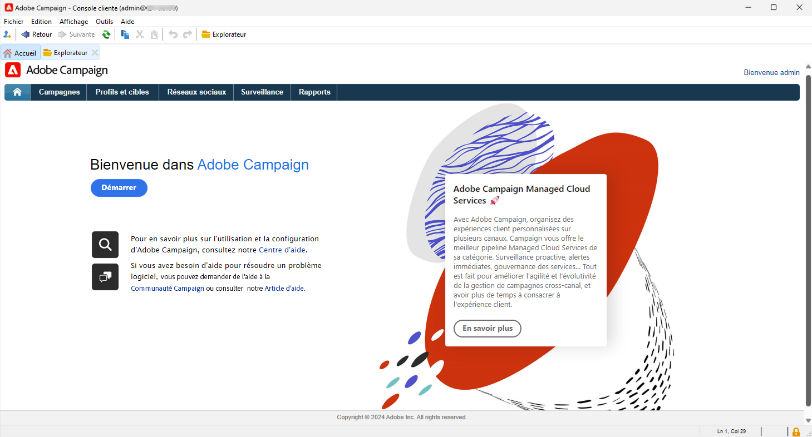

# Commencer pour les administrateurs et administratrices et les développeurs et développeuses {#acs-gs-admin}

Cette page offre une vue d’ensemble des principales fonctionnalités administratives et de gestion des données de Campaign v8. Elle est destinée aux administrateurs et administratrices et aux spécialistes du marketing technique qui passent de Campaign Standard à Campaign v8.

Le changement majeur pour vous est l’introduction de la console cliente, l’application native qui communique avec le serveur d’applications Adobe Campaign.

La console cliente Campaign centralise toutes les fonctionnalités et tous les paramètres. Elle est synchronisée avec l’interface d’utilisation de Campaign Web, assurant la cohérence entre les deux environnements.

{zoomable="yes"}

[En savoir plus sur l’interface d’utilisation de la console cliente d’Adobe Campaign v8](https://experienceleague.adobe.com/fr/docs/campaign/campaign-v8/new/campaign-ui#ui-access){target="_blank"}.

## Architecture de Campaign v8 {#acs-gs-admi-archi}

L’architecture de Campaign est détaillée dans la documentation de Campaign v8 (console). Découvrez les principes de base sur [cette page](https://experienceleague.adobe.com/fr/docs/campaign/campaign-v8/config/architecture/general-architecture){target="_blank"}.

Lien utile pour commencer :

* Les composants et l’architecture globale d’Adobe Campaign sont décrits sur [cette page](https://experienceleague.adobe.com/fr/docs/campaign/campaign-v8/new/ac-components){target="_blank"}.

* Consultez [Commencer avec l’architecture de Campaign](https://experienceleague.adobe.com/fr/docs/campaign/campaign-v8/config/architecture/architecture){target="_blank"} pour comprendre l’architecture de Campaign avant de commencer à structurer votre instance.

<!--Two deployment models are available: **Campaign FDA deployment** (P1-P3) and **Campaign Enterprise (FFDA)** deployment (P4). As a customer transitioning from Campaign Standard, your deployment model is **Campaign FDA**.-->

* La messagerie transactionnelle (Message Center) est le module de Campaign v8 conçu pour gérer les messages déclenchés. Elle repose sur un modèle d’architecture spécifique qui est détaillé dans [cette section](https://experienceleague.adobe.com/fr/docs/campaign/campaign-v8/config/architecture/architecture#transac-msg-archi){target="_blank"}.

## Console cliente Campaign {#acs-gs-console}

### Installer la console cliente {#acs-gs-admin-console}

Les tâches d’administration et de configuration sont effectuées dans la console cliente. La première étape consiste à configurer votre environnement.

La console cliente Campaign est une application native qui communique avec le serveur d’applications d’Adobe Campaign par le biais de protocoles Internet standard, tels que SOAP et HTTP. La console cliente Campaign centralise toutes les fonctionnalités et tous les paramètres et requiert une bande passante minimale, car elle repose sur un cache local. Conçue pour un déploiement facile, la console cliente Campaign peut être déployée à partir d’un navigateur Internet et être mise à jour automatiquement. En outre, elle ne nécessite aucune configuration réseau spécifique, car elle génère uniquement du trafic HTTP(S).

La vidéo suivante explique comment télécharger et installer la console cliente Adobe Campaign et gérer votre connexion à votre instance.

>[!VIDEO](https://video.tv.adobe.com/v/335375?quality=12&learn=on){transcript=true}

Pour plus d’informations, consulez [Se connecter à Campaign avec la console cliente](https://experienceleague.adobe.com/fr/docs/campaign/campaign-v8/new/connect){target="_blank"}.

Notez que la console cliente doit être installée dans un environnement pris en charge. En savoir plus dans la [matrice de compatibilité de Campaign v8 (console)](https://experienceleague.adobe.com/fr/docs/campaign/campaign-v8/releases/compatibility-matrix#ClientConsoleoperatingsystems){target="_blank"}.

### Découvrir l’interface de la console cliente  {#acs-gs-ui}

Découvrez l’interface d’utilisation d’Adobe Campaign v8 et comment naviguer parmi les principales fonctionnalités avec ce tutoriel vidéo.

>[!VIDEO](https://video.tv.adobe.com/v/334496?quality=12&learn=on){transcript=true}

Consultez [Utiliser la console cliente](https://experienceleague.adobe.com/fr/docs/campaign/campaign-v8/new/campaign-ui){target="_blank"} pour plus de détails.

## Administrer l’environnement {#acs-gs-admin-env}

Une fois la console cliente installée, suivez les étapes de cette documentation pour créer la connexion au serveur d’applications : [Connexion au serveur d’applications](https://experienceleague.adobe.com/fr/docs/campaign/campaign-v8/new/connect#create-your-connection){target="_blank"}.

Les bonnes pratiques de sécurité sont profondément ancrées dans nos processus internes de développement et d’exploitation de logiciels ainsi que dans nos outils. Nos équipes aux compétences croisées suivent scrupuleusement ces différentes règles afin d’éviter les incidents, mais aussi de pouvoir les détecter et d’y répondre rapidement. En savoir plus dans [Bonnes pratiques de sécurité de Campaign](https://experienceleague.adobe.com/fr/docs/campaign/campaign-v8/privacy/security){target="_blank"}.

### Droits d’accès et autorisations {#acs-gs-admin-rights}

Adobe Campaign vous permet de définir et gérer les droits attribués aux utilisateurs et utilisatrices. Ces autorisations sont définies en combinant les autorisations des groupes d’opérateurs et d’opératrices, les droits nommés et les autorisations sur les dossiers.

En tant qu’utilisateur ou utilisatrice de Campaign Standard passant à Campaign v8, vos autorisations et droits d’accès restent les mêmes. Adobe a déplacé les groupes de sécurité vers les groupes d’opérateurs et d’opératrices de Campaign v8, et vos autorisations par entité organisationnelle ont été transférées vers les autorisations de dossier. Utilisateurs et utilisatrices de Campaign - Utilisez votre Adobe ID pour vous connecter à Campaign v8, puis utilisez les mêmes identifiant et mot de passe que dans Campaign Standard.

Les [dossiers](https://experienceleague.adobe.com/fr/docs/campaign/campaign-v8/config/configuration/folders-and-views){target="_blank"} Campaign sont des nœuds dans l’arborescence de la console cliente. Selon leur type, ils contiennent certains types de données. Les programmes sont matérialisés par des dossiers dans Campaign v8. Vous pouvez créer des dossiers et gérer les autorisations qui s’y appliquent pour limiter l’accès. [En savoir plus](https://experienceleague.adobe.com/fr/docs/campaign/campaign-v8/admin/permissions/folder-permissions){target="_blank"}.

En savoir plus dans la [documentation sur les autorisations des utilisateurs et utilisatrices](https://experienceleague.adobe.com/fr/docs/campaign/campaign-v8/admin/permissions/gs-permissions){target="_blank"}.

### Panneau de contrôle Campaign {#acs-gs-admin-cp}

Comme dans Campaign Standard, vous pouvez utiliser le panneau de contrôle pour administrer votre environnement. Notez que pour la version 8, le panneau de contrôle fournit des fonctionnalités supplémentaires.

Le Panneau de contrôle Campaign accroît votre efficacité en tant qu’administrateur de produit Adobe Campaign, en vous permettant de gérer les paramètres et de suivre l’utilisation de chacune de vos instances. Dans son interface intuitive, vous pouvez facilement surveiller l&#39;utilisation des principales ressources ou effectuer certaines tâches administratives telles que l&#39;ajout d&#39;adresses IP à la liste autorisée, la surveillance de l&#39;espace de stockage SFTP, la gestion des clés, etc.

En savoir plus dans les [tutoriels sur le panneau de contrôle](https://experienceleague.adobe.com/fr/docs/control-panel-learn/tutorials/control-panel-overview){target="_blank"} et la [documentation sur le panneau de contrôle](https://experienceleague.adobe.com/docs/control-panel/using/control-panel-home.html?lang=fr){target="_blank"}.

* **Ajouter des adresses IP** : le panneau de contrôle Campaign vous permet de configurer de nouvelles connexions à vos instances en ajoutant des plages d’adresses IP à la liste autorisée. En savoir plus dans la [documentation sur les listes autorisées d’adresses IP](https://experienceleague.adobe.com/fr/docs/control-panel/using/instances-settings/ip-allow-listing-instance-access){target="_blank"}.

* **Configuration de sous-domaine** : vous pouvez configurer une sous-section de votre domaine (techniquement, une « zone DNS ») à utiliser avec Adobe Campaign.
En savoir plus dans la [documentation sur la délégation de sous-domaine](https://experienceleague.adobe.com/fr/docs/control-panel/using/subdomains-and-certificates/subdomains-branding){target="_blank"}.

* **Gérer les serveurs SFTP** : dans le panneau de contrôle, vous pouvez interagir avec tous les serveurs SFTP qui sont connectés aux instances Campaign auxquelles vous avez accès. En savoir plus dans la [documentation sur la gestion SFTP](https://experienceleague.adobe.com/fr/docs/control-panel/using/sftp-management/about-sftp-management){target="_blank"}.

### Journal d’audit {#acs-gs-admin-audit-trail}

Déjà disponible dans Campaign Standard, le journal d’audit peut être utilisé dans Campaign v8 pour accéder à l’historique complet des modifications apportées à votre instance.

Dans l’interface d’utilisation d’Adobe Campaign Web, la fonctionnalité Journal d’audit offre aux utilisateurs et utilisatrices une visibilité complète de toutes les modifications apportées à des entités importantes au sein de votre instance, généralement celles qui ont un impact significatif sur le bon fonctionnement de l’instance. En savoir plus dans la [documentation sur le journal d’audit](../../v8/reporting/audit-trail.md)

### Packages de données {#acs-gs-admin-audit-packages}

Tout comme dans Campaign Standard, les administrateurs et administratrices peuvent définir des packages pour échanger des ressources entre différentes instances Adobe Campaign par le biais de fichiers XML structurés. Il peut s’agir de paramètres de configuration ou de données.

Vous pouvez utiliser des packages de données pour exporter et importer les données et paramètres personnalisés de votre plateforme. Un package peut contenir différents types de configurations et de composants, filtrés ou non. Découvrez comment utiliser les packages de données dans Campaign v8 dans [cette documentation](https://experienceleague.adobe.com/fr/docs/campaign/campaign-v8/developer/packages){target="_blank"}.

<!--
MISSING LINKS: 

- System options
- Data Encryption/Decryption-->

### Personnaliser l’interface d’utilisation {#acs-gs-admin-ui}

Plusieurs options sont disponibles pour personnaliser l’interface d’utilisation dans la console cliente, telles que les suivantes :

* **Affichage des listes et des données** : des instructions pour gérer les paramètres de l’interface d’utilisation tels que les listes, les unités ou l’affichage des données, sont disponibles dans ce document : [Documentation sur les paramètres de l’interface d’utilisation](https://experienceleague.adobe.com/fr/docs/campaign/campaign-v8/config/configuration/ui-settings){target="_blank"}.

* **Gestion des dossiers** : dans Adobe Campaign, les dossiers sont des objets qui vous permettent d’organiser vos composants et vos données. Ils sont également utilisés pour gérer les autorisations. Découvrez comment [utiliser les dossiers](../../v8/get-started/work-with-folders.md).

* **Champs personnalisés** : les champs personnalisés sont des attributs supplémentaires ajoutés aux schémas intégrés via la console Adobe Campaign. Ces champs personnalisés sont affichés sur divers écrans, par exemple dans les détails d’un profil ou d’un profil de test. En savoir plus dans la [documentation sur la configuration des champs personnalisés](../../v8/administration/custom-fields.md).

## Configurer l’image de marque {#acs-gs-admin-branding}

Chaque entreprise dispose de directives de marque qui définissent à la fois des éléments visuels et des détails techniques. Comme Adobe Campaign Standard, Adobe Campaign v8 vous aide à gérer ces directives de manière centralisée, afin que vous puissiez présenter à vos clientes et clients une image de marque cohérente dans tout ce que vous faites, des logos contenus dans les e-mails aux URL et domaines utilisés dans vos campagnes. En tant qu’administrateur ou administratrice technique, vous pouvez créer et gérer plusieurs marques dans Adobe Campaign.

En savoir plus dans la [documentation sur l’image de marque](https://experienceleague.adobe.com/fr/docs/experience-cloud/campaign/branding/branding-gs){target="_blank"}.

## Comprendre la création d’un modèle de données {#acs-gs-admin-data-model-creation}

Comme Campaign Standard, Adobe Campaign v8 est fourni avec son modèle de données prédéfini. Adobe Campaign repose sur une base de données cloud contenant des tables liées entre elles. En savoir plus dans la [documentation sur le modèle de données](https://experienceleague.adobe.com/fr/docs/campaign/campaign-v8/developer/datamodel){target="_blank"}.

Un schéma est un document XML associé à une table de la base de données, il définit la structure des données et décrit la définition SQL de la table. Voir la [documentation sur la création de schémas](https://experienceleague.adobe.com/fr/docs/campaign/campaign-v8/developer/shemas-forms/schemas){target="_blank"}

Découvrez comment créer un schéma et étendre un schéma existant dans Campaign v8 dans cette vidéo :

>[!VIDEO](https://video.tv.adobe.com/v/337939?quality=12&learn=on){transcript=true}

Tout comme les fonctionnalités disponibles dans Campaign Standard, vous pouvez créer des ressources personnalisées. Dans Campaign v8, les ressources personnalisées sont des **schémas** personnalisés ou étendus.

* Découvrez comment utiliser un schéma sur [cette page](https://experienceleague.adobe.com/fr/docs/campaign/campaign-v8/developer/shemas-forms/schemas){target="_blank"}.

* Découvrez comment étendre un schéma existant sur [cette page](https://experienceleague.adobe.com/fr/docs/campaign/campaign-v8/developer/shemas-forms/extend-schema){target="_blank"}.

* Découvrez comment créer un schéma sur [cette page](https://experienceleague.adobe.com/fr/docs/campaign/campaign-v8/developer/shemas-forms/create-schema){target="_blank"}.

* Lorsque vous créez ou étendez un schéma, vous devez créer ou modifier les formulaires de saisie associés pour permettre aux utilisateurs et utilisatrices finaux de voir ces modifications. Un formulaire de saisie vous permet de modifier une instance associée à un schéma de données à partir de la console client Adobe Campaign. Le formulaire est identifié par son nom et son espace de noms. Consultez la [documentation sur la création de formulaires de saisie](https://experienceleague.adobe.com/fr/docs/campaign/campaign-v8/developer/shemas-forms/forms){target="_blank"}.

## Workflows et gestion des données {#acs-gs-admin-data-management}

Comme Adobe Campaign Standard, Adobe Campaign v8 comprend un module de workflow qui vous permet d’orchestrer l’ensemble des processus et tâches dans les différents modules du serveur d’applications. Cet environnement graphique complet permet de concevoir des processus englobant segmentation, exécution de campagnes, traitement de fichiers, participation humaine, etc. Le moteur de workflow exécute et assure le suivi de ces processus. Découvrez comment commencer avec des workflows dans Campaign v8 dans [cette documentation](https://experienceleague.adobe.com/fr/docs/campaign/campaign-v8/data/workflows){target="_blank"}.

Voir les liens vers d’autres ressources utiles ci-dessous :

* Découvrez ce que sont les dimensions de ciblage et les tables de travail, ainsi que la manière dont Adobe Campaign gère les données provenant de différentes sources de données dans cette vidéo :

  >[!VIDEO](https://video.tv.adobe.com/v/339992?quality=12&learn=on){transcript=true}

* Campaign vous aide à ajouter des contacts à la base de données cloud. Vous pouvez charger un fichier, planifier et automatiser plusieurs mises à jour des contacts, collecter des données sur le web ou saisir des informations de profil directement dans le tableau des destinataires.  En savoir plus dans la [documentation sur l’import de données (console)](https://experienceleague.adobe.com/fr/docs/campaign/campaign-v8/data/import){target="_blank"}.

* Vous pouvez facilement exporter vos différents rapports au format PDF ou CSV, ce qui vous permet de les partager, de les manipuler ou de les imprimer. En savoir plus dans la [documentation sur l’export de données](../../v8/reporting/export-reports.md).

## API REST {#acs-gs-admin-apis}

Les API REST de Campaign vous permettent de créer des intégrations pour Adobe Campaign et de construire votre propre écosystème en interfaçant Adobe Campaign avec l’ensemble des technologies que vous utilisez.

En tant qu’utilisateur ou utilisatrice Campaign Standard passant à Campaign v8, des API REST sont à votre disposition.

En savoir plus dans la [documentation sur l’API REST](https://experienceleague.adobe.com/fr/docs/experience-cloud/campaign/apis/get-started-apis){target="_blank"}.

Notez que certaines recommandations et limitations s’appliquent aux API REST lors de la transition de Campaign Standard vers Campaign v8. Celles-ci sont répertoriées sur [cette page](https://experienceleague.adobe.com/fr/docs/experience-cloud/campaign/apis/limitations){target="_blank"}. Des restrictions spécifiques s’appliquent également lors de la transition vers Campaign v8, comme indiqué dans la remarque sur la disponibilité ci-dessous :

>[!AVAILABILITY]
>
>* Les valeurs PKEY changent entre l’instance de Campaign Standard existante et l’instance Campaign v8 migrée. Si les PKEY sont stockés dans une base de données externe, l’implémentation doit changer de manière à ce qu’ils doivent appeler les API principales d’Adobe Campaign v8 qui fournissent des liens pkeys/hrefs avec les PKEY et les appels API suivants doivent être formés dynamiquement en utilisant les pkeys/hrefs des appels API précédents.
>
>* Dans Campaign v8, pour le même corps où un véhicule lié à un profil, nous obtiendrions une erreur de propriété firstName non valide pour `cusVehicle`, mais un corps de requête avec uniquement les attributs sans lien fonctionnel.`{ "vehicleNumber": "20009", "vehicleName": "Model E", "vehicleOwner":{   "firstName":"tester 11", "lastName":"Smith 11" } }&#x200B;`
>
>* Le fuseau horaire est présenté à l’utilisateur ou l’utilisatrice dans le cadre de l’appel de l’API REST `profileAndServicesExt/profile` et non de l’appel de l’API REST `profileAndServices/profile`, car il est ajouté à un schéma étendu dans le cadre de la migration des données.
>
>* `ccpaOptOut` n’est présenté à l’utilisateur ou l’utilisatrice que dans le cadre de l’appel de l’API REST `profileAndServicesExt/profile` et non de l’appel de l’API REST `profileAndServices/profile`, car il est ajouté à un schéma étendu dans le cadre de la migration des données.
>

<!--
## Working with templates - TO REMOVE?

Workflow templates contain pre-configured settings and activities which can be reused for creating new workflows.
[Workflow template documentation](../../v8/workflows/create-workflow.md)

You can design your landing page content, and save it for future reuse. See the [landing page template documentation](../../v8/landing-pages/lp-templates.md).

Each event can trigger a personalized message. For this to happen, you need to create a message template to match each event type. Templates contain the necessary information for personalizing the transactional message. See the [Transactional messaging template documentation](https://experienceleague.adobe.com/fr/docs/campaign/campaign-v8/send/real-time/transactional-template)

Using a workflow template is a best practice if you need to regularly import files with the same structure. See the [Import template documentation](https://experienceleague.adobe.com/fr/docs/campaign/automation/workflows/use-cases/data-management/recurring-import-workflow){target="_blank"}
-->

## Confidentialité et consentement

Lorsque vous passez de Campaign Standard à Campaign v8, il est important de vérifier l’impact des réglementations en matière de confidentialité sur vos opérations liées aux données. Selon votre activité et les juridictions dans lesquelles vous opérez, les clientes et clients peuvent avoir le droit légal d’accéder aux données que vous détenez à leur sujet ou d’en demander la suppression.

Dans Campaign v8, toutes les demandes d’accès à des informations personnelles doivent être gérées via l’intégration **Adobe Privacy Service**. Pour plus d’informations, consultez la [documentation de Campaign v8 (console)](https://experienceleague.adobe.com/fr/docs/campaign/campaign-v8/privacy/privacy).

N’oubliez pas que votre environnement Campaign Standard reste actif pendant un certain temps après la transition. Pendant ce temps, les demandes d’accès à des informations personnelles peuvent arriver dans les deux systèmes. Pour garantir la conformité et éviter les lacunes, collaborez avec votre responsable de transition Adobe afin de gérer correctement les demandes dans les deux environnements.

## Services d’abonnement {#acs-gs-admin-sub}

Comme dans Campaign Standard, en tant qu’administrateur ou administratrice, vous pouvez créer des services d’abonnement et les spécialistes du marketing peuvent envoyer des messages à leurs personnes abonnées. Les concepts clés et les étapes d’implémentation sont alignés avec Campaign Standard. Vous trouverez ci-dessous des liens utiles et une vidéo.

Découvrez comment configurer et gérer les abonnements et cibler les personnes abonnées.

>[!VIDEO](https://video.tv.adobe.com/v/334305?quality=12&learn=on){transcript=true}

* Voir les services d’abonnement dans la [documentation sur l’interface d’utilisation web](../../v8/audience/manage-subscribers.md).

* Consultez également la documentation pour définir les services d’abonnement dans la console cliente dans [cette section](https://experienceleague.adobe.com/fr/docs/campaign/campaign-v8/audience/subscriptions){target="_blank"}.

## Messages et diffusions{#acs-gs-msg}

### Configurer des canaux de diffusion {#acs-gs-admin-channels}

Comme Campaign Standard, Adobe Campaign v8 vous aide à réaliser des campagnes cross-canal, y compris sous forme d’e-mails, de SMS, de notifications push et de courrier, et à mesurer leur efficacité à l’aide de différents rapports dédiés. Ces messages sont conçus et envoyés par le biais de diffusions et peuvent être personnalisés pour chaque personne destinataire. Les principales fonctionnalités comprennent le ciblage, la définition et la personnalisation des messages, l&#39;exécution des communications et les rapports opérationnels associés. Le principal point d&#39;accès fonctionnel est l&#39;assistant de diffusion. Ce point d’accès permet d’accéder à de multiples fonctionnalités proposées par Adobe Campaign.

En tant qu’administrateur ou administratrice, vous devez définir les configurations de vos canaux. Consultez les liens ci-dessous pour en savoir plus.

* **E-mail** : les paramètres d’e-mail sont tous détaillés sur [cette page](https://experienceleague.adobe.com/fr/docs/campaign/campaign-v8/send/emails/email-parameters){target="_blank"}.
* **SMS** : découvrez comment configurer votre canal SMS dans [cette documentation](https://experienceleague.adobe.com/fr/docs/campaign/campaign-v8/send/sms/sms){target="_blank"}.
* **Notifications push** : les étapes de configuration du canal des notifications push sont détaillées dans [cette section](https://experienceleague.adobe.com/fr/docs/campaign/campaign-v8/send/push/push-data-collection){target="_blank"}.
* **Messages transactionnels** : les étapes de configuration des [Messages transactionnels](https://experienceleague.adobe.com/fr/docs/campaign/campaign-v8/send/real-time/transactional){target="_blank"} dans Campaign v8 sont détaillées dans [cette section](https://experienceleague.adobe.com/fr/docs/campaign/campaign-v8/config/configuration/transactional-msg-settings).

### Comptes externes {#acs-gs-ext-accounts}

En tant qu’administrateur ou administratrice, vous êtes responsable de la configuration et de la maintenance des comptes externes de Campaign. Comme dans Campaign Standard, les comptes externes sont utilisés par les processus techniques tels que les workflows techniques ou de campagne.

Le processus de transition vers Campaign v8 prend en charge vos comptes externes de Campaign Standard existants.

En savoir plus dans la [documentation sur le compte externe](../../v8/administration/external-account.md)

<!--
**Email**

MISSING LINKS :
- general email channel parameters 
- email routing accounts 
- email processing rules 
- email properties
-->

<!--
MISSING LINKS: 
- Setting external account 
- Adding vender details etc. -->

<!--
**Mobile app**
MISSING LINKS: 
- Configuring a mobile application using AEP SDKs 
- Sync Mobile app AEPSDK  
- Setting up your application in Adobe Campaign 
- Channel-specific application configuration
-->

### Contenu dynamique {#acs-gs-dyn-content}

Utilisez Campaign pour créer du contenu dynamique et envoyer des messages personnalisés. Vous pouvez cumuler les fonctionnalités de personnalisation afin d’améliorer vos messages et créer une expérience utilisateur personnalisée.

Avec Campaign v8, en tant qu’administrateur ou administratrice, vous pouvez définir des blocs de contenu dynamique et les utiliser pour personnaliser le contenu de votre diffusion par e-mail comme expliqué dans cette vidéo :

>[!VIDEO](https://video.tv.adobe.com/v/342088?quality=12&learn=on){transcript=true}

Liens utiles :

* [Commencer avec la personnalisation](https://experienceleague.adobe.com/fr/docs/campaign/campaign-v8/send/personalize/personalize){target="_blank"}
* [Utiliser les blocs de personnalisation](https://experienceleague.adobe.com/fr/docs/campaign/campaign-v8/send/personalize/personalization-blocks){target="_blank"}
* [Créer du contenu conditionnel](https://experienceleague.adobe.com/fr/docs/campaign/campaign-v8/send/personalize/conditions){target="_blank"}
* [Sources de données de personnalisation](https://experienceleague.adobe.com/fr/docs/campaign/campaign-v8/send/personalize/personalization-data){target="_blank"}

### Modèles de diffusion {#acs-gs-templates}

L’utilisation de modèles de diffusion est obligatoire dans Campaign v8, comme dans Campaign Standard.

Pour un processus de conception accéléré et amélioré, créez des modèles de diffusion pour réutiliser facilement le contenu et les paramètres personnalisés dans vos campagnes. Cette fonctionnalité vous permet de normaliser l’aspect créatif afin d’être plus rapide dans l’exécution et le lancement des campagnes. Découvrez comment créer des modèles de diffusion dans l’[interface d’utilisation de Campaign Web](../../v8/msg/delivery-template.md). Découvrez également comment créer des modèles de diffusion dans la console cliente dans [cette section](https://experienceleague.adobe.com/fr/docs/campaign/campaign-v8/send/create-templates){target="_blank"}.

### Règles de typologie {#acs-gs-admin-rules}

En tant qu’administrateur ou administratrice, vous êtes responsable de la création et de la maintenance des règles de typologie pour vos diffusions. Comme dans Adobe Campaign Standard, dans Campaign v8, les règles de typologie sont des règles métier qui vous permettent d’effectuer des vérifications et filtrages de votre message avant de l’envoyer.

Lors de la transition de votre environnement de Campaign Standard vers Campaign v8, vos règles de typologie sont déplacées vers Campaign v8.

Dans Campaign v8, les règles de typologie sont fournies avec un module complémentaire Optimisation de campagne spécifique. Ce module permet de contrôler, de filtrer et de surveiller l’envoi des diffusions. Pour éviter les conflits entre les campagnes, Adobe Campaign peut tester différentes combinaisons en appliquant des règles de contrainte spécifiques. Elles permettent de s’assurer que les messages envoyés répondent aux attentes et aux besoins des clientes et clients et des politiques de communication de l’entreprise. En savoir plus dans la [documentation sur les règles de typologie](https://experienceleague.adobe.com/fr/docs/campaign/automation/campaign-optimization/campaign-typologies){target="_blank"}.

### Gestion des quarantaines {#acs-gs-admin-quarantine}

Toutes les adresses en quarantaine et règles de mise en quarantaine ont été migrées de votre environnement Campaign Standard vers Campaign v8. Aucune action spécifique n’est nécessaire pour la gestion des quarantaines.

En tant qu’administrateur ou administratrice, familiarisez-vous avec la gestion des quarantaines dans Campaign v8 sur [cette page](../../v8/audience/quarantine.md). Consultez également la documentation détaillée de la console cliente sur la gestion des quarantaines dans [cette section](https://experienceleague.adobe.com/fr/docs/campaign/campaign-v8/send/failures/quarantines#access-quarantined-addresses){target="_blank"}.

## Gérer les intégrations Adobe Campaign {#acs-gs-integrations}

Vous pouvez connecter votre instance Campaign aux solutions Adobe Experience Cloud pour combiner les fonctionnalités. Adobe Campaign s’accompagne de plusieurs connecteurs qui vous permettent de communiquer avec des applications externes, de vous connecter à des moteurs de base de données, ainsi que de partager et de synchroniser des données. Découvrez comment combiner vos solutions dans [cette documentation](https://experienceleague.adobe.com/fr/docs/campaign/campaign-v8/connect/integration){target="_blank"}.

En tant qu’utilisateur ou utilisatrice de Campaign Standard migrant vers Campaign v8, les conditions suivantes s’appliquent à vous :

* Si vous utilisiez ces intégrations avec Campaign Standard, vos configurations et données **Adobe Analytics** et **Audience Manager** ont été migrées par Adobe.
* Si votre environnement Campaign Standard était intégré à **Adobe Experience Manager**, Adobe vous recommande de passer à **Adobe Experience Manager as a Cloud Service** pour pouvoir utiliser cette fonctionnalité lors de la conception d’e-mails dans l’interface d’utilisation de Campaign Web et faciliter la gestion simplifiée du contenu et des formulaires de diffusion d’e-mails directement dans votre environnement Adobe Experience Manager. En savoir plus sur [cette page](../../v8/integrations/aem-content.md).
Notez que Campaign peut également être intégré à Adobe Experience Manager 6.5. Pour configurer cette intégration, consultez [cette documentation](https://experienceleague.adobe.com/fr/docs/campaign/campaign-v8/connect/ac-aem){target="_blank"}.
* Si votre environnement Campaign Standard était intégré à **Triggers**, vous devez configurer cette intégration dans Campaign v8 comme indiqué sur [cette page](https://experienceleague.adobe.com/fr/docs/campaign/campaign-v8/connect/ac-triggers){target="_blank"}.
* Si votre environnement Campaign Standard était intégré à **Adobe Target**, vous devez configurer cette intégration dans Campaign v8 comme indiqué sur [cette page](https://experienceleague.adobe.com/fr/docs/campaign/campaign-v8/connect/ac-at){target="_blank"}.
