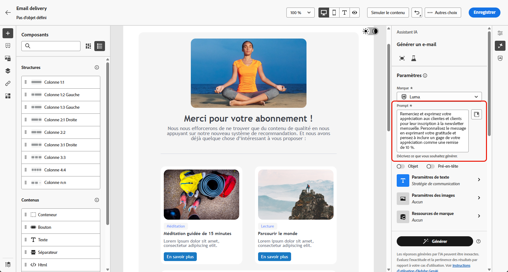

# De Campaign Standard vers v8 {#ac-acs}

Bienvenue dans Adobe Campaign v8.

En tant qu’utilisateur ou utilisatrice passant de Campaign Standard à Campaign v8, ce guide de référence est conçu pour vous. Il vous aide à vous familiariser avec votre nouvel environnement Campaign et vous guide dans les étapes nécessaires pour commencer à utiliser votre rôle.

1. Commencez par découvrir les [nouveautés d’Adobe Campaign v8](#new).

1. Comprenez ensuite les [différences d’expérience entre Adobe Campaign Standard et Adobe Campaign v8 en fonction de votre rôle](#experiences).

## Nouveautés {#new}

Découvrez les dernières améliorations apportées à l’interface d’utilisation d’Adobe Campaign Web sur cette page. Pour obtenir une liste complète des fonctionnalités clés et des notes de mises à jour, consultez [cette section](../../v8/rn/whats-new.md).

### Améliorations de Campaign v8 {#ac-enhancements}

Les améliorations clés apportées à Adobe Campaign v8 sont répertoriées ci-dessous.

* **Interface d’utilisation web**

  Adobe Campaign v8 propose une console cliente et une interface d’utilisation web, répondant ainsi à différents besoins et préférences des utilisateurs et utilisatrices. La console cliente offre une expérience d’application de bureau puissante, tandis que l’interface d’utilisation web est conçue pour être intuitive et accessible, ce qui en fait un choix idéal pour les personnes spécialisées dans le marketing familiarisées avec Adobe Campaign Standard.

  L’interface d’utilisation web partage de nombreuses similitudes avec Adobe Campaign Standard, bien que certaines terminologies puissent différer.

  Vous pouvez [en savoir plus sur l’interface d’utilisation d’Adobe Campaign Web ici](../../v8/campaign-web-home.md).

  {zoomable="yes"}

  Toutes les nouvelles fonctionnalités et modifications sont répertoriées dans les [Notes de mise à jour](../../v8/rn/release-notes.md). Les versions de l’interface utilisateur d’Adobe Campaign Web fonctionnent sur un modèle de diffusion continu qui permet une approche plus évolutive et progressive du déploiement des fonctionnalités. Par conséquent, ces notes de mise à jour sont complétées plusieurs fois par mois. Veuillez les vérifier régulièrement.

* **Performances**

  Adobe Campaign v8 tire parti des technologies de base de données avancées à l’échelle du cloud, ce qui se traduit par une amélioration significative des performances et de l’efficacité. Cette architecture repensée offre plusieurs avantages clés :

   * *Échelle* : le système prend désormais en charge une augmentation substantielle des fonctionnalités de traitement, avec un débit de traitement par lot pouvant atteindre **20 millions d’opérations par heure**. Avec cette nouvelle architecture, il est possible de gérer des profils encore plus élevés avec des performances prévisibles.
   * *Vitesse* : le système a été amélioré pour n’importe quelle activité marketing : segmentation, préparation de diffusion ou débit pour les messages transactionnels, qui s’élève désormais à **1 million par heure**.

  Les services cloud entièrement gérés fournissent aux utilisateurs et utilisatrices les avantages suivants :

   * Exploration des données en temps réel : accédez instantanément aux données et analysez-les pour obtenir des aperçus rapides et prendre des décisions plus éclairées.

   * Création rapide d’audiences : créez facilement des audiences ciblées en quelques minutes pour une segmentation des campagnes plus efficace.

  Dans l’ensemble, l’architecture robuste d’Adobe Campaign v8 constitue une base puissante pour la gestion de campagnes marketing complexes et étendues, avec une vitesse et une efficacité accrues.

### Nouvelles fonctionnalités d’Adobe Campaign v8 {#ac-new-features}

En tant qu’utilisateur ou utilisatrice Campaign Standard passant à Adobe Campaign v8, les fonctionnalités suivantes sont désormais à votre disposition :

* **Notification push enrichie**

  Adobe Campaign v8 offre la possibilité d’envoyer des notifications push enrichies, qui peuvent capter l’attention des utilisateurs et utilisatrices et les encourager à agir. Ces notifications peuvent inclure divers éléments, comme du texte, des images, des boutons, des comptes à rebours, des sons, etc.

  {zoomable="yes"}

  Pour faciliter la création de ces notifications enrichies, Adobe Campaign v8 fournit divers modèles qui vous permettent de concevoir et de personnaliser le contenu de notifications complexes, comme des carrousels ou des minuteurs.

  Vous pouvez personnaliser vos notifications en fonction du système de la cliente ou du client :

   * Pour les modèles [Android](../../v8/push/rich-push.md)

   * Pour les modèles [iOS](../../v8/push/rich-push.md)

  Les notifications push constituent un outil essentiel pour impliquer les utilisateurs et utilisatrices d’applications mobiles, ce qui vous permet de les atteindre même lorsqu’ils n’utilisent pas activement votre application.

* **Adobe Experience Manager as a Cloud Service**

  Adobe Campaign v8 est parfaitement intégré à Adobe Experience Manager as a Cloud Service, ce qui vous permet de proposer à votre clientèle des expériences personnalisées et riches en contenu. Cette intégration native simplifie la gestion de contenu et tire parti des puissantes fonctionnalités d’Adobe Experience Manager pour optimiser vos efforts marketing.

  Les principales fonctionnalités activées par cette intégration sont les suivantes :

   * *Gestion des ressources* : dans Adobe Campaign v8, le concepteur d’e-mail fournit un sélecteur pour accéder aux ressources et les gérer. Cette fonctionnalité simplifie l’intégration d’éléments d’Adobe Experience Manager dans votre diffusion, rendant ainsi la gestion de contenu plus efficace. [En savoir plus sur la gestion des ressources](../../v8/integrations/aem-assets.md)

     {zoomable="yes"}

   * *Import de modèle d’e-mail* : Adobe Campaign v8 vous permet de parcourir et d’importer directement des modèles d’e-mail d’Adobe Experience Manager dans Campaign. [En savoir plus sur l’import de modèle d’e-mail](../../v8/integrations/aem-content.md)

     {zoomable="yes"}

  Adobe Experience Manager as a Cloud Service offre une agilité cloud native, ce qui vous permet d’accélérer le temps d’évaluation et de vous adapter à l’évolution des besoins de l’entreprise. Cette intégration permet non seulement d’améliorer vos fonctionnalités de gestion de contenu, mais également de proposer à vos clientes et clients des expériences plus personnalisées et plus attrayantes sur tous les points de contact.

* **Assistant IA**

  L’assistant IA de Campaign rend la création et l’exécution de campagnes marketing sur plusieurs canaux (comme les e-mails, les SMS et les notifications push) intuitives, simples et sans accroc tout en gagnant du temps, en améliorant l’efficacité et en obtenant de meilleurs résultats.

  {zoomable="yes"}

  L’assistant IA révolutionne la manière dont vous créez du contenu de marque professionnel et cohérent sur les canaux. Grâce aux modèles avancés de GenAI et à une compréhension approfondie des directives de votre marque, l’assistant IA génère automatiquement du contenu personnalisé, attrayant et efficace en fonction de l’objectif marketing, avec un contenu optimisé pour les styles, les mises en page, le ton et bien plus encore.

  L’assistant IA rend la création et l’exécution de campagnes marketing intuitives, simples et sans accroc tout en gagnant du temps, en améliorant l’efficacité et en obtenant de meilleurs résultats.

  {zoomable="yes"}

  Il fournit une variante de modèles d’e-mail et génère et génère à nouveau des images. En savoir plus sur l’assistant IA dans [cette section](../../v8/email/generative-content.md). Adobe Campaign v8 comprend un assistant IA disponible pour les canaux [E-mail](../../v8/email/generative-content.md), [SMS](../../v8/email/generative-sms.md) et [Push](../../v8/email/generative-push.md).

* **Infrastructure SMS mise à niveau - SMS v2.0**

  La simplicité et la facilité d’utilisation des SMS en font un canal de communication très précieux en plus de sa robustesse et de sa compatibilité inégalée sur des milliards de terminaux.

  Adobe Campaign v8 est fourni avec une nouvelle infrastructure qui améliore l’envoi de SMS. [En savoir plus sur les nouveaux paramètres SMS](https://experienceleague.adobe.com/fr/docs/campaign/campaign-v8/send/sms/sms){target="_blank"}.

* **Infrastructure push mise à niveau**

  Adobe Campaign v8 présente son dernier service de notifications push, optimisé par un framework robuste reposant sur une technologie de pointe. Ce service est conçu pour atteindre des niveaux d’évolutivité supérieurs, afin que vos notifications puissent atteindre une audience plus large avec une efficacité optimale. Grâce à notre infrastructure améliorée et à nos processus optimisés, vous bénéficierez d’une plus grande échelle et d’une meilleure fiabilité. Vous pourrez ainsi communiquer avec vos utilisateurs et utilisatrices d’applications mobiles comme jamais auparavant.

  [En savoir plus sur l’infrastructure push mise à niveau](https://experienceleague.adobe.com/fr/docs/campaign/campaign-v8/send/push/push-data-collection){target="_blank"}.

## Managed Services {#ac-managed-services}

Adobe Campaign v8 est disponible en tant que Managed Cloud Service, offrant une supervision proactive, des alertes rapides et une gouvernance des services. Adobe Managed Cloud Service offre aux spécialistes marketing une solution de gestion de campagnes cross-canal plus agile, sécurisée et évolutive, avec un coût total de possession faible. La nouvelle offre associe des services à une supervision proactive et à des alertes opportunes.

## Fonctionnalités de Campaign Standard ajoutées dans la v8 {#ac-v8-added}

Pour que vous puissiez passer facilement à Campaign v8, les fonctionnalités clés de Campaign Standard ont été ajoutées à Campaign v8. Elles sont présentées dans [cette documentation](https://experienceleague.adobe.com/docs/experience-cloud/campaign/campaign-standard-migration-home.html?lang=fr){target="_blank"}.

* **Rapports dynamiques** : les rapports dynamiques fournissent des rapports entièrement personnalisables en temps réel pour mesurer l’impact de vos activités marketing. Il offre la possibilité d’accéder aux données de profil, ce qui permet l’analyse démographique par dimensions de profil, telles que le genre, la ville et l’âge, en plus des données de campagne par e-mail fonctionnelles comme les ouvertures et les clics. [En savoir plus](https://experienceleague.adobe.com/docs/experience-cloud/campaign/reporting/get-started-reporting.html?lang=fr){target="_blank"}.

* **Branding centralisé** : chaque entreprise dispose de ses directives visuelles et techniques en ce qui concerne le branding. Avec Adobe Campaign, vous pouvez définir un ensemble de spécifications pour présenter à vos clientes et clients une marque cohérente, des logos aux aspects techniques, tels que l’identifiant expéditeur des e-mails, l’URL ou les domaines. [En savoir plus](https://experienceleague.adobe.com/docs/experience-cloud/campaign/branding/branding-gs.html?lang=fr)

* **API REST** : en tant qu’utilisateur ou utilisatrice ayant migré à partir de Campaign Standard, vous pouvez utiliser les API REST pour créer des intégrations pour Adobe Campaign et pour créer votre propre réseau en connectant Adobe Campaign avec les technologies que vous utilisez. [En savoir plus](https://experienceleague.adobe.com/docs/experience-cloud/campaign/apis/get-started-apis.html?lang=fr){target="_blank"}.

* **Pages de destination** : certaines améliorations ont été apportées aux pages de destination de Campaign v8 pour garantir la parité des fonctionnalités avec Campaign Standard. En savoir plus dans la section [notes de mise à jour](../../v8/rn/release-notes.md#new-24-4) et dans la [documentation](../../v8/landing-pages/get-started-lp.md) des pages de destination.

* **Fragments visuels** : les fragments visuels sont des composants visuels réutilisables qui peuvent être référencés dans une ou plusieurs diffusions par e-mail ou dans des modèles de contenu. Lors de la modification d’un fragment, chaque contenu qui l’utilise est mis à jour. Cette fonctionnalité permet de précréer plusieurs blocs de contenu personnalisés destinés aux utilisateurs et utilisatrices marketing et permettant d’assembler rapidement les contenus de messages dans un processus de conception amélioré. [En savoir plus](../../v8//content/use-visual-fragments.md)

## Principales différences entre Campaign Standard et Campaign v8 {#experiences}

La plupart des concepts sont similaires entre Adobe Campaign v8 et Adobe Campaign Standard. Il existe toutefois quelques différences tel que décrit ci-dessous.

### Changements de terminologie {#terminology-changes}

Voici quelques différences terminologiques entre Campaign Standard et Campaign 8.

* Les ressources personnalisées sont appelées **schémas**.
* Les messages sont appelés **diffusions**.
* Les utilisateurs et les utilisatrices des produits sont les **opérateurs et opératrices**.
* Les rôles sont configurés avec les **droits nommés**.
* Les groupes de sécurité sont les **groupes d’opérateurs et d’opératrices**.
* Les entités organisationnelles sont gérées au moyen des **autorisations de dossier**.

De plus, en tant que personne utilisant déjà Campaign, notez que certains concepts ont été renommés pour s’aligner sur les dernières normes terminologiques. Ces modifications concernent uniquement l’interface utilisateur web de Campaign et ne sont pas répercutées dans la console cliente. Elles sont résumées ci-dessous.

* Les personnes destinataires sont désormais des **Profils**. [En savoir plus](../../v8/audience/gs-audiences-recipients.md).
* Les adresses de contrôle sont désormais des **Profils de test**. [En savoir plus](../../v8/preview-test/test-deliveries.md).
* L’analyse de la diffusion s’appelle désormais **préparation de la diffusion**. Lorsque vous devez lancer la préparation des messages, cliquez sur le bouton **Préparer**. [En savoir plus](../../v8/monitor/prepare-send.md)
* L’aperçu de l’e-mail est désormais disponible via le bouton **Simuler le contenu.** [En savoir plus](../../v8/preview-test/preview-test.md).
* Les listes s’appellent désormais **Audiences**. [En savoir plus](../../v8/audience/gs-audiences-recipients.md).

## Nouvelle expérience client

Accédez au guide de référence approprié pour votre rôle afin de découvrir la nouvelle expérience client avec Adobe Campaign v8.

<table>
<tr>
  <td>
    
    

  </td>
  <td>
  
    

  </td>
  </tr>
  <tr>
    <td>
    <a href="marketers.md">
    <strong>Personne spécialiste du marketing</strong>
    </a>
    </td>
    <td>
      <a href="admin-developers.md">
      <strong>Administrateur ou administratrice ou développeur ou développeuse</strong>
      </a>
    </td>
  </tr>
    <td>
    <em>Personne gestionnaire de campagnes, personne spécialiste du marketing multimédia</em>
    </td>
    <td>
      <em>Administrateur ou administratrice système, personne spécialiste du marketing technique</em>
    </td>
  <tr>
    <td>
    <b>Les tâches/responsabilités clés sont les suivantes :</b>
    </td>
      <td>
    <b>Les tâches/responsabilités clés sont les suivantes :</b>
    </td>
  </tr>
  <tr>
    <td>
      <li>Création de campagnes marketing
      <li>Concevoir des workflows
      <li>Tester et exécuter les campagnes
      <li>Déployer les campagnes multicanal
      <li>Optimiser les campagnes
      <li>Optimiser les campagnes automatisées
    </td>
    <td>
        <li>Gestion des accès
        <li>Configuration du système
        <li>Personnalisation du système
    </td>
</tr>
</table>

<!--
## Deprecated items

Adobe constantly evaluates product capabilities to identify older features that should be replaced with more modern alternatives to improve overall customer value, always under careful consideration of backward compatibility.

Please refer to [this documentation for information on deprecated items](https://experienceleague.adobe.com/en/docs/campaign-standard/using/release-notes/deprecated-features).-->
