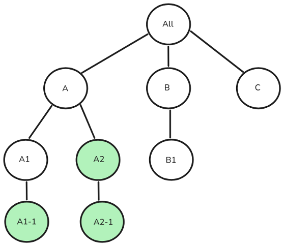

# Gestion de l’accès des utilisateurs de Campaign Standard à Campaign v8 {#user-management-acs}

Adobe Campaign Standard et Adobe Campaign v8 permettent aux utilisateurs de définir et de gérer des autorisations pour différents utilisateurs/opérateurs. Ces autorisations se composent de droits spécifiques qui accordent aux utilisateurs l’accès à diverses fonctionnalités du produit. Toutefois, les deux produits utilisent des approches et des implémentations distinctes pour gérer l’accès des utilisateurs et utilisatrices.

Les concepts ci-dessous sont utilisés dans Adobe Campaign Standard et Campaign v8 pour gérer l’accès des utilisateurs et utilisatrices :

| Campaign Standard | Campaign v8 |
|---------|----------|
| Utilisateur | Opérateur |
| Rôle | Droit nommé |
| Groupe de sécurité | Groupe D’Opérateurs |
| Organizational unit | Autorisation Dossier |

## Approche de migration du groupe de sécurité vers le groupe d’opérateurs

### Remarques sur la mise en garde

Les fonctionnalités de ces rôles/droits nommés peuvent varier dans l’implémentation, ce qui peut entraîner des problèmes d’autorisation (par exemple, élévation des privilèges ou perturbations des fonctionnalités). Nous recommandons aux utilisateurs de passer en revue ces mappages après la transition pour garantir un contrôle d’accès approprié. [En savoir plus sur les autorisations](https://experienceleague.adobe.com/fr/docs/campaign/campaign-v8/admin/permissions/manage-permissions)

### Groupes de sécurité et groupes d’opérateurs

Le tableau ci-dessous décrit l’approche de migration des groupes de rôles utilisateur lors de la transition de Adobe Campaign Standard vers Campaign v8. Dans Campaign Standard, un **Groupe de sécurité**, appelé **Groupe d’opérateurs** dans Campaign v8, est utilisé pour affecter un ensemble de rôles à un utilisateur. Bien que certains groupes de sécurité/groupes d’opérateurs soient disponibles par défaut, les utilisateurs peuvent créer des groupes ou modifier des groupes existants si nécessaire.

| | **Campaign Standard** | **Campaign v8** |
|---------|----------|---------|
| **Terminologie**  | Groupe de sécurité | Groupe D’Opérateurs |

Dans Adobe Campaign Standard et Campaign v8, les **groupes de sécurité** et **groupes d’opérateurs** sont mappés aux profils de produit dans Admin Console. Si vous souhaitez affecter un **Groupe de sécurité** ou **Groupe d’opérateurs** à un utilisateur, vous pouvez lier le **profil de produit** correspondant dans Admin Console. Cette association est synchronisée lorsque l’utilisateur se connecte. [En savoir plus sur le profil de produit](https://experienceleague.adobe.com/fr/docs/campaign/campaign-v8/admin/permissions/manage-permissions)

| **Groupe de sécurité Campaign Standard** | **Groupe d’opérateurs Campaign v8** |
|----------|---------|
| Administrateurs | Administrateurs |
| Superviseurs de diffusion | Administrateurs |
| Superviseurs de workflow | Superviseurs de workflow  |

## Approche de migration des rôles utilisateur vers les droits nommés

### Remarques sur la mise en garde

Lors de la migration de Adobe Campaign Standard vers Campaign v8, les utilisateurs possédant le rôle **Modèle de données** mais pas **Administration** obtiendront automatiquement l’accès **Administration**, car la création de schémas dans Campaign v8 nécessite des droits d’administration. Pour éviter cela, supprimez leur rôle **Modèle de données** avant la migration.

### Rôles utilisateur et droits nommés

Dans Adobe Campaign Standard, le terme **rôle utilisateur** est appelé **droit nommé** dans Campaign v8. Le tableau ci-dessous décrit la terminologie utilisée pour **Droits nommés** dans Campaign v8, qui correspond à **Rôles utilisateur** dans Campaign Standard.

| **Rôle utilisateur Campaign Standard** | **Droit nommé dans Campaign v8** | **Description**  |
|----------|---------|---------|
| Administration  | Administration  | L’utilisateur disposant du droit d’administration dispose d’un accès complet à l’instance. |
| Modèle de données  | Administration | Droit pour exécuter des publications et créer des ressources personnalisées. Fonctionnalité liée à la création de schémas disponible pour l’administrateur dans Campaign v8.  |
| DéliVRABILITÉ  | Administration  | Droit pour valider les diffusions préalablement analysées.  |
| Exporter | Exporter | Droit pour exporter des données.  |
| Accès aux fichiers  | Accès aux fichiers  | Droit pour valider les diffusions préalablement analysées.  |
| Import générique  | Importer  | Droit pour l&#39;import de données génériques |
| Préparation des diffusions | Préparation des diffusions | Droit pour créer, modifier, préparer et supprimer des diffusions.  |
| Exécution du script SQL | Exécution du script SQL | Droit pour exécuter toute commande SQL directement sur la base de données. |
| Démarrer les diffusions  | Démarrer les diffusions  | Droit pour valider les diffusions préalablement analysées.  |
| Exécution des commandes système | Exécution du programme | Droit pour exécuter des commandes système sur le serveur. |
| Workflow | Workflow | Droit pour gérer l&#39;exécution des workflows, démarrer, arrêter, mettre en pause, etc. |

## Approche de la migration depuis l’entité organisationnelle

### Remarques sur la mise en garde

Les entités organisationnelles dans Adobe Campaign Standard sans **Toutes (toutes)** comme parent direct ou indirect ne seront pas migrées vers Campaign v8.

Les utilisateurs appartenant à plusieurs groupes de sécurité sont affectés à l&#39;entité organisationnelle du groupe de sécurité ayant le rang le plus élevé. Si plusieurs groupes comportent des entités de niveau supérieur parallèles, le système sélectionne l’entité organisationnelle de l’utilisateur dans Campaign Standard et l’utilisateur n’a accès qu’à l’entité organisationnelle sélectionnée par le système et à ses enfants. Dans Campaign v8, après la migration, l’utilisateur aurait accès à **toutes les entités organisationnelles attribuées et leurs enfants**, ce qui pourrait augmenter les privilèges. Pour éviter cela, évitez d&#39;affecter des utilisateurs à des groupes de sécurité ayant des entités organisationnelles parallèles. En savoir plus sur l’[affectation parallèle d’entités organisationnelles](#parallel-assignments).

### Gestion des entités organisationnelles et des dossiers

Dans Adobe Campaign Standard, l’**entité organisationnelle** est associée au modèle de hiérarchie existant **Dossier** dans Campaign v8 afin de conserver un contrôle d’accès similaire. [En savoir plus sur la gestion des dossiers](https://experienceleague.adobe.com/fr/docs/campaign/campaign-v8/admin/permissions/folder-permissions)

| | **Campaign Standard** | **Campaign v8** |
|---------|----------|---------|
| **Terminologie**  | Organizational unit | Dossier |

### À propos de l’affectation parallèle d’entités organisationnelles {#parallel-assignments}

Une affectation d’entité organisationnelle parallèle a lieu lorsqu’un utilisateur a accès à plusieurs entités (affectées via des groupes de sécurité) qui existent dans des branches distinctes de la hiérarchie sans avoir accès à une entité organisationnelle parent commune. Cela crée un risque de sécurité lors de la migration.

Prenons l’exemple de la hiérarchie d’entités organisationnelles suivante :

{width="50%" zoomable="yes"}

Une affectation sans entités organisationnelles parallèles se présenterait comme suit :

{width="50%" zoomable="yes"}

Ici, l’utilisateur a accès aux entités organisationnelles A, A1 et A2-1, toutes connectées sous l’entité organisationnelle parent A. L’utilisateur peut accéder à tous les éléments sous A.

L&#39;affectation suivante contient des entités organisationnelles parallèles :

{width="50%" zoomable="yes"}

L’utilisateur a accès à A1-1, A2 et A2-1, qui existent dans des branches distinctes sans parent affecté commun.

**Implications en matière de sécurité**

* Dans Campaign Standard, le système sélectionne une entité organisationnelle de niveau supérieur (A1-1 ou A2) pour l’utilisateur ou l’utilisatrice, ce qui limite l’accès à cette entité et à ses enfants.
* Après la migration vers Campaign V8, l’utilisateur accède aux ressources de toutes les entités organisationnelles affectées et de leurs enfants.

**Résolution**

L’affectation parallèle d’entités organisationnelles peut être résolue en veillant à ce que toutes les entités organisationnelles affectées à un utilisateur appartiennent à une seule entité parente commune, également affectée à l’utilisateur.

Voici quelques moyens d’y parvenir :

1. Supprimer l’accès à plusieurs branches : révoquez l’accès à plusieurs branches parallèles et assurez-vous que tous les accès se trouvent sous un seul parent.
1. Attribuer un parent commun : accordez l’accès à une entité organisationnelle parente commune appropriée qui comprend tous les points d’accès nécessaires.
1. Restructurer la hiérarchie : modifiez la structure de l’entité organisationnelle pour placer tous les accès nécessaires sous une seule branche.

Pour l’exemple ci-dessus où un utilisateur a accès à A1-1, A2 et A2-1, les étapes de résolution spécifiques sont les suivantes :

1. Supprimez l’accès à plusieurs branches :

   1. Révoquer l’accès à A1-1, en ne laissant que l’accès à A2 (qui inclut A2-1), ou
   1. Révoquez l’accès à A2 et A2-1, en ne laissant que l’accès à A1-1.

1. Attribuez un parent commun :

   1. Accorder l’accès à l’entité organisationnelle A, qui est le parent commun de A1-1 et A2, ou
   1. Accorder l’accès à Tous, ce qui couvre l’ensemble de la hiérarchie

1. Restructurez la hiérarchie :

   1. Déplacez A1-1 sous A2, ou
   1. Déplacer A2 et A2-1 sous A1-1

## Approche de migration à partir du programme

Dans Campaign v8, les **programmes** sont représentés sous la forme de **dossiers**. Campaign v8 permet de créer des dossiers et de restreindre leur accès.

En utilisant les **Groupes** et **Droits nommés**, les **Opérateurs** peuvent avoir accès à des **Dossiers** spécifiques dans la hiérarchie de navigation, avec la possibilité d’attribuer des autorisations de lecture, d’écriture et de suppression. [En savoir plus sur la gestion des dossiers](https://experienceleague.adobe.com/fr/docs/campaign/campaign-v8/admin/permissions/folder-permissions)

Un **Programme** étant traité comme un **Dossier** dans Campaign v8, son accès peut être géré de la même manière que n’importe quel autre dossier. Après la migration, les administrateurs Campaign Standard peuvent suivre les étapes suivantes :

1. Dans l’explorateur, cliquez avec le bouton droit de la souris sur un dossier et sélectionnez **[!UICONTROL Propriétés...]**.

1. Accédez à l’onglet **[!UICONTROL Sécurité]**.

1. Modifiez les autorisations du groupe d’opérateurs en fonction du modèle d’accès souhaité. 

## Mappage du profil de produit pour accéder aux API REST 

Pour accéder aux API transactionnelles à partir de l&#39;instance d&#39;exécution dans Campaign v8, un nouveau **profil de produit** est requis, en plus des profils de produit **Administrateur** et **Message Center**. Ce nouveau **profil de produit** sera ajouté aux comptes techniques existants ou précréés dans Campaign Standard.

Après la migration, les utilisateurs de Campaign Standard doivent consulter leurs **mappages de profils de produit** et attribuer le **profil de produit** approprié s’ils ne souhaitent pas lier leurs **comptes techniques** au **profil d’administrateur** de produit. Pour les intégrations futures, il est recommandé d’utiliser l’identifiant client Campaign v8 **Tenant ID** dans l’**URL REST** au lieu de l’identifiant client Campaign Standard **Tenant ID** précédent.

## Migration de l&#39;accès aux ressources Campaign intégrées pour les opérateurs Campaign Standard

Les opérateurs migrés depuis Campaign Standard disposeront d&#39;un accès en lecture à des ressources intégrées spécifiques dans Campaign v8.

## Groupes et rôles de sécurité non migrés {#non-migrated-groups-roles}

Vous trouverez ci-dessous une liste des rôles Campaign Standard qui n’ont pas été transférés :

* Compte Relais Par Défaut 

* Notification push Message Center 

Vous trouverez ci-dessous une liste des mappages de groupes de sécurité Campaign Standard qui n’ont pas fait l’objet d’une transition.

* Agents Message Center

* Agents Push Message Center

* Chargés d&#39;application Adobe Experience Manager

* Compte Relais

Notez que les rôles personnalisés créés et affectés aux utilisateurs dans Adobe Campaign Standard ne seront pas migrés vers Campaign v8.
