# Attribuer votre marque {#branding-assign}

## Associer une marque à un modèle {#linking-a-brand-to-a-template}

Pour utiliser les paramètres définis pour une marque, elle doit être liée à un modèle de diffusion. Pour ce faire, vous devez créer ou modifier un modèle.

Votre modèle sera lié à la marque. Dans l’éditeur d’e-mail, les éléments comme l’**adresse e-mail de l’expéditeur ou de l’expéditrice par défaut**, le **nom de l’expéditeur ou de l’expéditrice par défaut** ou le **logo** utiliseront les données paramétrées de la marque.

>[!BEGINTABS]

>[!TAB Adobe Campaign Web]

Pour créer un modèle de diffusion, vous pouvez dupliquer un modèle intégré, convertir une diffusion existante en modèle ou créer un modèle de diffusion à partir de zéro. [En savoir plus](../../msg/delivery-template.md)

Une fois votre modèle créé, vous pouvez le lier à une marque. Pour cela :

1. Accédez à l’onglet **[!UICONTROL Modèles]** dans le menu de gauche **[!UICONTROL Diffusions]**, puis sélectionnez un modèle de diffusion.

   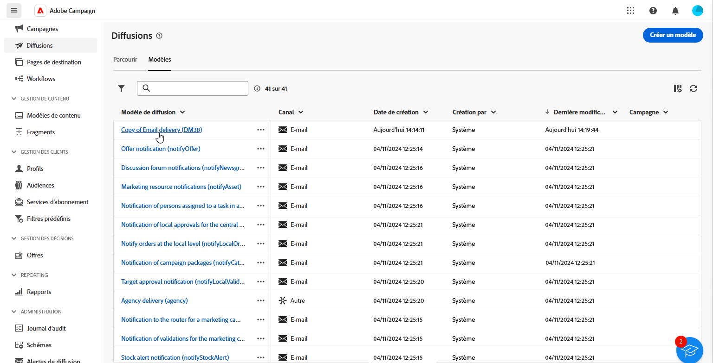

1. Cliquez sur **[!UICONTROL Paramètres]**.

   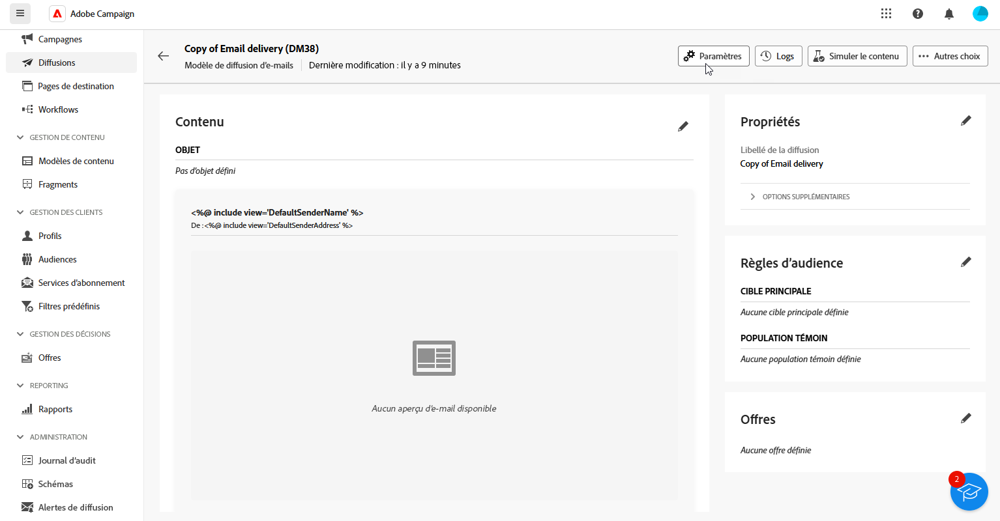

1. Dans l’onglet **[!UICONTROL Diffusion]**, accédez au champ **[!UICONTROL Branding]** et sélectionnez la marque que vous souhaitez lier au modèle.

   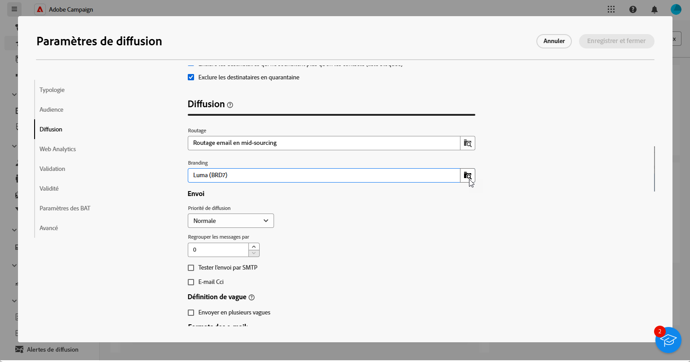

1. Validez votre sélection et enregistrez votre modèle.

Vous pouvez maintenant utiliser ce modèle pour envoyer vos diffusions.

>[!TAB Adobe Campaign V8]

Pour créer un modèle de diffusion, vous pouvez dupliquer un modèle intégré, convertir une diffusion existante en modèle ou créer un modèle de diffusion à partir de zéro. [En savoir plus](https://experienceleague.adobe.com/docs/campaign/campaign-v8/send/create-templates.html?lang=fr)

Une fois votre modèle créé, vous pouvez le lier à une marque. Pour cela :

1. Accédez à **[!UICONTROL Ressources]** `>` **[!UICONTROL Modèles]** `>` **[!UICONTROL Modèles de diffusion]** dans l’explorateur Adobe Campaign.

1. Sélectionnez un modèle de diffusion ou dupliquez un modèle existant.

   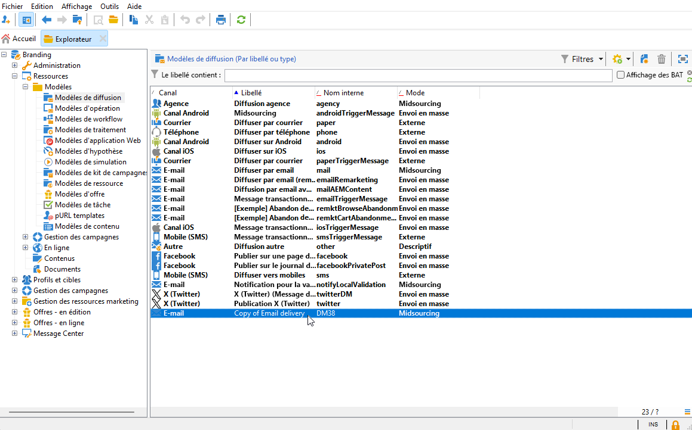

1. Accédez aux **[!UICONTROL Propriétés]** du modèle de diffusion sélectionné.

   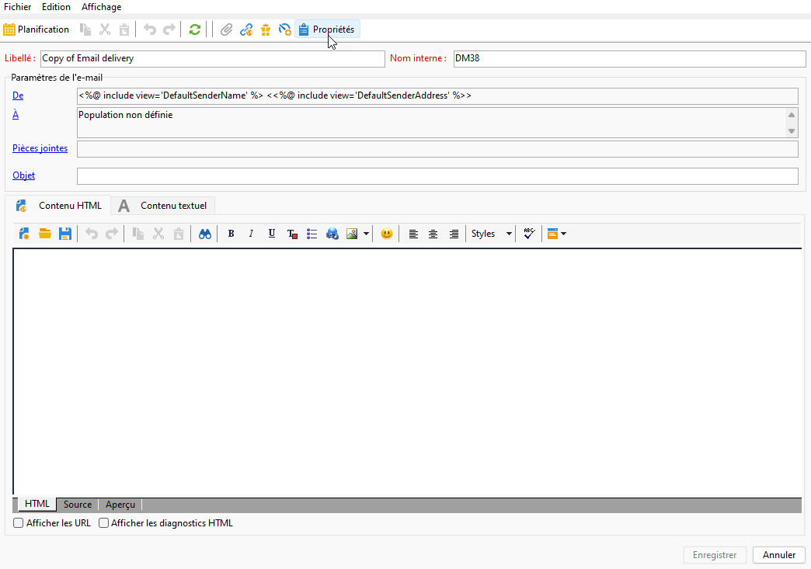

1. Dans l’onglet **[!UICONTROL Général]**, sélectionnez votre marque dans le menu déroulant **[!UICONTROL Branding]**.

   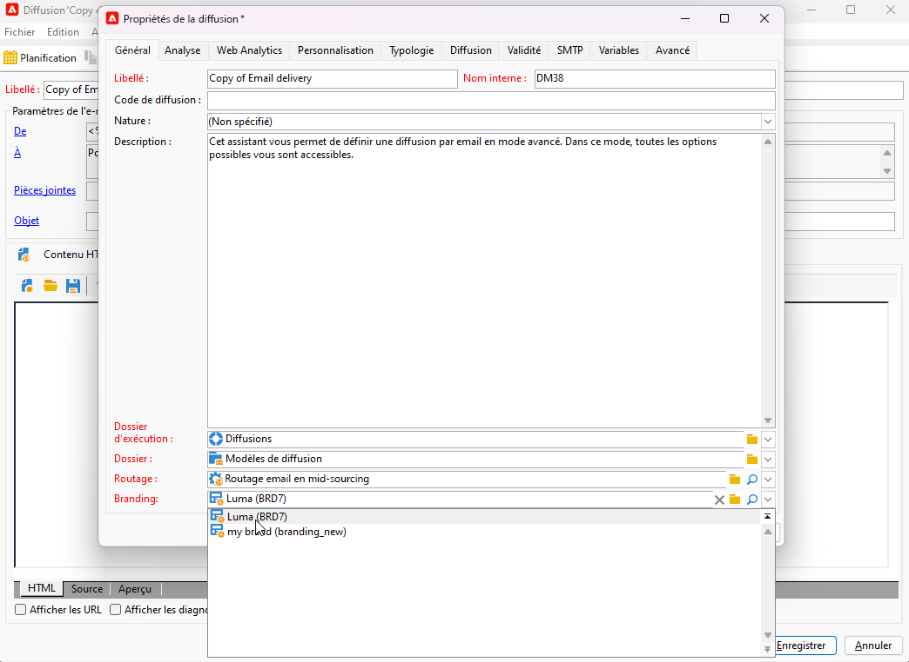

1. Une fois la configuration effectuée, sélectionnez **OK**.

Vous pouvez maintenant utiliser ce modèle pour envoyer vos diffusions.

>[!ENDTABS]

## Attribuer une marque à votre diffusion {#assigning-a-brand-to-an-email}

>[!BEGINTABS]

>[!TAB Adobe Campaign Web]

Pour créer une diffusion autonome, procédez comme suit.

1. Accédez au menu **[!UICONTROL Diffusions]** dans le rail de gauche, puis cliquez sur le bouton **[!UICONTROL Créer une diffusion]**.

   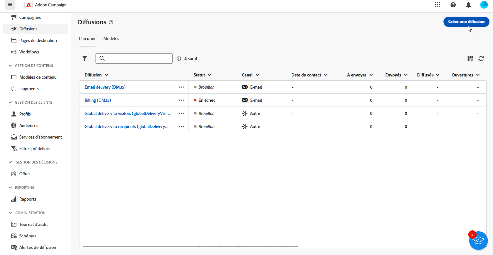

1. Sélectionnez le canal E-mail ou Notification push et choisissez un modèle de diffusion dans la liste.

1. Cliquez sur le bouton **[!UICONTROL Créer une diffusion]** pour confirmer.

1. Sur la page **[!UICONTROL Propriétés]**, cliquez sur **[!UICONTROL Paramètres]**.

   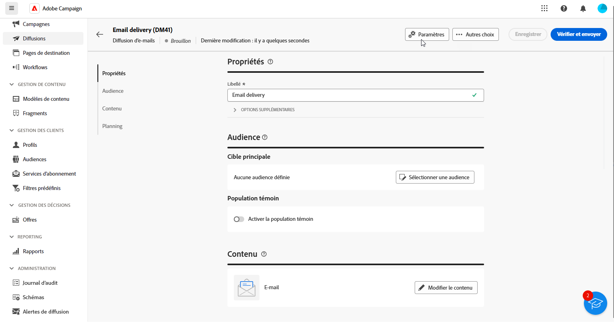

1. Dans l’onglet **[!UICONTROL Diffusion]**, accédez au champ **[!UICONTROL Branding]**.

   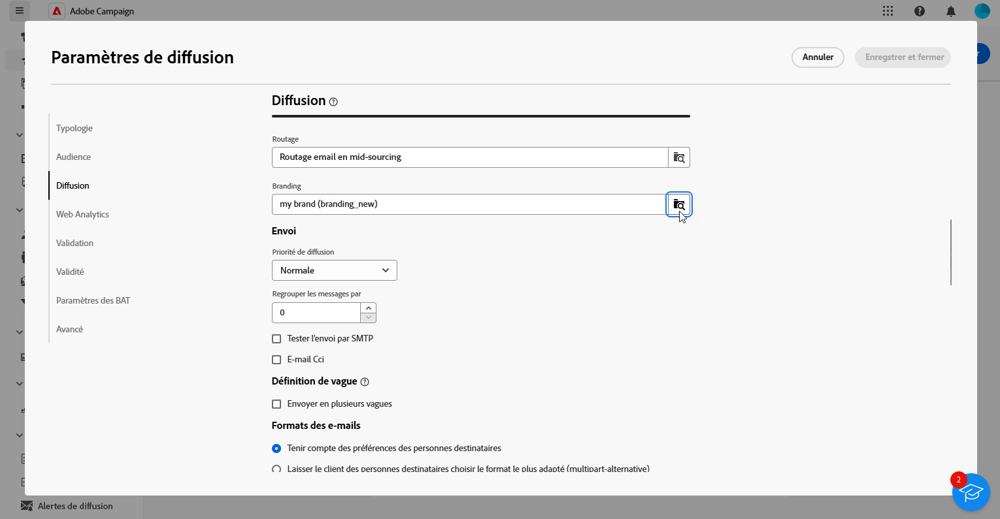

1. Sélectionnez la marque que vous souhaitez associer au modèle.

   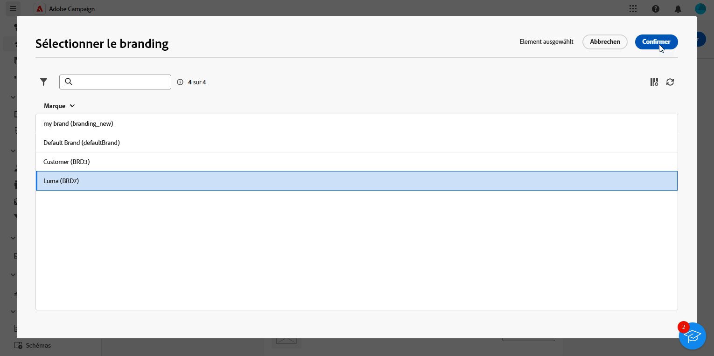

1. Personnalisez davantage vos diffusions. Pour plus d’informations sur la création d’un e-mail, consultez la section [Créer votre premier e-mail](../../email/create-email.md).

>[!TAB Adobe Campaign V8]

Pour créer une diffusion autonome, procédez comme suit.

1. Pour créer une diffusion, accédez à l’onglet **[!UICONTROL Campagnes]**.

1. Cliquez sur **[!UICONTROL Diffusions]** puis sur le bouton **[!UICONTROL Créer]** au-dessus de la liste des diffusions existantes.

   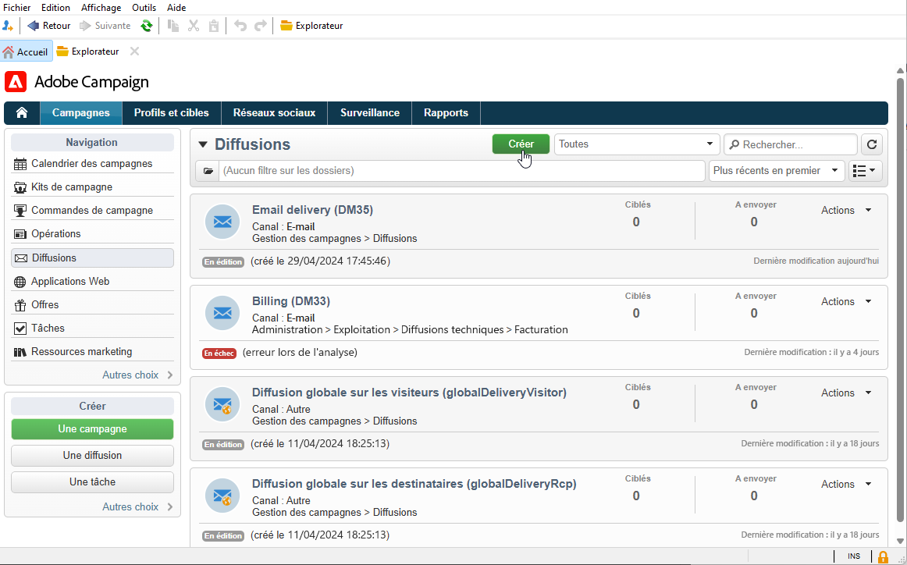

1. Sélectionnez un modèle de diffusion.

1. Accédez aux **[!UICONTROL Propriétés]** du modèle de diffusion sélectionné.

   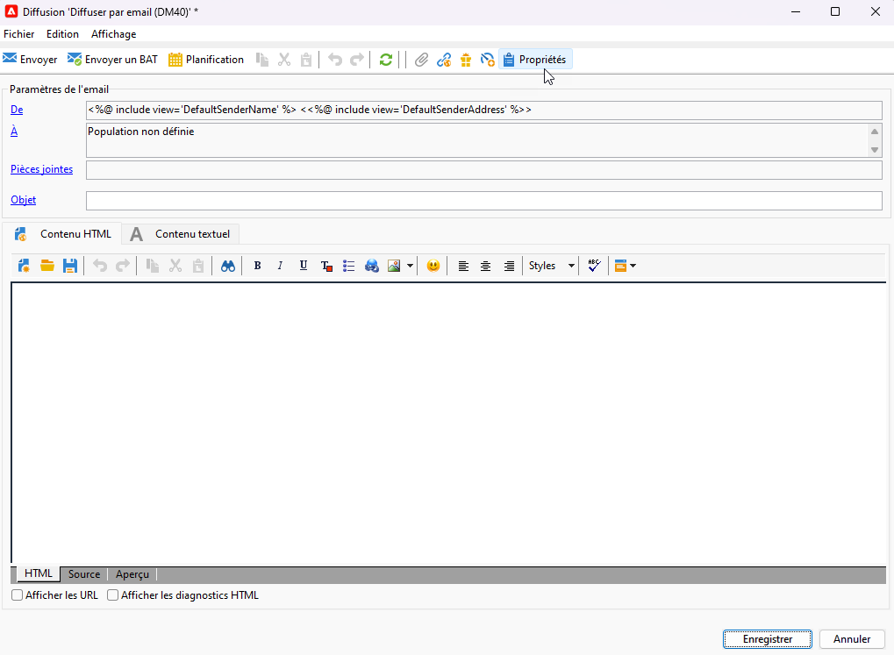

1. Dans l’onglet **[!UICONTROL Général]**, sélectionnez votre marque dans le menu déroulant **[!UICONTROL Branding]**.

   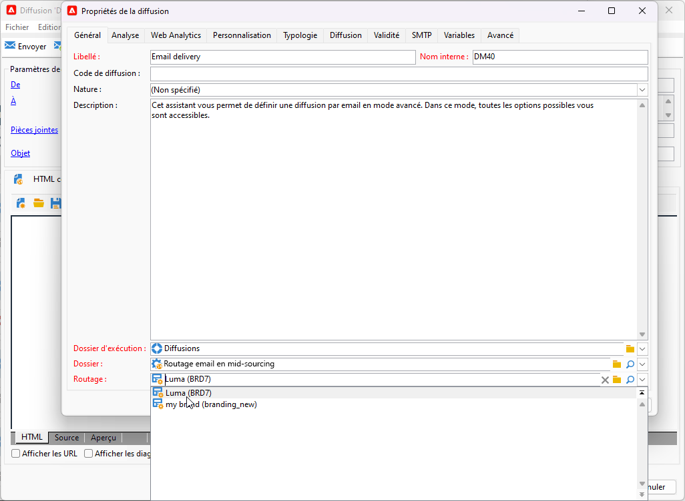

1. Une fois la configuration effectuée, sélectionnez **OK**.

1. Personnalisez davantage vos diffusions. Pour plus d’informations sur la création d’un e-mail, consultez la section [Concevoir et envoyer des e-mails](../../email/create-email.md).

>[!ENDTABS]

## Vérifier le branding associé aux messages transactionnels {#check-branding-transactional}

>[!IMPORTANT]
>
>Cette section s’applique uniquement aux messages transactionnels (Message Center).
>
>Bien que les fonctionnalités transactionnelles soient disponibles dans l’interface d’utilisation d’Adobe Campaign Web, les étapes de vérification ci-dessous doivent être effectuées dans la console cliente Campaign v8 (instance de pilotage).

Les diffusions transactionnelles synchronisées entre les instances d’exécution en temps réel (RT) et l’instance de pilotage ne répliquent pas les propriétés telles que le routage ou le branding. Ces diffusions synchronisées sont générées toutes les semaines à partir du même modèle pour rétablir les indicateurs de diffusion dans l’instance de pilotage.

Pour cette raison, l’instance de pilotage affiche la marque par défaut. Les paramètres de marque et de routage réellement utilisés pendant l’exécution du message sont définis dans le modèle de message transactionnel sur l’instance de pilotage.

Pour vérifier quelle marque a été utilisée pour un message transactionnel :

1. Identifiez le nom interne du modèle transactionnel publié sur l’instance d’exécution en temps réel (par exemple, `TransactionalMessaging4768`).

   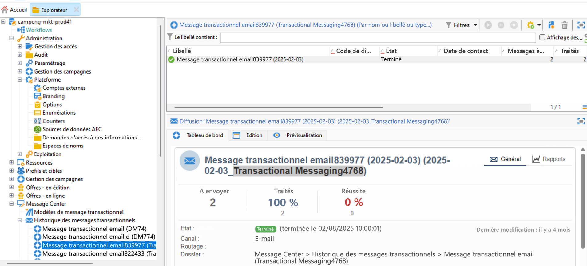

1. Dans l’instance de pilotage, recherchez ce nom interne sous **Modèles de messages transactionnels**.

   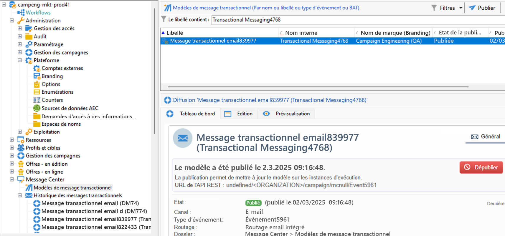

1. Ouvrez le modèle pour afficher la marque et d’autres propriétés associées.
