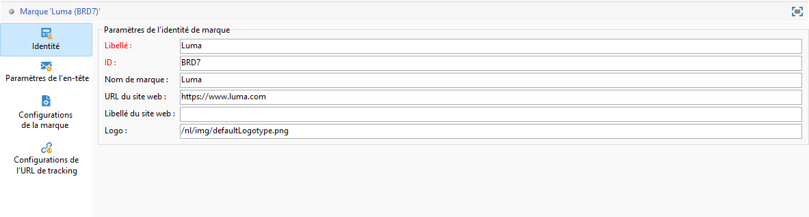
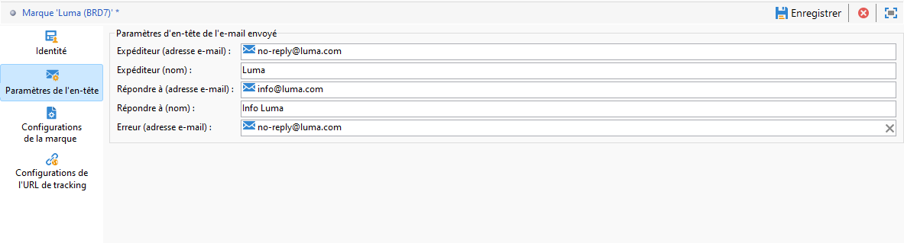
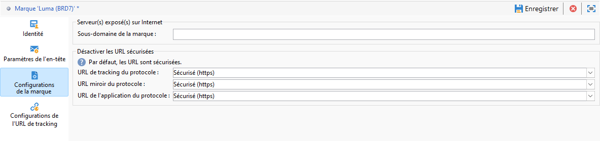

# Configurer des marques {#branding-configure}

>[!IMPORTANT]
>
>Les marques ne peuvent pas être créées ni modifiées par des utilisateurs et utilisatrices finaux : ces opérations doivent être effectuées par l’administrateur ou administratrice technique Adobe Campaign. Pour toute demande, contactez l&#39;Assistance clientèle Adobe.

Dans Adobe Campaign V8, les marques se trouvent dans le menu **[!UICONTROL Administration > Plateforme > Branding]**.

Une **[!UICONTROL marque]** est définie par les caractéristiques suivantes :

* Une **[!UICONTROL identité]** qui permet d&#39;identifier et de personnaliser votre marque. Cette section contient les champs suivants :

   * **[!UICONTROL Libellé]**, visible dans l&#39;interface
   * **[!UICONTROL ID]**
   * **[!UICONTROL Nom de la marque]**
   * **[!UICONTROL URL du site web]** et **[!UICONTROL Libellé du site web]** de la marque
   * **[!UICONTROL Logo de la marque]**

  

* **[!UICONTROL Paramètres d&#39;en-tête des emails envoyés]** qui permettent de personnaliser les informations qui seront visibles par les destinataires de vos campagnes. Cette section contient les champs suivants :

   * **[!UICONTROL Expéditeur (adresse email)]** avec l&#39;adresse email de la marque
   * **[!UICONTROL Expéditeur (nom)]** avec le nom de la marque
   * **[!UICONTROL Répondre à (adresse email)]** avec l&#39;adresse email de réponse destinée au client
   * **[!UICONTROL Répondre à (nom)]** avec le nom de la marque
   * **[!UICONTROL Erreur (adresse email)]** avec l&#39;adresse email à utiliser en cas d&#39;erreur

  >[!IMPORTANT]
  >
  >Après avoir mis à jour les paramètres d&#39;en-tête des emails, si le nom et l&#39;adresse email de l&#39;expéditeur ne sont pas modifiés dans l&#39;email créé à partir du modèle, vérifiez les paramètres avancés de ce dernier.

  

* Le paramètre **[!UICONTROL Configurations de marque]** définit les serveurs utilisés pour le tracking ainsi que l’accès aux pages de destination. Cette section contient les champs suivants :

   * **[!UICONTROL Sous-domaine de marque]** fait référence à l’URL de sous-domaine désignée spécifique à cette marque, demandée pour délégation à partir d’Adobe.

  Notez que la configuration des serveurs de tracking, de mise en miroir et d’application est stockée dans des comptes externes distincts associés au routage. Ces paramètres sont appliqués pendant l’approvisionnement et ne doivent pas être modifiés. Pour afficher les URL, accédez à l’onglet **[!UICONTROL Préfixes de branding]** à partir de votre compte externe.

  

* Le menu **[!UICONTROL Configurations des URL de tracking]** vous permet d’améliorer le tracking des URL en définissant des paramètres supplémentaires pour l’intégration aux outils d’analyse web tels qu’Adobe Analytics et Google Analytics.

  Utilisez le menu **[!UICONTROL Paramètres d’URL supplémentaires]** pour créer des paramètres supplémentaires en tant que paires clé-valeur, ainsi que leurs conditions d’applicabilité. Chaque nom de paramètre doit être unique et renseigné, et chaque valeur de paramètre doit être complétée. La condition d’applicabilité peut être vide, mais aucune de ces valeurs ne peut inclure de balises JST.

  Ces paramètres seront appliqués aux URL suivies correspondant à tout nom de domaine spécifié dans la **[!UICONTROL Liste des noms de domaine]**, qui peut inclure des expressions régulières.

  **Exemple :** une URL suivie telle que `https://www.example.com` devient `https://www.example.com/?age=21&deliveryName=DM101` lorsque les paramètres supplémentaires `age=21` et `deliveryName=DM101` sont configurés pour ce domaine.

## Configurer le branding pour les messages transactionnels {#branding-transactional-config}

>[!IMPORTANT]
>
>Cette section s’applique uniquement aux messages transactionnels (Message Center).
>
>Bien que les fonctionnalités transactionnelles soient disponibles dans l’interface d’utilisation d’Adobe Campaign Web, les étapes de vérification ci-dessous doivent être effectuées dans la console cliente de Campaign v8 (instance de pilotage).

Si vous utilisez la messagerie transactionnelle (Message Center) avec le branding, une configuration supplémentaire est nécessaire.

### Formules de tracking des instances en temps réel

Lorsque le branding est activé sur une instance de pilotage en temps réel (RT), des options de tracking spécifiques sont utilisées pour gérer les formules de tracking. Ces formules sont configurées de manière centralisée sur l’instance de pilotage en temps réel plutôt qu’individuellement sur chaque instance d’exécution en temps réel.

Les options suivantes définissent les formules de tracking utilisées par les diffusions en temps réel :

* **`NmsTracking_RT_ClickFormula`** : indique la formule utilisée pour le suivi des clics sur les instances en temps réel.

* **`NmsTracking_RT_OpenFormula`** : indique la formule utilisée pour le suivi des ouvertures sur les instances en temps réel.

Si votre implémentation nécessite des formules de tracking personnalisées pour les messages transactionnels, utilisez l’option ci-dessous :

* **`Branding_RT_ListXtkOptions_toPublish`** : listez ici les noms des options XTK pour vos formules personnalisées (séparées par des virgules). Cela permet de s’assurer que les diffusions en temps réel peuvent appliquer les formules de tracking personnalisées.