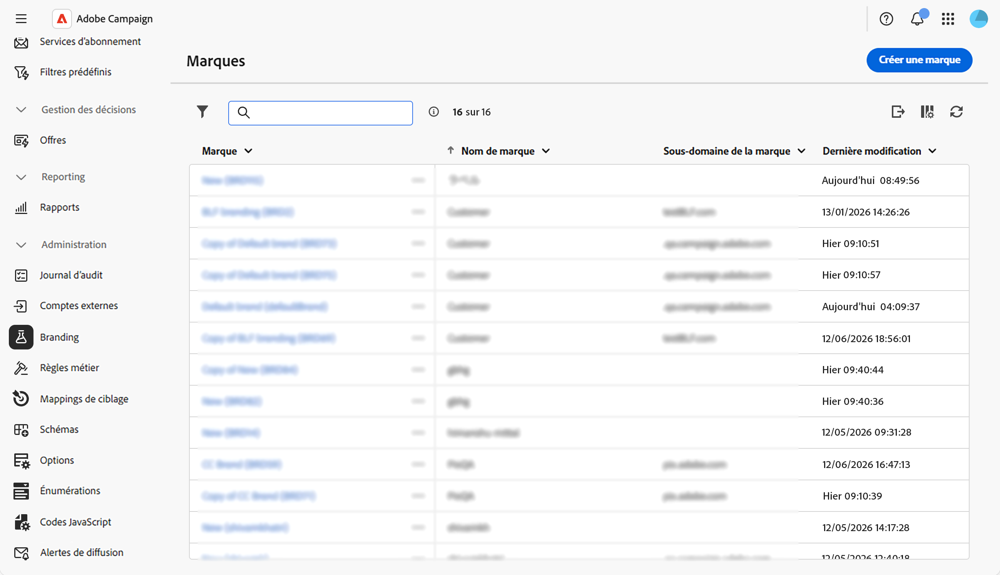
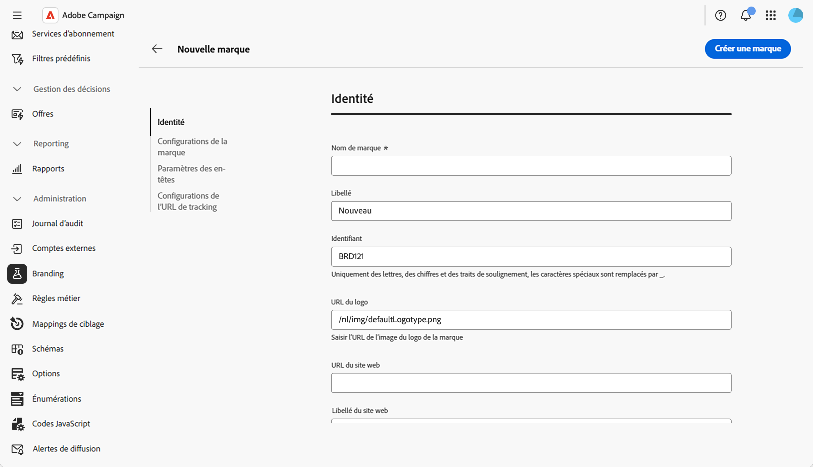
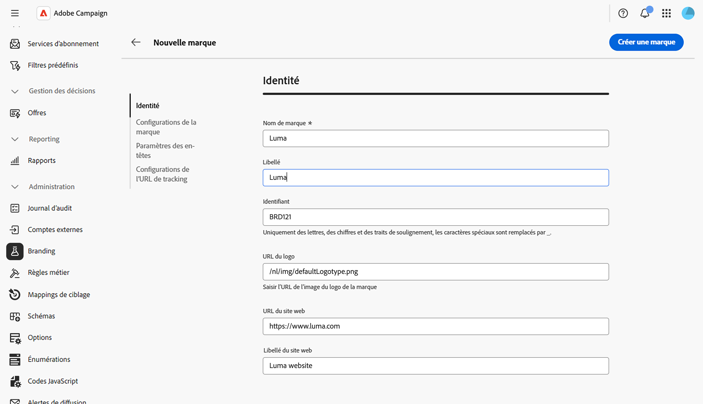
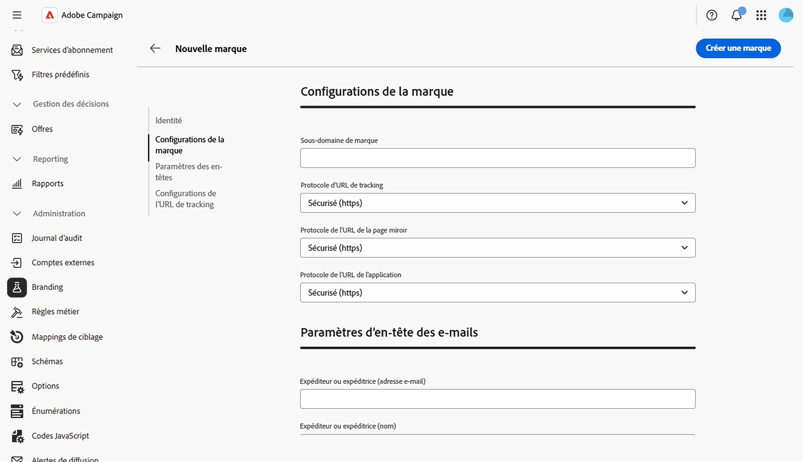
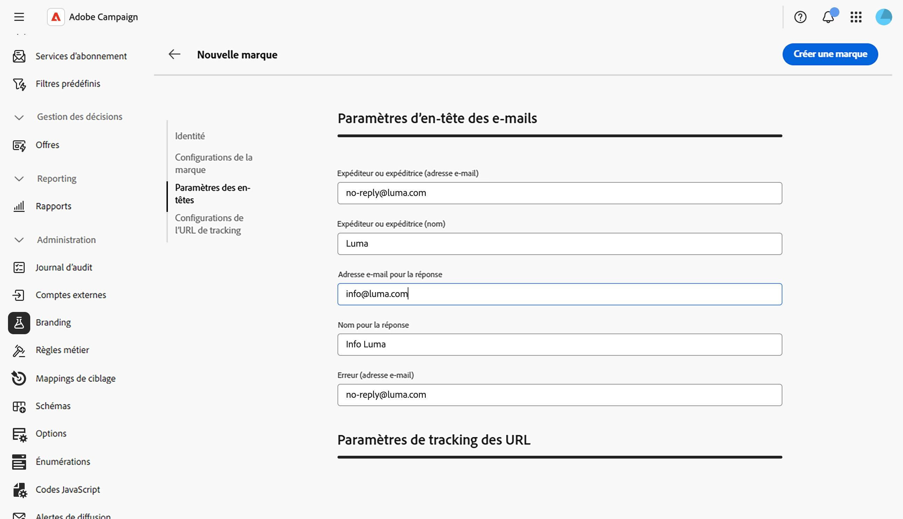
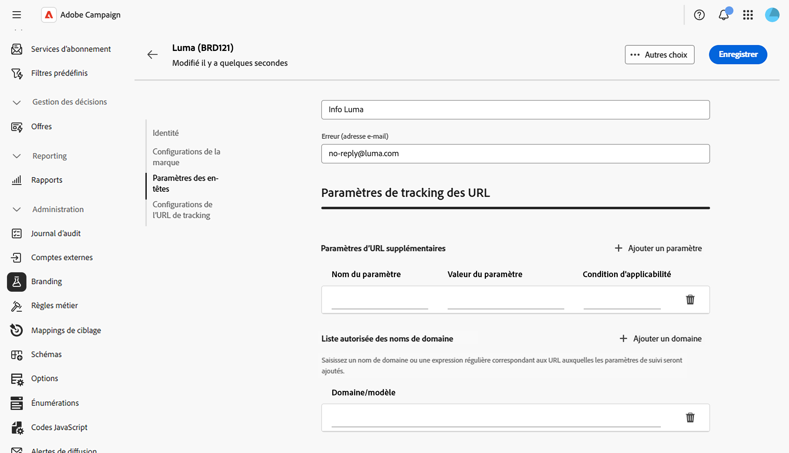

# Configurer des marques {#branding-configure}

Les administrateurs et administratrices techniques peuvent créer et gérer plusieurs marques directement à partir de l’interface d’utilisation web. Vous pouvez ainsi définir tous les éléments qui constituent votre identité de marque, y compris les logos et même les paramètres de tracking e-mail.

>[!NOTE]
>
>Cette fonctionnalité nécessite le package de branding sur votre instance. Contactez votre représentant ou représentante Adobe si le menu **Branding** ne s’affiche pas.

## Créer ou modifier une marque {#create-edit-brand}

>[!CONTEXTUALHELP]
>id="acw_branding_create"
>title="Créer une marque"
>abstract="Cliquez sur **Créer une marque** pour définir une nouvelle identité de marque. Renseignez les détails de la marque dans les onglets de configuration, puis cliquez sur **Créer une marque** pour enregistrer. La marque peut désormais être associée à des modèles de diffusion et à des diffusions autonomes."

Pour créer une nouvelle marque, suivez les étapes suivantes :

1. Accédez à **[!UICONTROL Administration > Branding]** dans le menu de gauche, ou à **[!UICONTROL Administration > Plateforme > Branding]** dans l’**[!UICONTROL Explorateur]**.

1. Cliquez sur le bouton **[!UICONTROL Créer une marque]** situé au-dessus de la liste.

   

1. Renseignez les détails de la marque dans les différentes sections. Chaque champ est décrit dans la section [Attributs de marque](#brand-attributes) ci-dessous.

   

1. Cliquez sur **[!UICONTROL Créer une marque]** pour enregistrer. La marque peut désormais être associée aux modèles de diffusion et aux diffusions autonomes. [Découvrez comment attribuer une marque](branding-assign.md).

Pour modifier une marque existante, sélectionnez-la dans la liste, mettez à jour les champs et enregistrez vos modifications.

## Attributs de la marque {#brand-attributes}

Une **[!UICONTROL marque]** est configurée en quatre sections : **[!UICONTROL Identité]**, **[!UICONTROL Configurations de marque]**, **[!UICONTROL Paramètres d’en-tête d’e-mail]** et **[!UICONTROL Paramètres de suivi des URL]**.

### Identité {#identity}

La section **[!UICONTROL Identité]** vous permet de définir et de personnaliser votre marque.

Cette section contient les champs suivants :

* **[!UICONTROL Nom de la marque]** : nom de votre marque. Ce champ est obligatoire.
* **[!UICONTROL Libellé]** : libellé visible dans l’interface.
* **[!UICONTROL ID]** : identifiant interne généré automatiquement. Vous pouvez le modifier. Seuls les lettres, les chiffres et les traits de soulignement sont autorisés. Les caractères spéciaux sont remplacés par des traits de soulignement.
* **[!UICONTROL URL du logo]** : URL de l’image du logo de la marque.
* **[!UICONTROL URL du site web]** et **[!UICONTROL Libellé du site web]** : URL du site web et libellé associés à la marque.

### Configurations de la marque {#brand-configs}

Dans la section **[!UICONTROL Configurations de marque]**, vous définissez les protocoles de sous-domaine et d’URL utilisés pour le suivi et l’accès aux pages de destination.

Cette section contient les champs suivants :

* **[!UICONTROL Sous-domaine de marque]** : URL de sous-domaine spécifique à cette marque, demandée pour délégation à partir d’Adobe.
* **[!UICONTROL Protocole d’URL de tracking]**, **[!UICONTROL Protocole d’URL de page miroir]** et **[!UICONTROL Protocole d’URL d’application]** : protocole utilisé pour chaque type d’URL (par exemple, **Sécurisé (https)**).

>[!NOTE]
>
>La configuration des serveurs de suivi, de mise en miroir et d’application est stockée dans des comptes externes distincts associés au routage. Ces paramètres sont appliqués pendant l’approvisionnement et ne doivent pas être modifiés. Pour afficher les URL, accédez à l’onglet **[!UICONTROL Préfixes de branding]** à partir de votre compte externe.

### Paramètres d’en-tête des e-mails {#header-param}

Les **[!UICONTROL paramètres d’en-tête des e-mails]** vous permettent de personnaliser ce que les destinataires verront dans la section d’en-tête de vos campagnes.

Cette section contient les champs suivants :

* **[!UICONTROL Expéditeur (adresse e-mail)]** : adresse e-mail de la marque.
* **[!UICONTROL Expéditeur (nom)]** : nom de la marque.
* **[!UICONTROL Adresse de réponse (adresse e-mail)]** : adresse e-mail à laquelle le client ou la cliente peut répondre.
* **[!UICONTROL Réponse (nom)]** : nom d’affichage des réponses.
* **[!UICONTROL Erreur (adresse e-mail)]** : adresse e-mail à utiliser en cas d’erreur.

<!--
>[!IMPORTANT]
>
>After having updated the header parameters of the emails, if the name and email address of the sender have not changed in the email created from the template, check the template's advanced settings.
-->

### Paramètres du tracking d’URL {#tracking-param}

La section **[!UICONTROL Paramètres du tracking d’URL]** vous permet d’améliorer le tracking des URL en définissant des paramètres supplémentaires pour l’intégration aux outils d’analyse web tels qu’Adobe Analytics et Google Analytics.

Cette section contient les champs suivants :

* **[!UICONTROL Paramètres d’URL supplémentaires]** : ajoutez des paramètres supplémentaires en tant que paires clé-valeur, ainsi que leurs conditions d’applicabilité. Chaque nom de paramètre doit être unique et renseigné, et chaque valeur de paramètre doit être complétée. La condition d’applicabilité peut être vide, mais aucune de ces valeurs ne peut inclure de balises JST.

* **[!UICONTROL Liste autorisée de noms de domaine]** : ajoutez des noms de domaine ou des expressions régulières pour correspondre aux URL où des paramètres de suivi seront ajoutés.

**Exemple :** une URL suivie telle que `https://www.luma.com` devient `https://www.luma.com/?age=21&deliveryName=DM101` lorsque les paramètres supplémentaires `age=21` et `deliveryName=DM101` sont configurés pour ce domaine.

## Configurer le branding pour les messages transactionnels {#branding-transactional-config}

>[!IMPORTANT]
>
>Cette section s’applique uniquement aux messages transactionnels (Message Center).
>
>Bien que les fonctionnalités transactionnelles soient disponibles dans l’interface d’utilisation d’Adobe Campaign Web, les étapes de vérification ci-dessous doivent être effectuées dans la console cliente de Campaign v8 (instance de pilotage).

Si vous utilisez la messagerie transactionnelle (Message Center) avec le branding, une configuration supplémentaire est nécessaire.

### Formules de tracking des instances en temps réel

Lorsque le branding est activé sur une instance de pilotage en temps réel (RT), des options de tracking spécifiques sont utilisées pour gérer les formules de tracking. Ces formules sont configurées de manière centralisée sur l’instance de pilotage en temps réel plutôt qu’individuellement sur chaque instance d’exécution en temps réel.

Les options suivantes définissent les formules de tracking utilisées par les diffusions en temps réel :

* **`NmsTracking_RT_ClickFormula`** : indique la formule utilisée pour le suivi des clics sur les instances en temps réel.

* **`NmsTracking_RT_OpenFormula`** : indique la formule utilisée pour le suivi des ouvertures sur les instances en temps réel.

Si votre implémentation nécessite des formules de tracking personnalisées pour les messages transactionnels, utilisez l’option ci-dessous :

* **`Branding_RT_ListXtkOptions_toPublish`** : listez ici les noms des options XTK pour vos formules personnalisées (séparées par des virgules). Cela permet de s’assurer que les diffusions en temps réel peuvent appliquer les formules de tracking personnalisées.
