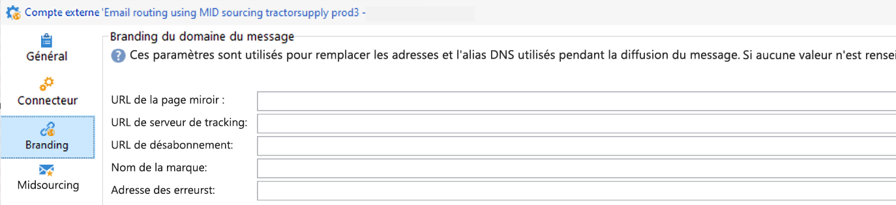

# Commencer avec le branding {#branding-gs}

>[!AVAILABILITY]
>
>Cette fonctionnalité est uniquement disponible à la demande pour les nouvelles implémentations. Pour y accéder, contactez votre représentant ou représentante Adobe.

Chaque entreprise dispose de directives de marque qui définissent à la fois des éléments visuels et des détails techniques. Adobe Campaign vous aide à gérer ces directives de manière centralisée, afin que vous puissiez présenter à vos clientes et clients une image de marque cohérente dans tout ce que vous faites, des logos contenus dans les e-mails aux URL et domaines utilisés dans vos campagnes.

Les administrateurs techniques peuvent créer et gérer plusieurs marques directement à partir de l’interface utilisateur web. Vous pouvez ainsi définir tous les éléments qui constituent votre identité de marque, y compris les logos et même les paramètres de tracking e-mail. Une fois créées, ces marques peuvent être facilement liées à vos diffusions. [Découvrez comment créer et configurer une marque](branding-configure.md).

Vous pouvez ajouter de nouvelles entités de votre organisation dans Campaign ou créer un nouveau type d’e-mail que vous devez envoyer sous un autre sous-domaine. Pour ce faire, suivez les étapes ci-après :

1. **Configurer un nouveau sous-domaine** - Pour tout nouveau sous-domaine utilisé par Adobe, la première étape consiste à le configurer. Vous pouvez effectuer cette opération via le [Panneau de contrôle Campaign](https://experienceleague.adobe.com/docs/control-panel/using/subdomains-and-certificates/subdomains-branding.html?lang=fr) ou contacter votre contact technique Adobe. Pour en savoir plus sur la configuration de sous-domaine, consultez [cette page](https://experienceleague.adobe.com/fr/docs/deliverability-learn/deliverability-best-practice-guide/additional-resources/campaign/ac-domain-name-setup).

   >[!NOTE]
   >
   >Le Panneau de contrôle est accessible à tous les utilisateurs administrateurs. Les étapes permettant d&#39;octroyer un accès administrateur à un utilisateur sont présentées sur [cette page](https://experienceleague.adobe.com/docs/control-panel/using/discover-control-panel/managing-permissions.html?lang=fr#discover-control-panel).

1. **Créer un modèle de diffusion** - Une fois la nouvelle marque disponible, il est recommandé de créer au moins un modèle de diffusion vierge qui fait référence à cette nouvelle marque. [En savoir plus](branding-assign.md).

1. **Vérifiez les directives relatives à la délivrabilité** - Avant de commencer à utiliser le nouveau domaine, la stratégie doit être discutée avec l&#39;équipe chargée de la délivrabilité d&#39;Adobe. Ils aideront à définir les bonnes pratiques, si une nouvelle affinité doit être créée pour partager les adresses IP entre les domaines par exemple, et/ou si un plan de montée en réputation doit être défini.

## Note de compatibilité {#compatibility-note}

Le nouveau modèle de branding centralisé n’est pas compatible avec la configuration de [&#x200B; branding héritée](https://experienceleague.adobe.com/docs/campaign-classic/using/transactional-messaging/configure-transactional-messaging/additional-configurations.html?lang=fr#configuring-multibranding){target="_blank"} qui était utilisée dans la console cliente.

Dans l’approche héritée, les clients et clientes implémentaient le branding en étendant le formulaire extAccount et en utilisant l’onglet **Branding**.

Si votre environnement existant utilise cette configuration héritée, elle ne peut pas être migrée directement vers le nouveau modèle de branding centralisé. Une nouvelle implémentation complète des paramètres de branding est nécessaire pour adopter le nouveau système.