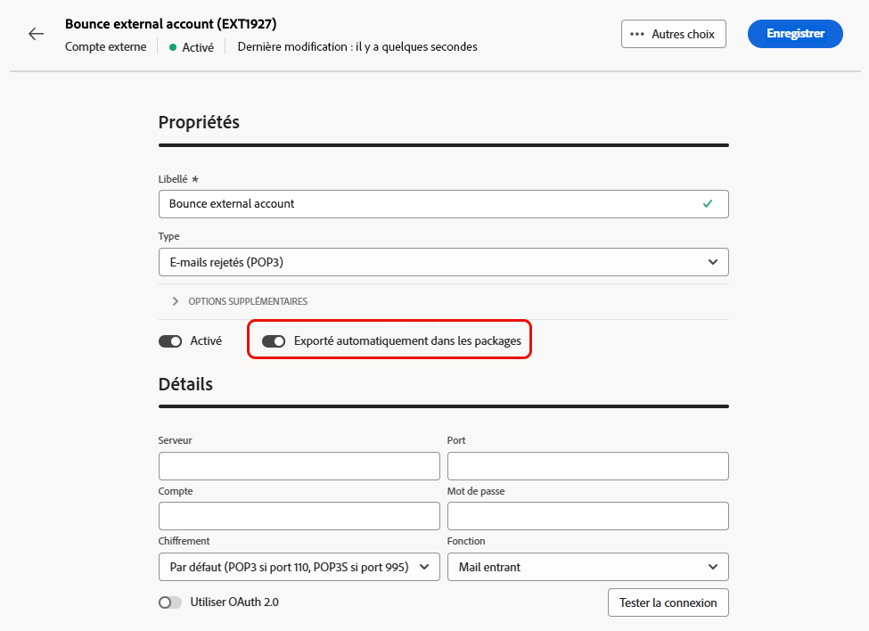

# Créer un compte externe {#create-external-account}

>[!CONTEXTUALHELP]
>id="acw_homepage_welcome_rn2"
>title="Création d’un compte externe"
>abstract="En tant qu’administrateur ou administratrice Campaign, vous pouvez désormais configurer de nouvelles connexions avec des systèmes externes à partir de l’interface d’utilisation de Campaign Web. Vous pouvez également afficher, mettre à jour et gérer les comptes externes existants."
>additional-url="https://experienceleague.adobe.com/docs/campaign-web/v8/release-notes/release-notes.html?lang=fr" text="Voir les notes de mise à jour"

Pour créer un compte externe, procédez comme suit. Les paramètres de configuration spécifiques dépendent du type de compte externe que vous créez.

1. Dans le menu du volet de gauche, sélectionnez **[!UICONTROL Comptes externes]** sous **[!UICONTROL Administration]**.

1. Cliquez sur **[!UICONTROL Créer un compte externe]**.

   

1. Saisissez votre **[!UICONTROL Libellé]** et sélectionnez le **[!UICONTROL Type]** de votre compte externe.

   * [Types spécifiques à Campaign](external-account.md)
   * [Intégration de la solution Adobe](integration-external-account.md)
   * [Transférer les données](transfer-external-account.md)
   * [Base externe](external-account-database.md)

   

1. Cliquez sur **[!UICONTROL Créer]**.

1. Dans la liste déroulante **[!UICONTROL Options supplémentaires]**, vous pouvez modifier le **[!UICONTROL Nom interne]** ou le chemin du **[!UICONTROL Dossier]** si nécessaire.

   

1. Activez l&#39;option **[!UICONTROL Exporter automatiquement dans les packages]** pour exporter automatiquement les données gérées par ce compte externe.<!--Exported where??-->

   

1. Dans la section **[!UICONTROL Détails]**, configurez l’accès au compte en spécifiant des informations d’identification selon le type de compte externe choisi. [En savoir plus](#bounce)

1. Cliquez sur **[!UICONTROL Tester la connexion]** pour vérifier que votre configuration est correcte.

1. Dans le menu **[!UICONTROL Plus...]**, dupliquez ou supprimez votre compte externe.

   

1. Une fois la configuration effectuée, cliquez sur **[!UICONTROL Enregistrer]**.
