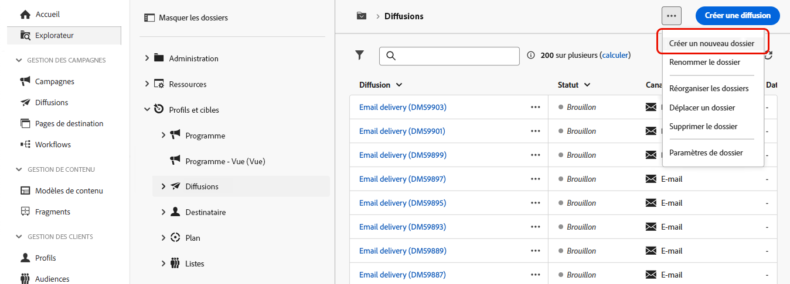
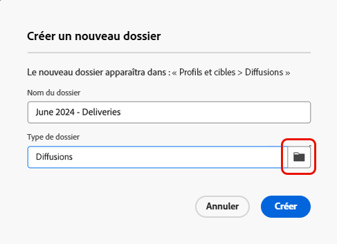
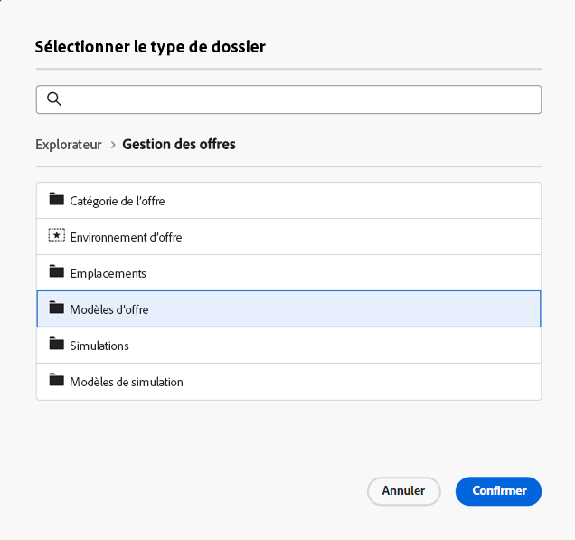

# Créer et gérer un dossier

Dans Adobe Campaign, vous pouvez créer des dossiers pour gérer votre arborescence de navigation. Dans **[!UICONTROL Explorateur]**, accédez au dossier dans lequel vous souhaitez créer votre dossier.

Sous le bouton **[!UICONTROL ...]**, sélectionnez **[!UICONTROL Créer un dossier]**.

{zoomable="yes"}

Lorsque vous créez un dossier, le type de dossier par défaut est celui du dossier parent.\
Dans cet exemple, un dossier est créé dans le dossier **[!UICONTROL Diffusions]**.

{zoomable="yes"}

Vous pouvez modifier le type de dossier en cliquant sur l’icône Type de dossier et en sélectionnant un type dans la liste présentée.

{zoomable="yes"}

Configurez le type de dossier en cliquant sur le bouton **[!UICONTROL Confirmer]**.

Pour créer un dossier sans type spécifique, sélectionnez le type **[!UICONTROL Dossier générique]**.

Dans la console Adobe Campaign, le processus de création et de gestion des dossiers est expliqué [ici](https://experienceleague.adobe.com/fr/docs/campaign/campaign-v8/config/configuration/folders-and-views). Vous pouvez également configurer des autorisations pour les dossiers. [En savoir plus](https://experienceleague.adobe.com/fr/docs/campaign/campaign-v8/admin/permissions/folder-permissions).