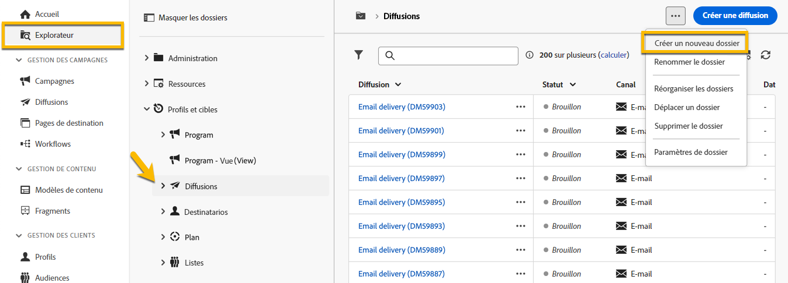

# Création et gestion d’un dossier

Dans Adobe Campaign, vous pouvez créer des dossiers pour gérer votre arborescence de navigation. Dans **[!UICONTROL Explorateur]**, accédez au dossier dans lequel vous souhaitez créer votre dossier.

Sous , **[!UICONTROL ..]** bouton, vous avez **[!UICONTROL Créer un dossier]**

{zoomable="yes"}

Lorsque vous créez un dossier, par défaut, le type de dossier est le type du dossier parent.
Dans notre exemple, nous créons un dossier dans le **[!UICONTROL Diffusions]** dossier.

{zoomable="yes"}

Vous pouvez modifier le type de votre dossier en cliquant sur l&#39;icône de type Dossier et vous pouvez le choisir dans la liste présentée :

{zoomable="yes"}

Pour configurer le type de dossier, cliquez sur **[!UICONTROL Confirmer]** bouton .

Si vous souhaitez créer un dossier sans type spécifique, choisissez **[!UICONTROL Dossier générique]** type.

Dans la console Adobe Campaign, le processus de création et de gestion d’un dossier est décrit. [here](https://experienceleague.adobe.com/en/docs/campaign/campaign-v8/config/configuration/folders-and-views)et vous avez la possibilité de configurer des autorisations sur des dossiers. [En savoir plus](https://experienceleague.adobe.com/en/docs/campaign/campaign-v8/admin/permissions/folder-permissions)
