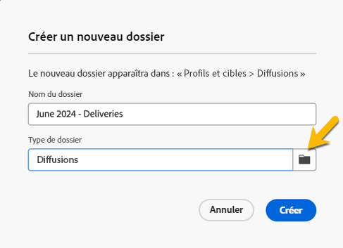

# Créer et gérer un dossier

Dans Adobe Campaign, vous pouvez créer des dossiers pour gérer votre arborescence de navigation. Dans **[!UICONTROL Explorateur]**, accédez au dossier dans lequel vous souhaitez créer votre dossier.

Sous le bouton **[!UICONTROL ...]**, vous voyez **[!UICONTROL Créer un dossier]**.

{zoomable="yes"}

Lorsque vous créez un dossier, par défaut, le type de dossier est le type du dossier parent.
Dans notre exemple, nous créons un dossier dans le dossier **[!UICONTROL Diffusions]**.

{zoomable="yes"}

Vous pouvez modifier le type de votre dossier en cliquant sur l&#39;icône de type Dossier et vous pouvez le choisir dans la liste présentée :

{zoomable="yes"}

Pour configurer le type de dossier, cliquez sur le bouton **[!UICONTROL Confirmer]**.

Si vous souhaitez créer un dossier sans type spécifique, choisissez le type **[!UICONTROL Dossier générique]**.

Dans la console Adobe Campaign, le processus de création et de gestion d’un dossier est décrit [ici](https://experienceleague.adobe.com/fr/docs/campaign/campaign-v8/config/configuration/folders-and-views), et vous avez la possibilité de configurer des autorisations sur des dossiers. [En savoir plus](https://experienceleague.adobe.com/fr/docs/campaign/campaign-v8/admin/permissions/folder-permissions)
