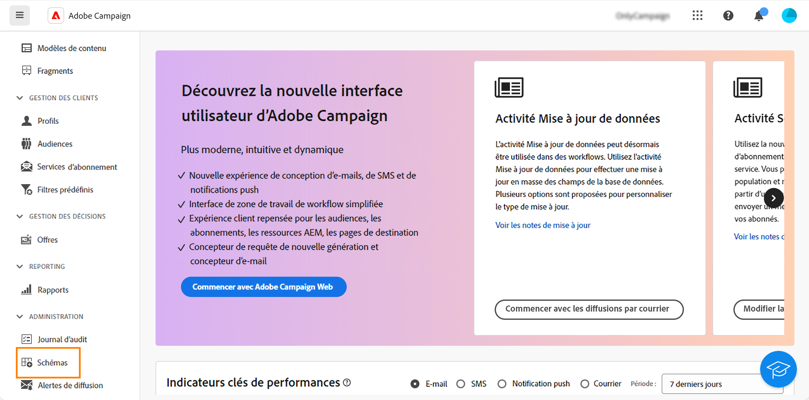
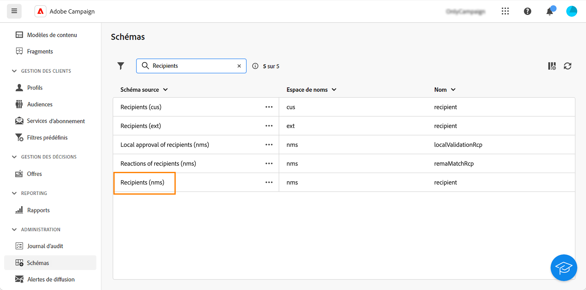
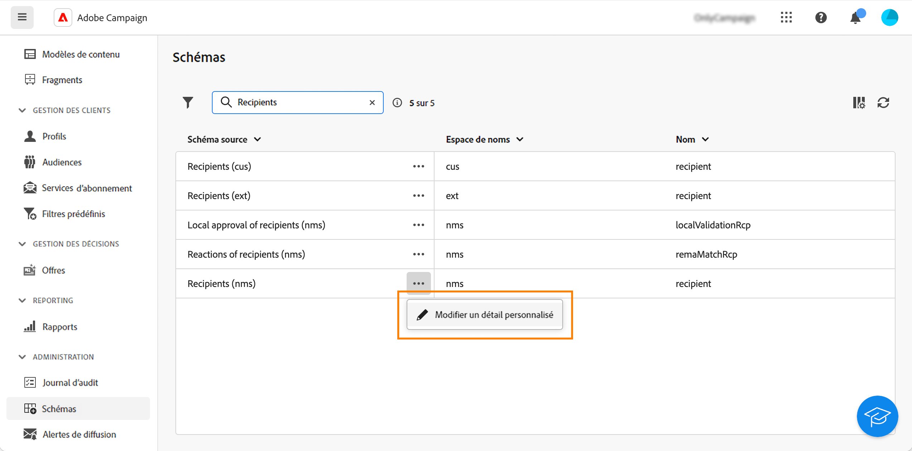
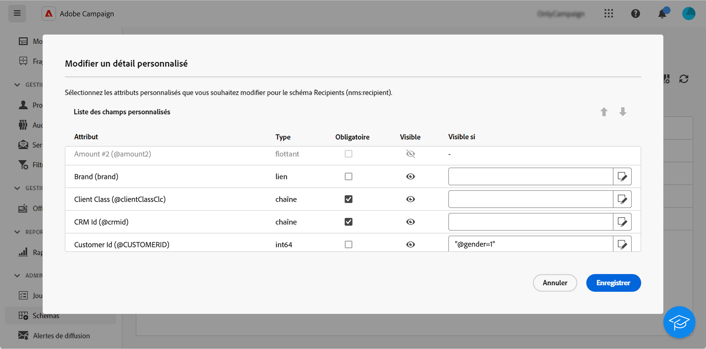
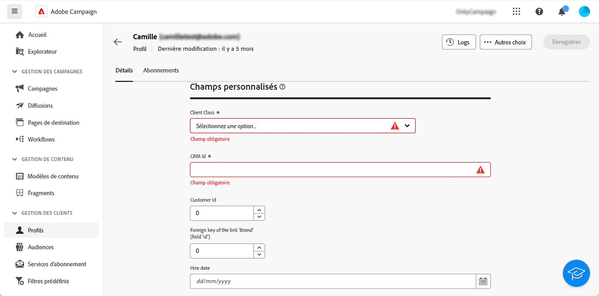

# Configurer des champs personnalisés {#custom-fields}

Les champs personnalisés sont des attributs supplémentaires ajoutés aux schémas intégrés via la console Adobe Campaign. En savoir plus dans la [documentation d’Adobe Campaign v8](https://experienceleague.adobe.com/docs/campaign/campaign-v8/developer/shemas-forms/extend-schema.html?lang=fr){target="_blank"}

Ces champs personnalisés sont affichés sur divers écrans, par exemple dans les détails d’un profil ou d’un profil de test.

Dans l’interface d’utilisation web, vous ne pouvez pas créer de champs personnalisés, mais vous pouvez modifier leur mode d’affichage. Ces modifications s’appliquent à tous les utilisateurs et à toutes les utilisatrices de Campaign.

>[!NOTE]
>
>Vous devez disposer des droits d’administration pour modifier des champs personnalisés.

Les champs personnalisés sont disponibles dans les schémas suivants :

* Personnes destinataires (nms)
* Campagnes (nms)
* Diffusions (nms)
* Adresses de contrôle (nms)

Pour configurer des champs personnalisés, procédez comme suit :

1. Dans **Administration**, cliquez sur **Schémas**.

   {zoomable="yes"}

1. Recherchez le schéma souhaité, par exemple le schéma **Personnes destinataires (nms)**.

   {zoomable="yes"}

1. Cliquez sur le bouton **Autres actions** et sélectionnez **Modifier les détails personnalisés**.

   {zoomable="yes"}

   L’écran **Modifier les détails personnalisés** affiche tous les champs personnalisés et leur type.

   {zoomable="yes"}

   Cet écran vous permet d’effectuer les actions suivantes :

   * Modifiez l’ordre des différents champs à l’aide des flèches haut et bas.
   * Rendez le champ obligatoire : cochez la case **Obligatoire**.
   * Rendez le champ visible ou masquez-le : cliquez sur le bouton **Visible**.
   * Ajoutez une condition de visibilité : cliquez sur le bouton **Visible si** et écrivez votre expression xtk à l’aide des fonctions xtk disponibles.

1. Accédez à l’écran qui affiche le champ personnalisé. Dans notre exemple, il s’agit de l’écran des détails du profil.

   {zoomable="yes"}
