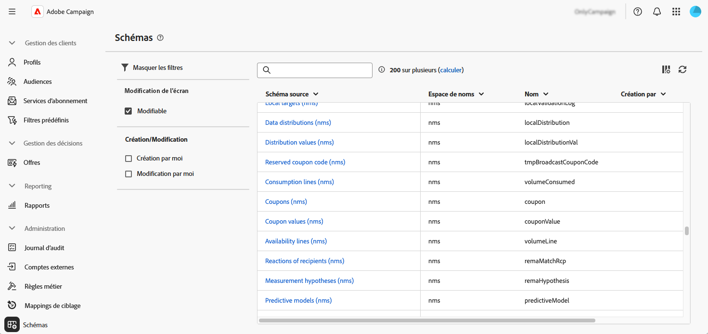
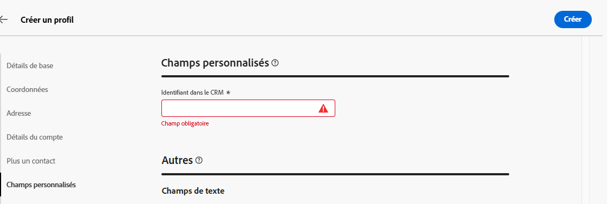

# Configurer des champs personnalisés {#custom-fields}

>[!CONTEXTUALHELP]
>id="acw_schema_editcustomfields"
>title="Modifier les détails personnalisés"
>abstract="Tous les champs personnalisés du schéma sélectionné qui sont affichés dans l’interface s’affichent. Vous pouvez modifier leur ordre d’affichage dans l’interface à l’aide des flèches haut et bas, et regrouper les champs en sous-sections en ajoutant des séparateurs. Pour supprimer un champ personnalisé ou modifier des paramètres tels que les conditions de visibilité, cliquez sur le bouton représentant des points de suspension."

>[!CONTEXTUALHELP]
>id="acw_schema_editcustomfields_settings_general"
>title="Général"
>abstract="Définissez les paramètres généraux du champ personnalisé. Si aucun libellé n’est renseigné, le libellé défini dans le schéma s’affiche. Utilisez le champ **Visible si** pour définir une condition à l’aide d’une expression xtk qui contrôle quand le champ doit être affiché. Vous pouvez également marquer le champ comme obligatoire ou en lecture seule dans l’interface."

>[!CONTEXTUALHELP]
>id="acw_schema_editcustomfields_settings_link"
>title="Propriétés du lien"
>abstract="Utilisez le concepteur de requête pour spécifier les règles d’affichage d’un champ personnalisé de type lien. Par exemple, restreignez les valeurs de liste en fonction de l’entrée d’un autre champ."

>[!CONTEXTUALHELP]
>id="acw_schema_editcustomfields_settings_layout"
>title="Disposition"
>abstract="Par défaut, les champs personnalisés s’affichent dans l’interface dans deux colonnes. Activez cette option pour afficher le champ personnalisé sur toute la largeur de l’écran au lieu de deux colonnes."

>[!CONTEXTUALHELP]
>id="acw_schema_editcustomfields_separatorproperties"
>title="Propriétés du séparateur"
>abstract="Indiquez le nom à afficher dans l’interface pour la sous-section."

<!-- NOT USED IN THE UI?-->

>[!CONTEXTUALHELP]
>id="acw_schema_editcustomfields_settings"
>title="Paramètres des attributs"
>abstract="Paramètres des attributs"

Les champs personnalisés sont des attributs supplémentaires ajoutés aux schémas intégrés via la console Adobe Campaign. Ils vous permettent de personnaliser les schémas en incluant de nouveaux attributs en fonction des besoins de votre entreprise. Découvrez comment étendre un schéma dans la [documentation d’Adobe Campaign v8](https://experienceleague.adobe.com/docs/campaign/campaign-v8/developer/shemas-forms/extend-schema.html?lang=fr){target="_blank"}.

Les champs personnalisés peuvent être affichés sur différents écrans, comme les détails de profil dans l’interface de Campaign Web. Les administrateurs et les administratrices peuvent contrôler quels champs sont visibles et la manière dont ils apparaissent. Ces modifications s’appliquent à tous les utilisateurs et utilisatrices de Campaign.

>[!NOTE]
>
>Vous devez disposer des droits d’administration pour gérer des champs personnalisés.

Les champs personnalisés sont disponibles pour les schémas suivants :

* Campagnes (nms)
* Plans (nms)
* Programmes (nms)
* Personnes destinataires (nms)
* Adresses de contrôle (nms)
* Diffusions (nms)

## Ajouter des champs personnalisés à l’interface {#add}

Pour afficher des champs personnalisés dans l’interface, procédez comme suit :

1. Accédez au menu **[!UICONTROL Schémas]** dans le volet de navigation de gauche et recherchez le schéma souhaité.

   Utilisez le filtre **[!UICONTROL Modifiable]** dans le volet des filtres pour identifier rapidement les schémas comportant des champs personnalisés.

   

1. Sélectionnez le nom du schéma dans la liste pour l’ouvrir. Une vue de schéma détaillée affiche [En savoir plus sur les détails du schéma](../administration/schemas.md). Cliquez sur le bouton **[!UICONTROL Modifier les détails personnalisés]** pour accéder aux champs personnalisés. Dans cet exemple, nous voulons ajouter des champs pour le schéma **[!UICONTROL Personnes destinataires]**.

   

1. La liste des champs personnalisés du schéma qui s’affichent dans l’interface est affichée. Ici, le champ « CRM Id » est visible sur l’écran des détails des profils et a été marqué comme obligatoire.

   | Configuration des champs personnalisés | Rendu dans l’interface |
   |  ---  |  ---  |
   | {zoomable="yes"} | {zoomable="yes"} |

1. Pour ajouter un champ personnalisé à l’interface , cliquez sur le bouton représentant des points de suspension et choisissez l’une des options suivantes :

   * **[!UICONTROL Sélectionner des champs personnalisés]** : sélectionnez un ou plusieurs champs personnalisés à afficher dans l’interface.
   * **[!UICONTROL Remplir automatiquement la liste des champs personnalisés]** : ajoutez tous les champs personnalisés définis pour le schéma à l’interface.

   

1. Une fois les champs personnalisés ajoutés, vous pouvez effectuer les opérations suivantes :

   * **Réorganiser les champs** : utilisez les flèches haut et bas.
   * **Rendre les champs obligatoires** : cochez la case **Obligatoire**.
   * **Modifier les paramètres des champs** : cliquez sur le bouton représentant des points de suspension et choisissez **[!UICONTROL Modifier]**. [En savoir plus](#settings)
   * **Supprimer des champs** : cliquez sur le bouton représentant des points de suspension et choisissez **[!UICONTROL Supprimer]**.
   * **Organiser les champs en sous-sections dans l’interface** : cliquez sur le bouton représentant des points de suspension à côté des flèches haut et bas et choisissez **[!UICONTROL Ajouter un séparateur]**. [En savoir plus](#separator)

## Configurer les paramètres des champs personnalisés {#settings}

Pour configurer des paramètres spécifiques à chaque champ personnalisé, cliquez sur le bouton représentant des points de suspension à côté du champ souhaité, puis sélectionnez **[!UICONTROL Modifier]**.

Les paramètres disponibles sont les suivants :

* **[!UICONTROL Attribut]** : nom du champ personnalisé.
* **[!UICONTROL Libellé (personnalisé)]** : libellé à afficher dans l’interface. Si aucun libellé n’est renseigné, le libellé défini dans le schéma s’affiche.
* **[!UICONTROL Visible si]** : définissez une condition à l’aide d’une expression xtk qui contrôle quand le champ doit être affiché. Par exemple, masquer le champ si un autre champ est vide.
* **[!UICONTROL Obligatoire]** : permet au champ d’être obligatoire dans l’interface.
* **[!UICONTROL Lecture seule]** : permet au champ d’être en lecture seule dans l’interface. Les utilisateurs et les utilisatrices ne pourront pas modifier la valeur du champ.
* **[!UICONTROL Paramètres de filtrage]** (pour les champs de type lien) : utilisez le concepteur de requête pour spécifier les règles d’affichage d’un champ personnalisé de type lien. Par exemple, restreignez les valeurs de liste en fonction de l’entrée d’un autre champ.

  Vous pouvez également référencer dans vos conditions une valeur saisie dans d’autres champs à l’aide de la syntaxe `$(<field-name>)`. Cela vous permet de référencer la valeur actuelle d’un champ telle qu’elle a été saisie dans le formulaire, même si elle n’a pas encore été enregistrée dans la base de données.

  Dans l’exemple ci-dessous, la condition vérifie si la valeur du champ @ref correspond à la valeur saisie dans le champ @refCom. En revanche, utiliser `@refCom` au lieu de `$(@refCom)` référencerait la valeur du champ @ref telle qu’elle existe dans la base de données.

  +++Afficher l’exemple

  

+++

* **[!UICONTROL Étendre sur deux colonnes]** : par défaut, les champs personnalisés s’affichent dans l’interface sur deux colonnes. Activez cette option pour afficher le champ personnalisé sur toute la largeur de l’écran au lieu de deux colonnes.

## Organiser des champs personnalisés en sous-sections {#separator}

L’interface d’utilisation de Campaign Web vous permet d’ajouter des séparateurs afin de regrouper des champs personnalisés dans l’interface pour une meilleure lisibilité. Pour ce faire, procédez comme suit :

1. Cliquez sur le bouton représentant des points de suspension à côté des flèches haut et bas et sélectionnez **[!UICONTROL Ajouter un séparateur]**.

1. Une nouvelle ligne représentant le séparateur est ajoutée à la liste. Cliquez sur le bouton représentant des points de suspension et choisissez **[!UICONTROL Modifier]** pour nommer la sous-section.

1. Utilisez les flèches haut et bas pour déplacer le séparateur vers l’emplacement souhaité. Les champs répertoriés sous le séparateur seront regroupés sous celui-ci.

   Dans cet exemple, les champs « Interested Collections » et « Brand » sont regroupés dans une sous-section « Collection ».

   | Configuration des champs personnalisés | Rendu dans l’interface |
   |  ---  |  ---  |
   | {zoomable="yes"} | {zoomable="yes"} |
