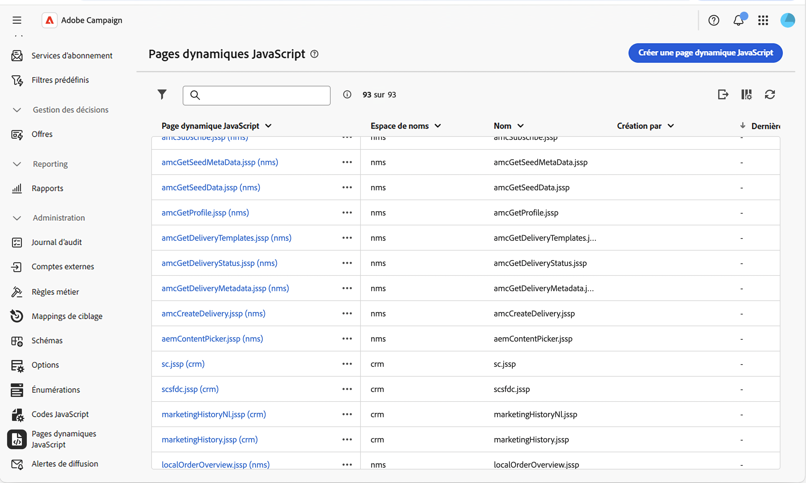
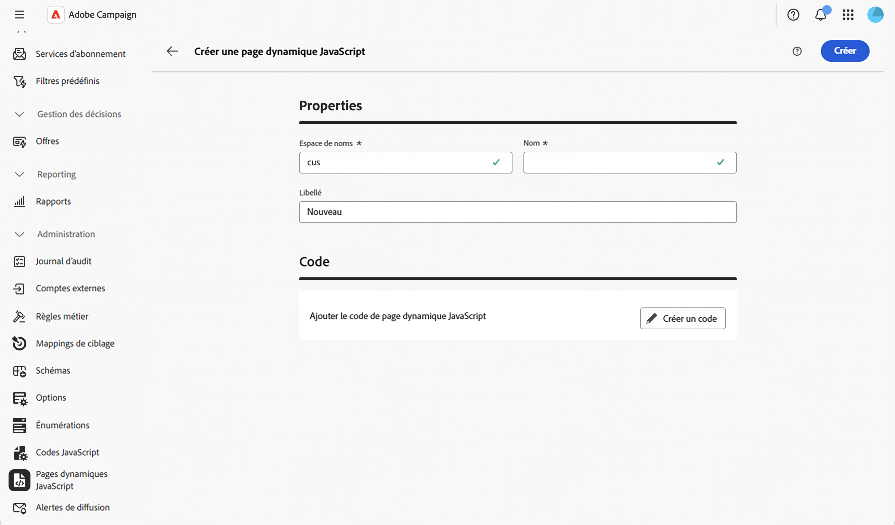
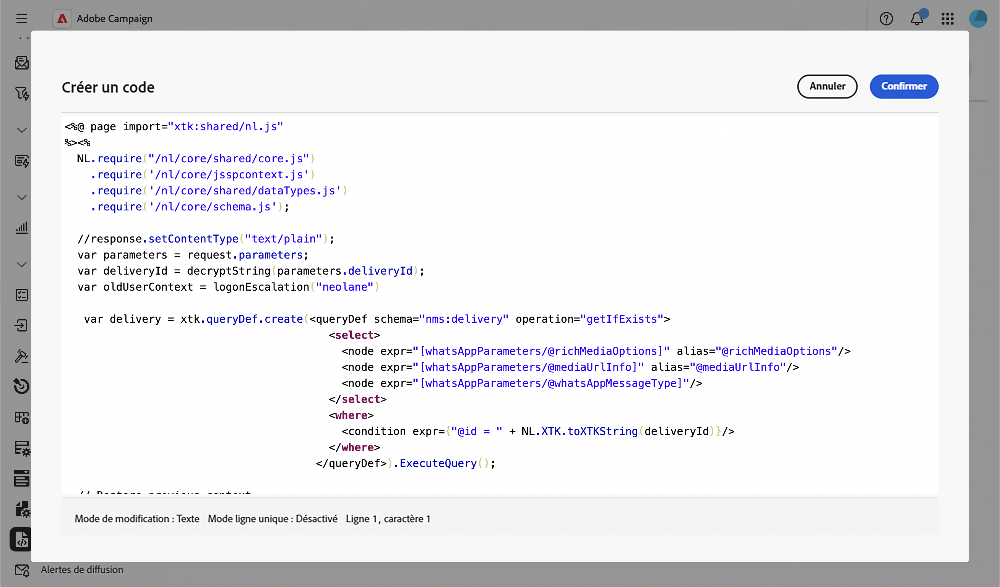

# Utiliser des pages JavaScript dynamiques {#dynamic-javascript-pages}

>[!CONTEXTUALHELP]
>id="acw_dynamic_javascript_pages_list"
>title="Pages JavaScript dynamiques"
>abstract="Les pages JavaScript dynamiques (JSSP) vous permettent de créer des pages côté serveur qui génèrent du contenu dynamique lorsqu’elles sont accessibles via une URL, comme des API personnalisées, des exports ou une logique d’application web. Dans cette liste, vous pouvez créer, modifier, dupliquer ou supprimer une page JavaScript dynamique."

>[!CONTEXTUALHELP]
>id="acw_dynamic_javascript_pages_create"
>title="Créer une page dynamique JavaScript"
>abstract="Définissez un espace de noms, un nom et un libellé pour votre page JavaScript dynamique, puis écrivez son contenu à l’aide du code JavaScript. Une fois créés, l’espace de noms et le nom ne peuvent plus être modifiés."

## À propos des pages JavaScript dynamiques {#about}

Les pages JavaScript dynamiques (JSSP) vous permettent de créer des pages côté serveur qui génèrent du contenu dynamique lorsqu’elles sont accessibles via une URL, comme des API personnalisées, des exports ou une logique d’application web. Ces pages sont stockées dans le menu **[!UICONTROL Administration]** > **[!UICONTROL Pages JavaScript dynamiques]** dans le volet de navigation de gauche.

À partir de la liste des pages JavaScript dynamiques, vous pouvez :

* **Dupliquer ou supprimer une page** : cliquez sur le bouton représentant des points de suspension et sélectionnez l’action souhaitée.
* **Modifier une page** : cliquez sur le nom d’une page pour ouvrir ses propriétés, apporter vos modifications et enregistrer.
* **Créer une page JavaScript dynamique** : cliquez sur le bouton **[!UICONTROL Créer une page JavaScript dynamique]**.

<!--
>[!NOTE]
>
>In the Campaign console, dynamic JavaScript pages are available under **[!UICONTROL Administration]** > **[!UICONTROL Configuration]** > **[!UICONTROL Dynamic JavaScript pages]**. Although the menu location differs from the Web user interface, the list is identical and operates like a mirror.
-->

## Créer une page JavaScript dynamique {#create}

Pour créer une page JavaScript dynamique, procédez comme suit :

1. Accédez au menu **[!UICONTROL Pages JavaScript dynamiques]**, puis cliquez sur le bouton **[!UICONTROL Créer une page JavaScript dynamique]**.

1. Définissez les propriétés de la page :

   * **[!UICONTROL Espace de noms]** : spécifiez l’espace de noms pertinent pour vos ressources personnalisées. Par défaut, l’espace de noms est « cus », mais il peut varier en fonction de votre implémentation.
   * **[!UICONTROL Nom]** : identifiant unique utilisé pour référencer la page.
   * **[!UICONTROL Libellé]** : libellé descriptif affiché dans la liste des pages JavaScript dynamiques.

   

   >[!NOTE]
   >
   >Une fois créés, les champs **[!UICONTROL Espace de noms]** et **[!UICONTROL Nom]** ne peuvent plus être modifiés. Pour apporter des modifications, dupliquez la page et mettez-la à jour si nécessaire.

1. Cliquez sur le bouton **[!UICONTROL Créer un code]** pour définir le contenu de la page, puis écrivez votre code JSSP à l’aide de directives `<%@ page %>` et d’appels `NL.require()` pour charger les bibliothèques principales.

   

1. Cliquez sur **[!UICONTROL Confirmer]** pour enregistrer votre code.

1. Lorsque votre page JavaScript dynamique est prête, cliquez sur **[!UICONTROL Créer]**. La page est désormais accessible à partir d’une URL créée à partir de son espace de noms et de son nom, au format `https://<your-instance>/<namespace>/<name>`. Par exemple, une page nommée `recipientAPI.jssp` dans l’espace de noms `cus` est accessible sur `https://<your-instance>/cus/recipientAPI.jssp`.

Pour plus d’informations sur les fonctions JavaScript réutilisables, consultez [Utiliser des codes JavaScript](javascript-codes.md).
