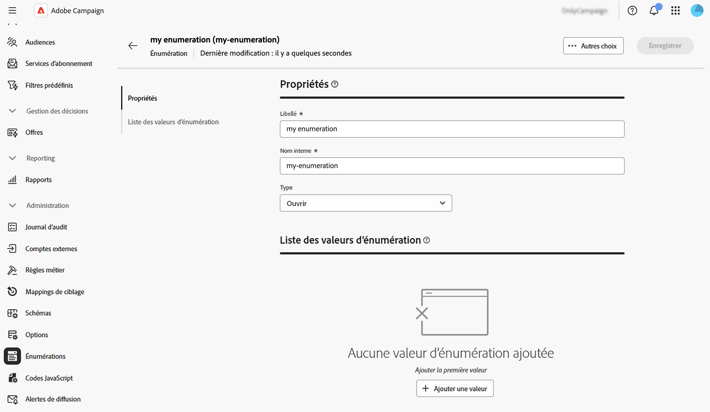

# Gérer les énumérations {#enumerations}

>[!CONTEXTUALHELP]
>id="acw_enumerations_list"
>title="Énumérations"
>abstract="Une énumération est une liste de valeurs proposées par le système pour renseigner les champs. Utilisez des énumérations pour normaliser les valeurs de ces champs, faciliter la saisie de données ou les utiliser dans des requêtes."

>[!CONTEXTUALHELP]
>id="acw_enumerations_properties"
>title="Propriétés"
>abstract="Définissez les propriétés de l’énumération telles que son nom, son nom interne et son type. Les énumérations **[!UICONTROL Fermées]** ont une liste fixe de valeurs qui ne peut être modifiée qu&#39;à partir du menu **[!UICONTROL Énumérations]**. Les énumérations **[!UICONTROL Ouverte]** permettent aux utilisateurs d&#39;ajouter des valeurs directement dans les champs à partir de cette énumération. Les énumérations **[!UICONTROL Système]** sont associées aux champs système. Les énumérations **[!UICONTROL Émoticône]** sont utilisées pour mettre à jour la liste des émoticônes."

>[!CONTEXTUALHELP]
>id="acw_enumerations_values"
>title="Liste de valeurs d’énumération"
>abstract="Pour ajouter une valeur à l’énumération, cliquez sur le bouton **[!UICONTROL Ajouter une valeur]** puis configurez-la selon vos besoins."

## Que sont les énumérations ? {#about}

Une énumération est une liste de valeurs proposées par le système pour renseigner les champs. Utilisez des énumérations pour normaliser les valeurs de ces champs, faciliter la saisie de données ou les utiliser dans des requêtes. La liste des valeurs s’affiche sous forme d’une liste déroulante dans laquelle vous pouvez sélectionner la valeur à renseigner dans le champ. La liste déroulante permet également une entrée prédictive : saisissez les premières lettres et l’application remplit le reste.

Les valeurs de ce type de champ sont définies depuis le menu **[!UICONTROL Administration]** / **[!UICONTROL Énumérations]** du volet de navigation de gauche.

## Création d’une énumération {#create}

Pour créer une énumération, procédez comme suit :

1. Accédez au menu **[!UICONTROL Énumérations]**, puis cliquez sur le bouton **[!UICONTROL Créer une énumération]**.

1. Saisissez un **[!UICONTROL Libellé]** et un **[!UICONTROL Nom interne]** pour l’énumération.

   

1. Sélectionnez l&#39;énumération **[!UICONTROL Type]** :

   * Les énumérations **[!UICONTROL Fermées]** ont une liste fixe de valeurs qui ne peut être modifiée qu&#39;à partir du menu **[!UICONTROL Énumérations]**.
   * Les énumérations **[!UICONTROL Ouverte]** permettent aux utilisateurs d&#39;ajouter des valeurs directement dans les champs à partir de cette énumération.
   * Les énumérations **[!UICONTROL Système]** sont associées aux champs système.
   * Les énumérations **[!UICONTROL Émoticône]** sont utilisées pour mettre à jour la liste des émoticônes.

1. Cliquez sur **[!UICONTROL Créer]**. Les détails de l’énumération s’affichent, ce qui vous permet d’ajouter des valeurs à la liste.

   

1. Pour ajouter une valeur, cliquez sur le bouton **[!UICONTROL Ajouter une valeur]** puis configurez-la selon vos besoins :

   * **[!UICONTROL Libellé]** : libellé à afficher dans l’énumération.
   * **[!UICONTROL Nom interne]** : le nom interne de la valeur (pour les énumérations système).
   * **[!UICONTROL U+ (nom interne)]** (énumérations des émoticônes) : code unicode de l’émoticône (pour les énumérations des émoticônes).

   

1. Enregistrez vos modifications. L’énumération est désormais mise à jour dans les écrans où elle est utilisée.

## Cas d’utilisation : ajout de valeurs prédéfinies à une énumération {#uc}

Par défaut, le champ « Origine » dans l’écran des détails du profil permet aux utilisateurs de saisir librement n’importe quelle valeur.

Chaque fois qu’un utilisateur ou une utilisatrice saisit une valeur pour le champ, celle-ci est automatiquement ajoutée à l’énumération « Origine », ce qui peut entraîner des valeurs redondantes, incohérentes ou erronées au fil du temps dans la liste de valeurs.

Pour garantir la cohérence des données et guider les utilisateurs et utilisatrices lors du remplissage du champ, vous pouvez définir un ensemble de valeurs prédéfinies. Procédez comme suit :

1. Accédez au menu **[!UICONTROL Énumérations]** et ouvrez l’énumération « Origine ».

2. Passez en revue la liste des valeurs saisies par l’utilisateur et nettoyez-la. Cliquez sur le bouton représentant des points de suspension en regard d’une valeur pour la supprimer. Si la liste contient trop d’incohérences, supprimez l’énumération entière et recréez-la à partir de zéro.

   

3. Ajoutez des valeurs prédéfinies. Pour ce faire, cliquez sur le bouton **[!UICONTROL Ajouter une valeur]** et saisissez les valeurs prédéfinies que les utilisateurs doivent sélectionner.

   

4. Pour garantir la cohérence, basculez le type d’énumération sur **[!UICONTROL Fermé]**, ce qui limite les utilisateurs à des valeurs prédéfinies.
Si vous avez besoin de flexibilité, laissez-la **[!UICONTROL ouverte]** pour autoriser de nouvelles entrées utilisateur.

5. Revenez à l’écran des détails du profil. Le champ « Origine » affiche désormais les valeurs prédéfinies à sélectionner.

   
