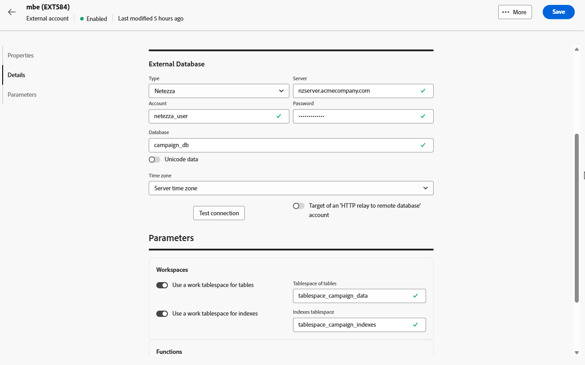
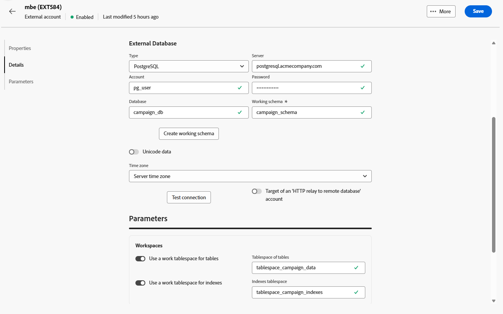
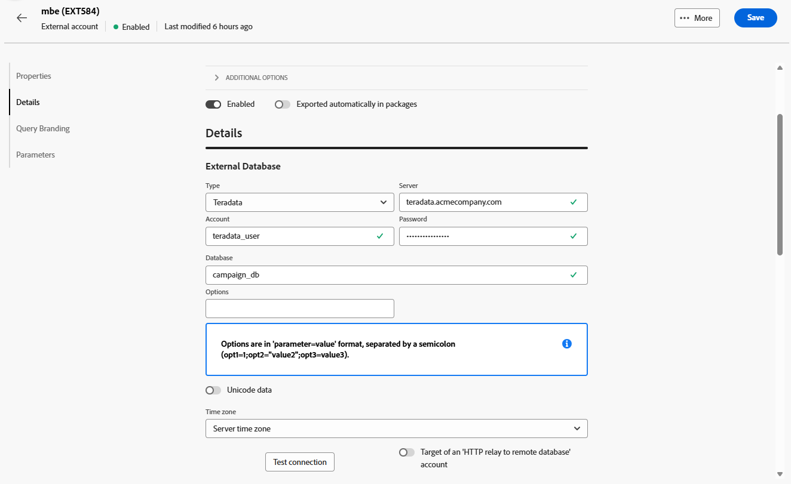
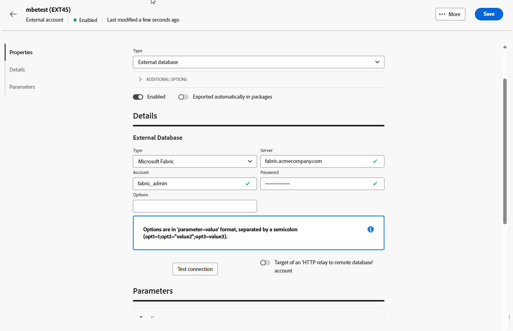

# Comptes de base de données externe {#external-accounts}

Utilisez un compte externe de type Base de données externe pour connecter Adobe Campaign à une base de données tierce.

Les paramètres de configuration du compte externe varient en fonction du moteur de base de données auquel vous vous connectez. Vous trouverez des instructions détaillées pour chaque base de données prise en charge dans les sections ci-dessous.

## Amazon Redshift

Le compte externe Amazon Redshift permet de connecter votre instance Campaign à votre base de données externe Amazon Redshift.

Dans l’interface utilisateur web d’Adobe Campaign, configurez votre compte externe Amazon Redshift.

1. [Créez votre compte externe](external-account.md) puis sélectionnez **[!UICONTROL Base de données externe]** comme **[!UICONTROL Type]** de votre compte externe et Amazon Redshift comme **[!UICONTROL Type de fournisseur]**.

1. Cliquez sur **[!UICONTROL Créer]**.

1. Pour configurer le compte externe **[!UICONTROL Amazon Redshift]**, renseignez les champs suivants :

   * **[!UICONTROL Type]** : Amazon Redshift

   * **[!UICONTROL Serveur]** : saisissez le nom DNS de votre serveur Redshift.

   * **[!UICONTROL Compte]** : indiquez le nom d’utilisateur Redshift à utiliser pour l’authentification.

   * **[!UICONTROL Mot de passe]** : saisissez le mot de passe associé au compte utilisateur.

   * **[!UICONTROL Base de données]** : indiquez le nom de la base de données s&#39;il n&#39;est pas déjà défini dans le DSN. Laissez ce champ vide si le DSN inclut la base de données.

   * **[!UICONTROL Schéma de travail]** : saisissez le nom du schéma sur lequel Adobe Campaign doit fonctionner.

   * **[!UICONTROL Options]** : ajoutez toutes les options de configuration avancées qui peuvent être requises par votre environnement.

   * **[!UICONTROL Fuseau horaire]** : sélectionnez ou saisissez le fuseau horaire du serveur pour garantir la précision des opérations temporelles.

   

1. Après avoir configuré la connexion, créez les fonctions SQL Adobe Campaign dans votre base de données Redshift distante. Une fois ces fonctions disponibles, cliquez sur **[!UICONTROL Déployer les fonctions]** pour les activer.

1. Liez votre **[!UICONTROL compte de stockage]** pour optimiser les performances et permettre des processus de chargement de données plus rapides entre Adobe Campaign et Amazon Redshift.

1. Saisissez votre **[!UICONTROL rôle de compte]** qui détermine les autorisations qu’Adobe Campaign utilisera lors de l’interaction avec votre environnement Redshift.

## Amazon Redshift (hérité)

Le compte externe Amazon Redshift (hérité) permet de connecter votre instance Campaign à votre base de données externe Amazon Redshift.

Dans l’interface utilisateur web d’Adobe Campaign, configurez votre compte externe Amazon Redshift (hérité).

1. [Créez votre compte externe](external-account.md) puis sélectionnez **[!UICONTROL Base de données externe]** comme **[!UICONTROL Type]** de votre compte externe et Amazon Redshift (hérité) comme **[!UICONTROL Type de fournisseur]**.

1. Cliquez sur **[!UICONTROL Créer]**.

1. Pour configurer le compte externe **[!UICONTROL Amazon Redshift (hérité)]**, renseignez les champs suivants :

   * **[!UICONTROL Type]** : Amazon Redshift (hérité)

   * **[!UICONTROL Serveur]** : saisissez le nom DNS de votre serveur Redshift.

   * **[!UICONTROL Compte]** : indiquez le nom d’utilisateur Redshift à utiliser pour l’authentification.

   * **[!UICONTROL Mot de passe]** : saisissez le mot de passe associé au compte utilisateur.

   * **[!UICONTROL Base de données]** : indiquez le nom de la base de données s&#39;il n&#39;est pas déjà défini dans le DSN. Laissez ce champ vide si le DSN inclut la base de données.

   * **[!UICONTROL Schéma de travail]** : saisissez le nom du schéma sur lequel Adobe Campaign doit fonctionner.

   * **[!UICONTROL Fuseau horaire]** : sélectionnez ou saisissez le fuseau horaire du serveur pour garantir la précision des opérations temporelles.

   

1. Après avoir configuré la connexion, créez les fonctions SQL Adobe Campaign dans votre base de données Redshift distante. Une fois ces fonctions disponibles, cliquez sur **[!UICONTROL Déployer les fonctions]** pour les activer.

## Azure Synapse Analytics

Le compte externe Azure Synapse Analytics permet de connecter votre instance Campaign à votre base de données externe Azure Synapse.

Dans l’interface utilisateur web d’Adobe Campaign, configurez votre compte externe Azure Synapse Analytics.

1. [Créez votre compte externe](external-account.md) puis sélectionnez **[!UICONTROL Base de données externe]** comme **[!UICONTROL Type]** de votre compte externe et Amazon Redshift comme **[!UICONTROL Type de fournisseur]**.

1. Cliquez sur **[!UICONTROL Créer]**.

1. Pour configurer le compte externe **[!UICONTROL Azure Synapse Analytics]**, renseignez les champs suivants :

   * **[!UICONTROL Type]** : Azure Synapse Analytics

   * **[!UICONTROL Serveur]** : renseignez l&#39;URL du serveur Azure Synapse.

   * **[!UICONTROL Compte]** : indiquez le nom d’utilisateur qui s’authentifiera avec la base de données Synapse.

   * **[!UICONTROL Mot de passe]** : saisissez le mot de passe associé au compte.

   * **[!UICONTROL Base de données]** : indiquez la base de données cible à laquelle Adobe Campaign doit se connecter.

   * **[!UICONTROL Préfixe des tables et fonctions]** : par défaut, il est défini sur le nom du compte. Vous pouvez l’ajuster si vous préférez utiliser un préfixe différent pour identifier les objets liés à Campaign.

   * **[!UICONTROL Options]** : ajoutez toutes les options de configuration avancées qui peuvent être requises par votre environnement.

   * **[!UICONTROL Fuseau horaire]** : sélectionnez ou saisissez le fuseau horaire du serveur pour garantir la précision des opérations temporelles.

   

1. Vous pouvez choisir d&#39;activer l&#39;option **[!UICONTROL Utiliser un espace disque logique de travail pour les tables]**, puis spécifier l&#39;**[!UICONTROL Espace disque logique des tables]** où vos tables de travail seront stockées.

1. Si nécessaire, activez l&#39;option **[!UICONTROL Utiliser un espace disque logique de travail pour les index]** puis fournissez l&#39;espace disque logique **[!UICONTROL Index]**.

   

1. Après avoir configuré la connexion, créez les fonctions SQL Adobe Campaign dans votre base de données Azure Synapse Analytics distante. Une fois ces fonctions disponibles, cliquez sur **[!UICONTROL Déployer les fonctions]** pour les activer.

## Databricks

Le compte externe Databricks permet de connecter votre instance Campaign à votre base de données externe Databricks.

Dans l’interface utilisateur web d’Adobe Campaign, configurez votre compte externe Databricks .

1. [Créez votre compte externe](external-account.md) puis sélectionnez **[!UICONTROL Base de données externe]** comme **[!UICONTROL Type]** et Blocs de données comme **[!UICONTROL Type de fournisseur]**.

1. Cliquez sur **[!UICONTROL Créer]**.

1. Pour configurer le compte externe **[!UICONTROL Databricks]**, renseignez les champs suivants :

   * **[!UICONTROL Type]** : briques de données

   * **[!UICONTROL Serveur]** : saisissez le nom DNS de votre serveur Databricks.

   * **[!UICONTROL Compte]** : indiquez le nom d’utilisateur des briques de données qui sera utilisé pour l’authentification.

   * **[!UICONTROL Mot de passe]** : saisissez le mot de passe associé au compte utilisateur.

   * **[!UICONTROL Catalogue]** : indiquez le catalogue à utiliser.

   * **[!UICONTROL Schéma de travail]** : renseignez le nom du schéma sur lequel Adobe Campaign va créer et gérer ses objets de travail.

   * **[!UICONTROL Options]** : ajoutez toutes les options de configuration avancées qui peuvent être requises par votre environnement.

   

1. Après avoir configuré la connexion, créez les fonctions SQL Adobe Campaign dans votre base de données distante Databricks. Une fois ces fonctions disponibles, cliquez sur **[!UICONTROL Déployer les fonctions]** pour les activer.

1. Liez votre **[!UICONTROL compte de stockage]** afin d’optimiser les performances et d’activer des processus de chargement de données plus rapides entre Adobe Campaign et les briques de données.

## Google BigQuery

Le compte externe BigQuery Google vous permet de connecter votre instance Campaign à votre base de données externe BigQuery Google.

Dans l’interface utilisateur web d’Adobe Campaign, configurez votre compte externe BigQuery Google.

1. [Créez votre compte externe](external-account.md) puis sélectionnez **[!UICONTROL Base de données externe]** comme **[!UICONTROL Type]** de votre compte externe et BigQuery Google comme **[!UICONTROL Type de fournisseur]**.

1. Cliquez sur **[!UICONTROL Créer]**.

1. Pour configurer le compte externe BigQuery **** Google, renseignez les champs suivants :

   * **[!UICONTROL Type]** : BigQuery Google

   * **[!UICONTROL Compte]** : saisissez le nom d’utilisateur ou le compte de service qu’Adobe Campaign utilisera pour se connecter à BigQuery.

   * **[!UICONTROL Méthode de chargement du fichier de connexion]** : choisissez comment fournir la clé de compte de service en saisissant manuellement le chemin d’accès au fichier de clé ou en chargeant directement le fichier de clé sur le serveur.

   * **[!UICONTROL Serveur]** : si vous sélectionnez l’option de saisie manuelle, indiquez l’URL du serveur.

   * **[!UICONTROL Projet]** : indiquez l’ID de projet Google Cloud associé à votre instance BigQuery.

   * **[!UICONTROL Jeu de données]** : saisissez le nom du jeu de données dans lequel Adobe Campaign stockera et interrogera les données.

   * **[!UICONTROL Options]** : ajoutez toutes les options de configuration avancées qui peuvent être requises par votre environnement.

   

1. Sous **[!UICONTROL Paramètres]**, collez le contenu du fichier JSON de clé de compte de service pour authentifier Adobe Campaign avec Google BigQuery.

1. Après avoir configuré la connexion, créez les fonctions SQL Adobe Campaign dans votre base de données BigQuery Google distante. Une fois ces fonctions disponibles, cliquez sur **[!UICONTROL Déployer les fonctions]** pour les activer.

1. Si votre environnement nécessite un accès proxy pour se connecter au serveur BigQuery, configurez les paramètres du proxy.

   Commencez par sélectionner votre type de proxy : http, http_no_tunnel, socks4 ou socks5.

1. Renseignez les champs de configuration de proxy suivants pour établir un accès sécurisé :

   * **[!UICONTROL Proxy Host]** : adresse du serveur proxy.
   * **[!UICONTROL Proxy Port]** : port utilisé par le serveur proxy.
   * **[!UICONTROL Proxy UID]** : ID utilisateur pour l’authentification auprès du serveur proxy, si nécessaire.
   * **[!UICONTROL Proxy Host]** : mot de passe correspondant au proxy UID (le cas échéant).

   

## Microsoft SQL Server

Le compte externe SQL Server Microsoft permet de connecter votre instance Campaign à votre base de données externe SQL Server Microsoft.

Dans l’interface utilisateur web d’Adobe Campaign, configurez votre compte externe SQL Server Microsoft.

1. [Créez votre compte externe](external-account.md) puis sélectionnez **[!UICONTROL Base de données externe]** comme **[!UICONTROL Type]** de votre compte externe et Microsoft SQL Server comme **[!UICONTROL Type de fournisseur]**.

1. Cliquez sur **[!UICONTROL Créer]**.

1. Pour configurer le compte externe **[!UICONTROL Microsoft SQL Server]**, renseignez les champs suivants :

   * **[!UICONTROL Type]** : Microsoft SQL Server

   * **[!UICONTROL Serveur]** : saisissez le nom DNS de votre serveur SQL Microsoft.

   * **[!UICONTROL Compte]** : indiquez le nom d’utilisateur SQL Server Microsoft qui sera utilisé pour l’authentification.

   * **[!UICONTROL Mot de passe]** : saisissez le mot de passe associé au compte utilisateur.

   * **[!UICONTROL Base de données]** : indiquez le nom de la base de données s&#39;il n&#39;est pas déjà défini dans le DSN. Laissez ce champ vide si le DSN inclut la base de données.

   * **[!UICONTROL Options]** : ajoutez toutes les options de configuration avancées qui peuvent être requises par votre environnement.

   * **[!UICONTROL Préfixe des tables et fonctions]** : par défaut, il est défini sur le nom du compte. Vous pouvez l’ajuster si vous préférez utiliser un préfixe différent pour identifier les objets liés à Campaign.

   * **[!UICONTROL Fuseau horaire]** : sélectionnez ou saisissez le fuseau horaire du serveur pour garantir la précision des opérations temporelles.

   

1. Vous pouvez choisir d&#39;activer l&#39;option **[!UICONTROL Utiliser un espace disque logique de travail pour les tables]**, puis spécifier l&#39;**[!UICONTROL Espace disque logique des tables]** où vos tables de travail seront stockées.

1. Si nécessaire, activez l&#39;option **[!UICONTROL Utiliser un espace disque logique de travail pour les index]** puis fournissez l&#39;espace disque logique **[!UICONTROL Index]**.

1. Après avoir configuré la connexion, créez les fonctions SQL Adobe Campaign dans votre base de données SQL Server Microsoft distante. Une fois ces fonctions disponibles, cliquez sur **[!UICONTROL Déployer les fonctions]** pour les activer.

## MySQL

Le compte externe MySQL vous permet de connecter votre instance Campaign à votre base de données externe MySQL.
Dans l’interface utilisateur web d’Adobe Campaign, configurez votre compte externe MySQL.

1. [Créez votre compte externe](external-account.md) puis sélectionnez **[!UICONTROL Base de données externe]** comme **[!UICONTROL Type]** et MySQL comme **[!UICONTROL Type de fournisseur]**.

1. Cliquez sur **[!UICONTROL Créer]**.

1. Pour configurer le compte externe **[!UICONTROL MySQL]**, renseignez les champs suivants :

   * **[!UICONTROL Type]** : MySQL

   * **[!UICONTROL Serveur]** : saisissez le nom DNS de votre serveur MySQL.

   * **[!UICONTROL Compte]** : indiquez le nom d’utilisateur MySQL qui sera utilisé pour l’authentification.

   * **[!UICONTROL Mot de passe]** : saisissez le mot de passe associé au compte utilisateur.

   * **[!UICONTROL Base de données]** : indiquez le nom de la base de données s&#39;il n&#39;est pas déjà défini dans le DSN. Laissez ce champ vide si le DSN inclut la base de données.

   * **[!UICONTROL Fuseau horaire]** : sélectionnez ou saisissez le fuseau horaire du serveur pour garantir la précision des opérations temporelles.

   

1. Vous pouvez choisir d&#39;activer l&#39;option **[!UICONTROL Utiliser un espace disque logique de travail pour les tables]**, puis spécifier l&#39;**[!UICONTROL Espace disque logique des tables]** où vos tables de travail seront stockées.

1. Si nécessaire, activez l&#39;option **[!UICONTROL Utiliser un espace disque logique de travail pour les index]** puis fournissez l&#39;espace disque logique **[!UICONTROL Index]**.

1. Après avoir configuré la connexion, créez les fonctions SQL Adobe Campaign dans votre base de données MySQL distante. Une fois ces fonctions disponibles, cliquez sur **[!UICONTROL Déployer les fonctions]** pour les activer.

## Netezza

Le compte externe Netezza vous permet de connecter l’instance Campaign à la base de données externe Netezza.

Dans l’interface utilisateur web d’Adobe Campaign, configurez votre compte externe Netezza.

1. [Créez votre compte externe](external-account.md) puis sélectionnez **[!UICONTROL Base de données externe]** comme **[!UICONTROL Type]** et Netezza comme **[!UICONTROL Type de fournisseur]**.

1. Cliquez sur **[!UICONTROL Créer]**.

1. Pour configurer le compte externe **[!UICONTROL Netezza]**, renseignez les champs suivants :

   * **[!UICONTROL Type]** : Netezza

   * **[!UICONTROL Serveur]** : saisissez le nom DNS de votre serveur Netezza.

   * **[!UICONTROL Compte]** : indiquez le nom d’utilisateur Netezza qui sera utilisé pour l’authentification.

   * **[!UICONTROL Mot de passe]** : saisissez le mot de passe associé au compte utilisateur.

   * **[!UICONTROL Base de données]** : indiquez le nom de la base de données s&#39;il n&#39;est pas déjà défini dans le DSN. Laissez ce champ vide si le DSN inclut la base de données.

   * **[!UICONTROL Fuseau horaire]** : sélectionnez ou saisissez le fuseau horaire du serveur pour garantir la précision des opérations temporelles.

   

1. Vous pouvez choisir d&#39;activer l&#39;option **[!UICONTROL Utiliser un espace disque logique de travail pour les tables]**, puis spécifier l&#39;**[!UICONTROL Espace disque logique des tables]** où vos tables de travail seront stockées.

1. Si nécessaire, activez l&#39;option **[!UICONTROL Utiliser un espace disque logique de travail pour les index]** puis fournissez l&#39;espace disque logique **[!UICONTROL Index]**.

1. Après avoir configuré la connexion, créez les fonctions SQL Adobe Campaign dans votre base de données Netezza distante. Une fois ces fonctions disponibles, cliquez sur **[!UICONTROL Déployer les fonctions]** pour les activer.

## ODBC (Sybase ASE, Sybase IQ).

Le compte externe ODBC (Sybase ASE, Sybase IQ) vous permet de connecter votre instance Campaign à votre base de données externe ODBC (Sybase ASE, Sybase IQ).
Dans l’interface utilisateur web d’Adobe Campaign, configurez votre compte externe ODBC (Sybase ASE, Sybase IQ).

1. [Créez votre compte externe](external-account.md) puis sélectionnez **[!UICONTROL Base de données externe]** comme **[!UICONTROL Type]** et ODBC (Sybase ASE, Sybase IQ) comme **[!UICONTROL Type de fournisseur]**.

1. Cliquez sur **[!UICONTROL Créer]**.

1. Pour configurer le compte externe **[!UICONTROL ODBC (Sybase ASE, Sybase IQ)]**, renseignez les champs suivants :

   * **[!UICONTROL Type]** : ODBC (Sybase ASE, Sybase IQ)

   * **[!UICONTROL Serveur]** : saisissez le nom DNS de votre serveur ODBC (Sybase ASE, Sybase IQ).

   * **[!UICONTROL Compte]** : indiquez le nom d’utilisateur du serveur ODBC (Sybase ASE, Sybase IQ) qui sera utilisé pour l’authentification.

   * **[!UICONTROL Mot de passe]** : saisissez le mot de passe associé au compte utilisateur.

   * **[!UICONTROL Base de données]** : indiquez le nom de la base de données s&#39;il n&#39;est pas déjà défini dans le DSN. Laissez ce champ vide si le DSN inclut la base de données.

   * **[!UICONTROL Options]** : ajoutez toutes les options de configuration avancées qui peuvent être requises par votre environnement.

   * **[!UICONTROL Outil d’insertion en masse]** : indiquez le chemin d’accès complet de l’exécutable de l’outil d’insertion en masse.

   * **[!UICONTROL Fuseau horaire]** : sélectionnez ou saisissez le fuseau horaire du serveur pour garantir la précision des opérations temporelles.

   

1. Vous pouvez choisir d&#39;activer l&#39;option **[!UICONTROL Utiliser un espace disque logique de travail pour les tables]**, puis spécifier l&#39;**[!UICONTROL Espace disque logique des tables]** où vos tables de travail seront stockées.

1. Si nécessaire, activez l&#39;option **[!UICONTROL Utiliser un espace disque logique de travail pour les index]** puis fournissez l&#39;espace disque logique **[!UICONTROL Index]**.

1. Après avoir configuré la connexion, créez les fonctions SQL Adobe Campaign dans votre base de données ODBC distante. Une fois ces fonctions disponibles, cliquez sur **[!UICONTROL Déployer les fonctions]** pour les activer.

## Relais HTTP vers base distante

Le compte externe Relais HTTP vers base de données distante permet de connecter votre instance Campaign à votre relais HTTP vers base de données externe distante.

Dans l’interface utilisateur web d’Adobe Campaign, configurez le compte externe Relais HTTP vers base de données distante .

1. [Créez votre compte externe](external-account.md) puis sélectionnez **[!UICONTROL Base de données externe]** comme **[!UICONTROL Type]** de votre compte externe et Amazon Redshift comme **[!UICONTROL Type de fournisseur]**.

1. Cliquez sur **[!UICONTROL Créer]**.

1. Pour configurer le compte externe **[!UICONTROL Relais HTTP vers base distante]** , renseignez les champs suivants :

   * **[!UICONTROL Type]** : Relais HTTP vers base distante

   * **[!UICONTROL Serveur]** : saisissez l’URL complète du serveur relais HTTP qui se connecte à votre base de données distante.

   * **[!UICONTROL Compte]** : indiquez le nom d’utilisateur utilisé pour l’authentification auprès du serveur relais HTTP.

   * **[!UICONTROL Mot de passe]** : saisissez le mot de passe associé à ce compte.

   * **[!UICONTROL Source de données]** : indiquez la base de données cible à laquelle Adobe Campaign doit se connecter via le relais.

   * **[!UICONTROL Options]** : ajoutez toutes les options de configuration avancées qui peuvent être requises par votre environnement.

   

1. Vous pouvez choisir d&#39;activer l&#39;option **[!UICONTROL Utiliser un espace disque logique de travail pour les tables]**, puis spécifier l&#39;**[!UICONTROL Espace disque logique des tables]** où vos tables de travail seront stockées.

1. Si nécessaire, activez l&#39;option **[!UICONTROL Utiliser un espace disque logique de travail pour les index]** puis fournissez l&#39;espace disque logique **[!UICONTROL Index]**.

1. Après avoir configuré la connexion, créez les fonctions SQL Adobe Campaign dans votre relais HTTP distant vers la base de données distante. Une fois ces fonctions disponibles, cliquez sur **[!UICONTROL Déployer les fonctions]** pour les activer.

## Oracle

Le compte externe Oracle permet de connecter votre instance Campaign à votre base de données externe Oracle.
Dans l’interface utilisateur web d’Adobe Campaign, configurez votre compte externe Oracle.

1. [Créez votre compte externe](external-account.md) puis sélectionnez **[!UICONTROL Base de données externe]** comme **[!UICONTROL Type]** et Oracle comme **[!UICONTROL Type de fournisseur]**.

1. Cliquez sur **[!UICONTROL Créer]**.

1. Pour configurer le compte externe **[!UICONTROL Oracle]**, renseignez les champs suivants :

   * **[!UICONTROL Type]** : Oracle

   * **[!UICONTROL Serveur]** : saisissez le nom DNS de votre serveur Oracle.

   * **[!UICONTROL Compte]** : indiquez le nom d’utilisateur Oracle qui sera utilisé pour l’authentification.

   * **[!UICONTROL Mot de passe]** : saisissez le mot de passe associé au compte utilisateur.

   * **[!UICONTROL Fuseau horaire]** : sélectionnez ou saisissez le fuseau horaire du serveur pour garantir la précision des opérations temporelles.

   

1. Vous pouvez choisir d&#39;activer l&#39;option **[!UICONTROL Utiliser un espace disque logique de travail pour les tables]**, puis spécifier l&#39;**[!UICONTROL Espace disque logique des tables]** où vos tables de travail seront stockées.

1. Si nécessaire, activez l&#39;option **[!UICONTROL Utiliser un espace disque logique de travail pour les index]** puis fournissez l&#39;espace disque logique **[!UICONTROL Index]**.

1. Après avoir configuré la connexion, créez les fonctions SQL Adobe Campaign dans votre base de données Oracle distante. Une fois ces fonctions disponibles, cliquez sur **[!UICONTROL Déployer les fonctions]** pour les activer.

## PostgreSQL

Le compte externe PostgreSQL permet de connecter votre instance Campaign à votre base de données externe PostgreSQL.
Dans l’interface utilisateur web d’Adobe Campaign, configurez votre compte externe PostgreSQL.

1. [Créez votre compte externe](external-account.md) puis sélectionnez **[!UICONTROL Base de données externe]** en tant que **[!UICONTROL Type]** et PostgreSQL en tant que **[!UICONTROL Type de fournisseur]**.

1. Cliquez sur **[!UICONTROL Créer]**.

1. Pour configurer le compte externe **[!UICONTROL PostgreSQL]**, renseignez les champs suivants :

   * **[!UICONTROL Type]** : PostgreSQL

   * **[!UICONTROL Serveur]** : saisissez le nom DNS de votre serveur PostgreSQL.

   * **[!UICONTROL Compte]** : indiquez le nom d’utilisateur PostgreSQL à utiliser pour l’authentification.

   * **[!UICONTROL Mot de passe]** : saisissez le mot de passe associé au compte utilisateur.

   * **[!UICONTROL Base de données]** : indiquez le nom de la base de données s&#39;il n&#39;est pas déjà défini dans le DSN. Laissez ce champ vide si le DSN inclut la base de données.

   * **[!UICONTROL Schéma de travail]** : renseignez le nom du schéma sur lequel Adobe Campaign va créer et gérer ses objets de travail.

   * **[!UICONTROL Fuseau horaire]** : sélectionnez ou saisissez le fuseau horaire du serveur pour garantir la précision des opérations temporelles.

   

1. Vous pouvez choisir d&#39;activer l&#39;option **[!UICONTROL Utiliser un espace disque logique de travail pour les tables]**, puis spécifier l&#39;**[!UICONTROL Espace disque logique des tables]** où vos tables de travail seront stockées.

1. Si nécessaire, activez l&#39;option **[!UICONTROL Utiliser un espace disque logique de travail pour les index]** puis fournissez l&#39;espace disque logique **[!UICONTROL Index]**.

1. Après avoir configuré la connexion, créez les fonctions SQL Adobe Campaign dans votre base de données PostgreSQL distante. Une fois ces fonctions disponibles, cliquez sur **[!UICONTROL Déployer les fonctions]** pour les activer.

## SAP HANA

Le compte externe SAP HANA permet de connecter l’instance Campaign à la base de données externe SAP HANA.

Dans l’interface utilisateur web d’Adobe Campaign, configurez votre compte externe SAP HANA.

1. [Créez votre compte externe](external-account.md) puis sélectionnez **[!UICONTROL Base de données externe]** comme **[!UICONTROL Type]** et SAP HANA comme **[!UICONTROL Type de fournisseur]**.

1. Cliquez sur **[!UICONTROL Créer]**.

1. Pour configurer le compte externe **[!UICONTROL SAP HANA]**, renseignez les champs suivants :

   * **[!UICONTROL Type]** : SAP HANA

   * **[!UICONTROL Serveur]** : saisissez le nom DNS de votre serveur SAP HANA.

   * **[!UICONTROL Compte]** : indiquez le nom d’utilisateur SAP HANA qui sera utilisé pour l’authentification.

   * **[!UICONTROL Mot de passe]** : saisissez le mot de passe associé au compte utilisateur.

   * **[!UICONTROL Options]** : ajoutez toutes les options de configuration avancées qui peuvent être requises par votre environnement.

   * **[!UICONTROL Schéma de travail]** : renseignez le nom du schéma sur lequel Adobe Campaign va créer et gérer ses objets de travail.

   * **[!UICONTROL Fuseau horaire]** : sélectionnez ou saisissez le fuseau horaire du serveur pour garantir la précision des opérations temporelles.

   

1. Vous pouvez choisir d&#39;activer l&#39;option **[!UICONTROL Utiliser un espace disque logique de travail pour les tables]**, puis spécifier l&#39;**[!UICONTROL Espace disque logique des tables]** où vos tables de travail seront stockées.

1. Si nécessaire, activez l&#39;option **[!UICONTROL Utiliser un espace disque logique de travail pour les index]** puis fournissez l&#39;espace disque logique **[!UICONTROL Index]**.

1. Après avoir configuré la connexion, créez les fonctions SQL Adobe Campaign dans votre base de données SAP HANA distante. Une fois ces fonctions disponibles, cliquez sur **[!UICONTROL Déployer les fonctions]** pour les activer.

## Snowflake

Le compte externe Snowflake permet de connecter votre instance Campaign à votre base de données externe Snowflake.

Dans l’interface utilisateur web d’Adobe Campaign, configurez votre compte externe Snowflake.

1. [Créez votre compte externe](external-account.md) puis sélectionnez **[!UICONTROL Base de données externe]** comme **[!UICONTROL Type]** et Snowflake comme **[!UICONTROL Type de fournisseur]**.

1. Cliquez sur **[!UICONTROL Créer]**.

1. Pour configurer le compte externe **[!UICONTROL Snowflake]**, renseignez les champs suivants :

   * **[!UICONTROL Type]** : Snowflake

   * **[!UICONTROL Serveur]** : saisissez le nom DNS de votre serveur Snowflake.

   * **[!UICONTROL Compte]** : indiquez le nom d’utilisateur Snowflake qui sera utilisé pour l’authentification.

   * **[!UICONTROL Mot de passe]** : saisissez le mot de passe associé au compte utilisateur.

   * **[!UICONTROL Base de données]** : indiquez le nom de la base de données s&#39;il n&#39;est pas déjà défini dans le DSN. Laissez ce champ vide si le DSN inclut la base de données.

   * **[!UICONTROL Schéma de travail]** : renseignez le nom du schéma sur lequel Adobe Campaign va créer et gérer ses objets de travail.

   * **[!UICONTROL Options]** : ajoutez toutes les options de configuration avancées qui peuvent être requises par votre environnement.

   * **[!UICONTROL Fuseau horaire]** : sélectionnez ou saisissez le fuseau horaire du serveur pour garantir la précision des opérations temporelles.

   

1. Après avoir configuré la connexion, créez les fonctions SQL Adobe Campaign dans votre base de données Snowflake distante. Une fois ces fonctions disponibles, cliquez sur **[!UICONTROL Déployer les fonctions]** pour les activer.

1. Si vous utilisez l’authentification par paire de clés, dans le menu **[!UICONTROL keypair.auth]**, saisissez les valeurs requises pour :

   * **[!UICONTROL Mot de passe]** : phrase secrète protégeant la clé privée, le cas échéant.

   * **[!UICONTROL Clé privée]** : clé privée utilisée pour authentifier le compte Snowflake.

## Teradata

Le compte externe Teradata vous permet de connecter votre instance Campaign à votre base de données externe Teradata.

Dans l’interface utilisateur web d’Adobe Campaign, configurez votre compte externe Teradata.

1. [Créez votre compte externe](external-account.md) puis sélectionnez **[!UICONTROL Base de données externe]** comme **[!UICONTROL Type]** et Teradata comme **[!UICONTROL Type de fournisseur]**.

1. Cliquez sur **[!UICONTROL Créer]**.

1. Pour configurer le compte externe **[!UICONTROL Teradata]**, renseignez les champs suivants :

   * **[!UICONTROL Type]** : Teradata

   * **[!UICONTROL Serveur]** : saisissez le nom DNS de votre serveur Teradata.

   * **[!UICONTROL Compte]** : indiquez le nom d’utilisateur Teradata qui sera utilisé pour l’authentification.

   * **[!UICONTROL Mot de passe]** : saisissez le mot de passe associé au compte utilisateur.

   * **[!UICONTROL Base de données]** : indiquez le nom de la base de données s&#39;il n&#39;est pas déjà défini dans le DSN. Laissez ce champ vide si le DSN inclut la base de données.

   * **[!UICONTROL Options]** : ajoutez toutes les options de configuration avancées qui peuvent être requises par votre environnement.

   * **[!UICONTROL Fuseau horaire]** : sélectionnez ou saisissez le fuseau horaire du serveur pour garantir la précision des opérations temporelles.

   

1. Vous pouvez choisir d&#39;activer l&#39;option **[!UICONTROL Utiliser un espace disque logique de travail pour les tables]**, puis spécifier l&#39;**[!UICONTROL Espace disque logique des tables]** où vos tables de travail seront stockées.

1. Si nécessaire, activez l&#39;option **[!UICONTROL Utiliser un espace disque logique de travail pour les index]** puis fournissez l&#39;espace disque logique **[!UICONTROL Index]**.

1. Après avoir configuré la connexion, créez les fonctions SQL Adobe Campaign dans votre base de données Teradata distante. Une fois ces fonctions disponibles, cliquez sur **[!UICONTROL Déployer les fonctions]** pour les activer.

1. Si nécessaire, saisissez votre **[!UICONTROL Script PostConnect]** si vous souhaitez qu’un script s’exécute automatiquement après l’établissement de chaque connexion. Si vous souhaitez que le script s’exécute à chaque fois, activez l’option **[!UICONTROL Exécuter à chaque fois]**.

## Vertica Analytics

Dans l’interface utilisateur web d’Adobe Campaign, configurez votre compte externe Vertica Analytics.

1. [Créez votre compte externe](external-account.md) puis sélectionnez **[!UICONTROL Base de données externe]** comme **[!UICONTROL Type]** et Vertica Analytics comme **[!UICONTROL Type de fournisseur]**.

1. Cliquez sur **[!UICONTROL Créer]**.

1. Pour configurer le compte externe **[!UICONTROL Vertica Analytics]**, renseignez les champs suivants :

   * **[!UICONTROL Type]** : Vertica Analytics

   * **[!UICONTROL Serveur]** : saisissez le nom DNS de votre serveur Vertica Analytics.

   * **[!UICONTROL Compte]** : indiquez le nom d’utilisateur Vertica Analytics qui sera utilisé pour l’authentification.

   * **[!UICONTROL Mot de passe]** : saisissez le mot de passe associé au compte utilisateur.

   * **[!UICONTROL Base de données]** : indiquez le nom de la base de données s&#39;il n&#39;est pas déjà défini dans le DSN. Laissez ce champ vide si le DSN inclut la base de données.

   * **[!UICONTROL Schéma de travail]** : renseignez le nom du schéma sur lequel Adobe Campaign va créer et gérer ses objets de travail.

   * **[!UICONTROL Options]** : ajoutez toutes les options de configuration avancées qui peuvent être requises par votre environnement.

   * **[!UICONTROL Fuseau horaire]** : sélectionnez ou saisissez le fuseau horaire du serveur pour garantir la précision des opérations temporelles.

   

1. Après avoir configuré la connexion, créez les fonctions SQL Adobe Campaign dans votre base de données Vertica Analytics distante. Une fois ces fonctions disponibles, cliquez sur **[!UICONTROL Déployer les fonctions]** pour les activer.

## Microsoft Fabric {#fabric}

Le compte externe Microsoft Fabric vous permet de connecter votre instance Campaign à votre base de données externe Microsoft Fabric.

Dans l’interface utilisateur web d’Adobe Campaign, configurez votre compte externe Microsoft Fabric.

1. [Créez votre compte externe](external-account.md) puis sélectionnez **[!UICONTROL Base de données externe]** comme **[!UICONTROL Type]** de votre compte externe et Fabric Microsoft comme **[!UICONTROL Type de fournisseur]**.

1. Cliquez sur **[!UICONTROL Créer]**.

1. Pour configurer le compte externe **[!UICONTROL Microsoft Fabric]**, renseignez les champs suivants :

   * **[!UICONTROL Type]** : Microsoft Fabric

   * **[!UICONTROL Serveur]** : saisissez le nom DNS de votre serveur Microsoft Fabric.

   * **[!UICONTROL Compte]** : indiquez le nom d’utilisateur de Microsoft Fabric (ou le principal de service) qui sera utilisé pour l’authentification.

   * **[!UICONTROL Mot de passe]** : saisissez le mot de passe ou le secret associé au compte.

   * **[!UICONTROL Options]** : ajoutez toutes les options de configuration avancées qui peuvent être requises par votre environnement.

   

1. Après avoir configuré la connexion, créez les fonctions SQL Adobe Campaign dans votre base de données Redshift distante. Une fois ces fonctions disponibles, cliquez sur **[!UICONTROL Déployer les fonctions]** pour les activer.

1. Liez votre **[!UICONTROL compte de stockage]** afin d’optimiser les performances et d’activer des processus de chargement de données plus rapides entre Adobe Campaign et la structure Microsoft.

1. Saisissez votre **[!UICONTROL rôle de compte]** qui détermine les autorisations qu’Adobe Campaign utilisera lors de l’interaction avec votre environnement Redshift.
