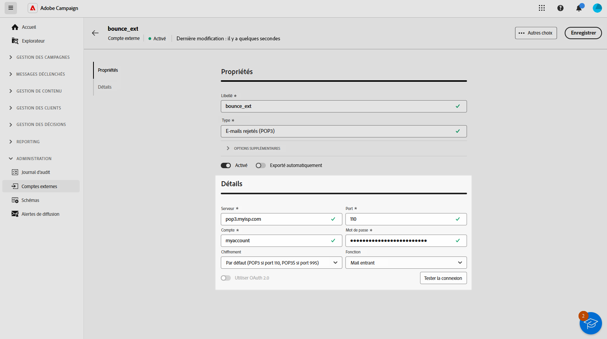

# Gérer des comptes externes {#external-accounts}

>[!CONTEXTUALHELP]
>id="acw_homepage_welcome_rn3"
>title="Création de compte externe"
>abstract="En tant qu’administrateur Campaign, vous pouvez désormais configurer de nouvelles connexions avec des systèmes externes à partir de l’interface utilisateur web de Campaign. Vous pouvez également afficher, mettre à jour et gérer les comptes externes existants."
>additional-url="https://experienceleague.adobe.com/docs/campaign-web/v8/release-notes/release-notes.html?lang=fr" text="Voir les notes de mise à jour"

Adobe Campaign comprend des comptes externes préconfigurés pour une intégration facile à divers systèmes. Pour vous connecter à d’autres plateformes ou personnaliser les connexions en fonction de votre workflow, créez des comptes externes à l’aide de l’interface utilisateur web. Cela garantit des transferts de données transparents.

## Créer un compte externe {#create-ext-account}

Pour créer un compte externe, procédez comme suit. Les paramètres détaillés dépendent du type de compte externe. [En savoir plus](#campaign-specific)

1. Dans le menu du volet de gauche, sélectionnez **[!UICONTROL Comptes externes]** sous **[!UICONTROL Administration]**.

1. Cliquez sur **[!UICONTROL Créer un compte externe]**.

   

1. Saisissez votre **[!UICONTROL Libellé]** et sélectionnez le **[!UICONTROL Type]** de votre compte externe.

   >[!NOTE]
   >
   >Les paramètres des types spécifiques à Campaign sont décrits dans [cette section](#campaign-specific).

   

1. Cliquez sur **[!UICONTROL Créer]**.

1. Dans la liste déroulante **[!UICONTROL Options supplémentaires]**, modifiez le chemin d’accès **[!UICONTROL Nom interne]** ou **[!UICONTROL Dossier]** si nécessaire.

   

1. Activez l&#39;option **[!UICONTROL Exporté automatiquement dans les packages]** pour exporter automatiquement les données gérées par ce compte externe. <!--Exported where??-->

   

1. Dans la section **[!UICONTROL Détails]**, configurez l’accès au compte en spécifiant les informations d’identification en fonction du type de compte externe sélectionné. [En savoir plus](#bounce)

1. Cliquez sur **[!UICONTROL Tester la connexion]** pour vérifier que votre configuration est correcte.

1. Dans le menu **[!UICONTROL Plus...]**, dupliquez ou supprimez votre compte externe.

   

1. Une fois la configuration terminée, cliquez sur **[!UICONTROL Enregistrer]**.

## Comptes externes spécifiques à Campaign {#campaign-specific}

Selon le type de compte externe que vous avez sélectionné, suivez les étapes ci-dessous pour configurer les paramètres du compte.

### E-mails rejetés (POP3) {#bounce}

Le compte externe « E-mails rejetés » spécifie le compte POP3 externe utilisé pour se connecter au service de messagerie. Tous les serveurs configurés pour l’accès POP3 peuvent recevoir les retours d’e-mails.

Pour configurer le compte externe **[!UICONTROL E-mails rejetés (POP3)]**, renseignez les champs suivants :

* **[!UICONTROL Serveur]** - URL du serveur POP3.

* **[!UICONTROL Port]** : numéro de port de la connexion POP3 (le port par défaut est 110).

* **[!UICONTROL Compte]** - Nom de l’utilisateur.

* **[!UICONTROL Mot de passe]** : mot de passe du compte d’utilisateur.

* **[!UICONTROL Chiffrement]** - Type de chiffrement choisi, notamment :
   * Par défaut (POP3 si port 110, POP3S si port 995).
   * POP3 qui bascule en SSL après envoi d&#39;un STARTTLS.
   * POP3 non sécurisé (port 110 par défaut).
   * POP3 sécurisé au-dessus de SSL (port 995 par défaut).

* **[!UICONTROL Fonction]** - Sélectionnez **[!UICONTROL E-mail entrant]** pour configurer le compte de réception des e-mails entrants ou le **[!UICONTROL routeur SOAP]** pour gérer les requêtes SOAP.

>[!IMPORTANT]
>
>Avant de configurer votre compte externe POP3 à l’aide de Microsoft OAuth 2.0, vous devez enregistrer votre application sur le portail Azure. Pour plus d’informations, consultez [cette page](https://learn.microsoft.com/en-us/entra/identity-platform/quickstart-register-app){target=_blank}.

Pour configurer un environnement externe POP3 à l’aide de Microsoft OAuth 2.0, cochez la case Microsoft OAuth 2.0 et renseignez les champs suivants :

* **[!UICONTROL Client Azure]**

  L’ID Azure (ou l’ID de répertoire (client)) se trouve dans le menu déroulant Essentiels de la présentation de votre application dans le portail Azure.

* **[!UICONTROL Identifiant de client Azure]**

  L’ID client (ou l’ID d’application (client)) se trouve dans le menu déroulant Essentiels de la présentation de votre application dans le portail Azure.

* **[!UICONTROL Secret client Azure]**

  L’ID de secret client se trouve dans la colonne Secrets client du menu Certificats et secrets de votre application dans le portail Azure.

* **[!UICONTROL URL de redirection Azure]**

  L’URL de redirection se trouve dans le menu Authentification de votre application dans le portail Azure. Elle doit se terminer par la syntaxe suivante : nl/jsp/oauth.jsp, par exemple `https://redirect.adobe.net/nl/jsp/oauth.jsp`.

Un accès Internet est nécessaire pour la configuration et l’utilisation du bouton Tester la connexion dans la console cliente. Après la configuration, le processus inMail peut communiquer avec les serveurs Microsoft sans Internet.

Après avoir saisi les différentes informations d’identification, vous pouvez cliquer sur Configurer la connexion pour terminer la configuration de votre compte externe.

### Routage {#routing}

Pour configurer un compte externe spécifique pour les diffusions externes, procédez comme suit.

1. Créez un compte externe. [En savoir plus](../administration/external-account.md#create-ext-account)

1. Sélectionnez le type **[!UICONTROL Routage]**.

   {zoomable="yes"}

1. Sélectionnez le canal souhaité et cliquez sur **[!UICONTROL Créer]** :

1. Dans la section **[!UICONTROL Détails]** du compte externe, **[!UICONTROL Externe]** est sélectionné par défaut en tant que **[!UICONTROL Mode de diffusion]**.

   {zoomable="yes"}

   >[!NOTE]
   >
   >Actuellement, le mode **[!UICONTROL Externe]** est le seul disponible.

1. Pour gérer le processus après l’exécution de la diffusion, externalisez-le dans un workflow de post-traitement. Créez un workflow avec une activité [Signal externe](../workflows/activities/external-signal.md) et sélectionnez-la dans le champ **[!UICONTROL Post-traitement]**.

   {zoomable="yes"}

1. Dans le champ **[!UICONTROL Activité]**, modifiez le nom de l’activité de workflow de post-traitement qui s’affiche dans les logs. <!--you can edit the name of the activity that will be created if you add an external or bulk delivery to a workflow-->

### Instance d’exécution {#instance-exec}

Si vous disposez d&#39;une architecture segmentée, identifiez les instances d&#39;exécution associées à l&#39;instance de pilotage et établissez des connexions entre elles. Les modèles de messages transactionnels sont déployés sur l’instance d’exécution.

Pour configurer le compte externe d’**[!UICONTROL Instance d’exécution]** :

* **[!UICONTROL URL]** - URL du serveur sur lequel l&#39;instance d&#39;exécution est installée.

* **[!UICONTROL Compte]** - Nom du compte correspondant à l’agent Message Center tel que défini dans le dossier de l’opérateur.

* **[!UICONTROL Mot de passe]** - Mot de passe du compte tel que défini dans le dossier de l’opérateur.

* **[!UICONTROL Méthode]** - Choisissez entre le service Web ou Federated Data Access (FDA).

  Sélectionnez votre compte FDA. Notez que la connexion de la campagne aux systèmes externes est réservée à une utilisation avancée et n’est disponible qu’à partir de la console cliente. [En savoir plus](https://experienceleague.adobe.com/fr/docs/campaign/campaign-v8/connect/fda#_blank)

* **[!UICONTROL Créer un workflow d’archivage]** - Pour chaque instance d’exécution enregistrée dans Message Center, que vous disposiez d’une ou de plusieurs instances, créez un workflow d’archivage distinct pour chaque compte externe associé à l’instance d’exécution.

## Comptes externes d’intégration de solutions Adobe

### Adobe Experience Cloud

Pour vous connecter à la console Adobe Campaign à l&#39;aide d&#39;un Adobe ID, vous devez configurer le compte externe Adobe Experience Cloud (MAC) .

* **[!UICONTROL Serveurs IMS]**

  URL de votre serveur IMS. Assurez-vous que les instances de test et de production pointent sur le même point de terminaison de production IMS.

* **[!UICONTROL Scope IMS]**

  Les périmètres définis ici doivent être un sous-ensemble de ceux provisionnés par IMS.

* **[!UICONTROL Identifiant du client IMS]**

  ID de votre client IMS.

* **[!UICONTROL Secret client IMS]**

  Informations d’identification de votre secret client IMS.

* **[!UICONTROL Serveur de rappel]**

  URL d’accès à votre instance Adobe Campaign.

* **[!UICONTROL Identifiant de l&#39;organisation IMS]**

  Identifiant de votre organisation. Pour trouver l’identifiant de votre organisation, reportez-vous à [ cette page ](https://experienceleague.adobe.com/docs/core-services/interface/administration/organizations.html?lang=fr){target=_blank}.

* **[!UICONTROL Masque de correspondance]**

  Syntaxe qui permettra la synchronisation des noms de configuration dans Enterprise Dashboard avec les groupes dans Adobe Campaign.

* **[!UICONTROL Serveur]**

  URL de votre instance Adobe Experience Cloud.

* **[!UICONTROL Tenant]**

  Nom de votre tenant Adobe Experience Cloud.

## Transfert de données vers des comptes externes

### Amazon Simple Storage Service (S3) {#amazon-simple-storage-service--s3--external-account}

Le connecteur Amazon Simple Storage Service (S3) peut être utilisé pour importer ou exporter des données vers Adobe Campaign. Il peut être configuré dans une activité de workflow. Pour plus d’informations, consultez [cette page](https://experienceleague.adobe.com/en/docs/campaign-web/v8/wf/design-workflows/transfer-file){target=_blank}.

Lors de la configuration de ce nouveau compte externe, vous devez indiquer les informations suivantes :

* **[!UICONTROL Serveur du compte AWS S3]**

  URL du serveur qui doit être renseignée de la manière suivante :

  `  <S3bucket name>.s3.amazonaws.com/<s3object path>`

* **[!UICONTROL ID de la clé d&#39;accès AWS]**

  Pour savoir où trouver votre ID de la clé d’accès AWS, consultez [cette page](https://docs.aws.amazon.com/general/latest/gr/aws-sec-cred-types.html#access-keys-and-secret-access-keys).

* **[!UICONTROL Clé d&#39;accès secrète à AWS]**

  Pour savoir où trouver votre clé d&#39;accès secrète à AWS, consultez [cette page](https://aws.amazon.com/fr/blogs/security/wheres-my-secret-access-key/).

* **[!UICONTROL Région AWS]**

  Pour en savoir plus sur la région AWS, consultez cette [page](https://aws.amazon.com/fr/about-aws/global-infrastructure/regions_az/).

* La case à cocher **[!UICONTROL Utiliser le chiffrement coté serveur]** vous permet de stocker votre fichier en mode chiffré dans S3.

Pour savoir où trouver l’ID de la clé d’accès et la clé d’accès secrète, consultez la [documentation](https://docs.aws.amazon.com/general/latest/gr/aws-sec-cred-types.html#access-keys-and-secret-access-keys) d’Amazon Web Services.

### Stockage Azure Blob {#azure-blob-external-account}

Le compte externe **[!UICONTROL Stockage Blob Azure]** peut être utilisé pour importer ou exporter des données vers Adobe Campaign à l’aide d’une activité de workflow **[!UICONTROL Transfert de fichier]**. Pour plus d’informations, consultez [cette section](https://experienceleague.adobe.com/en/docs/campaign-web/v8/wf/design-workflows/transfer-file){target=_blank}.

Pour configurer le **[!UICONTROL compte externe Azure]** afin de l’utiliser avec Adobe Campaign, vous devez fournir les détails suivants :

* **[!UICONTROL Serveur]**

  URL de votre serveur de stockage Azure Blob.

* **[!UICONTROL Chiffrement]**

  Type de chiffrement choisi entre **[!UICONTROL Aucun]** et **[!UICONTROL SSL]**.

* **[!UICONTROL Clé d’accès]**

  Pour savoir où trouver votre **** clé d’accès[, consultez cette page](https://docs.microsoft.com/fr-fr/azure/storage/common/storage-account-keys-manage?tabs=azure-portal).

## Hadoop

Le compte externe Hadoop permet de connecter votre instance Campaign à votre base de données externe Hadoop. Pour en savoir plus sur Hadoop, consultez la [documentation de la console Campaign V7](https://experienceleague.adobe.com/en/docs/campaign-classic/using/installing-campaign-classic/accessing-external-database/configure-fda/config-databases/configure-fda-hadoop){target=_blank}.

* **[!UICONTROL Serveur]**

  URL de votre serveur de stockage Hadoop.

* **[!UICONTROL Compte]**

  Nom de votre compte de serveur Hadoop.
