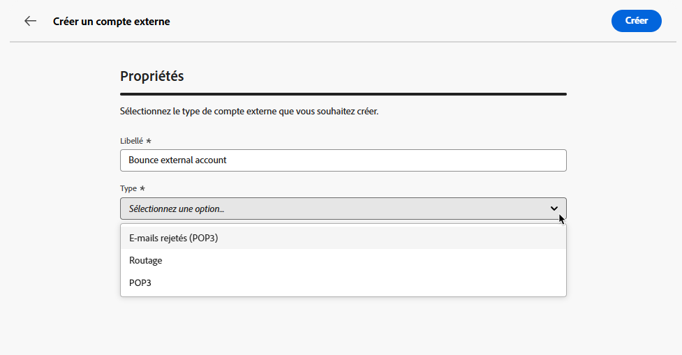

# Configuration des comptes externes {#external-accounts}

>[!CONTEXTUALHELP]
>id="acw_homepage_welcome_rn2"
>title="Comptes externes"
>abstract="Vous pouvez désormais vous connecter à d’autres plateformes ou personnaliser les connexions pour qu’elles s’adaptent à votre workflow, et créer facilement de nouveaux comptes externes pour répondre à vos besoins spécifiques et garantir un transfert de données transparent."
>additional-url="https://experienceleague.adobe.com/docs/campaign-web/v8/release-notes/release-notes.html?lang=fr" text="Voir les notes de mise à jour"

>[!AVAILABILITY]
>
> Notez que les comptes externes ne sont actuellement disponibles que pour les mails rebonds (POP3) et l&#39;instance Exécution, avec des types de compte supplémentaires à ajouter à l&#39;avenir.
> Les comptes externes non pris en charge créés dans la console Adobe Campaign sont visibles dans l’interface utilisateur web, mais ne peuvent pas être modifiés ni accessibles.

Adobe Campaign est fourni avec un ensemble de comptes externes préconfigurés pour une intégration facile avec divers systèmes. Si vous devez vous connecter à d’autres plateformes ou personnaliser les connexions pour qu’elles s’adaptent à votre workflow, vous pouvez désormais facilement créer de nouveaux comptes externes à l’aide de l’interface utilisateur web pour répondre à vos besoins spécifiques et garantir un transfert de données transparent.

## Créer un compte externe {#create-ext-account}

Pour créer un compte externe, procédez comme suit : Les paramètres détaillés dépendent du type de compte externe.

1. Dans le menu de gauche, sélectionnez **[!UICONTROL Comptes externes]** sous **[!UICONTROL Administration]**.

1. Cliquez sur **[!UICONTROL Créer un compte externe]**.

   

1. Saisissez votre **[!UICONTROL Libellé]** et sélectionnez votre compte externe **[!UICONTROL Type]**.

   

1. Cliquez sur **[!UICONTROL Créer]**.

1. Dans la liste déroulante **[!UICONTROL Options avancées]**, vous pouvez modifier le chemin **[!UICONTROL Nom interne]** ou **[!UICONTROL Dossier]** si nécessaire.

   

1. Activez l’option **[!UICONTROL Exporté automatiquement]** si vous souhaitez que vos données gérées par ce compte externe soient automatiquement exportées.

1. Configurez l’accès au compte en spécifiant les informations d’identification en fonction du type de compte externe choisi.

1. Cliquez sur **[!UICONTROL Tester la connexion]** pour vérifier que votre configuration est correcte.

1. Dans le menu **[!UICONTROL Plus...]**, dupliquez ou supprimez votre compte externe.

   

1. Une fois la configuration terminée, cliquez sur **[!UICONTROL Enregistrer]**.

## Comptes externes spécifiques à Campaign {#campaign-specific}

### E-mails rejetés (POP3) {#bounce}

>[!AVAILABILITY]
>
> OAuth 2.0 n’est actuellement pas pris en charge.

Le compte externe Mails rebonds spécifie le compte POP3 externe utilisé pour se connecter au service de messagerie. Tous les serveurs configurés pour l’accès POP3 peuvent recevoir des retours.

Pour configurer le compte externe **[!UICONTROL Mails rebonds (POP3)]** :

* **[!UICONTROL Serveur]**

  URL du serveur POP3

* **[!UICONTROL Port]**

  Numéro de port de connexion POP3 (le port par défaut est 110)

* **[!UICONTROL Compte]**

  Nom de l’utilisateur

* **[!UICONTROL Mot de passe]**

  Mot de passe du compte utilisateur

* **[!UICONTROL Chiffrement]**

  Type de chiffrement choisi entre :

   * Par défaut (POP3 si port 110, POP3S si port 995)
   * POP3 qui bascule en SSL après envoi d&#39;un STARTTLS
   * POP3 non sécurisé (port 110 par défaut)
   * POP3 securisé au dessus de SSL (port 995 par défaut)

* **[!UICONTROL Fonction]**

  Email entrant, lorsque le compte externe est configuré pour recevoir les emails entrants, ou SOAP routeur, pour traiter SOAP requêtes.

### Instance d&#39;exécution{#instance-exec}

Si vous disposez d’une architecture segmentée, vous devez identifier les instances d’exécution associées à l’instance de pilotage et établir des connexions entre elles. Les modèles de messages transactionnels sont déployés sur l&#39;instance d&#39;exécution.

Pour configurer le compte externe **[!UICONTROL Instance d&#39;exécution]** :

* **[!UICONTROL URL]**

  URL du serveur sur lequel est installée l&#39;instance d&#39;exécution.

* **[!UICONTROL Compte]**

  Nom du compte qui doit correspondre à l&#39;Agent Message Center tel qu&#39;il a été défini dans le dossier de l&#39;opérateur.

* **[!UICONTROL Mot de passe]**

  Mot de passe du compte tel qu&#39;il a été défini dans le dossier de l&#39;opérateur.

* **[!UICONTROL Méthode]**

  Choisissez entre Service Web ou Federated Data Access (FDA).
En cas de méthode FDA, sélectionnez votre compte FDA. Notez que la connexion de Campaign aux systèmes externes est limitée aux utilisateurs avancés et n&#39;est disponible que depuis la console cliente. [En savoir plus](https://experienceleague.adobe.com/en/docs/campaign/campaign-v8/connect/fda#_blank)

* **[!UICONTROL Créer un workflow d’archivage]**

  Pour chaque instance d&#39;exécution enregistrée dans Message Center, qu&#39;une ou plusieurs instances soient présentes, vous devez créer un workflow d&#39;archivage distinct pour chaque compte externe associé à l&#39;instance d&#39;exécution.
