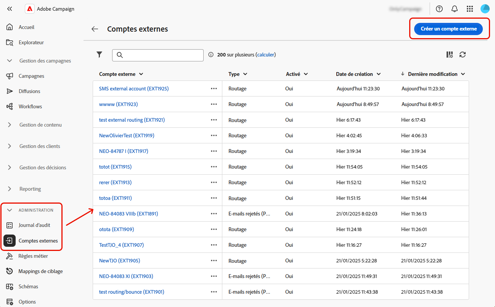
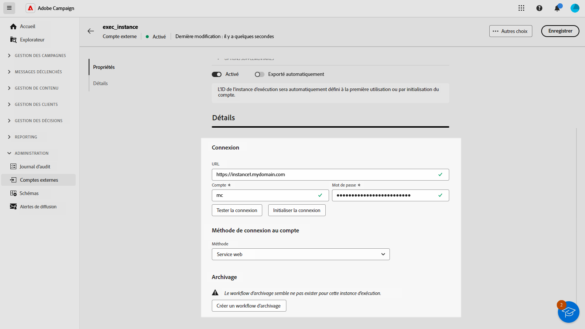

# Configurer des comptes externes {#external-accounts}

>[!CONTEXTUALHELP]
>id="acw_homepage_welcome_rn2"
>title="Comptes externes"
>abstract="Vous pouvez désormais vous connecter à d’autres plateformes ou personnaliser les connexions pour qu’elles s’adaptent à votre workflow, et créer facilement des comptes externes pour répondre à vos besoins spécifiques et garantir un transfert de données fluide."
>additional-url="https://experienceleague.adobe.com/docs/campaign-web/v8/release-notes/release-notes.html?lang=fr" text="Voir les notes de mise à jour"

>[!AVAILABILITY]
>
> Notez que les comptes externes ne sont actuellement disponibles que pour les e-mails rejetés (POP3) et l’instance d’exécution, et des types de compte supplémentaires seront ajoutés à l’avenir.
> Les comptes externes non pris en charge créés dans la console Adobe Campaign sont visibles dans l’interface d’utilisation web, mais ne peuvent pas être modifiés et ne sont pas accessibles.

Adobe Campaign est fourni avec un ensemble de comptes externes préconfigurés pour faciliter l’intégration avec différents systèmes. Si vous devez vous connecter à d’autres plateformes ou personnaliser les connexions pour qu’elles s’adaptent à votre workflow, vous pouvez désormais facilement créer des comptes externes à l’aide de l’interface d’utilisation web pour répondre à vos besoins spécifiques et garantir des transferts de données transparents.

## Créer un compte externe {#create-ext-account}

Pour créer un compte externe, procédez comme suit : Les paramètres détaillés dépendent du type de compte externe.

1. Dans le menu du volet de gauche, sélectionnez **[!UICONTROL Comptes externes]** sous **[!UICONTROL Administration]**.

1. Cliquez sur **[!UICONTROL Créer un compte externe]**.

   

1. Saisissez votre **[!UICONTROL Libellé]** et sélectionnez le **[!UICONTROL Type]** de votre compte externe.

   

1. Cliquez sur **[!UICONTROL Créer]**.

1. Dans la liste déroulante **[!UICONTROL Options avancées]**, vous pouvez modifier le **[!UICONTROL Nom interne]** ou le chemin du **[!UICONTROL Dossier]** si nécessaire.

   

1. Activez l’option **[!UICONTROL Exporté automatiquement]** si vous souhaitez que vos données gérées par ce compte externe soient automatiquement exportées.

1. Configurez l’accès au compte en spécifiant les informations d’identification en fonction du type de compte externe choisi.

1. Cliquez sur **[!UICONTROL Tester la connexion]** pour vérifier que votre configuration est correcte.

1. Dans le menu **[!UICONTROL Plus...]**, dupliquez ou supprimez votre compte externe.

   

1. Une fois la configuration effectuée, cliquez sur **[!UICONTROL Enregistrer]**.

## Comptes externes spécifiques à Campaign {#campaign-specific}

### E-mails rejetés (POP3) {#bounce}

>[!AVAILABILITY]
>
> OAuth 2.0 n’est actuellement pas pris en charge.

Le compte externe d’e-mails rejetés spécifie le compte POP3 externe utilisé pour se connecter au service d’e-mail. Tous les serveurs configurés pour l’accès POP3 peuvent recevoir les retours d’e-mails.

Pour configurer le compte externe **[!UICONTROL E-mails rejetés (POP3)]** :

* **[!UICONTROL Serveur]**

  URL du serveur POP3

* **[!UICONTROL Port]**

  Numéro de port de la connexion POP3 (port par défaut : 110)

* **[!UICONTROL Compte]**

  Nom de l’utilisateur ou l’utilisatrice

* **[!UICONTROL Mot de passe]**

  Mot de passe du compte d’utilisateur ou d’utilisatrice

* **[!UICONTROL Chiffrement]**

  Type de chiffrement choisi entre ce qui suit :

   * Par défaut (POP3 si port 110, POP3S si port 995)
   * POP3 basculant en SSL après envoi d’un STARTTLS
   * POP3 non sécurisé (port 110 par défaut)
   * POP3 securisé au dessus de SSL (port 995 par défaut)

* **[!UICONTROL Fonction]**

  E-mail entrant, lorsque le compte externe est configuré pour recevoir les e-mails entrants, ou routeur SOAP, pour traiter les requêtes SOAP.

### Instance d’exécution{#instance-exec}

Dans le cas d’une architecture segmentée, vous devez identifier les instances d’exécution associées à l’instance de pilotage et établir des connexions entre elles. Les modèles de messages transactionnels sont déployés sur l’instance d’exécution.

Pour configurer le compte externe d’**[!UICONTROL Instance d’exécution]** :

* **[!UICONTROL URL]**

  URL du serveur sur lequel est installée l&#39;instance d&#39;exécution.

* **[!UICONTROL Compte]**

  Nom du compte qui doit correspondre à l&#39;Agent Message Center tel qu&#39;il a été défini dans le dossier de l&#39;opérateur.

* **[!UICONTROL Mot de passe]**

  Mot de passe du compte tel qu&#39;il a été défini dans le dossier de l&#39;opérateur.

* **[!UICONTROL Méthode]**

  Choisissez entre Service web ou Federated Data Access (FDA).
En cas de méthode FDA, sélectionnez votre compte FDA. Notez que la connexion de la campagne aux systèmes externes est réservée à une utilisation avancée et n’est disponible qu’à partir de la console cliente. [En savoir plus](https://experienceleague.adobe.com/fr/docs/campaign/campaign-v8/connect/fda#_blank)

* **[!UICONTROL Créer un workflow d’archivage]**

  Pour chaque instance d’exécution enregistrée dans Message Center, qu’une ou plusieurs instances soient présentes, vous devez créer un workflow d’archivage distinct pour chaque compte externe associé à l’instance d’exécution.
