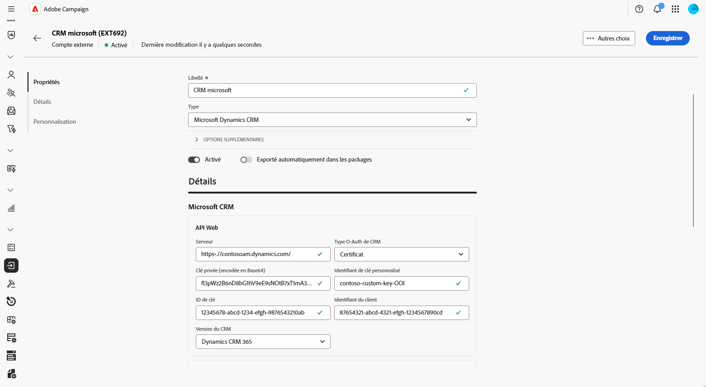
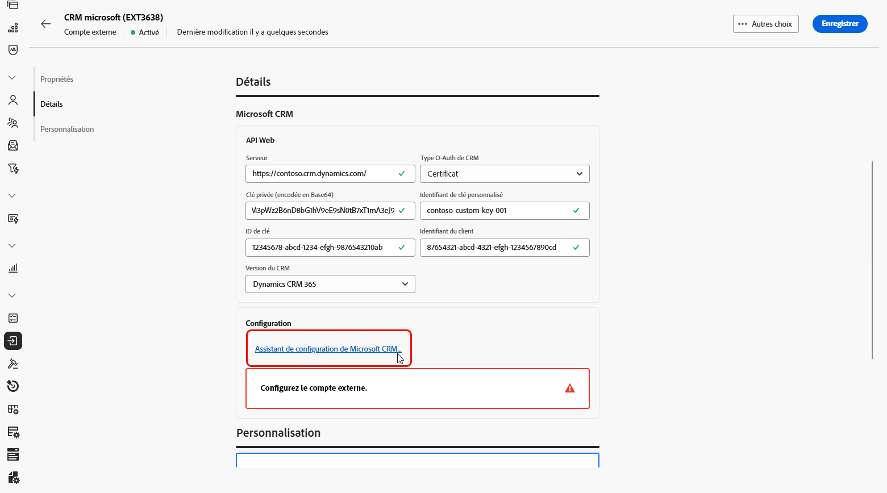
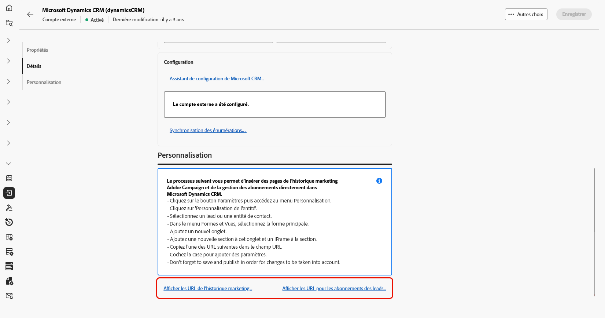
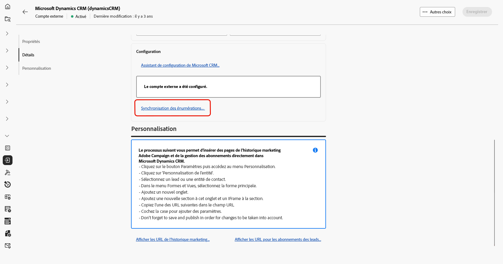
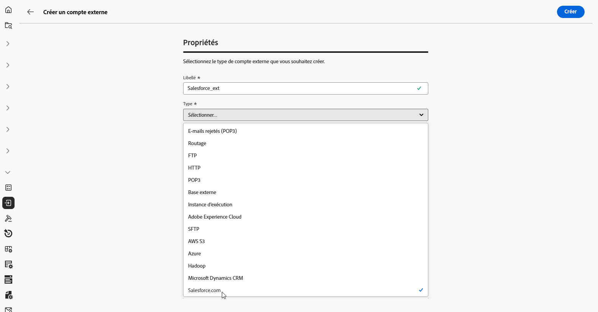
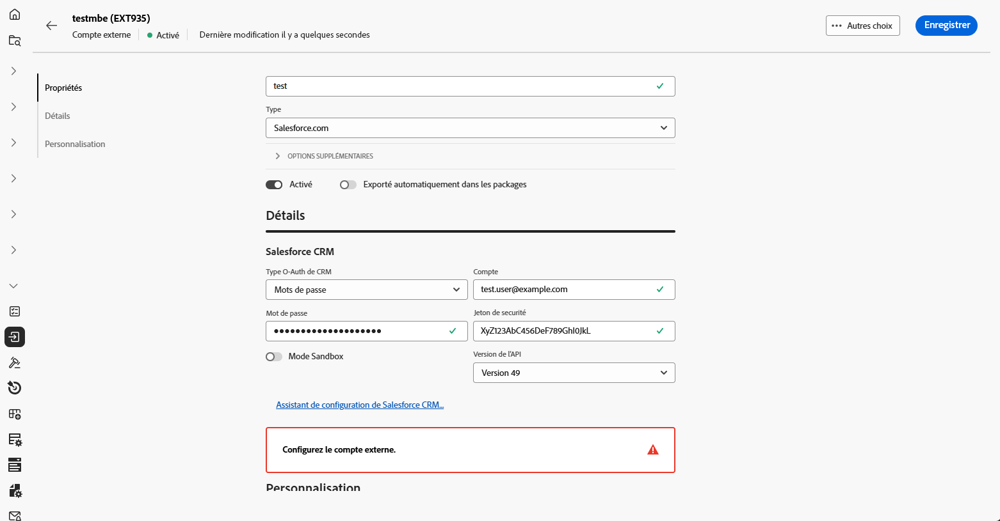
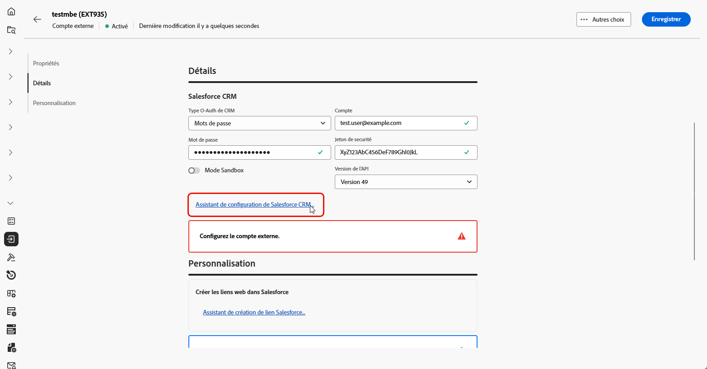
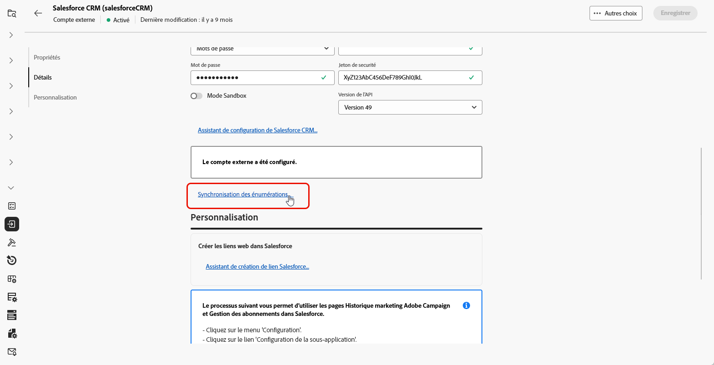
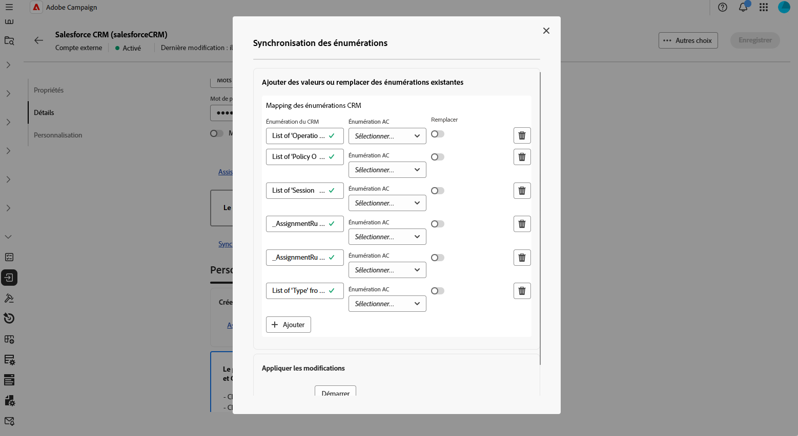

# Compte externe CRM {#external-crm}

Utilisez un compte externe de type CRM pour connecter Adobe Campaign à une base de données tierce.

Les paramètres de configuration de ce compte externe dépendent du moteur de base de données spécifique auquel vous vous connectez. Vous trouverez des instructions de configuration détaillées pour chaque base de données prise en charge dans les sections ci-dessous.

## Microsoft Dynamics CRM

Le compte externe Microsoft Dynamics CRM vous permet de connecter votre instance Campaign à votre base de données externe Microsoft Dynamics CRM.

Dans l’interface d’utilisation d’Adobe Campaign Web, configurez votre compte externe Microsoft Dynamics CRM.

1. [Créez votre compte externe](external-account.md), puis sélectionnez **[!UICONTROL Base de données externe]** comme **[!UICONTROL type]** de votre compte externe et Microsoft Dynamics CRM comme **[!UICONTROL type de fournisseur]**.

1. Cliquez sur **[!UICONTROL Créer]**.

1. Pour configurer le compte externe **[!UICONTROL Microsoft Dynamics CRM]**, renseignez les champs suivants :

   

   +++ Pour le type OAuth de CRM : mot de passe

   * **[!UICONTROL Serveur]** : saisissez l’URL de votre serveur Microsoft CRM.

     Pour trouver l’URL de votre serveur Microsoft CRM, connectez-vous à votre compte Microsoft Dynamics CRM, sélectionnez Dynamics 365, puis ouvrez votre application. L’URL du serveur s’affiche dans la barre d’adresse de votre navigateur, par exemple :`https://myserver.crm.dynamics.com/`.

   * **[!UICONTROL Compte]** : spécifiez le compte utilisé pour se connecter à Microsoft CRM.

   * **[!UICONTROL Mot de passe]** : saisissez le mot de passe associé au compte spécifié.

   * **[!UICONTROL Identifiant du client]** : saisissez l’identifiant du client qui se trouve sur le portail de gestion Microsoft Azure.

   * **[!UICONTROL Version du CRM]** : sélectionnez la version du CRM Dynamics 365 CRM.

   +++

    

   +++ Pour le type O-Auth CRM : certificat

   * **[!UICONTROL Serveur]** : saisissez l’URL de votre serveur Microsoft CRM.

     Pour trouver l’URL de votre serveur Microsoft CRM, connectez-vous à votre compte Microsoft Dynamics CRM, sélectionnez Dynamics 365, puis ouvrez votre application. L’URL du serveur s’affiche dans la barre d’adresse de votre navigateur, par exemple :`https://myserver.crm.dynamics.com/`.

   * **[!UICONTROL Clé privée (encodée en Base64)]** : indiquez la clé privée encodée au format Base64.

     Pour cela, vous pouvez utiliser l’aide d’un encodeur Base64 ou vous servir de la ligne de commande `base64 -w0 private.key` sous Linux.

   * **[!UICONTROL Identifiant de clé personnalisée]** : saisissez l’identifiant de clé personnalisée utilisé pour votre certificat.

   * **[!UICONTROL Identifiant de clé]** : saisissez l’identifiant de clé associé à votre certificat.

   * **[!UICONTROL Identifiant du client]** : saisissez l’identifiant du client qui se trouve sur le portail de gestion Microsoft Azure.

   * **[!UICONTROL Version du CRM]** : sélectionnez la version du CRM Dynamics 365 CRM.

   +++

1. Une fois la connexion configurée, accédez à l’**[!UICONTROL Assistant de configuration de Microsoft CRM]** pour générer votre liste de tables Microsoft CRM.

   Cliquez sur **[!UICONTROL Suivant]** pour sélectionner les tables requises.

   

1. Sélectionnez les tables Microsoft CRM à récupérer ou ajoutez une table distante en spécifiant le **[!UICONTROL libellé de la table]** et le **[!UICONTROL nom interne de la table]**, puis activez l’option **[!UICONTROL Sélectionnées]**.

   Cliquez sur **[!UICONTROL Suivant]**.

1. Cliquez sur **[!UICONTROL Démarrer]** pour commencer à créer le schéma Microsoft CRM à partir des tables sélectionnées.

1. Suivez les instructions affichées à l’écran pour insérer des pages de l’historique marketing et de la gestion des abonnements d’Adobe Campaign directement dans Microsoft Dynamics CRM.

1. Cliquez sur **[!UICONTROL Afficher les URL de l’historique marketing]** pour afficher les URL permettant d’intégrer les pages de l’historique marketing ou **[!UICONTROL Afficher les URL des abonnements des prospects]** pour afficher les URL permettant d’intégrer les pages de la gestion des abonnements.

   

1. Cliquez sur **[!UICONTROL Enregistrer]** une fois votre compte externe Microsoft CRM configuré.

1. Une fois votre compte externe créé, vous pouvez cliquer sur **[!UICONTROL Synchroniser les énumérations...]** pour synchroniser automatiquement les énumérations entre Microsoft CRM et l’interface d’utilisation d’Adobe Campaign Web.

   

1. Sélectionnez l’énumération Adobe Campaign correspondant à l’énumération Microsoft CRM.

   Pour remplacer les valeurs d’Adobe Campaign par les valeurs de Microsoft CRM, activez l’option **[!UICONTROL Remplacer]**.

## Salesforce {#salesforce}

Pour configurer le compte externe Salesforce afin de l’utiliser avec Adobe Campaign, vous devez fournir les détails suivants :

1. [Créez votre compte externe](external-account.md), puis sélectionnez **[!UICONTROL Base de données externe]** comme **[!UICONTROL type]** de votre compte externe et Salesforce.com comme **[!UICONTROL type de fournisseur]**.

   

1. Cliquez sur **[!UICONTROL Créer]**.

1. Pour configurer le compte externe **[!UICONTROL Salesforce]**, renseignez les champs suivants :

   * **[!UICONTROL Type O-Auth CRM]** : **[!UICONTROL mot de passe]** ou **[!UICONTROL informations d’identification]**

   * **[!UICONTROL Compte]** : compte utilisé pour se connecter à Salesforce CRM

   * **[!UICONTROL Mot de passe]** : saisissez le mot de passe associé au compte spécifié.

   * **[!UICONTROL Jeton de sécurité]** : renseignez le jeton de sécurité Salesforce associé au compte.

   * **[!UICONTROL Version de l’API]** : sélectionnez la version 49.

   

1. Ouvrez l’**[!UICONTROL Assistant de configuration de Salesforce CRM]** pour générer la liste des tables de Salesforce CRM, puis cliquez sur **[!UICONTROL Suivant]**.

   

1. Sélectionnez les tables Salesforce à récupérer ou ajoutez une table distante en spécifiant le **[!UICONTROL libellé de la table]** et le **[!UICONTROL nom interne de la table]**, puis activez l’option **[!UICONTROL Sélectionnées]**.

   Cliquez sur **[!UICONTROL Suivant]**.

1. Cliquez sur **[!UICONTROL Démarrer]** pour commencer à créer le schéma Salesforce CRM à partir des tables sélectionnées.

1. Cliquez sur **[!UICONTROL Assistant de création de liens Salesforce...]** pour générer les liens web dans Salesforce.

   Cliquez ensuite sur **[!UICONTROL Suivant]** pour récupérer les liens web pour les **Leads** et les **Contacts** à partir de Salesforce.

1. Sélectionnez les liens à exporter vers la liste des liens web Salesforce.

1. Suivez les instructions affichées à l’écran pour insérer les pages **Historique marketing** et **Gestion des abonnements** à partir de l’interface d’utilisation d’Adobe Campaign Web dans Salesforce CRM.

1. Cliquez sur **[!UICONTROL Enregistrer]** une fois votre compte externe Salesforce CRM configuré.

1. Une fois votre compte externe créé, vous pouvez cliquer sur **[!UICONTROL Synchroniser les énumérations...]** pour synchroniser automatiquement les énumérations entre Salesforce et l’interface d’utilisation d’Adobe Campaign Web.

   

1. Sélectionnez l’énumération Adobe Campaign correspondant à l’énumération Salesforce.

   Pour remplacer les valeurs d’Adobe Campaign par les valeurs de Salesforce, activez l’option **[!UICONTROL Remplacer]**.

   

