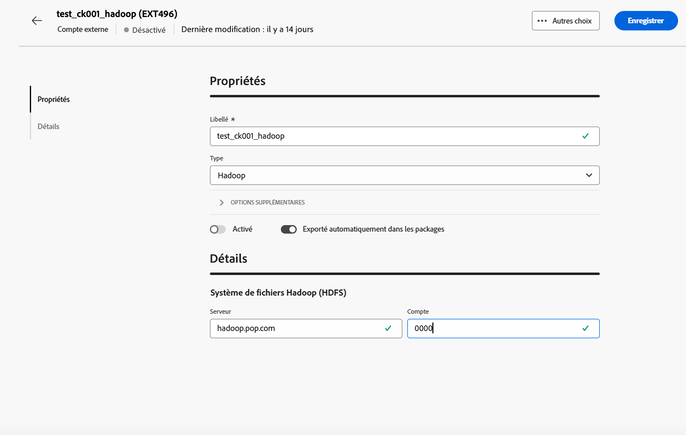

# Compte externe Hadoop {#external-hadoop}

Le compte externe Hadoop vous permet de connecter votre instance Campaign à votre base de données externe Hadoop. Pour en savoir plus sur Hadoop, consultez la [documentation de la console Campaign V7](https://experienceleague.adobe.com/fr/docs/campaign-classic/using/installing-campaign-classic/accessing-external-database/configure-fda/config-databases/configure-fda-hadoop){target=_blank}.

Pour configurer le compte externe **[!UICONTROL Hadoop]**, renseignez les champs suivants :

* **[!UICONTROL Serveur]**

  URL de votre serveur de stockage Hadoop.

* **[!UICONTROL Compte]**

  Nom du compte de votre serveur Hadoop.
