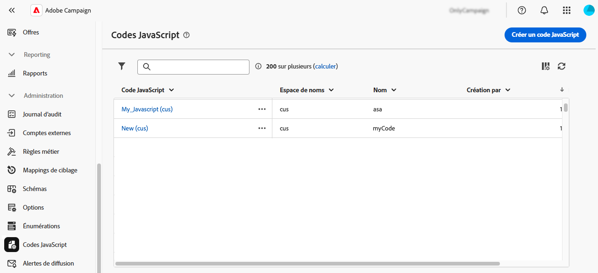

# Utiliser les codes JavaScript {#javascript-codes}

>[!CONTEXTUALHELP]
>id="acw_javascript_codes_list"
>title="Codes JavaScript"
>abstract="Codes JavaScript"

>[!CONTEXTUALHELP]
>id="acw_javascript_codes_create"
>title="Créer du code JavaScript"
>abstract="Créer du code JavaScript"

## À propos des codes JavaScript {#about}

Les codes JavaScript vous permettent de créer des fonctions réutilisables qui peuvent être utilisées dans les workflows, à la manière d’une bibliothèque. Ces fonctions sont stockées dans le menu **[!UICONTROL Administration]** > **[!UICONTROL Codes JavaScript]** dans le volet de navigation de gauche.



À partir de la liste des codes JavaScript, vous pouvez effectuer les opérations suivantes :

* **Dupliquer ou supprimer un code** : cliquez sur le bouton représentant des points de suspension et sélectionnez l’action souhaitée.
* **Modifier un code** : cliquez sur le nom d’un code pour ouvrir ses propriétés, apporter vos modifications et enregistrer.
* **Créer un code JavaScript** : cliquez sur le bouton **[!UICONTROL Créer un code JavaScript]**.

>[!NOTE]
>
>Bien que l’emplacement du menu des codes JavaScript diffère entre la console Adobe Campaign et l’interface d’utilisation web, la liste est identique et fonctionne comme un miroir.

## Créer un code JavaScript {#create}

Pour créer un code JavaScript, procédez comme suit :

1. Accédez au menu **[!UICONTROL Codes JavaScript]** et cliquez sur le bouton **[!UICONTROL Créer un code JavaScript]**.

1. Définissez les propriétés du code :

   * **[!UICONTROL Espace de noms]** : spécifiez l’espace de noms pertinent pour vos ressources personnalisées. Par défaut, l’espace de noms est « cus », mais il peut varier en fonction de votre implémentation.
   * **[!UICONTROL Nom]** : identifiant unique à utiliser pour référencer le code.
   * **[!UICONTROL Libellé]** : libellé descriptif affiché dans la liste des codes JavaScript.

   

   >[!NOTE]
   >
   >Une fois créés, les champs **[!UICONTROL Espace de noms]** et **[!UICONTROL Nom]** ne peuvent plus être modifiés. Pour apporter des modifications, dupliquez le code et mettez-le à jour si nécessaire.
   >
   >Dans la console Campaign, le nom du code JavaScript s’affiche sous la forme d’une concaténation de ces deux champs.

1. Cliquez sur le bouton **[!UICONTROL Créer le code]** pour définir le code JavaScript. Le volet de gauche comprend deux menus qui vous permettent d’utiliser des fonctions prédéfinies concernant les conditions et la mise en forme des dates.

   

1. Cliquez sur **[!UICONTROL Confirmer]** pour enregistrer votre code.

1. Lorsque votre code JavaScript est prêt, cliquez sur **[!UICONTROL Créer]**. Le code JavaScript peut désormais être utilisé dans tous les workflows.

## Utiliser un code JavaScript à partir d’un workflow {#workflow}

### Charger des bibliothèques de code JavaScript {#library}

Vous pouvez référencer des codes JavaScript dans des workflows afin d’éviter d’avoir à réécrire du code pour des tâches répétitives. Pour utiliser ces codes, chargez d’abord la bibliothèque correspondante dans le script d’initialisation du workflow. Cela vous permet de charger toutes les bibliothèques contenant les fonctions que vous souhaitez utiliser dans votre workflow en une fois.

Pour charger une bibliothèque, procédez comme suit :

1. Ouvrez un workflow et cliquez sur le bouton **[!UICONTROL Paramètres]**.
1. Accédez à la section **[!UICONTROL Script d’initialisation]** et cliquez sur **[!UICONTROL Créer un code]**.

   

1. Utilisez la syntaxe suivante dans le code pour charger une bibliothèque :

   ```
   loadLibrary("/<namespace>/<name>")
   ```

   * Remplacez `<namespace>` par l’espace de noms spécifié lors de la création du code JavaScript.
   * Remplacez `<name>` par le nom du code JavaScript.

1. Cliquez sur **[!UICONTROL Confirmer]** et enregistrez les paramètres.

### Référencer des fonctions dans des workflows {#reference}

Une fois la bibliothèque JavaScript chargée, vous pouvez référencer les fonctions définies dans le code JavaScript directement dans le workflow, généralement à l’aide d’une activité **[!UICONTROL Code JavaScript]**.

