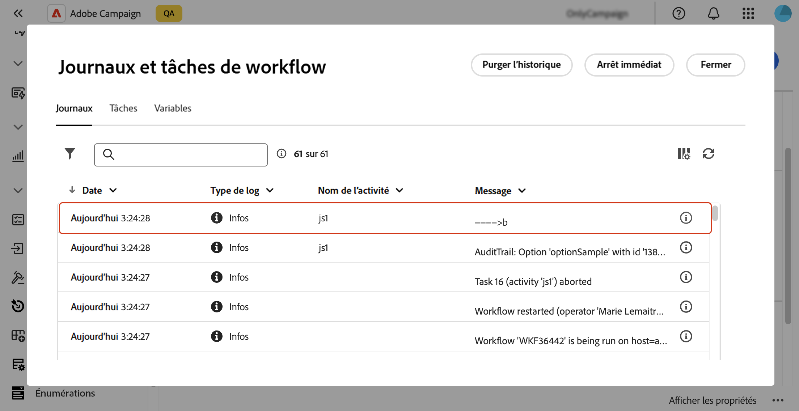

# Configurer les options de [!DNL Campaign] {#options}

>[!CONTEXTUALHELP]
>id="acw_options_list"
>title="Options"
>abstract="Options"

>[!CONTEXTUALHELP]
>id="acw_options_create"
>title="Option Créer"
>abstract="Option Créer"

Adobe Campaign Web propose des options techniques qui vous permettent de configurer l’application de manière plus spécifique. Certaines de ces options sont intégrées, tandis que d’autres peuvent être ajoutées manuellement selon vos besoins.

>[!IMPORTANT]\
>Les options intégrées sont préconfigurées et ne doivent être modifiées que par des personnes expérimentées. Pour toute question ou demande, contactez votre représentant ou représentante Adobe.

## Accéder aux options de Campaign {#access}

Les options sont disponibles à partir du menu **[!UICONTROL Administration]** / **[!UICONTROL Options]**. Utilisez le volet de filtrage pour affiner la liste et trouver rapidement l’option dont vous avez besoin.

\
[Liste des options du menu Administration/Options]

>[!NOTE]\
>Bien que l’emplacement du menu des options diffère entre la console Adobe Campaign et l’interface d’utilisation web, la liste est identique et fonctionne comme un miroir. Pour plus d’informations sur les options disponibles, consultez la liste des options dans la [documentation de Campaign v7](https://experienceleague.adobe.com/fr/docs/campaign-classic/using/installing-campaign-classic/appendices/configuring-campaign-options){target="_blank"}.

Dans la liste des options, vous pouvez effectuer les actions suivantes :

* **Dupliquer ou supprimer une option** : cliquez sur le bouton représentant des points de suspension et sélectionnez l’action souhaitée.
* **Modifier une option** : cliquez sur le nom de l’option pour ouvrir ses propriétés. Apportez vos modifications et enregistrez-les.
* **Créer une option personnalisée** : cliquez sur le bouton **[!UICONTROL Créer une option]**.

## Créer une option {#create}

L’interface d’utilisation d’Adobe Campaign Web vous permet de créer vos propres options personnalisées en fonction de vos besoins. Cela s’avère particulièrement utile lorsque vous utilisez des activités de workflow **[!UICONTROL Code JavaScript]** pour stocker des données intermédiaires.

Pour créer une option, procédez comme suit :

1. Accédez à la liste des options et cliquez sur **[!UICONTROL Créer une option]**.
1. Attribuez un nom à l’option, sélectionnez son type et définissez la valeur souhaitée.
1. Cliquez sur **[!UICONTROL Créer]** pour créer l’option.

Les options peuvent servir d’espace de stockage temporaire pour des données, ce qui offre les avantages suivants :

* Valeurs typées : les options prennent en charge les types de données spécifiques, tels que les dates, les entiers, les chaînes, etc.
* Flexibilité : les options permettent aux utilisateurs et aux utilisatrices de stocker et de récupérer les données efficacement sans avoir à gérer des tables de bases de données.

Dans l’exemple ci-dessous, une option personnalisée nommée `sampleOption` est créée avec la valeur initiale « a ». Une activité **[!UICONTROL Code JavaScript]** dans un workflow modifie la valeur de cette option et la stocke dans une variable. La valeur mise à jour s’affiche dans les logs du workflow et est reflétée dans le menu **[!UICONTROL Options]**.

1. Créez l’option.

   

1. Configurez une activité **[!UICONTROL Code JavaScript]** et démarrez le workflow.

   Interface de configuration de l’activité de code 

1. Exécutez le workflow pour afficher la valeur mise à jour dans les logs du workflow.

   

1. La valeur mise à jour est désormais visible dans le menu **[!UICONTROL Options]**.

   