<?xml version="1.0" encoding="UTF-8"?>
<xliff xmlns="urn:oasis:names:tc:xliff:document:1.2" xmlns:okp="okapi-framework:xliff-extensions" xmlns:its="http://www.w3.org/2005/11/its" xmlns:itsxlf="http://www.w3.org/ns/its-xliff/" version="1.2" its:version="2.0">
<file original="help/v8/administration/plans-programs.md.mdsc" source-language="en-US" target-language="en-XX" datatype="x-text/markdown">
<body>
<trans-unit id="tu1" restype="x-YAML_METADATA_HEADER_VALUE" xml:space="preserve">
<source xml:lang="en-US">Plans and Programs</source>
<target xml:lang="en-XX">Plans et programmes</target>
</trans-unit>
<trans-unit id="tu2" restype="x-YAML_METADATA_HEADER_VALUE" xml:space="preserve">
<source xml:lang="en-US">Learn how to create and configure plans and programs in Adobe Campaign</source>
<target xml:lang="en-XX">Découvrir comment créer et envoyer des plans et des programmes dans Adobe Campaign</target>
</trans-unit>
<trans-unit id="tu3" xml:space="preserve">
<source xml:lang="en-US">Plans and programs</source>
<target xml:lang="en-XX">Plans et programmes</target>
</trans-unit>
<trans-unit id="tu4" xml:space="preserve">
<source xml:lang="en-US">Adobe Campaign allows you to configure your folder hierarchy for marketing plans and programs.</source>
<target xml:lang="en-XX">Adobe Campaign permet de configurer la hiérarchie des dossiers des plans marketing et des programmes.</target>
</trans-unit>
<trans-unit id="tu5" xml:space="preserve">
<source xml:lang="en-US">To better organize these components, Adobe recommends the following hierarchy: Plan <ph id="1" ctype="x-CODE">`>`</ph> Programs <ph id="2" ctype="x-CODE">`>`</ph> Campaigns.</source>
<target xml:lang="en-XX">Pour mieux organiser ces composants, Adobe recommande la hiérarchie suivante : Plan <ph id="1" ctype="x-CODE">`>`</ph> Programmes <ph id="2" ctype="x-CODE">`>`</ph> Campagnes.</target>
</trans-unit>
<trans-unit id="tu6" xml:space="preserve">
<source xml:lang="en-US">A <ph id="1" ctype="x-STRONG_EMPHASIS">**</ph>plan<ph id="2" ctype="x-STRONG_EMPHASIS">**</ph> may contain multiple programs. It defines strategic objectives for a specific period.</source>
<target xml:lang="en-XX">Un <ph id="1" ctype="x-STRONG_EMPHASIS">**</ph>plan<ph id="2" ctype="x-STRONG_EMPHASIS">**</ph> peut contenir plusieurs programmes. Il définit des objectifs stratégiques pour une période spécifique.</target>
</trans-unit>
<trans-unit id="tu7" xml:space="preserve">
<source xml:lang="en-US">A <ph id="1" ctype="x-STRONG_EMPHASIS">**</ph>program<ph id="2" ctype="x-STRONG_EMPHASIS">**</ph> may contain other programs as well as campaigns, workflows, and landing pages.</source>
<target xml:lang="en-XX">Un <ph id="1" ctype="x-STRONG_EMPHASIS">**</ph>programme<ph id="2" ctype="x-STRONG_EMPHASIS">**</ph> peut contenir d’autres programmes, des campagnes, des workflows et des landing pages.</target>
</trans-unit>
<trans-unit id="tu8" xml:space="preserve">
<source xml:lang="en-US">A <ph id="1" ctype="x-STRONG_EMPHASIS">**</ph>campaign<ph id="2" ctype="x-STRONG_EMPHASIS">**</ph> may contain deliveries, workflows, and landing pages.</source>
<target xml:lang="en-XX">Une <ph id="1" ctype="x-STRONG_EMPHASIS">**</ph>campagne<ph id="2" ctype="x-STRONG_EMPHASIS">**</ph> peut contenir des diffusions, des workflows et des landing pages.</target>
</trans-unit>
<trans-unit id="tu9" xml:space="preserve">
<source xml:lang="en-US">Create and configure a plan</source>
<target xml:lang="en-XX">Créer et configurer un plan</target>
</trans-unit>
<trans-unit id="tu10" xml:space="preserve">
<source xml:lang="en-US">To create a plan, create a folder with the folder type <ph id="1" ctype="x-STRONG_EMPHASIS">**[!UICONTROL </ph>Plan<ph id="3" ctype="x-LINK_REF">]**</ph>. <ph id="5" ctype="x-LINK">[</ph>Learn more about creating a folder<ph id="6" ctype="x-LINK">](../get-started/work-with-folders.md)</ph></source>
<target xml:lang="en-XX">Pour créer un plan, créez un dossier avec le type de dossier <ph id="1" ctype="x-STRONG_EMPHASIS">**[!UICONTROL </ph>Plan<ph id="3" ctype="x-LINK_REF">]**</ph>. <ph id="5" ctype="x-LINK">[</ph>En savoir plus sur la création d’un dossier<ph id="6" ctype="x-LINK">](../get-started/work-with-folders.md)</ph></target>
</trans-unit>
<trans-unit id="tu11" xml:space="preserve">
<source xml:lang="en-US"><ph id="1" ctype="x-IMAGE">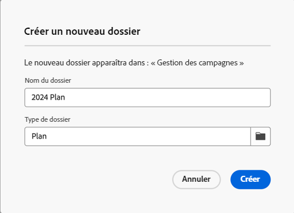{zoomable="yes"}</ph></source>
<target xml:lang="en-XX"><ph id="1" ctype="x-IMAGE">{zoomable="yes"}</ph></target>
</trans-unit>
<trans-unit id="tu12" xml:space="preserve">
<source xml:lang="en-US">Go to the <ph id="1" ctype="x-STRONG_EMPHASIS">**[!UICONTROL </ph>Folder settings<ph id="3" ctype="x-LINK_REF">]**</ph> of your plan to manage it.</source>
<target xml:lang="en-XX">Accédez aux <ph id="1" ctype="x-STRONG_EMPHASIS">**[!UICONTROL </ph>Paramètres de dossier<ph id="3" ctype="x-LINK_REF">]**</ph> de votre plan pour le gérer.</target>
</trans-unit>
<trans-unit id="tu13" xml:space="preserve">
<source xml:lang="en-US"><ph id="1" ctype="x-IMAGE">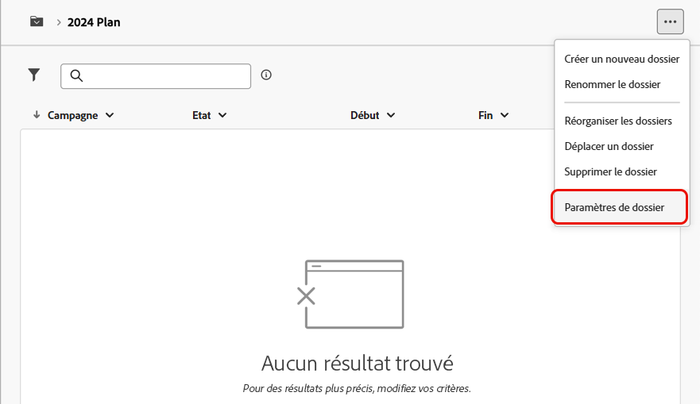{zoomable="yes"}</ph></source>
<target xml:lang="en-XX"><ph id="1" ctype="x-IMAGE">{zoomable="yes"}</ph></target>
</trans-unit>
<trans-unit id="tu14" xml:space="preserve">
<source xml:lang="en-US">Define <ph id="1" ctype="x-STRONG_EMPHASIS">**[!UICONTROL </ph>Custom options<ph id="3" ctype="x-LINK_REF">]**</ph>, and set the scheduling date of your plan.</source>
<target xml:lang="en-XX">Définissez des <ph id="1" ctype="x-STRONG_EMPHASIS">**[!UICONTROL </ph>Options personnalisées<ph id="3" ctype="x-LINK_REF">]**</ph> et la date de planification de votre plan.</target>
</trans-unit>
<trans-unit id="tu15" xml:space="preserve">
<source xml:lang="en-US"><ph id="1" ctype="x-IMAGE">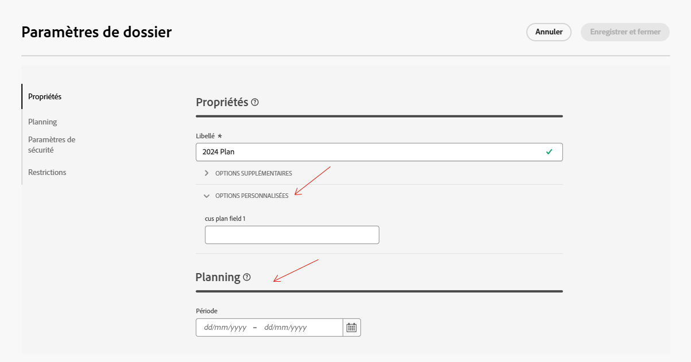{zoomable="yes"}</ph></source>
<target xml:lang="en-XX"><ph id="1" ctype="x-IMAGE">{zoomable="yes"}</ph></target>
</trans-unit>
<trans-unit id="tu16" xml:space="preserve">
<source xml:lang="en-US">To manage the <ph id="1" ctype="x-STRONG_EMPHASIS">**[!UICONTROL </ph>Custom options<ph id="3" ctype="x-LINK_REF">]**</ph>:</source>
<target xml:lang="en-XX">Pour gérer les <ph id="1" ctype="x-STRONG_EMPHASIS">**[!UICONTROL </ph>Options personnalisées<ph id="3" ctype="x-LINK_REF">]**</ph>, procédez comme suit :</target>
</trans-unit>
<trans-unit id="tu17" xml:space="preserve">
<source xml:lang="en-US">Browse to the <ph id="1" ctype="x-STRONG_EMPHASIS">**[!UICONTROL </ph>Schemas<ph id="3" ctype="x-LINK_REF">]**</ph>.</source>
<target xml:lang="en-XX">Accédez aux <ph id="1" ctype="x-STRONG_EMPHASIS">**[!UICONTROL </ph>Schémas<ph id="3" ctype="x-LINK_REF">]**</ph>.</target>
</trans-unit>
<trans-unit id="tu18" xml:space="preserve">
<source xml:lang="en-US">Choose the <ph id="1" ctype="x-STRONG_EMPHASIS">**[!UICONTROL </ph>Editable<ph id="3" ctype="x-LINK_REF">]**</ph> schemas in the filters.</source>
<target xml:lang="en-XX">Choisissez les schémas <ph id="1" ctype="x-STRONG_EMPHASIS">**[!UICONTROL </ph>Modifiables<ph id="3" ctype="x-LINK_REF">]**</ph> dans les filtres.</target>
</trans-unit>
<trans-unit id="tu19" xml:space="preserve">
<source xml:lang="en-US">Click the schema.</source>
<target xml:lang="en-XX">Cliquez sur le schéma.</target>
</trans-unit>
<trans-unit id="tu20" xml:space="preserve">
<source xml:lang="en-US"><ph id="1" ctype="x-IMAGE">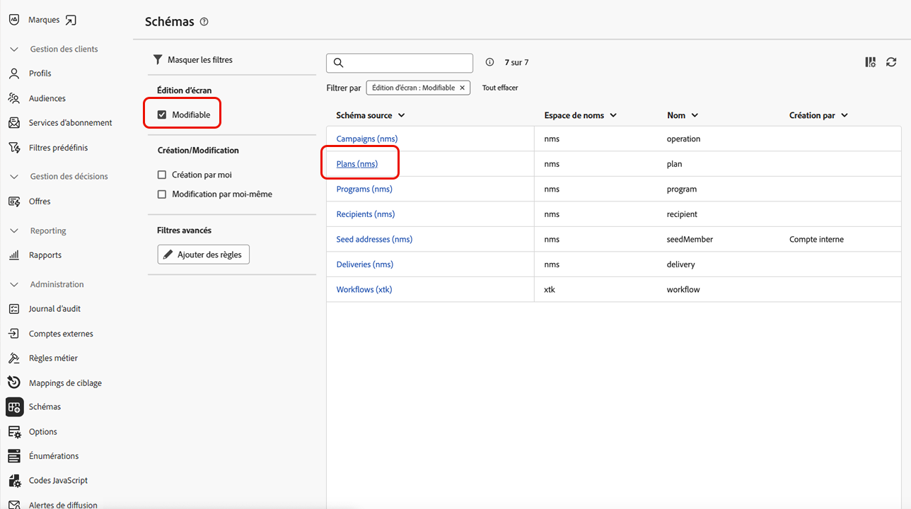{zoomable="yes"}</ph></source>
<target xml:lang="en-XX"><ph id="1" ctype="x-IMAGE">{zoomable="yes"}</ph></target>
</trans-unit>
<trans-unit id="tu21" xml:space="preserve">
<source xml:lang="en-US">Click the <ph id="1" ctype="x-STRONG_EMPHASIS">**[!UICONTROL </ph>Screen edition<ph id="3" ctype="x-LINK_REF">]**</ph> button.</source>
<target xml:lang="en-XX">Cliquez sur le bouton <ph id="1" ctype="x-STRONG_EMPHASIS">**[!UICONTROL </ph>Édition d’écran<ph id="3" ctype="x-LINK_REF">]**</ph>.</target>
</trans-unit>
<trans-unit id="tu22" xml:space="preserve">
<source xml:lang="en-US"><ph id="1" ctype="x-IMAGE">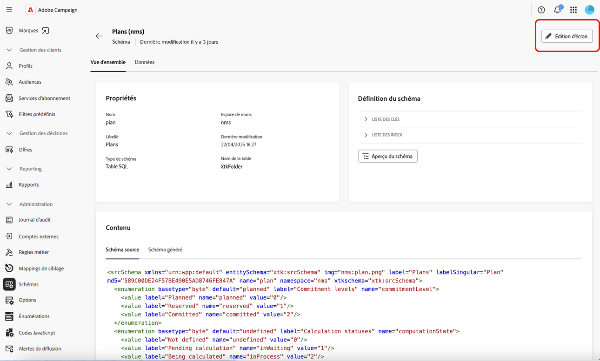{zoomable="yes"}</ph></source>
<target xml:lang="en-XX"><ph id="1" ctype="x-IMAGE">{zoomable="yes"}</ph></target>
</trans-unit>
<trans-unit id="tu23" xml:space="preserve">
<source xml:lang="en-US">Configure the custom options:</source>
<target xml:lang="en-XX">Configurez les options personnalisées :</target>
</trans-unit>
<trans-unit id="tu24" xml:space="preserve">
<source xml:lang="en-US"><ph id="1" ctype="x-IMAGE">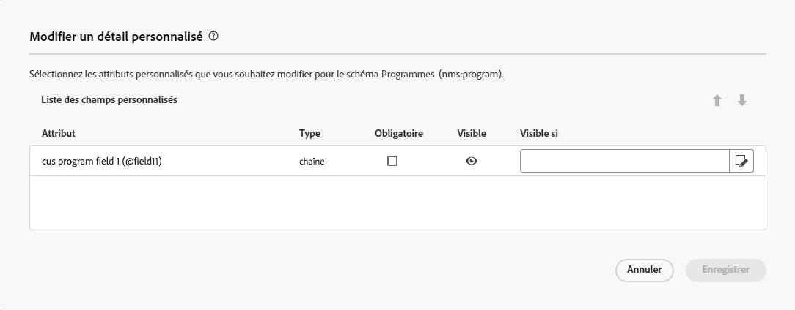{zoomable="yes"}</ph></source>
<target xml:lang="en-XX"><ph id="1" ctype="x-IMAGE">{zoomable="yes"}</ph></target>
</trans-unit>
<trans-unit id="tu25" xml:space="preserve">
<source xml:lang="en-US">Create and configure a program</source>
<target xml:lang="en-XX">Créer et configurer un programme</target>
</trans-unit>
<trans-unit id="tu26" xml:space="preserve">
<source xml:lang="en-US">Programs are available from the left navigation menu, similar to the list views for campaigns, deliveries, and workflows. The <ph id="1" ctype="x-STRONG_EMPHASIS">**[!UICONTROL </ph>Programs<ph id="3" ctype="x-LINK_REF">]**</ph> entry lets you create a program within an existing program, not under a plan.</source>
<target xml:lang="en-XX">Les programmes sont disponibles à partir du menu de navigation de gauche, comme les vues de listes pour les campagnes, les diffusions et les workflows. L’entrée <ph id="1" ctype="x-STRONG_EMPHASIS">**[!UICONTROL </ph>Programmes<ph id="3" ctype="x-LINK_REF">]**</ph> vous permet de créer un programme au sein d’un programme existant, et non d’un plan.</target>
</trans-unit>
<trans-unit id="tu27" xml:space="preserve">
<source xml:lang="en-US">To create your first, top-level program in a plan, navigate to your plan in the Explorer (see this <ph id="1" ctype="x-LINK">[</ph>section<ph id="2" ctype="x-LINK">](#create-plan)</ph>), and create a folder with the folder type <ph id="3" ctype="x-STRONG_EMPHASIS">**[!UICONTROL </ph>Program<ph id="5" ctype="x-LINK_REF">]**</ph>. <ph id="7" ctype="x-LINK">[</ph>Learn more about creating a folder<ph id="8" ctype="x-LINK">](../get-started/work-with-folders.md)</ph>.</source>
<target xml:lang="en-XX">Pour créer votre premier programme de niveau supérieur dans un plan, accédez à votre plan dans l’Explorateur (voir cette <ph id="1" ctype="x-LINK">[</ph>section<ph id="2" ctype="x-LINK">](#create-plan)</ph>), et créez un dossier avec le type de dossier <ph id="3" ctype="x-STRONG_EMPHASIS">**[!UICONTROL </ph>Programme<ph id="5" ctype="x-LINK_REF">]**</ph>. <ph id="7" ctype="x-LINK">[</ph>En savoir plus sur la création d’un dossier<ph id="8" ctype="x-LINK">](../get-started/work-with-folders.md)</ph>.</target>
</trans-unit>
<trans-unit id="tu28" xml:space="preserve">
<source xml:lang="en-US">To create a program within an existing program, follow the steps below:</source>
<target xml:lang="en-XX">Pour créer un programme au sein d’un programme existant, procédez comme suit :</target>
</trans-unit>
<trans-unit id="tu29" xml:space="preserve">
<source xml:lang="en-US">Browse to the <ph id="1" ctype="x-STRONG_EMPHASIS">**[!UICONTROL </ph>Programs<ph id="3" ctype="x-LINK_REF">]**</ph> entry in the left navigation menu. This view lists all your programs and lets you search and filter. Clicking a program opens it in the Explorer view.</source>
<target xml:lang="en-XX">Accédez à l’entrée <ph id="1" ctype="x-STRONG_EMPHASIS">**[!UICONTROL </ph>Programmes<ph id="3" ctype="x-LINK_REF">]**</ph> dans le menu de navigation de gauche. Cette vue répertorie tous vos programmes et vous permet de rechercher et de filtrer. Cliquer sur un programme l’ouvre dans la vue de l’explorateur.</target>
</trans-unit>
<trans-unit id="tu30" xml:space="preserve">
<source xml:lang="en-US"><ph id="1" ctype="x-IMAGE">{zoomable="yes"}</ph></source>
<target xml:lang="en-XX"><ph id="1" ctype="x-IMAGE">{zoomable="yes"}</ph></target>
</trans-unit>
<trans-unit id="tu31" xml:space="preserve">
<source xml:lang="en-US">Click <ph id="1" ctype="x-STRONG_EMPHASIS">**[!UICONTROL </ph>Create program<ph id="3" ctype="x-LINK_REF">]**</ph> and configure the following options:</source>
<target xml:lang="en-XX">Cliquez sur <ph id="1" ctype="x-STRONG_EMPHASIS">**[!UICONTROL </ph>Créer un programme<ph id="3" ctype="x-LINK_REF">]**</ph> et configurez les options suivantes :</target>
</trans-unit>
<trans-unit id="tu32" xml:space="preserve">
<source xml:lang="en-US"><ph id="1" ctype="x-IMAGE">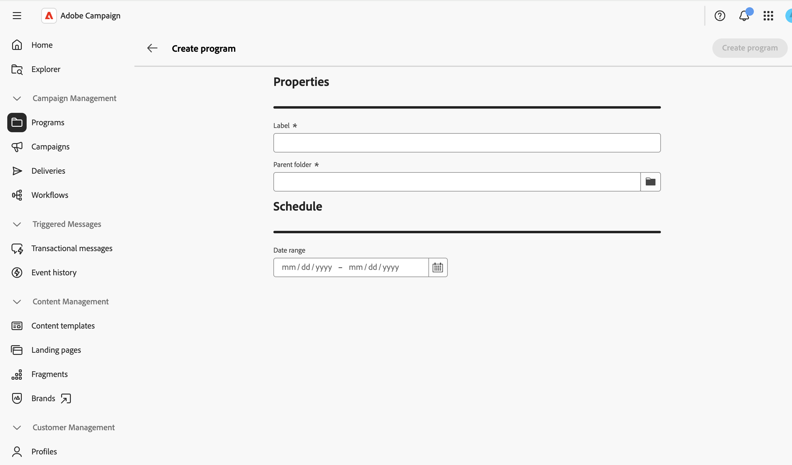{zoomable="yes"}</ph></source>
<target xml:lang="en-XX"><ph id="1" ctype="x-IMAGE">{zoomable="yes"}</ph></target>
</trans-unit>
<trans-unit id="tu33" xml:space="preserve">
<source xml:lang="en-US">Enter a <ph id="1" ctype="x-STRONG_EMPHASIS">**[!UICONTROL </ph>Label<ph id="3" ctype="x-LINK_REF">]**</ph>.</source>
<target xml:lang="en-XX">Saisissez un <ph id="1" ctype="x-STRONG_EMPHASIS">**[!UICONTROL </ph>Libellé<ph id="3" ctype="x-LINK_REF">]**</ph>.</target>
</trans-unit>
<trans-unit id="tu34" xml:space="preserve">
<source xml:lang="en-US">Select the existing program to use as the <ph id="1" ctype="x-STRONG_EMPHASIS">**[!UICONTROL </ph>Parent folder<ph id="3" ctype="x-LINK_REF">]**</ph>.</source>
<target xml:lang="en-XX">Sélectionnez le programme existant à utiliser comme <ph id="1" ctype="x-STRONG_EMPHASIS">**[!UICONTROL </ph>dossier parent<ph id="3" ctype="x-LINK_REF">]**</ph>.</target>
</trans-unit>
<trans-unit id="tu35" xml:space="preserve">
<source xml:lang="en-US">Optionally, set a <ph id="1" ctype="x-STRONG_EMPHASIS">**[!UICONTROL </ph>Date range<ph id="3" ctype="x-LINK_REF">]**</ph> in the <ph id="5" ctype="x-STRONG_EMPHASIS">**[!UICONTROL </ph>Schedule<ph id="7" ctype="x-LINK_REF">]**</ph> section.</source>
<target xml:lang="en-XX">Vous pouvez éventuellement définir une <ph id="1" ctype="x-STRONG_EMPHASIS">**[!UICONTROL </ph>Période<ph id="3" ctype="x-LINK_REF">]**</ph> dans la section <ph id="5" ctype="x-STRONG_EMPHASIS">**[!UICONTROL </ph>Planning<ph id="7" ctype="x-LINK_REF">]**</ph>.</target>
</trans-unit>
<trans-unit id="tu36" xml:space="preserve">
<source xml:lang="en-US"><ph id="1" ctype="x-regxph" equiv-text="&lbrack;!TIP">[!TIP]</ph></source>
<target xml:lang="en-XX"><ph id="1" ctype="x-regxph" equiv-text="&lbrack;!TIP">[!TIP]</ph></target>
</trans-unit>
<trans-unit id="tu37" xml:space="preserve">
<source xml:lang="en-US">If you create a program from the Explorer view, the parent folder is automatically set to the current program.</source>
<target xml:lang="en-XX">Si vous créez un programme à partir de la vue de l’explorateur, le dossier parent est automatiquement défini sur le programme actuel.</target>
</trans-unit>
<trans-unit id="tu38" xml:space="preserve">
<source xml:lang="en-US">Click <ph id="1" ctype="x-STRONG_EMPHASIS">**[!UICONTROL </ph>Create program<ph id="3" ctype="x-LINK_REF">]**</ph> again to save changes and create the program. The program is then displayed in the Explorer view. You can rename it, delete it, and access its settings, like any other folder. You can also create sub-programs within this program.</source>
<target xml:lang="en-XX">Cliquez à nouveau sur <ph id="1" ctype="x-STRONG_EMPHASIS">**[!UICONTROL </ph>Créer un programme<ph id="3" ctype="x-LINK_REF">]**</ph> pour enregistrer les modifications et créer le programme. Le programme s’affiche alors dans la vue de l’explorateur. Vous pouvez le renommer, le supprimer et accéder à ses paramètres, comme pour tout autre dossier. Vous pouvez également créer des sous-programmes dans ce programme.</target>
</trans-unit>
<trans-unit id="tu39" xml:space="preserve">
<source xml:lang="en-US"><ph id="1" ctype="x-IMAGE">{zoomable="yes"}</ph></source>
<target xml:lang="en-XX"><ph id="1" ctype="x-IMAGE">{zoomable="yes"}</ph></target>
</trans-unit>
<trans-unit id="tu40" xml:space="preserve">
<source xml:lang="en-US">Custom options for a program are configured the same way as for a plan. See <ph id="1" ctype="x-LINK">[</ph>Create and configure a plan<ph id="2" ctype="x-LINK">](#create-plan)</ph>.</source>
<target xml:lang="en-XX">Les options personnalisées d’un programme sont configurées de la même manière que pour un plan. Voir <ph id="1" ctype="x-LINK">[</ph>Créer et configurer un plan<ph id="2" ctype="x-LINK">](#create-plan)</ph>.</target>
</trans-unit>
<trans-unit id="tu41" xml:space="preserve">
<source xml:lang="en-US">How to link a campaign to a program</source>
<target xml:lang="en-XX">Comment lier une campagne à un programme</target>
</trans-unit>
<trans-unit id="tu42" xml:space="preserve">
<source xml:lang="en-US">You have two ways to link a campaign to a program:</source>
<target xml:lang="en-XX">Vous pouvez lier une campagne à un programme de deux manières différentes :</target>
</trans-unit>
<trans-unit id="tu43" xml:space="preserve">
<source xml:lang="en-US">Way #1: You already have a program and want to create a campaign linked to it</source>
<target xml:lang="en-XX">Méthode 1 : vous disposez déjà d’un programme et souhaitez créer une campagne qui lui est liée.</target>
</trans-unit>
<trans-unit id="tu44" xml:space="preserve">
<source xml:lang="en-US">To link a new campaign to your program, create the campaign directly within the program.</source>
<target xml:lang="en-XX">Pour lier une nouvelle campagne à votre programme, créez directement la campagne dans le programme.</target>
</trans-unit>
<trans-unit id="tu45" xml:space="preserve">
<source xml:lang="en-US"><ph id="1" ctype="x-IMAGE">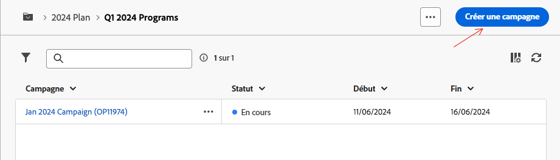{zoomable="yes"}</ph></source>
<target xml:lang="en-XX"><ph id="1" ctype="x-IMAGE">{zoomable="yes"}</ph></target>
</trans-unit>
<trans-unit id="tu46" xml:space="preserve">
<source xml:lang="en-US">The <ph id="1" ctype="x-STRONG_EMPHASIS">**[!UICONTROL </ph>Folder<ph id="3" ctype="x-LINK_REF">]**</ph> settings will automatically populate with the path to your program.</source>
<target xml:lang="en-XX">Les paramètres <ph id="1" ctype="x-STRONG_EMPHASIS">**[!UICONTROL </ph>Dossier<ph id="3" ctype="x-LINK_REF">]**</ph> seront automatiquement renseignés avec le chemin d’accès à votre programme.</target>
</trans-unit>
<trans-unit id="tu47" xml:space="preserve">
<source xml:lang="en-US"><ph id="1" ctype="x-IMAGE">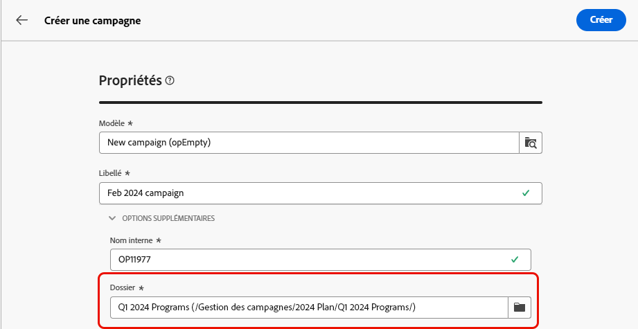{zoomable="yes"}</ph></source>
<target xml:lang="en-XX"><ph id="1" ctype="x-IMAGE">{zoomable="yes"}</ph></target>
</trans-unit>
<trans-unit id="tu48" xml:space="preserve">
<source xml:lang="en-US">Way #2: You already have an existing campaign and want to link it to an existing program</source>
<target xml:lang="en-XX">Méthode 2 : vous avez déjà une campagne existante et souhaitez la lier à un programme existant.</target>
</trans-unit>
<trans-unit id="tu49" xml:space="preserve">
<source xml:lang="en-US">Go to the <ph id="1" ctype="x-STRONG_EMPHASIS">**[!UICONTROL </ph>Settings<ph id="3" ctype="x-LINK_REF">]**</ph> button of the campaign you want to link to your program.</source>
<target xml:lang="en-XX">Cliquez sur le bouton <ph id="1" ctype="x-STRONG_EMPHASIS">**[!UICONTROL </ph>Paramètres<ph id="3" ctype="x-LINK_REF">]**</ph> de la campagne que vous souhaitez lier à votre programme.</target>
</trans-unit>
<trans-unit id="tu50" xml:space="preserve">
<source xml:lang="en-US"><ph id="1" ctype="x-IMAGE">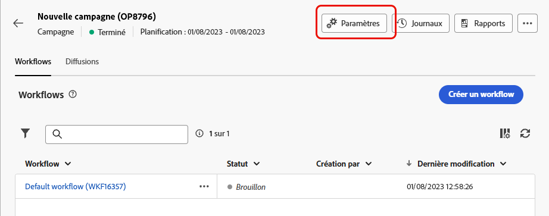{zoomable="yes"}</ph></source>
<target xml:lang="en-XX"><ph id="1" ctype="x-IMAGE">{zoomable="yes"}</ph></target>
</trans-unit>
<trans-unit id="tu51" xml:space="preserve">
<source xml:lang="en-US">In its <ph id="1" ctype="x-STRONG_EMPHASIS">**[!UICONTROL </ph>Properties<ph id="3" ctype="x-LINK_REF">]**</ph>, click the <ph id="5" ctype="x-STRONG_EMPHASIS">**[!UICONTROL </ph>Folder<ph id="7" ctype="x-LINK_REF">]**</ph> icon in the <ph id="9" ctype="x-STRONG_EMPHASIS">**[!UICONTROL </ph>Folder<ph id="11" ctype="x-LINK_REF">]**</ph> settings to choose your <ph id="13" ctype="x-STRONG_EMPHASIS">**[!UICONTROL </ph>Program<ph id="15" ctype="x-LINK_REF">]**</ph> folder.</source>
<target xml:lang="en-XX">Dans ses <ph id="1" ctype="x-STRONG_EMPHASIS">**[!UICONTROL </ph>Propriétés<ph id="3" ctype="x-LINK_REF">]**</ph>, cliquez sur l’icône <ph id="5" ctype="x-STRONG_EMPHASIS">**[!UICONTROL </ph>Dossier<ph id="7" ctype="x-LINK_REF">]**</ph> dans les paramètres <ph id="9" ctype="x-STRONG_EMPHASIS">**[!UICONTROL </ph>Dossier<ph id="11" ctype="x-LINK_REF">]**</ph> pour choisir votre dossier <ph id="13" ctype="x-STRONG_EMPHASIS">**[!UICONTROL </ph>Programme<ph id="15" ctype="x-LINK_REF">]**</ph>.</target>
</trans-unit>
<trans-unit id="tu52" xml:space="preserve">
<source xml:lang="en-US"><ph id="1" ctype="x-IMAGE">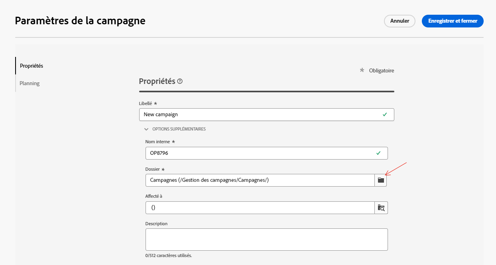{zoomable="yes"}</ph></source>
<target xml:lang="en-XX"><ph id="1" ctype="x-IMAGE">{zoomable="yes"}</ph></target>
</trans-unit>
<trans-unit id="tu53" xml:space="preserve">
<source xml:lang="en-US">Select your <ph id="1" ctype="x-STRONG_EMPHASIS">**[!UICONTROL </ph>Program<ph id="3" ctype="x-LINK_REF">]**</ph> folder, click the <ph id="5" ctype="x-STRONG_EMPHASIS">**[!UICONTROL </ph>Confirm<ph id="7" ctype="x-LINK_REF">]**</ph> button, and then click the <ph id="9" ctype="x-STRONG_EMPHASIS">**[!UICONTROL </ph>Save and Close<ph id="11" ctype="x-LINK_REF">]**</ph> button.</source>
<target xml:lang="en-XX">Sélectionnez votre dossier <ph id="1" ctype="x-STRONG_EMPHASIS">**[!UICONTROL </ph>Programme<ph id="3" ctype="x-LINK_REF">]**</ph> et cliquez sur le bouton <ph id="5" ctype="x-STRONG_EMPHASIS">**[!UICONTROL </ph>Confirmer<ph id="7" ctype="x-LINK_REF">]**</ph>, puis sur le bouton <ph id="9" ctype="x-STRONG_EMPHASIS">**[!UICONTROL </ph>Enregistrer et fermer<ph id="11" ctype="x-LINK_REF">]**</ph>.</target>
</trans-unit>
<trans-unit id="tu54" xml:space="preserve">
<source xml:lang="en-US"><ph id="1" ctype="x-IMAGE">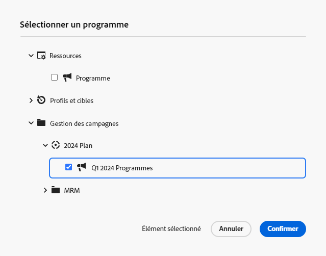{zoomable="yes"}</ph></source>
<target xml:lang="en-XX"><ph id="1" ctype="x-IMAGE">{zoomable="yes"}</ph></target>
</trans-unit>
<trans-unit id="tu55" xml:space="preserve">
<source xml:lang="en-US">Your campaign is now listed in your program.</source>
<target xml:lang="en-XX">Votre campagne est maintenant répertoriée dans votre programme :</target>
</trans-unit>
<trans-unit id="tu56" xml:space="preserve">
<source xml:lang="en-US"><ph id="1" ctype="x-IMAGE">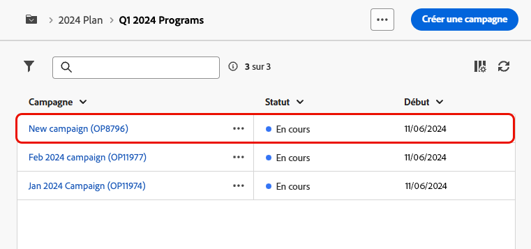{zoomable="yes"}</ph></source>
<target xml:lang="en-XX"><ph id="1" ctype="x-IMAGE">{zoomable="yes"}</ph></target>
</trans-unit>
</body>
</file>
</xliff>