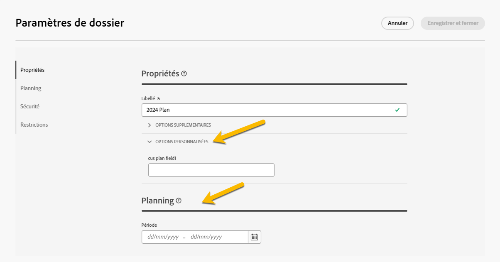
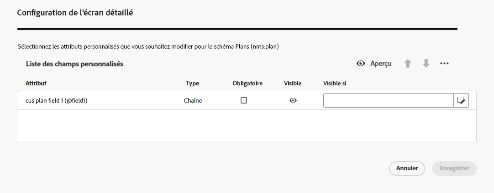
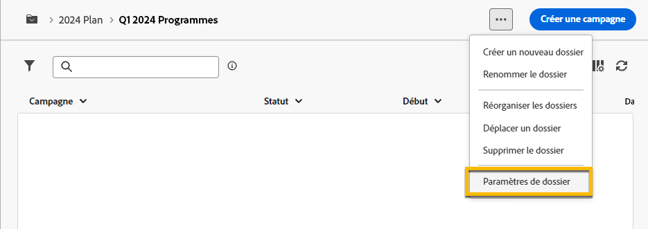
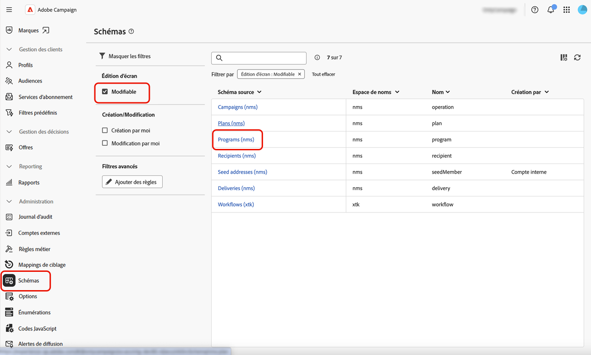
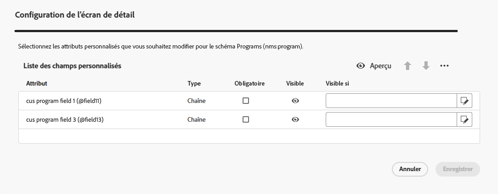

# Plans et programmes {#plan-and-programs}

>[!CONTEXTUALHELP]
>id="acw_homepage_welcome_rn2"
>title="Plans et programmes"
>abstract="Vous pouvez maintenant paramétrer la hiérarchie des dossiers des plans marketing et des programmes dans l’interface d’utilisation de Campaign Web."
>additional-url="https://experienceleague.adobe.com/docs/campaign-web/v8/release-notes/release-notes.html?lang=fr" text="Voir les notes de mise à jour"

Adobe Campaign permet de configurer la hiérarchie des dossiers des plans marketing et des programmes.

Pour mieux les organiser, Adobe recommande la hiérarchie suivante : Plan `>` Programmes `>` Campagnes.

* Un **plan** peut contenir plusieurs programmes. Il définit des objectifs stratégiques pour une période de temps.
* Un **programme** peut contenir d’autres programmes, des campagnes, des workflows et des pages de destination.
* Une **campagne** peut contenir des diffusions, des workflows et des pages de destination.

## Créer et configurer un plan {#create-plan}

Pour créer un plan, vous devez créer un dossier avec le type de dossier **[!UICONTROL Plan]**. [En savoir plus sur la création d’un dossier](create-manage-folder.md).

{zoomable="yes"}

Accédez aux **[!UICONTROL Paramètres de dossier]** de votre plan pour le gérer.

{zoomable="yes"}

Vous pouvez définir des **[!UICONTROL Options personnalisées]** et définir la date de planification de votre plan.

{zoomable="yes"}

Pour gérer les **[!UICONTROL Options personnalisées]**, procédez comme suit :

1. Accédez aux **[!UICONTROL Schémas]**.
1. Choisissez les schémas **[!UICONTROL Modifiables]** dans les filtres.
1. Cliquez sur l’icône **[!UICONTROL Modifier les détails personnalisés]**.

{zoomable="yes"}

Vous pouvez les configurer comme suit :

{zoomable="yes"}

## Créer et configurer un programme

Pour créer un programme dans votre plan ([En savoir plus sur la création d’un plan.](#create-plan)), vous devez être dans votre plan et créer un dossier avec le type de dossier **[!UICONTROL Programme]**.[En savoir plus sur la création d’un dossier](create-manage-folder.md).

{zoomable="yes"}

Accédez aux **[!UICONTROL Paramètres de dossier]** de votre programme pour le gérer.

{zoomable="yes"}

Vous pouvez définir des **[!UICONTROL Options personnalisées]** et définir la date de planification de votre programme.

{zoomable="yes"}

Pour gérer les **[!UICONTROL Options personnalisées]**, procédez comme suit :

1. Accédez aux **[!UICONTROL Schémas]**.
1. Choisissez les schémas **[!UICONTROL Modifiables]** dans les filtres.
1. Cliquez sur l’icône **[!UICONTROL Modifier les détails personnalisés]**.

{zoomable="yes"}

Vous pouvez les configurer comme suit :

{zoomable="yes"}

## Comment lier une campagne à un programme

Vous pouvez lier une campagne à un programme de deux manières différentes :

### Méthode 1 : vous disposez déjà d’un programme et souhaitez créer une campagne qui lui est liée.

Pour lier une nouvelle campagne à votre programme, créez directement votre campagne dans le programme :

{zoomable="yes"}

Les paramètres **[!UICONTROL Dossier]** seront automatiquement renseignés avec le chemin d’accès à votre programme.

{zoomable="yes"}

### Méthode 2 : vous avez déjà une campagne existante et souhaitez la lier à un programme existant.

Cliquez sur le bouton **[!UICONTROL Paramètres]** de la campagne que vous souhaitez lier à votre programme :

{zoomable="yes"}

Dans ses **[!UICONTROL Propriétés]**, cliquez sur l’icône **[!UICONTROL Dossier]** dans les paramètres **[!UICONTROL Dossier]** pour choisir votre dossier **[!UICONTROL Programme]**.

{zoomable="yes"}

Sélectionnez votre dossier **[!UICONTROL Programme]** et cliquez sur le bouton **[!UICONTROL Confirmer]**, puis sur le bouton **[!UICONTROL Enregistrer et fermer]**.

{zoomable="yes"}

Votre campagne est maintenant répertoriée dans votre programme :

{zoomable="yes"}
