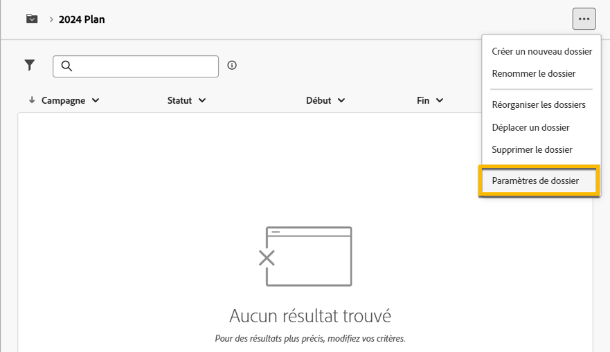
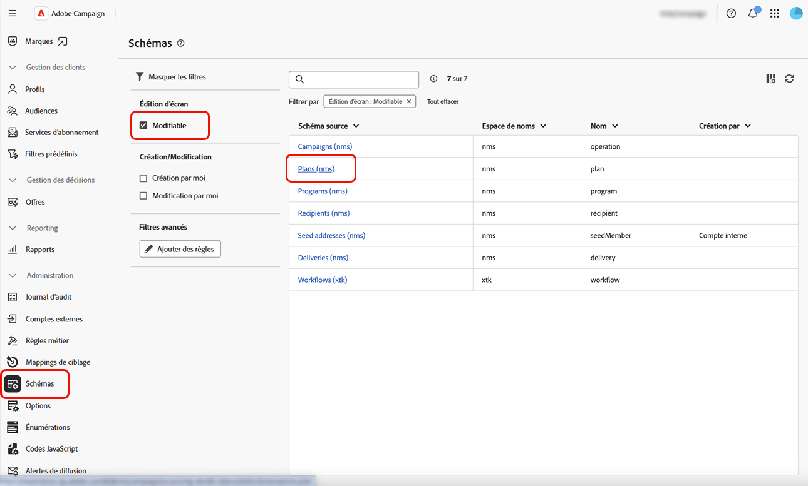
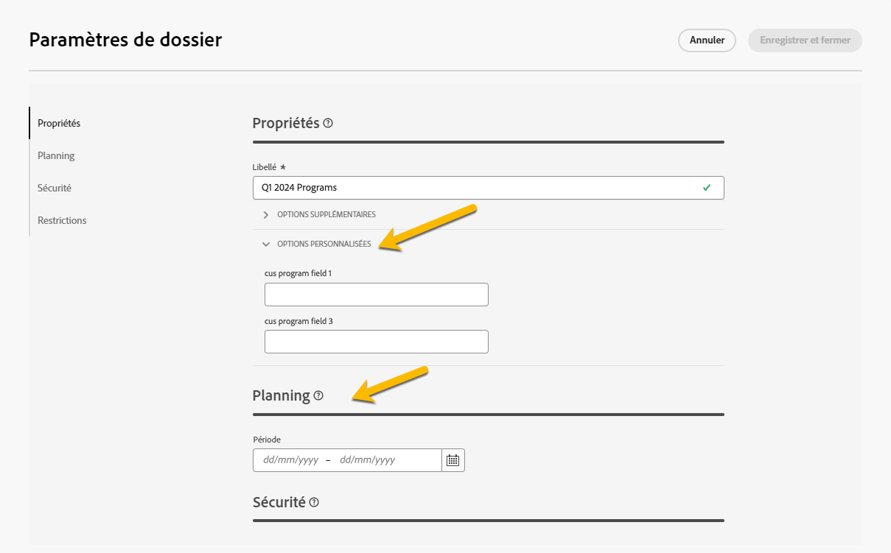
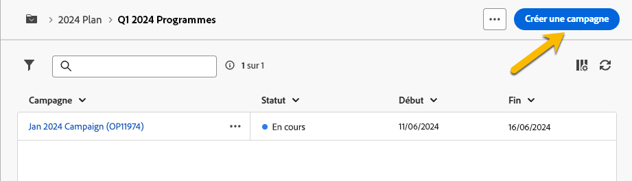

# Plans et programmes

Adobe Campaign vous permet de configurer la hiérarchie des dossiers des plans marketing et des programmes.

Pour mieux les organiser, Adobe recommande la hiérarchie suivante : Planifier `>` Programmes `>` Campagnes

* A **plan** peut contenir plusieurs programmes. Il définit des objectifs stratégiques pour une période donnée.
* A **program** peut contenir d’autres programmes ainsi que des campagnes, des workflows et des landing pages.
* A **campaign** peut contenir des diffusions, des workflows et des landing pages.

## Créer et configurer un plan {#create-plan}

Pour créer un plan, vous devez créer un dossier avec le type de dossier **[!UICONTROL Planifier]** [En savoir plus sur la création d’un dossier](create-manage-folder.md).

{zoomable="yes"}

Accédez au **[!UICONTROL Paramètres du dossier]** de votre plan de gestion.

{zoomable="yes"}

Vous pouvez définir **[!UICONTROL Options personnalisées]** et pour définir la date de planification de votre plan.

{zoomable="yes"}

Pour gérer la variable  **[!UICONTROL Options personnalisées]**:

1. Accédez au **[!UICONTROL Schémas]**
1. Choisissez la **[!UICONTROL Modifiable]** schémas dans les filtres
1. Cliquez sur l’icône de **[!UICONTROL Modification des détails personnalisés]**

{zoomable="yes"}

Vous pouvez les configurer :

{zoomable="yes"}

## Créer et configurer un programme

Pour créer un programme dans votre plan ([En savoir plus sur la création d’un plan](#create-plan)), vous devez être dans votre plan et créer un dossier avec le type de dossier **[!UICONTROL Programme]** [En savoir plus sur la création d’un dossier](create-manage-folder.md).

{zoomable="yes"}

Accédez au **[!UICONTROL Paramètres du dossier]** de votre programme pour le gérer.

{zoomable="yes"}

Vous pouvez définir **[!UICONTROL Options personnalisées]** et pour définir la date de planification de votre programme.

{zoomable="yes"}

Pour gérer la variable  **[!UICONTROL Options personnalisées]**:

1. Accédez au **[!UICONTROL Schémas]**
1. Choisissez la **[!UICONTROL Modifiable]** schémas dans les filtres
1. Cliquez sur l’icône de **[!UICONTROL Modification des détails personnalisés]**

{zoomable="yes"}

Vous pouvez les configurer :

{zoomable="yes"}

## Comment lier une campagne à un programme

Vous pouvez lier une campagne à un programme de deux manières différentes :

### Voie #1 : vous disposez déjà d’un programme et souhaitez créer une campagne qui lui est associée.

Pour associer une nouvelle campagne à votre programme, créez directement votre campagne dans le programme :

{zoomable="yes"}

La variable **[!UICONTROL Dossier]** Les paramètres seront automatiquement renseignés avec le chemin d’accès à votre programme.

{zoomable="yes"}

### Voie #2 : vous avez déjà une campagne existante et souhaitez la lier à un programme existant

Accédez au **[!UICONTROL Paramètres]** de l&#39;opération que vous souhaitez lier à votre programme :

{zoomable="yes"}

Dans son **[!UICONTROL Propriétés]**, cliquez sur le **[!UICONTROL Dossier]** dans le **[!UICONTROL Dossier]** pour choisir vos **[!UICONTROL Programme]** dossier.

{zoomable="yes"}

Sélectionnez votre **[!UICONTROL Programme]** et cliquez sur **[!UICONTROL Confirmer]** puis, **[!UICONTROL Enregistrer et fermer]** bouton .

{zoomable="yes"}

Votre campagne est maintenant répertoriée dans votre programme :

{zoomable="yes"}