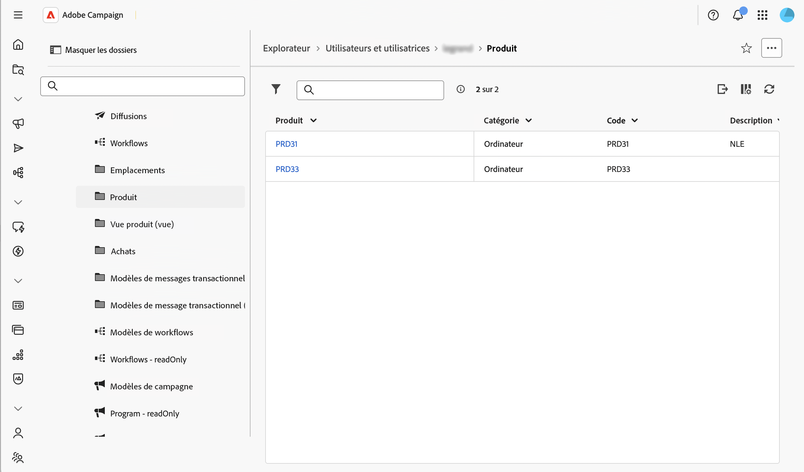
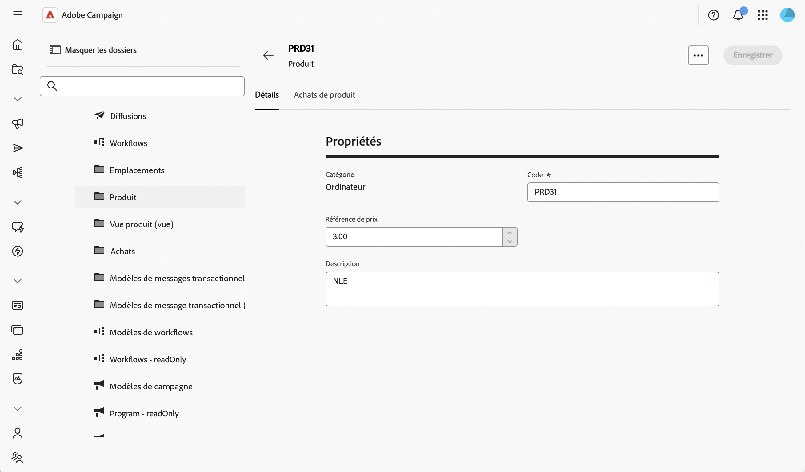

# Actions de contrôle sur les données {#action-data}

>[!CONTEXTUALHELP]
>id="acw_schema_action_data"
>title="Données des actions"
>abstract="Configurer les actions disponibles pour les écrans de détails et de listes du schéma. Activez **[!UICONTROL Lecture seule]** pour définir l’écran de détails en lecture seule et supprimer les actions de la liste. Activez **[!UICONTROL Ne pas autoriser la suppression]** pour supprimer l’action de suppression des écrans de détails et de liste."

La section **[!UICONTROL Données d’action]** vous permet de restreindre les actions disponibles sur les enregistrements d’un schéma personnalisé, quelles que soient les [règles de sécurité](../get-started/work-with-folders.md) configurées sur des dossiers individuels. Cette restriction s’applique au niveau du schéma, dans chaque dossier, pour chaque utilisateur et utilisatrice, y compris les administrateurs et administratrices.

>[!NOTE]
>
>Cette section n’est disponible que pour les schémas personnalisés.

Pour plus d’informations sur l’écran de définition d’écran et la façon d’y accéder, consultez la section [Accéder à la définition d’écran](schemas-browse-access.md#screen-def).

Pour configurer les données d’action, procédez comme suit :

1. Accédez au menu **[!UICONTROL Schémas]** et recherchez les schémas modifiables à l’aide des filtres.

1. Sélectionnez le nom du schéma dans la liste pour l’ouvrir et cliquez sur le bouton **[!UICONTROL Modification d’écran]** dans la vue des détails du schéma pour accéder à la définition d’écran.

1. Faites défiler jusqu’à la section **[!UICONTROL Données d’action]**, en bas de la définition d’écran.

   

1. Sélectionnez une ou deux options disponibles :

   * **[!UICONTROL Lecture seule]** : l’écran des détails devient en lecture seule pour tous les utilisateurs. Aucune action de création, de duplication, de mise à jour ou de suppression n’est disponible dans la liste, et les actions de suppression et de duplication sont masquées dans l’écran de détails. La sélection de cette option est similaire au paramétrage d&#39;une vue : les utilisateurs peuvent toujours ouvrir des enregistrements et les réutiliser, par exemple lors du ciblage d&#39;une diffusion, mais ne peuvent pas les modifier.

   * **[!UICONTROL Ne pas autoriser la suppression]** : l’action de suppression est supprimée de l’écran des détails et de la liste, dans chaque dossier. D’autres actions, telles que créer, dupliquer et mettre à jour, restent disponibles.

     >[!NOTE]
     >
     >L’activation de la **[!UICONTROL Lecture seule]** couvre automatiquement la suppression. De ce fait, l’option **[!UICONTROL Ne pas autoriser la suppression]** est désactivée lorsque l’option **[!UICONTROL Lecture seule]** est sélectionnée.

1. Cliquez sur **[!UICONTROL Enregistrer]**.

1. Accédez à la liste des enregistrements de ce schéma pour vérifier le résultat.

   Dans cet exemple, la fonction **[!UICONTROL Lecture seule]** est activée : la liste n&#39;affiche plus les actions de duplication et de suppression.

   

1. Ouvrez un enregistrement pour vérifier l’écran des détails. Ses champs s’affichent sans permettre d’édition.

   
