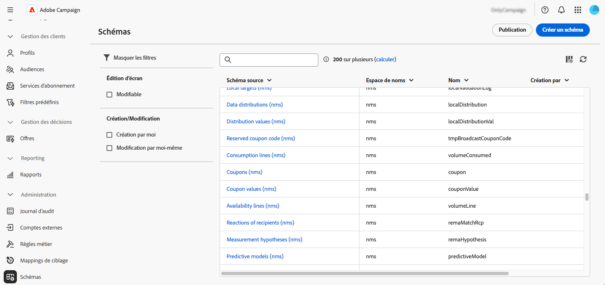
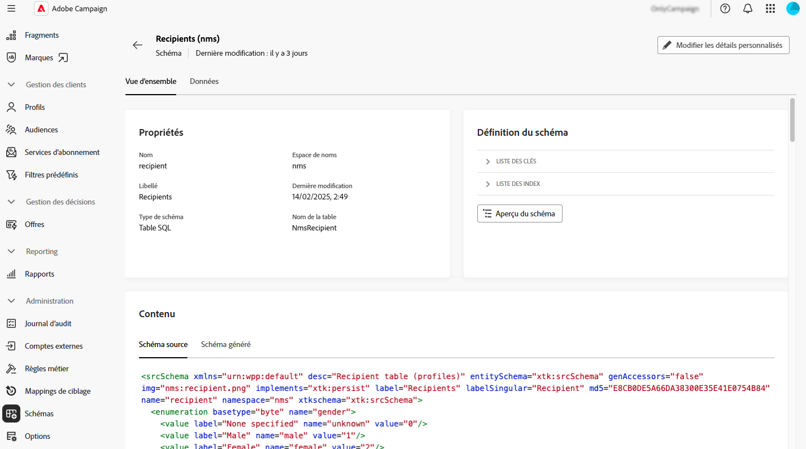
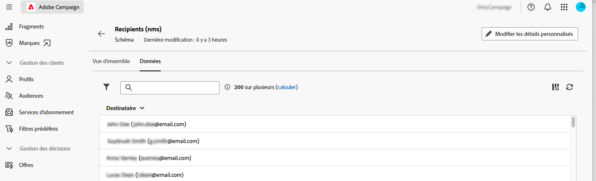
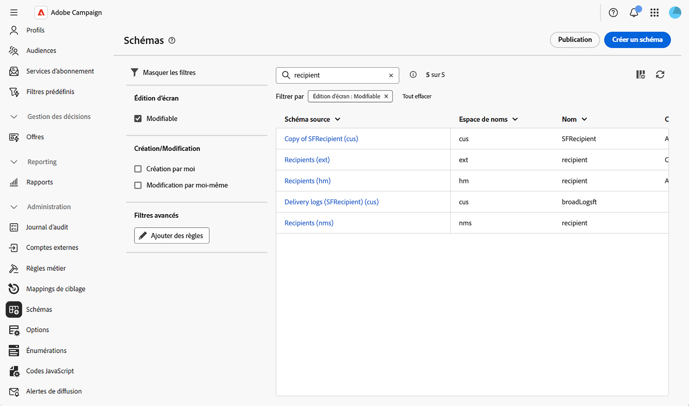
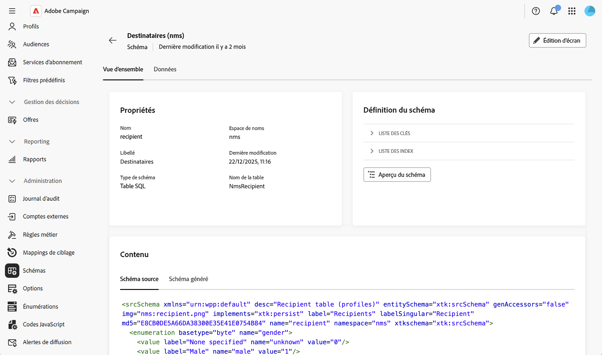
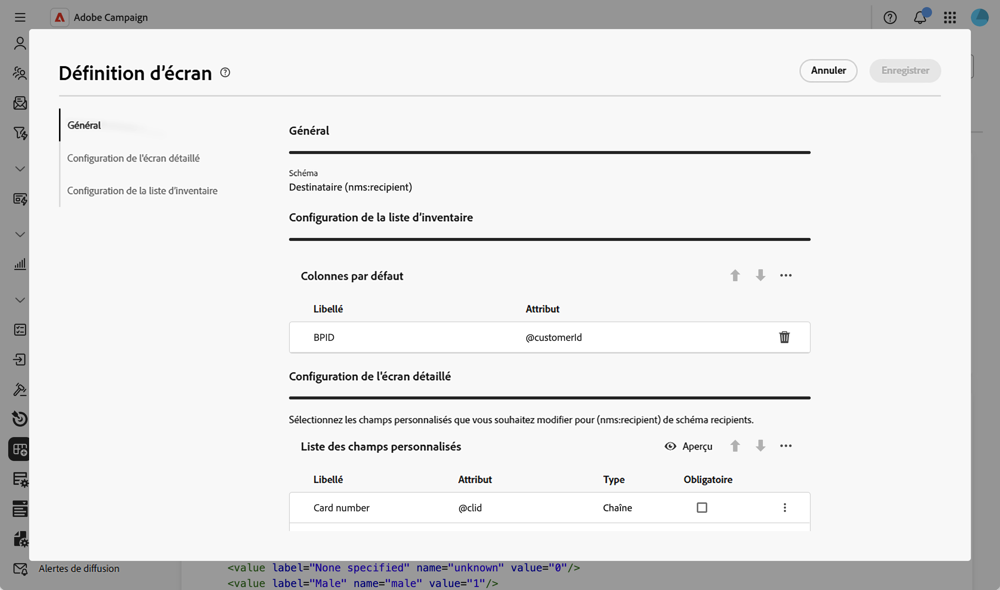

# Accès et configuration des schémas {#access}

Les schémas sont accessibles à partir du menu **[!UICONTROL Administration]** > **[!UICONTROL Schémas]**.

Depuis cet écran, vous pouvez afficher tous les schémas existants. Des filtres sont disponibles pour aider à affiner la liste, par exemple pour afficher uniquement les schémas modifiables.

Pour ouvrir un schéma, sélectionnez son nom. Une vue de schéma détaillée s’affiche.

## Vue d’ensemble du schéma {#overview}

L’onglet **[!UICONTROL Vue d’ensemble]** offre une vue générale du schéma :

* La section **[!UICONTROL Propriétés]** affiche des informations clés, telles que le nom du schéma, l’espace de noms et le nom de la table associée.

* La section **[!UICONTROL Définition du schéma]** affiche des détails sur la définition du schéma, comme la clé primaire utilisée pour la réconciliation des données et ses liens avec d’autres tables.

  Cliquez sur le bouton **[!UICONTROL Aperçu du schéma]** pour visualiser les différents champs et liens composant le schéma. Vous pouvez ainsi vérifier la structure complète d’un schéma. Si le schéma a été étendu avec des champs personnalisés, vous pouvez visualiser toutes ses extensions.

* La section **[!UICONTROL Contenu]** affiche le contenu XML du schéma, ce qui vous permet de basculer entre la source et la syntaxe générée.

## Données de schéma {#data}

L’onglet **[!UICONTROL Données]** fournit des informations sur les données du schéma.

## Personnaliser l’affichage de l’écran {#screen-def}

La définition d’écran vous permet de configurer l’affichage et la modification des champs de schéma dans l’interface. Vous pouvez configurer les colonnes par défaut pour les vues de liste, personnaliser les champs personnalisés qui s’affichent dans les écrans de détail, ajouter des listes de collection pour afficher les données associées et organiser les champs en sections avec des séparateurs et des critères de visibilité.

Pour accéder à la définition d’écran :

1. Accédez au menu **[!UICONTROL Schémas]** et recherchez les schémas modifiables à l’aide des filtres.

   

1. Sélectionnez le nom du schéma dans la liste pour l’ouvrir et cliquez sur le bouton **[!UICONTROL Modification de l’écran]** dans la vue des détails du schéma pour accéder à la définition d’écran.

   

   Les différentes listes vous permettent de réorganiser les éléments à l’aide des icônes fléchées vers le haut et vers le bas ou de les faire glisser et de les déposer. Pour supprimer des éléments, cliquez sur l’icône de la corbeille sur une ligne spécifique ou sélectionnez **[!UICONTROL Tout supprimer]** à partir de l’icône représentant des points de suspension.

   

À partir de la définition d’écran, vous pouvez :

* [Configurer les colonnes de la liste par défaut](schemas-list-columns.md) - Configurez les colonnes affichées par défaut dans les vues Liste.
* [Modifier les champs personnalisés](schemas-custom-fields.md) - Configurer les champs personnalisés qui s’affichent dans les écrans de détails et les organiser en sections.
* [Ajouter des listes de collection](schemas-collection-lists.md) - Ajoutez des listes de collection pour afficher les données associées dans les écrans de profil.
