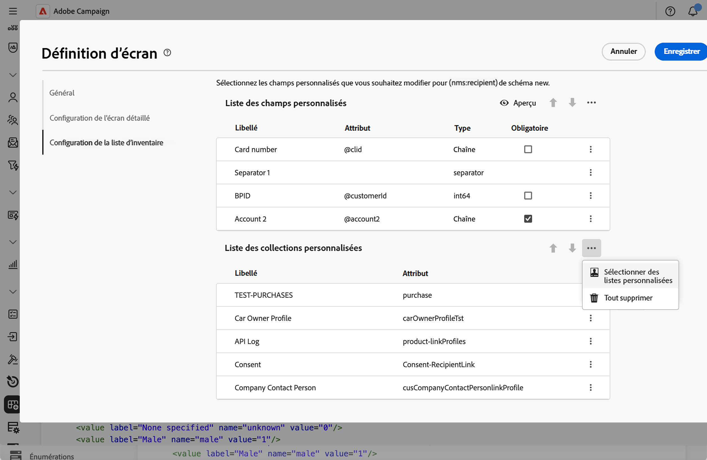
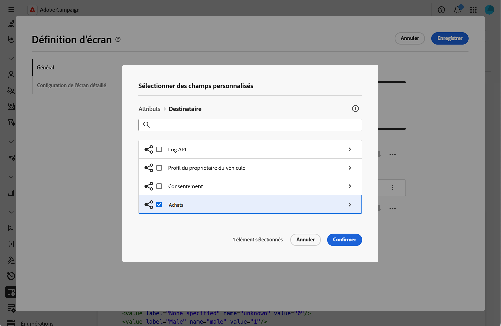
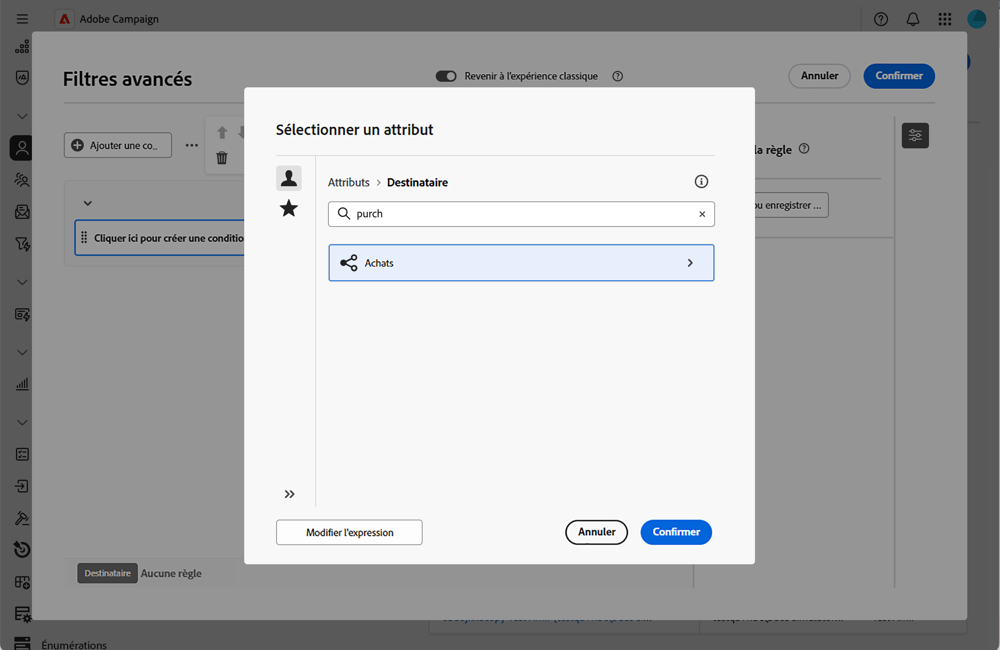
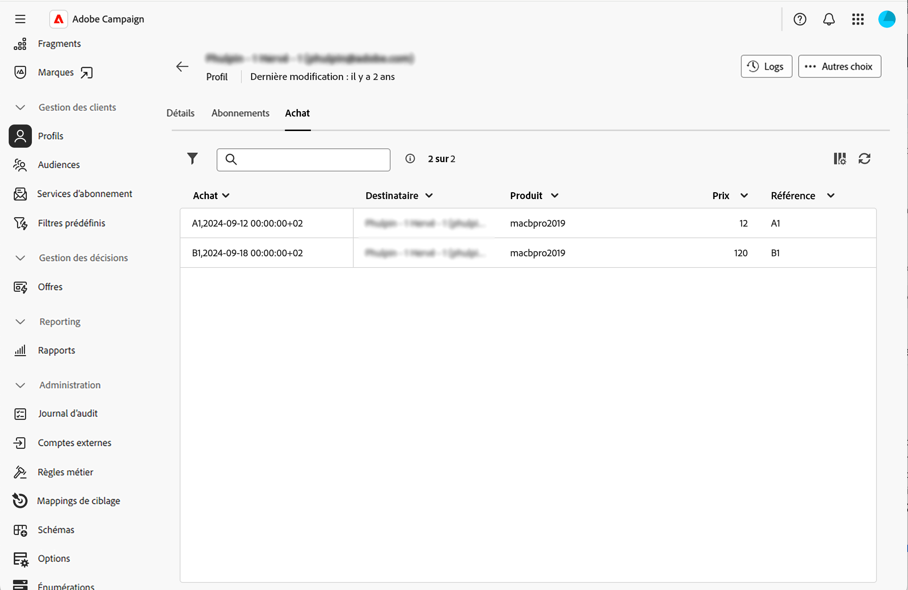

# Ajouter des listes de collection {#collection-lists}

La section **Liste de listes personnalisées** vous permet de définir des liens de collection, tels que des achats. Les données associées sont alors affichées sur les écrans des profils via un onglet dédié.

Pour plus d&#39;informations sur l&#39;écran de définition d&#39;écran et sur la façon d&#39;y accéder, consultez la section [Accéder à la définition d&#39;écran](schemas-browse-access.md#screen-def).

>[!NOTE]
>
>Actuellement, cette fonctionnalité n’est disponible que pour le schéma Destinataires.

Pour ajouter des listes de collections :

1. Accédez au menu **[!UICONTROL Schémas]** et recherchez les schémas modifiables à l’aide des filtres.

1. Sélectionnez le nom du schéma dans la liste pour l’ouvrir et cliquez sur le bouton **[!UICONTROL Modification de l’écran]** dans la vue des détails du schéma pour accéder à la définition d’écran.

1. Cliquez sur l’icône représentant des points de suspension et choisissez **[!UICONTROL Sélectionner des listes personnalisées]**.

   

1. Sélectionnez l’une des listes personnalisées disponibles, par exemple les achats, puis cliquez sur **[!UICONTROL Confirmer]**.

   

1. Accédez au menu **Profils** et filtrez les profils qui ont effectué des achats.

   

1. Cliquez sur un profil. Vous remarquerez que le nouvel onglet s’affiche. Vous pouvez ajouter d’autres colonnes si nécessaire.

   
