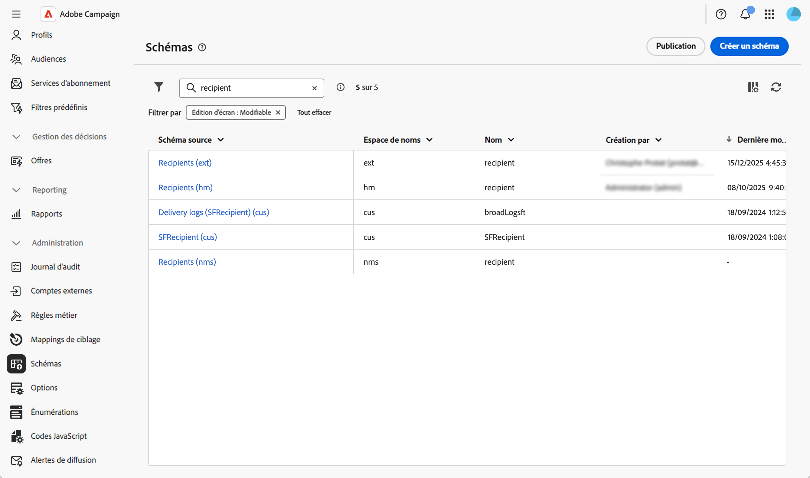
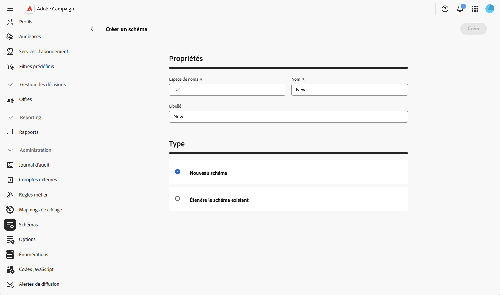
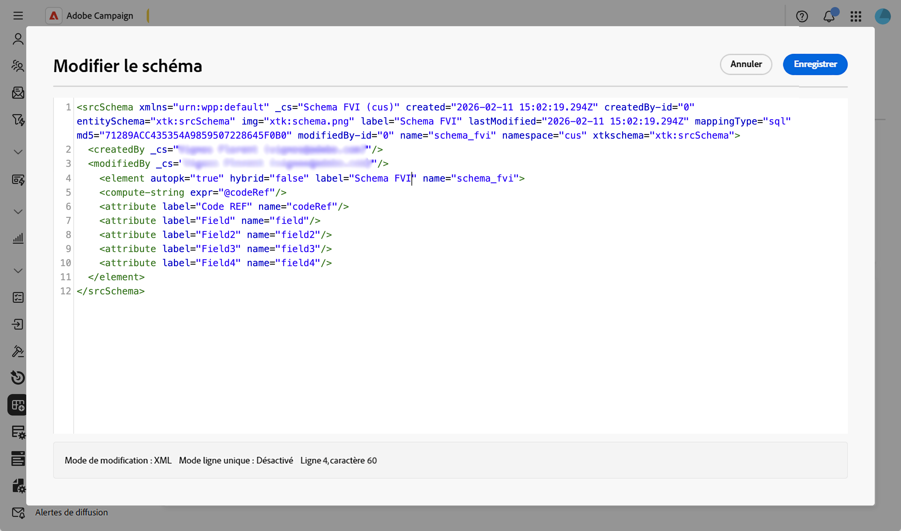
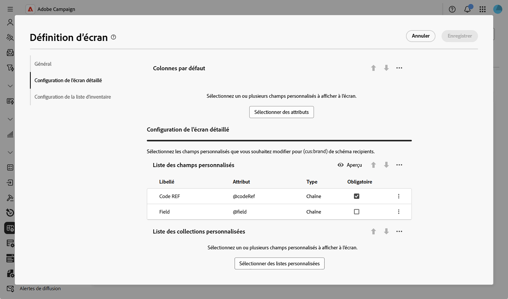
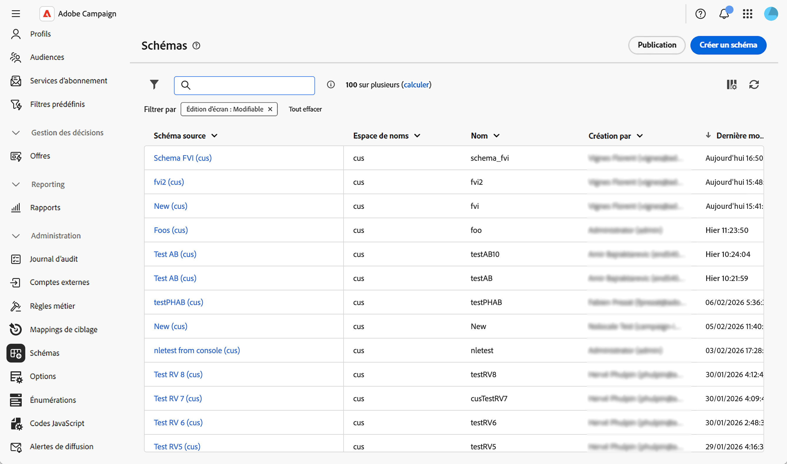
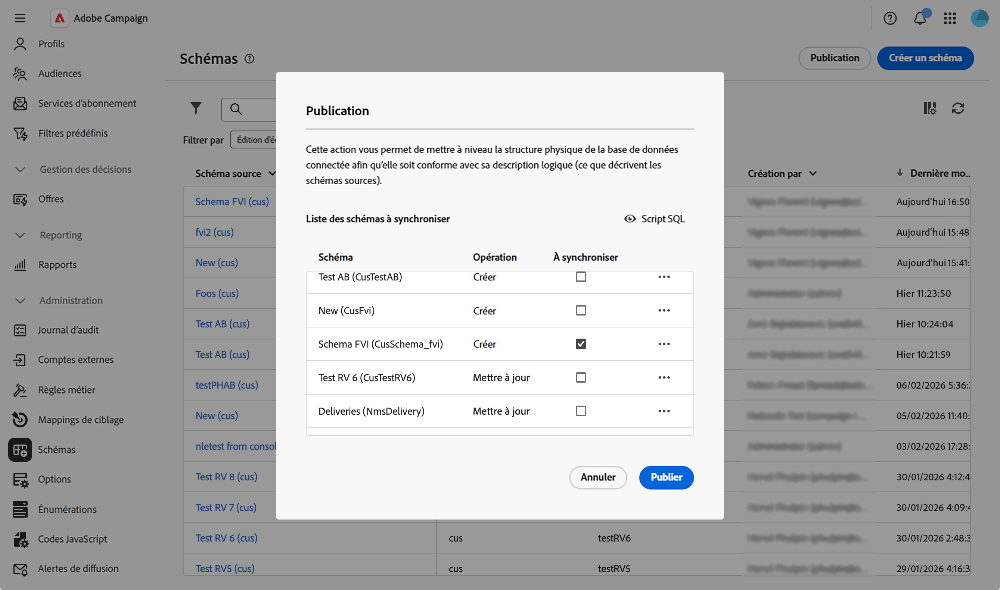
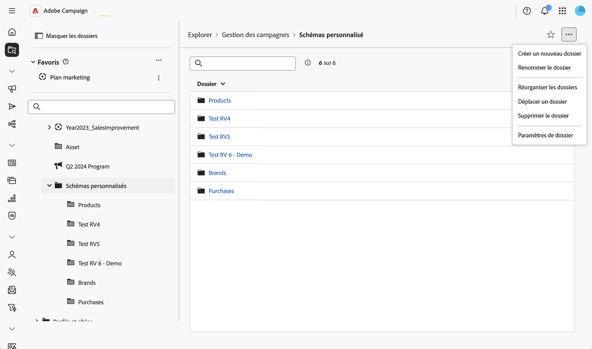
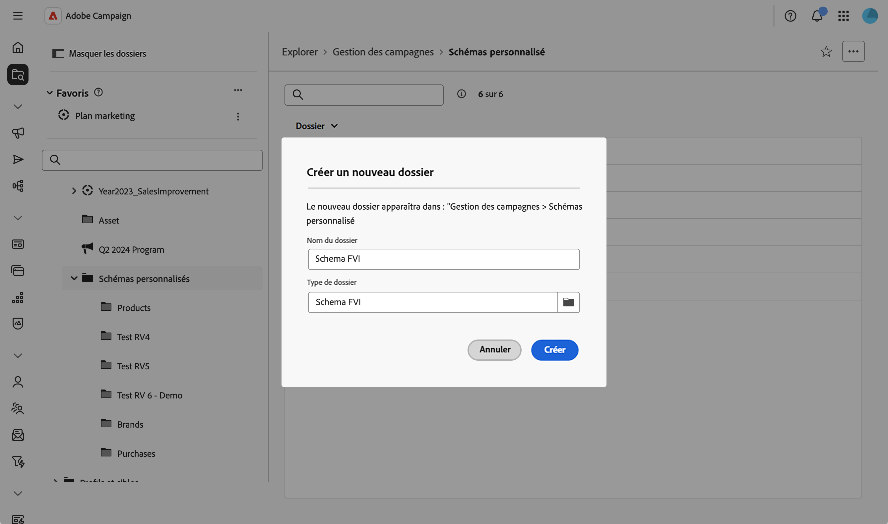

# Création et publication de schémas {#create-publish}

## Création et gestion de schémas {#create-schemas}

Vous pouvez créer des schémas, étendre les schémas existants et accéder à des bases de données externes.

### Création ou extension d’un schéma {#create-new}

Pour créer ou étendre un schéma :

1. Accédez à **[!UICONTROL Administration]** > **[!UICONTROL Schémas]**.
1. Cliquez sur **[!UICONTROL Créer un schéma]**.

   

1. Saisissez un espace de noms pour votre schéma (par exemple, `cus` pour les schémas personnalisés).
1. Saisissez un nom et un libellé uniques, puis choisissez si vous souhaitez créer un schéma ou étendre un schéma existant.

1. Cliquez sur **[!UICONTROL Créer]**.
   

Le schéma est créé et la structure de schéma générée s’affiche.

Par défaut, le schéma est vide. Vous devez maintenant ajouter les champs que vous souhaitez inclure dans votre schéma à l’aide de l’éditeur de schémas :

1. Cliquez sur l’icône en forme de crayon dans la section **[!UICONTROL Contenu]** de l’écran des détails du schéma.
2. Ajoutez les éléments nécessaires et enregistrez. Voici un exemple de structure de schéma personnalisée :

   

Le système valide automatiquement la structure XML et génère le schéma.

### Définition de l’édition de l’écran {#define-attributes}

Après avoir créé le schéma, vous devez définir l’édition de l’écran.

Pour plus d&#39;informations sur l&#39;écran de définition d&#39;écran et sur la façon d&#39;y accéder, consultez la section [Accéder à la définition d&#39;écran](schemas-browse-access.md#screen-def).

Dans notre exemple, nous ajoutons simplement deux champs personnalisés :

1. Cliquez sur le bouton **[!UICONTROL Modification d’écran]** dans la vue des détails du schéma pour accéder à la définition d’écran.

1. Cliquez sur l’icône représentant des points de suspension au-dessus du tableau **[!UICONTROL Liste de champs personnalisés]** et choisissez **[!UICONTROL Sélectionner des attributs]**.
1. Sélectionnez les champs personnalisés à ajouter et confirmez-les.

   

## Publication et synchronisation de schémas {#publish}

Après avoir créé ou modifié un schéma, vous devez le publier pour synchroniser le schéma logique avec la structure physique de la base de données.

### Publication des modifications du schéma {#publish-changes}

>[!CAUTION]
>
>La publication des modifications du schéma modifie la structure de la base de données. Assurez-vous de comprendre l’impact de ces modifications avant de confirmer la publication.

Pour publier vos modifications de schéma :

1. Accédez à **[!UICONTROL Administration]** > **[!UICONTROL Schémas]** pour accéder à la liste des schémas.
1. Cliquez sur **[!UICONTROL Publication]** et confirmez.

   

1. Sélectionnez dans la liste le schéma à synchroniser.

   

1. Vérifiez le script SQL qui sera exécuté pour mettre à jour la structure de la base de données.
1. Cliquez sur **[!UICONTROL Publier]** et confirmez pour poursuivre la publication.

>[!NOTE]
>
>Le processus peut prendre un certain temps en fonction de la taille de votre base de données et de la complexité des modifications.

### Créer une entrée de navigation {#navigation}

Après avoir publié un schéma personnalisé, vous pouvez créer une entrée de navigation dans l’Explorateur pour accéder à vos données personnalisées :

1. Accédez au menu **[!UICONTROL Explorateur]** et sélectionnez un dossier dans lequel vous souhaitez placer votre schéma personnalisé.
1. Cliquez sur l’icône représentant des points de suspension, puis sur **[!UICONTROL Créer un dossier]**.
   
1. Ajoutez un libellé et choisissez votre schéma dans le champ **[!UICONTROL Type de dossier]**.
   
1. Le schéma personnalisé est désormais accessible à partir de la vue **[!UICONTROL Explorateur]**.

À partir du nouveau dossier, vous pouvez :

* Afficher la liste des enregistrements dans votre schéma personnalisé.
* Créer de nouveaux enregistrements.
* Modifier et supprimer des enregistrements existants.
* Personnaliser les colonnes affichées par défaut dans la vue Liste.
