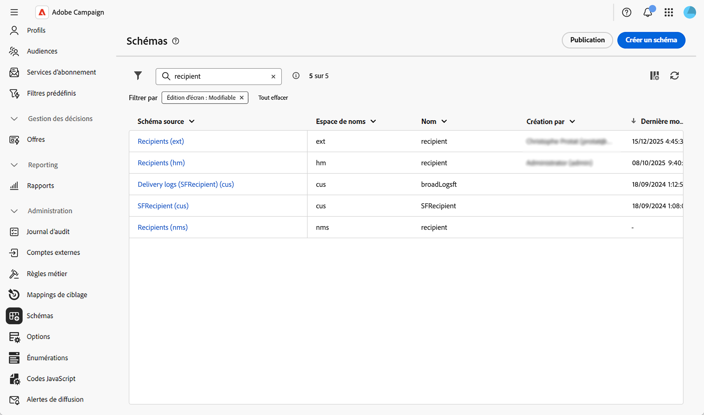
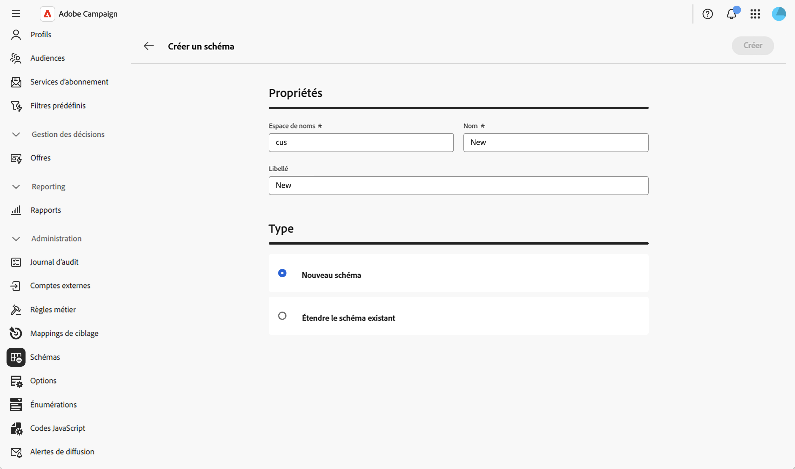
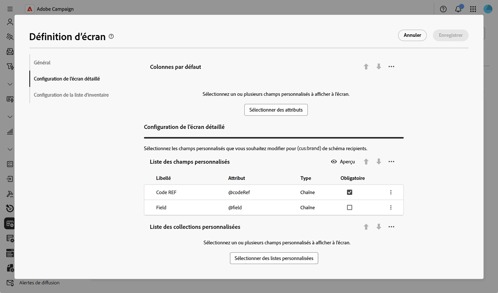
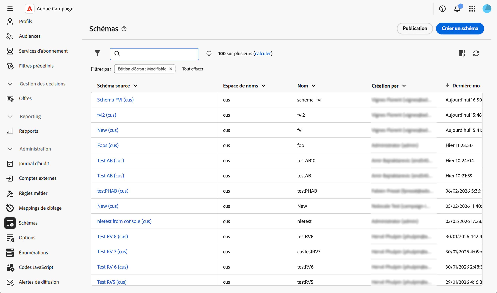
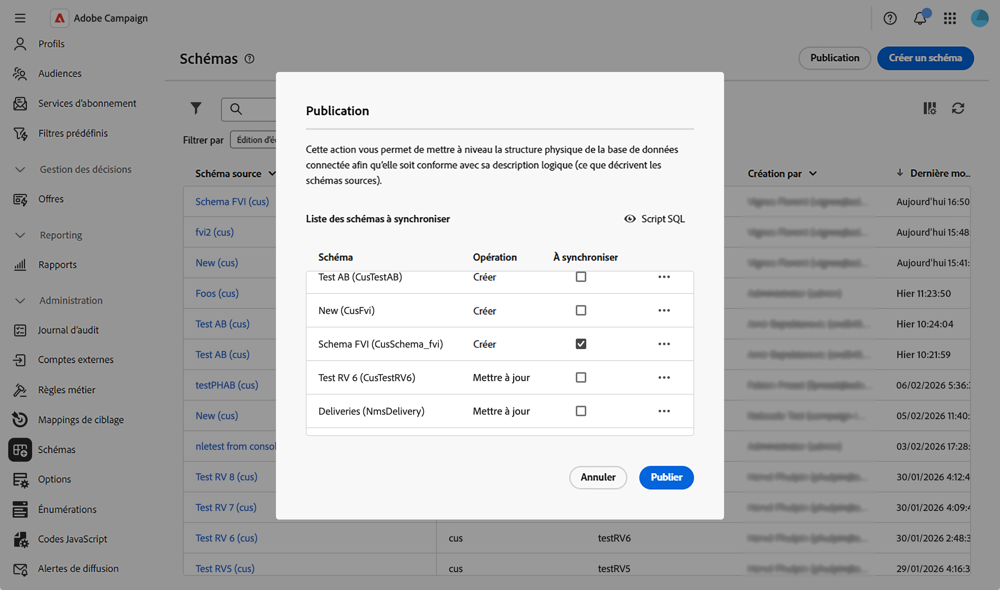
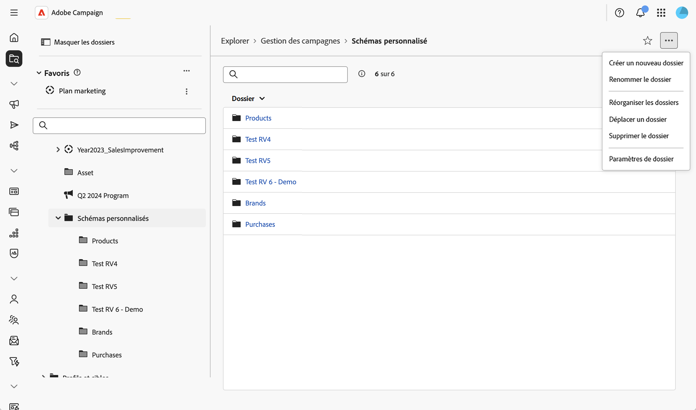
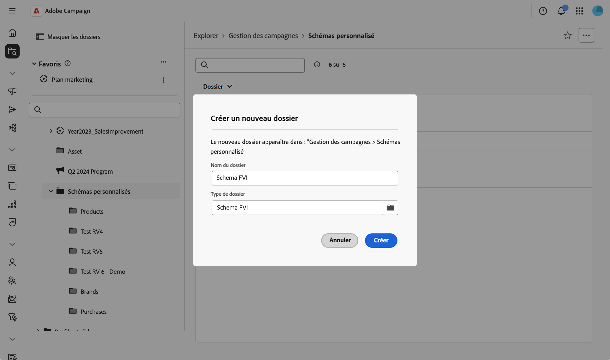

<?xml version="1.0" encoding="UTF-8"?>
<xliff xmlns="urn:oasis:names:tc:xliff:document:1.2" xmlns:okp="okapi-framework:xliff-extensions" xmlns:its="http://www.w3.org/2005/11/its" xmlns:itsxlf="http://www.w3.org/ns/its-xliff/" version="1.2" its:version="2.0">
<file original="help/v8/administration/schemas-create-publish.md.mdsc" source-language="en-US" target-language="en-XX" datatype="x-text/markdown">
<body>
<trans-unit id="tu1" restype="x-YAML_METADATA_HEADER_VALUE" xml:space="preserve">
<source xml:lang="en-US">Create and publish schemas</source>
<target xml:lang="en-XX">Créer et publier des schémas</target>
</trans-unit>
<trans-unit id="tu2" restype="x-YAML_METADATA_HEADER_VALUE" xml:space="preserve">
<source xml:lang="en-US">Learn how to create, extend, and publish schemas.</source>
<target xml:lang="en-XX">Découvrez comment créer, étendre et publier des schémas.</target>
</trans-unit>
<trans-unit id="tu3" xml:space="preserve">
<source xml:lang="en-US">Create and publish schemas</source>
<target xml:lang="en-XX">Créer et publier des schémas</target>
</trans-unit>
<trans-unit id="tu4" xml:space="preserve">
<source xml:lang="en-US">Create and manage schemas</source>
<target xml:lang="en-XX">Création et publication de schémas</target>
</trans-unit>
<trans-unit id="tu5" xml:space="preserve">
<source xml:lang="en-US">You can create new schemas, extend existing schemas, and access external databases.</source>
<target xml:lang="en-XX">Vous pouvez créer des schémas, étendre les schémas existants et accéder à des bases de données externes.</target>
</trans-unit>
<trans-unit id="tu6" xml:space="preserve">
<source xml:lang="en-US">Create or extend a schema</source>
<target xml:lang="en-XX">Création ou extension d’un schéma</target>
</trans-unit>
<trans-unit id="tu7" xml:space="preserve">
<source xml:lang="en-US">To create or extend a schema:</source>
<target xml:lang="en-XX">Pour créer ou étendre un schéma :</target>
</trans-unit>
<trans-unit id="tu8" xml:space="preserve">
<source xml:lang="en-US">Navigate to <ph id="1" ctype="x-STRONG_EMPHASIS">**[!UICONTROL </ph>Administration<ph id="3" ctype="x-LINK_REF">]**</ph> > <ph id="5" ctype="x-STRONG_EMPHASIS">**[!UICONTROL </ph>Schemas<ph id="7" ctype="x-LINK_REF">]**</ph>.</source>
<target xml:lang="en-XX">Accédez à <ph id="1" ctype="x-STRONG_EMPHASIS">**[!UICONTROL </ph>Administration<ph id="3" ctype="x-LINK_REF">]**</ph> > <ph id="5" ctype="x-STRONG_EMPHASIS">**[!UICONTROL </ph>Schémas<ph id="7" ctype="x-LINK_REF">]**</ph>.</target>
</trans-unit>
<trans-unit id="tu9" xml:space="preserve">
<source xml:lang="en-US">Click <ph id="1" ctype="x-STRONG_EMPHASIS">**[!UICONTROL </ph>Create schema<ph id="3" ctype="x-LINK_REF">]**</ph>.</source>
<target xml:lang="en-XX">Cliquez sur <ph id="1" ctype="x-STRONG_EMPHASIS">**[!UICONTROL </ph>Créer un schéma<ph id="3" ctype="x-LINK_REF">]**</ph>.</target>
</trans-unit>
<trans-unit id="tu10" xml:space="preserve">
<source xml:lang="en-US"><ph id="1" ctype="x-IMAGE"></ph></source>
<target xml:lang="en-XX"><ph id="1" ctype="x-IMAGE"></ph></target>
</trans-unit>
<trans-unit id="tu11" xml:space="preserve">
<source xml:lang="en-US">Enter a namespace for your schema (for example, <ph id="1" ctype="x-CODE">`cus`</ph> for custom schemas).</source>
<target xml:lang="en-XX">Saisissez un espace de noms pour votre schéma (par exemple, <ph id="1" ctype="x-CODE">`cus`</ph> pour les schémas personnalisés).</target>
</trans-unit>
<trans-unit id="tu12" xml:space="preserve">
<source xml:lang="en-US">Enter a unique name and label, and choose if you want to create a new schema or extend an existing one.</source>
<target xml:lang="en-XX">Saisissez un nom et un libellé uniques, puis choisissez si vous souhaitez créer un schéma ou étendre un schéma existant.</target>
</trans-unit>
<trans-unit id="tu13" xml:space="preserve">
<source xml:lang="en-US">Click <ph id="1" ctype="x-STRONG_EMPHASIS">**[!UICONTROL </ph>Create<ph id="3" ctype="x-LINK_REF">]**</ph>.
</source>
<target xml:lang="en-XX">Cliquez sur <ph id="1" ctype="x-STRONG_EMPHASIS">**[!UICONTROL </ph>Créer<ph id="3" ctype="x-LINK_REF">]**</ph>.
</target>
</trans-unit>
<trans-unit id="tu14" xml:space="preserve">
<source xml:lang="en-US"><ph id="1" ctype="x-IMAGE"></ph></source>
<target xml:lang="en-XX"><ph id="1" ctype="x-IMAGE"></ph></target>
</trans-unit>
<trans-unit id="tu15" xml:space="preserve">
<source xml:lang="en-US">The schema is created and the generated schema structure is displayed.</source>
<target xml:lang="en-XX">Le schéma est créé et la structure de schéma générée s’affiche.</target>
</trans-unit>
<trans-unit id="tu16" xml:space="preserve">
<source xml:lang="en-US">By default, the schema is empty. You now need to add the fields you want to include in your schema using the schema editor:</source>
<target xml:lang="en-XX">Par défaut, le schéma est vide. Vous devez maintenant ajouter les champs que vous souhaitez inclure dans votre schéma à l’aide de l’éditeur de schémas :</target>
</trans-unit>
<trans-unit id="tu17" xml:space="preserve">
<source xml:lang="en-US">Click the pencil icon in the <ph id="1" ctype="x-STRONG_EMPHASIS">**[!UICONTROL </ph>Content<ph id="3" ctype="x-LINK_REF">]**</ph> section of the schema details screen.</source>
<target xml:lang="en-XX">Cliquez sur l’icône en forme de crayon dans la section <ph id="1" ctype="x-STRONG_EMPHASIS">**[!UICONTROL </ph>Contenu<ph id="3" ctype="x-LINK_REF">]**</ph> de l’écran des détails du schéma.</target>
</trans-unit>
<trans-unit id="tu18" xml:space="preserve">
<source xml:lang="en-US">Add the needed elements. Here is an example of a custom schema structure:</source>
<target xml:lang="en-XX">Ajoutez les éléments nécessaires. Voici un exemple de structure de schéma personnalisée :</target>
</trans-unit>
<trans-unit id="tu19" xml:space="preserve">
<source xml:lang="en-US"><ph id="1" ctype="x-IMAGE"></ph></source>
<target xml:lang="en-XX"><ph id="1" ctype="x-IMAGE"></ph></target>
</trans-unit>
<trans-unit id="tu20" xml:space="preserve">
<source xml:lang="en-US">Click the <ph id="1" ctype="x-STRONG_EMPHASIS">**[!UICONTROL </ph>Check<ph id="3" ctype="x-LINK_REF">]**</ph> button to verify the XML structure of your schema before saving. Identified errors are displayed at the bottom of the screen, for example "Invalid XML format".</source>
<target xml:lang="en-XX">Cliquez sur le bouton <ph id="1" ctype="x-STRONG_EMPHASIS">**[!UICONTROL </ph>Vérifier<ph id="3" ctype="x-LINK_REF">]**</ph> pour vérifier la structure XML de votre schéma avant d’enregistrer. Les erreurs identifiées s’affichent en bas de l’écran, par exemple « Format XML non valide ».</target>
</trans-unit>
<trans-unit id="tu21" xml:space="preserve">
<source xml:lang="en-US"><ph id="1" ctype="x-IMAGE"></ph></source>
<target xml:lang="en-XX"><ph id="1" ctype="x-IMAGE"></ph></target>
</trans-unit>
<trans-unit id="tu22" xml:space="preserve">
<source xml:lang="en-US">Fix any errors, then save your changes to generate the schema.</source>
<target xml:lang="en-XX">Corrigez les erreurs éventuelles, puis enregistrez vos modifications pour générer le schéma.</target>
</trans-unit>
<trans-unit id="tu23" xml:space="preserve">
<source xml:lang="en-US">Define the screen edition</source>
<target xml:lang="en-XX">Définition de la modification d’écran</target>
</trans-unit>
<trans-unit id="tu24" xml:space="preserve">
<source xml:lang="en-US">After creating the schema, you need to define the screen edition.</source>
<target xml:lang="en-XX">Après avoir créé le schéma, vous devez définir la modification d’écran.</target>
</trans-unit>
<trans-unit id="tu25" xml:space="preserve">
<source xml:lang="en-US">For more information on the screen definition screen and how to access it, refer to the <ph id="1" ctype="x-LINK">[</ph>Access the screen definition<ph id="2" ctype="x-LINK">](schemas-browse-access.md#screen-def)</ph> section.</source>
<target xml:lang="en-XX">Pour plus d’informations sur l’écran de définition d’écran et la façon d’y accéder, consultez la section <ph id="1" ctype="x-LINK">[</ph>Accéder à la définition d’écran<ph id="2" ctype="x-LINK">](schemas-browse-access.md#screen-def)</ph>.</target>
</trans-unit>
<trans-unit id="tu26" xml:space="preserve">
<source xml:lang="en-US">In our example, we simply add two custom fields:</source>
<target xml:lang="en-XX">Dans notre exemple, nous ajoutons simplement deux champs personnalisés :</target>
</trans-unit>
<trans-unit id="tu27" xml:space="preserve">
<source xml:lang="en-US">Click the <ph id="1" ctype="x-STRONG_EMPHASIS">**[!UICONTROL </ph>Screen edition<ph id="3" ctype="x-LINK_REF">]**</ph> button in the schema details view to access the screen definition.</source>
<target xml:lang="en-XX">Cliquez sur le bouton <ph id="1" ctype="x-STRONG_EMPHASIS">**[!UICONTROL </ph>Modification d’écran<ph id="3" ctype="x-LINK_REF">]**</ph> dans la vue des détails du schéma pour accéder à la définition d’écran.</target>
</trans-unit>
<trans-unit id="tu28" xml:space="preserve">
<source xml:lang="en-US">Click the ellipsis icon above the <ph id="1" ctype="x-STRONG_EMPHASIS">**[!UICONTROL </ph>List of custom fields<ph id="3" ctype="x-LINK_REF">]**</ph> table and choose <ph id="5" ctype="x-STRONG_EMPHASIS">**[!UICONTROL </ph>Select attributes<ph id="7" ctype="x-LINK_REF">]**</ph>.</source>
<target xml:lang="en-XX">Cliquez sur l’icône représentant des points de suspension au-dessus du tableau <ph id="1" ctype="x-STRONG_EMPHASIS">**[!UICONTROL </ph>Liste de champs personnalisés<ph id="3" ctype="x-LINK_REF">]**</ph> et choisissez <ph id="5" ctype="x-STRONG_EMPHASIS">**[!UICONTROL </ph>Sélectionner des attributs<ph id="7" ctype="x-LINK_REF">]**</ph>.</target>
</trans-unit>
<trans-unit id="tu29" xml:space="preserve">
<source xml:lang="en-US">Select the custom fields you want to add and confirm.</source>
<target xml:lang="en-XX">Sélectionnez les champs personnalisés à ajouter et confirmez votre choix.</target>
</trans-unit>
<trans-unit id="tu30" xml:space="preserve">
<source xml:lang="en-US"><ph id="1" ctype="x-IMAGE"></ph></source>
<target xml:lang="en-XX"><ph id="1" ctype="x-IMAGE"></ph></target>
</trans-unit>
<trans-unit id="tu31" xml:space="preserve">
<source xml:lang="en-US">Publish and synchronize schemas</source>
<target xml:lang="en-XX">Publication et synchronisation de schémas</target>
</trans-unit>
<trans-unit id="tu32" xml:space="preserve">
<source xml:lang="en-US">After creating or modifying a schema, you need to publish it to synchronize the logical schema with the physical database structure.</source>
<target xml:lang="en-XX">Après avoir créé ou modifié un schéma, vous devez le publier pour synchroniser le schéma logique avec la structure physique de la base de données.</target>
</trans-unit>
<trans-unit id="tu33" xml:space="preserve">
<source xml:lang="en-US">Publish schema changes</source>
<target xml:lang="en-XX">Publication des modifications du schéma</target>
</trans-unit>
<trans-unit id="tu34" xml:space="preserve">
<source xml:lang="en-US"><ph id="1" ctype="x-regxph" equiv-text="&lbrack;!CAUTION">[!CAUTION]</ph></source>
<target xml:lang="en-XX"><ph id="1" ctype="x-regxph" equiv-text="&lbrack;!CAUTION">[!CAUTION]</ph></target>
</trans-unit>
<trans-unit id="tu35" xml:space="preserve">
<source xml:lang="en-US">Publishing schema changes modifies the database structure. Make sure you understand the impact of these changes before confirming the publication.</source>
<target xml:lang="en-XX">La publication des modifications du schéma modifie la structure de la base de données. Assurez-vous de comprendre l’impact de ces modifications avant de confirmer la publication.</target>
</trans-unit>
<trans-unit id="tu36" xml:space="preserve">
<source xml:lang="en-US">To publish your schema changes:</source>
<target xml:lang="en-XX">Pour publier vos modifications de schéma :</target>
</trans-unit>
<trans-unit id="tu37" xml:space="preserve">
<source xml:lang="en-US">Navigate to <ph id="1" ctype="x-STRONG_EMPHASIS">**[!UICONTROL </ph>Administration<ph id="3" ctype="x-LINK_REF">]**</ph> > <ph id="5" ctype="x-STRONG_EMPHASIS">**[!UICONTROL </ph>Schemas<ph id="7" ctype="x-LINK_REF">]**</ph> to access the schema list.</source>
<target xml:lang="en-XX">Accédez à <ph id="1" ctype="x-STRONG_EMPHASIS">**[!UICONTROL </ph>Administration<ph id="3" ctype="x-LINK_REF">]**</ph> > <ph id="5" ctype="x-STRONG_EMPHASIS">**[!UICONTROL </ph>Schémas<ph id="7" ctype="x-LINK_REF">]**</ph> pour accéder à la liste des schémas.</target>
</trans-unit>
<trans-unit id="tu38" xml:space="preserve">
<source xml:lang="en-US">Click <ph id="1" ctype="x-STRONG_EMPHASIS">**[!UICONTROL </ph>Publishing<ph id="3" ctype="x-LINK_REF">]**</ph> and confirm.</source>
<target xml:lang="en-XX">Cliquez sur <ph id="1" ctype="x-STRONG_EMPHASIS">**[!UICONTROL </ph>Publication<ph id="3" ctype="x-LINK_REF">]**</ph> et confirmez.</target>
</trans-unit>
<trans-unit id="tu39" xml:space="preserve">
<source xml:lang="en-US"><ph id="1" ctype="x-IMAGE"></ph></source>
<target xml:lang="en-XX"><ph id="1" ctype="x-IMAGE"></ph></target>
</trans-unit>
<trans-unit id="tu40" xml:space="preserve">
<source xml:lang="en-US">Select, in the list, the schema you want to synchronize.</source>
<target xml:lang="en-XX">Dans la liste, sélectionnez le schéma à synchroniser.</target>
</trans-unit>
<trans-unit id="tu41" xml:space="preserve">
<source xml:lang="en-US"><ph id="1" ctype="x-IMAGE"></ph></source>
<target xml:lang="en-XX"><ph id="1" ctype="x-IMAGE"></ph></target>
</trans-unit>
<trans-unit id="tu42" xml:space="preserve">
<source xml:lang="en-US">Review the SQL script that will be executed to update the database structure.</source>
<target xml:lang="en-XX">Vérifiez le script SQL qui sera exécuté pour mettre à jour la structure de la base de données.</target>
</trans-unit>
<trans-unit id="tu43" xml:space="preserve">
<source xml:lang="en-US">Click <ph id="1" ctype="x-STRONG_EMPHASIS">**[!UICONTROL </ph>Publish<ph id="3" ctype="x-LINK_REF">]**</ph> and confirm to proceed with the publication.</source>
<target xml:lang="en-XX">Cliquez sur <ph id="1" ctype="x-STRONG_EMPHASIS">**[!UICONTROL </ph>Publier<ph id="3" ctype="x-LINK_REF">]**</ph> et confirmez pour lancer la publication.</target>
</trans-unit>
<trans-unit id="tu44" xml:space="preserve">
<source xml:lang="en-US"><ph id="1" ctype="x-regxph" equiv-text="&lbrack;!NOTE">[!NOTE]</ph></source>
<target xml:lang="en-XX"><ph id="1" ctype="x-regxph" equiv-text="&lbrack;!NOTE">[!NOTE]</ph></target>
</trans-unit>
<trans-unit id="tu45" xml:space="preserve">
<source xml:lang="en-US">The process may take some time depending on the size of your database and the complexity of the changes.</source>
<target xml:lang="en-XX">Le processus peut prendre un certain temps en fonction de la taille de votre base de données et de la complexité des modifications.</target>
</trans-unit>
<trans-unit id="tu46" xml:space="preserve">
<source xml:lang="en-US">Create a navigation entry</source>
<target xml:lang="en-XX">Création d’une entrée de navigation</target>
</trans-unit>
<trans-unit id="tu47" xml:space="preserve">
<source xml:lang="en-US">After publishing a custom schema, you can create a navigation entry in the Explorer to access your custom data:</source>
<target xml:lang="en-XX">Après avoir publié un schéma personnalisé, vous pouvez créer une entrée de navigation dans l’Explorateur pour accéder à vos données personnalisées :</target>
</trans-unit>
<trans-unit id="tu48" xml:space="preserve">
<source xml:lang="en-US">Navigate to the <ph id="1" ctype="x-STRONG_EMPHASIS">**[!UICONTROL </ph>Explorer<ph id="3" ctype="x-LINK_REF">]**</ph> menu and select a folder where you want to place your custom schema.</source>
<target xml:lang="en-XX">Accédez au menu <ph id="1" ctype="x-STRONG_EMPHASIS">**[!UICONTROL </ph>Explorateur<ph id="3" ctype="x-LINK_REF">]**</ph> et sélectionnez un dossier dans lequel vous souhaitez placer votre schéma personnalisé.</target>
</trans-unit>
<trans-unit id="tu49" xml:space="preserve">
<source xml:lang="en-US">Click the ellipsis icon, and click <ph id="1" ctype="x-STRONG_EMPHASIS">**[!UICONTROL </ph>Create new folder<ph id="3" ctype="x-LINK_REF">]**</ph>.
</source>
<target xml:lang="en-XX">Cliquez sur l’icône représentant des points de suspension, puis sur <ph id="1" ctype="x-STRONG_EMPHASIS">**[!UICONTROL </ph>Créer un dossier<ph id="3" ctype="x-LINK_REF">]**</ph>.
</target>
</trans-unit>
<trans-unit id="tu50" xml:space="preserve">
<source xml:lang="en-US"><ph id="1" ctype="x-IMAGE"></ph></source>
<target xml:lang="en-XX"><ph id="1" ctype="x-IMAGE"></ph></target>
</trans-unit>
<trans-unit id="tu51" xml:space="preserve">
<source xml:lang="en-US">Add a label and choose your schema in the <ph id="1" ctype="x-STRONG_EMPHASIS">**[!UICONTROL </ph>Folder type<ph id="3" ctype="x-LINK_REF">]**</ph> field.
</source>
<target xml:lang="en-XX">Ajoutez un libellé et choisissez votre schéma dans le champ <ph id="1" ctype="x-STRONG_EMPHASIS">**[!UICONTROL </ph>Type de dossier<ph id="3" ctype="x-LINK_REF">]**</ph>.
</target>
</trans-unit>
<trans-unit id="tu52" xml:space="preserve">
<source xml:lang="en-US"><ph id="1" ctype="x-IMAGE"></ph></source>
<target xml:lang="en-XX"><ph id="1" ctype="x-IMAGE"></ph></target>
</trans-unit>
<trans-unit id="tu53" xml:space="preserve">
<source xml:lang="en-US">The custom schema will now be accessible from the <ph id="1" ctype="x-STRONG_EMPHASIS">**[!UICONTROL </ph>Explorer<ph id="3" ctype="x-LINK_REF">]**</ph> view.</source>
<target xml:lang="en-XX">Le schéma personnalisé est désormais accessible à partir de la vue <ph id="1" ctype="x-STRONG_EMPHASIS">**[!UICONTROL </ph>Explorateur<ph id="3" ctype="x-LINK_REF">]**</ph>.</target>
</trans-unit>
<trans-unit id="tu54" xml:space="preserve">
<source xml:lang="en-US">From the new folder, you can:</source>
<target xml:lang="en-XX">À partir du nouveau dossier, vous pouvez effectuer les opérations suivantes :</target>
</trans-unit>
<trans-unit id="tu55" xml:space="preserve">
<source xml:lang="en-US">View the list of records in your custom schema.</source>
<target xml:lang="en-XX">Afficher la liste des enregistrements dans votre schéma personnalisé</target>
</trans-unit>
<trans-unit id="tu56" xml:space="preserve">
<source xml:lang="en-US">Create new records.</source>
<target xml:lang="en-XX">Créer de nouveaux enregistrements</target>
</trans-unit>
<trans-unit id="tu57" xml:space="preserve">
<source xml:lang="en-US">Edit and delete existing records.</source>
<target xml:lang="en-XX">Modifier et supprimer des enregistrements existants</target>
</trans-unit>
<trans-unit id="tu58" xml:space="preserve">
<source xml:lang="en-US">Customize which columns are displayed by default in the list view.</source>
<target xml:lang="en-XX">Personnaliser les colonnes affichées par défaut dans la vue Liste</target>
</trans-unit>
</body>
</file>
</xliff>