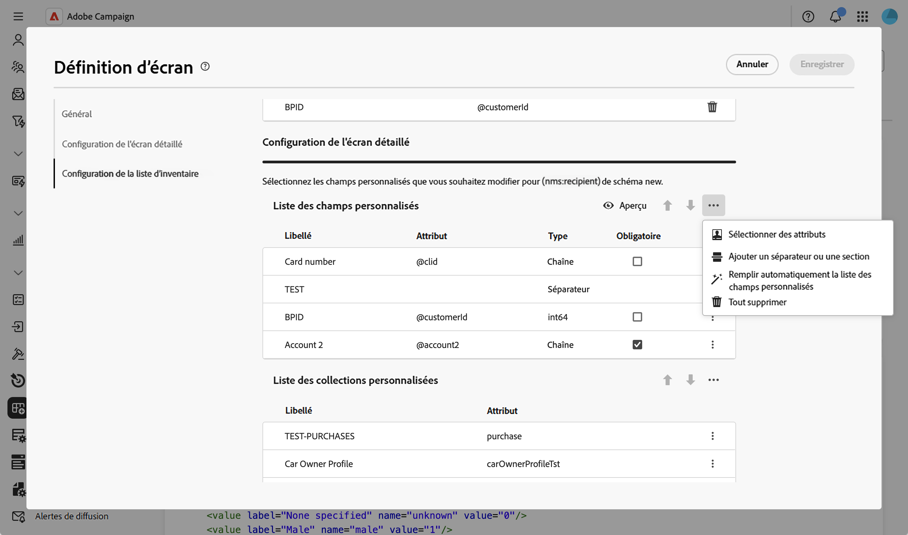
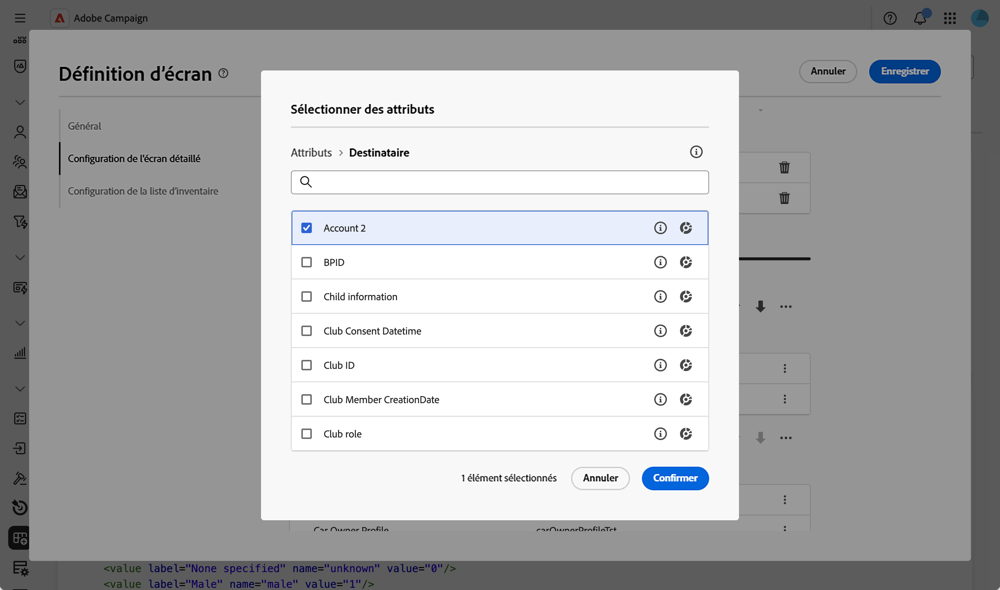
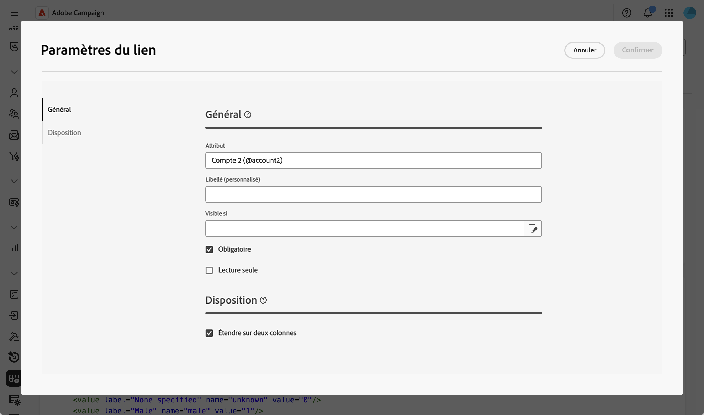
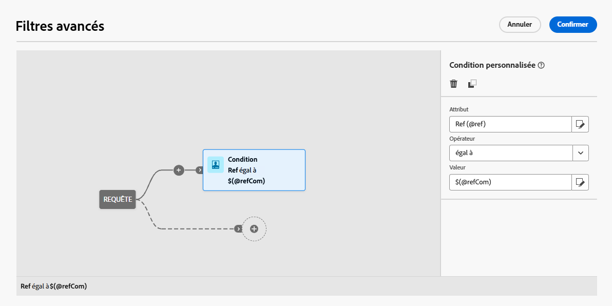
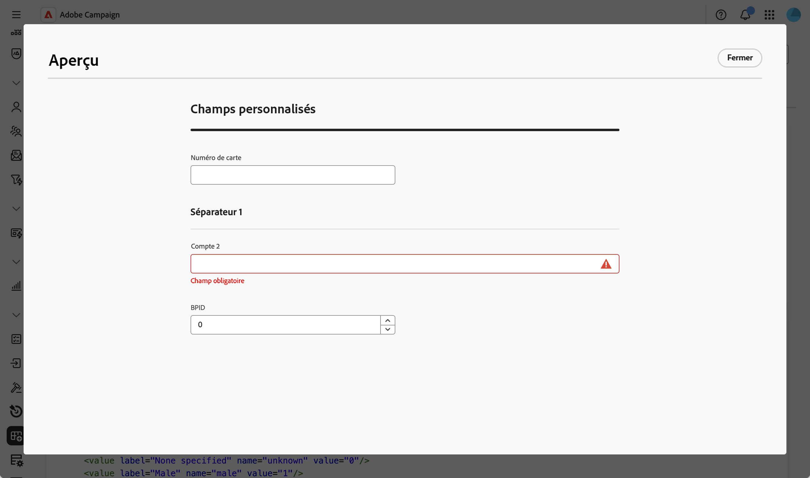
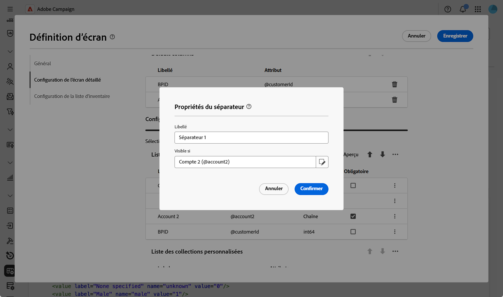
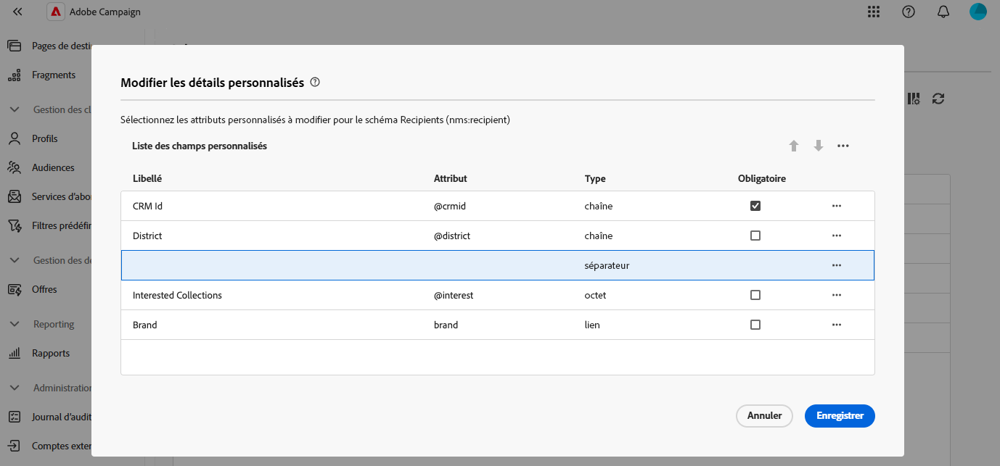
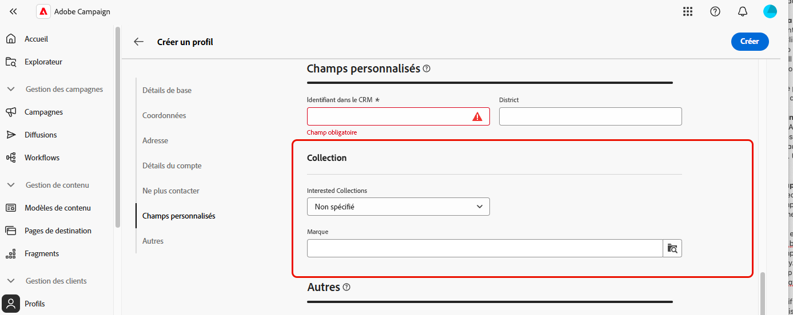

# Modifier des champs personnalisés {#fields}

>[!CONTEXTUALHELP]
>id="acw_schema_detail_screen_configuration"
>title="Configuration de l&#39;écran détaillé"
>abstract="Configurer les champs personnalisés à afficher dans les écrans de détails et les organiser en sections. Ajoutez des listes de collection pour afficher les données associées dans les écrans de profil."
>additional-url="https://experienceleague.adobe.com/en/docs/campaign-web/v8/conf/schemas/schemas-collection-lists" text="Ajouter des listes de collection"

Les champs personnalisés sont des attributs supplémentaires ajoutés aux schémas prêts à l’emploi via la console Adobe Campaign. Ils vous permettent de personnaliser les schémas en incluant de nouveaux attributs en fonction des besoins de votre entreprise.

Les champs personnalisés peuvent être affichés sur différents écrans, comme les détails de profil dans l’interface. Vous pouvez contrôler quels champs sont visibles et la manière dont ils apparaissent dans l’interface.

Pour plus d’informations sur la définition d’écran et la façon d’y accéder, consultez la section [Accéder à la définition d’écran](schemas-browse-access.md#screen-def).

Pour ajouter des champs personnalisés à la liste :

1. Accédez au menu **[!UICONTROL Schémas]** et recherchez les schémas modifiables à l’aide des filtres.

1. Sélectionnez le nom du schéma dans la liste pour l’ouvrir et cliquez sur le bouton **[!UICONTROL Modification d’écran]** dans la vue des détails du schéma pour accéder à la définition d’écran.

1. Cliquez sur l’icône représentant trois points de suspension située au-dessus du tableau **[!UICONTROL Liste de champs personnalisés]**, puis choisissez **[!UICONTROL Sélectionner des attributs]** pour déterminer un ou plusieurs champs personnalisés à afficher dans l’interface.
   
1. Sélectionnez les champs personnalisés à ajouter et confirmez votre choix.

   

   >[!NOTE]
   >
   > Vous pouvez également sélectionner **[!UICONTROL Remplir automatiquement la liste des champs personnalisés]** pour ajouter tous les champs personnalisés définis pour le schéma à l’interface.

Une fois les champs personnalisés ajoutés, vous pouvez les prévisualiser, les réorganiser, les rendre obligatoires, modifier leurs paramètres ou les organiser en sous-sections.

## Configurer les paramètres des champs {#field-settings}

Pour configurer des paramètres spécifiques pour chaque champ personnalisé, cliquez sur le bouton représentant des points de suspension à côté du champ souhaité dans la liste, puis sélectionnez **[!UICONTROL Modifier]**.

Les paramètres disponibles sont les suivants :

* **[!UICONTROL Attribut]** : nom du champ personnalisé (lecture seule).
* **[!UICONTROL Libellé (personnalisé)]** : libellé à afficher dans l’interface. Si aucun libellé n’est renseigné, le libellé défini dans le schéma s’affiche.
* **[!UICONTROL Visible si]** : définissez une condition à l’aide d’une expression xtk qui contrôle quand le champ doit être affiché. Par exemple, masquer le champ si un autre champ est vide.
* **[!UICONTROL Obligatoire]** : permet au champ d’être obligatoire dans l’interface.
* **[!UICONTROL Lecture seule]** : permet au champ d’être en lecture seule dans l’interface. Les utilisateurs et les utilisatrices ne pourront pas modifier la valeur du champ.
* **[!UICONTROL Paramètres de filtrage]** (pour les champs de type lien) : utilisez le concepteur de requête pour spécifier les règles d’affichage d’un champ personnalisé de type lien. Par exemple, limitez les valeurs d’une liste en fonction de l’entrée d’un autre champ.

  +++Afficher l’exemple

  Vous pouvez également référencer dans vos conditions une valeur saisie dans d’autres champs à l’aide de la syntaxe `$(<field-name>)`. Cela vous permet de référencer la valeur actuelle d’un champ telle qu’elle a été saisie dans le formulaire, même si elle n’a pas encore été enregistrée dans la base de données.

  Dans l’exemple ci-dessous, la condition vérifie si la valeur du champ @ref correspond à la valeur saisie dans le champ @refCom. En revanche, utiliser `@refCom` au lieu de `$(@refCom)` référencerait la valeur du champ @ref telle qu’elle existe dans la base de données.

  

  +++

* **[!UICONTROL Étendre sur deux colonnes]** : par défaut, les champs personnalisés s’affichent dans l’interface sur deux colonnes. Activez cette option pour afficher le champ personnalisé sur toute la largeur de l’écran au lieu de deux colonnes.

## Prévisualiser les champs personnalisés {#preview}

Cliquez sur **[!UICONTROL Aperçu]** pour afficher les champs personnalisés dans un exemple d’écran. Vous pouvez ainsi voir comment les champs apparaîtront dans l’interface, y compris ceux marqués comme obligatoires.

## Organiser des champs personnalisés en sous-sections {#separator}

Vous pouvez ajouter des séparateurs afin de regrouper des champs personnalisés dans l’interface pour une meilleure lisibilité. Pour ce faire, procédez comme suit :

1. Cliquez sur l’icône représentant des points de suspension au-dessus du tableau **[!UICONTROL Liste des champs personnalisés]** et choisissez **[!UICONTROL Ajouter un séparateur]**.

1. Une nouvelle ligne représentant le séparateur est ajoutée à la liste. Cliquez sur l’icône représentant des points de suspension sur la ligne de séparation et choisissez **[!UICONTROL Modifier]**.

1. Saisissez un **[!UICONTROL Libellé]** pour le séparateur. Si vous le souhaitez, définissez une condition **[!UICONTROL Visible si]** pour contrôler l’affichage du séparateur.

   

1. Utilisez les flèches haut et bas pour déplacer le séparateur vers l’emplacement souhaité. Les champs répertoriés sous le séparateur seront regroupés sous celui-ci.

   Dans cet exemple, les champs « Interested Collections » et « Brand » sont regroupés dans une sous-section « Collection ».

   | Configuration des champs personnalisés | Rendu dans l’interface |
   |  ---  |  ---  |
   | {zoomable="yes"} | {zoomable="yes"} |
