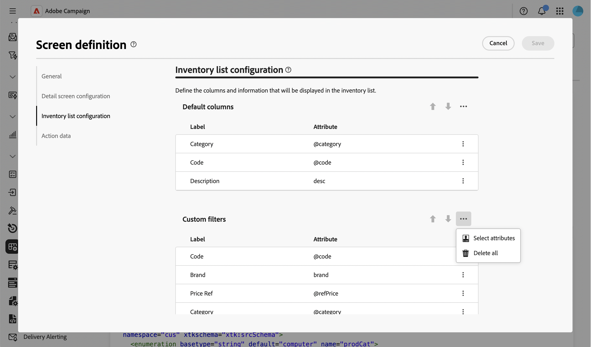
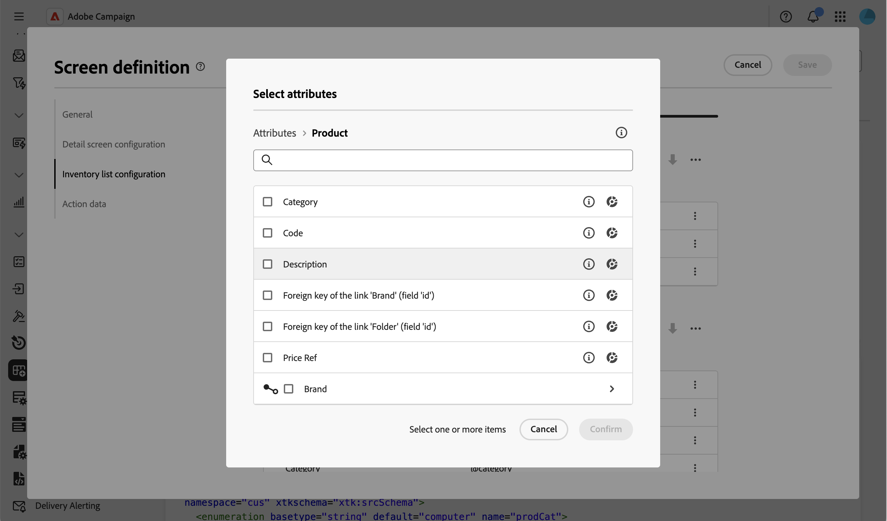
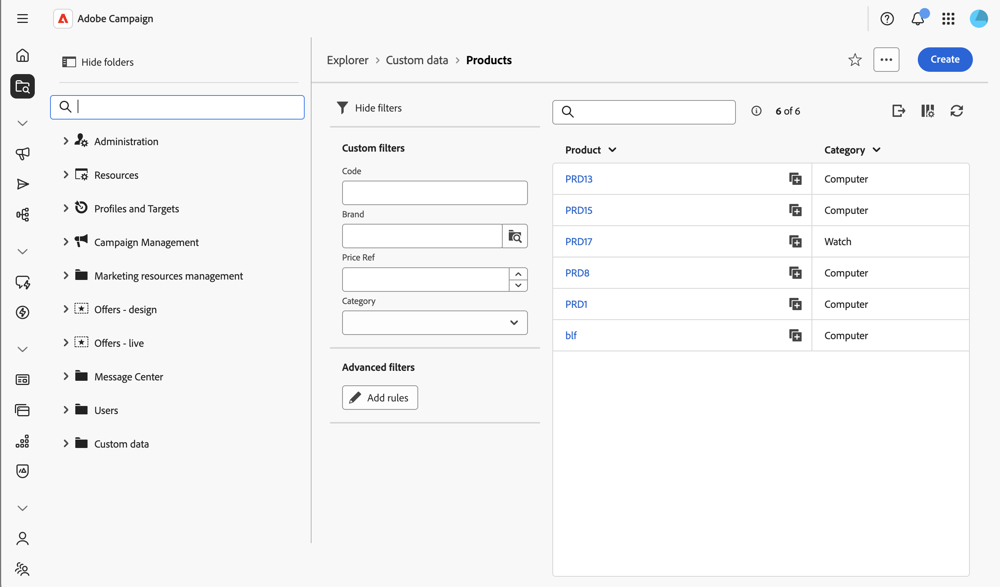

# Ajouter des filtres personnalisés {#custom-filters}

La section **[!UICONTROL Configuration de la liste d’inventaire]** > **[!UICONTROL Filtres personnalisés]** vous permet de choisir les attributs qui s’affichent en tant que champs à accès rapide dans le volet [Filtres](../query/filter.md) de la vue Liste d’un schéma, au-dessus du créateur de règles **[!UICONTROL Filtres avancés]**.

Pour plus d’informations sur l’écran de définition d’écran et la façon d’y accéder, consultez la section [Accéder à la définition d’écran](schemas-browse-access.md#screen-def).

## Ajouter des filtres personnalisés {#add}

1. Accédez au menu **[!UICONTROL Schémas]** et recherchez les schémas modifiables à l’aide des filtres.

1. Sélectionnez le nom du schéma dans la liste pour l’ouvrir et cliquez sur le bouton **[!UICONTROL Modification d’écran]** dans la vue des détails du schéma pour accéder à la définition d’écran.

1. Dans la section **[!UICONTROL Configuration de la liste d’inventaire]**, cliquez sur l’icône représentant des points de suspension au-dessus du tableau **[!UICONTROL Filtres personnalisés]**, puis choisissez **[!UICONTROL Sélectionner des attributs]**.

   

1. Sélectionnez un ou plusieurs attributs et confirmez.

   Vous pouvez sélectionner les éléments suivants :

   * Attribut direct du schéma, par exemple un code ou une catégorie.
   * Attribut de lien ; par exemple, une marque liée à un produit. Dans ce cas, le filtre utilise un sélecteur de recherche limité au schéma lié.
   * Un sous-attribut d’un lien, par exemple le nom complet d’un dossier lié ou l’e-mail d’un destinataire lié.

   

1. Cliquez sur **[!UICONTROL Enregistrer]**. Vous pouvez réorganiser les filtres personnalisés à l’aide des flèches vers le haut et vers le bas ou en les faisant glisser et supprimer un filtre à l’aide de l’icône de corbeille sur sa ligne.

1. Accédez à la liste des enregistrements pour ce schéma et ouvrez le volet Filtres . Les attributs que vous avez sélectionnés s’affichent sous la forme **[!UICONTROL Filtres personnalisés]**, au-dessus du créateur de règles **[!UICONTROL Filtres avancés]**.

   

   >[!NOTE]
   >
   >Un filtre personnalisé basé sur un attribut de date ou de date et d’heure s’affiche en tant que sélecteur de période.

1. Saisissez ou sélectionnez une valeur dans l’un des filtres personnalisés pour affiner la liste.

<!--
## Configure a custom filter's settings {#settings}

To configure specific settings for a custom filter, click the ellipsis icon on its row and select **[!UICONTROL Edit]**.

Available settings are:

* **[!UICONTROL Label (custom)]**: The label to display for this filter. If no label is provided, the attribute's label defined in the schema is used.
* **[!UICONTROL Filter settings]** (for link-type custom filters only): Use the query modeler to specify a condition that restricts the values available in the picker. For example, restrict a delivery filter to deliveries using the email channel.
-->