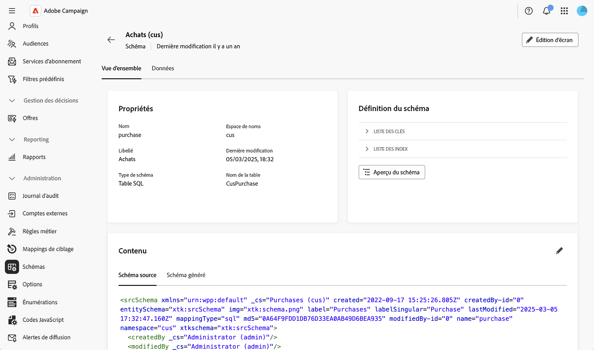
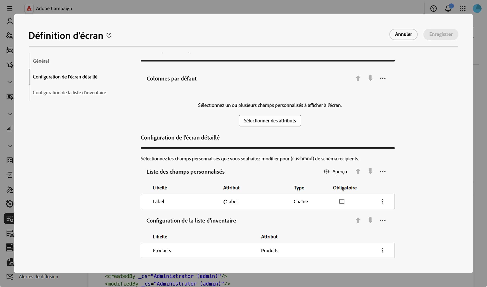
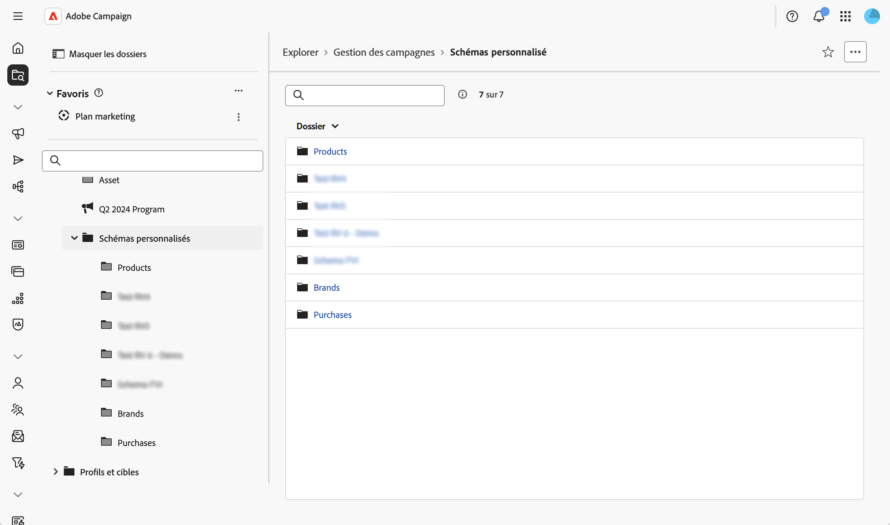
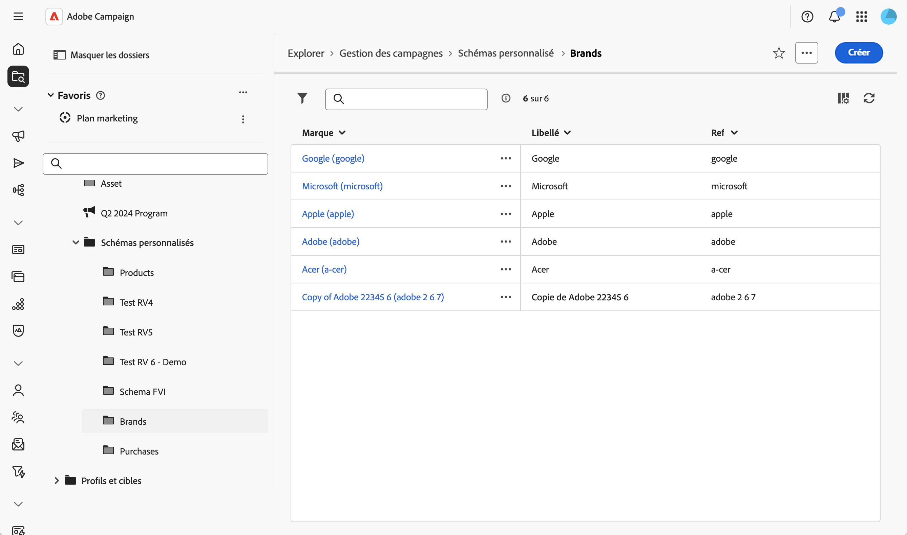

# Utiliser les formulaires personnalisés {#custom-forms}

Les formulaires personnalisés sont des interfaces de saisie de données qui vous permettent de gérer des enregistrements dans des schémas personnalisés directement à partir de l’interface d’utilisation web.Chaque formulaire personnalisé correspond à un schéma personnalisé spécifique et fournit une vue de liste pour parcourir les enregistrements et une vue détaillée pour créer, modifier et supprimer des enregistrements.

Les formulaires personnalisés sont basés sur la définition de formulaire du schéma (définition d’écran), qui configure les champs affichés et leur organisation.

>[!NOTE]
>
>Les formulaires personnalisés ne sont disponibles que pour les schémas dont la définition de formulaire est configurée.

## Créer et publier des schémas personnalisés {#form-schema}

Vous devez d’abord créer et publier vos schémas personnalisés.Pour des consignes détaillées, voir cette [section](schemas-create-publish.md).

Voici le modèle de données utilisé pour cet exemple :

* Une personne destinataire effectue plusieurs achats.
* Un achat est lié à un produit.
* Un produit est lié à une marque.

Pour ce cas d’utilisation, trois schémas sont créés : les schémas Achats, Produits et Marque.Voici un exemple :

## Configurer la définition d’écran {#form-screen-schema}

Définissez les champs à afficher et leur organisation.Pour des consignes détaillées, voir cette [section](schemas-browse-access.md#screen-def).

Voici un exemple pour le schéma Marque dans lequel la liste personnalisée Produits est ajoutée.Le formulaire affiche alors la liste des produits associés à la marque.

Pour le schéma Produits , nous ajoutons la liste personnalisée Achats.Et pour le schéma Achats, les champs Produit et Destinataire.

## Créer des saisies de navigation {#form-screen-entries}

Créez des dossiers dans l’Explorateur pour accéder à votre formulaire personnalisé.Pour des instructions détaillées, voir cette [section](schemas-create-publish.md#navigation).

La vue Liste affiche tous les enregistrements de ce schéma. Si le schéma comporte une définition de formulaire configurée, la liste est modifiable et vous pouvez créer, modifier et supprimer des enregistrements.

Vous pouvez ensuite effectuer ce qui suit :

* **Afficher et modifier des enregistrements** : cliquez sur un enregistrement dans la vue Liste pour l’ouvrir dans la vue Détail et modifier directement les champs.
* **Créer de nouveaux enregistrements** : cliquez sur le bouton **[!UICONTROL Créer]** et renseignez les champs requis.Pour les champs liés, utilisez l’icône de recherche pour effectuer une sélection parmi les enregistrements associés disponibles.
* **Supprimer des enregistrements** : sélectionnez un enregistrement et utilisez l’action de suppression disponible dans la vue Détails de l’enregistrement ou dans la vue Liste.
* **Afficher les données associées dans les onglets** : accédez aux enregistrements associés via des onglets dédiés dans la vue détaillée (par exemple, afficher tous les produits liés à une marque ou tous les achats liés à un produit).
* **Appliquer des filtres** : utilisez le panneau de filtrage pour affiner la vue Liste et rechercher des enregistrements spécifiques en fonction de n’importe quel champ de votre schéma.
* **Personnaliser les colonnes de la liste** : configurez les colonnes affichées par défaut dans les vues Liste via la définition d’écran.
