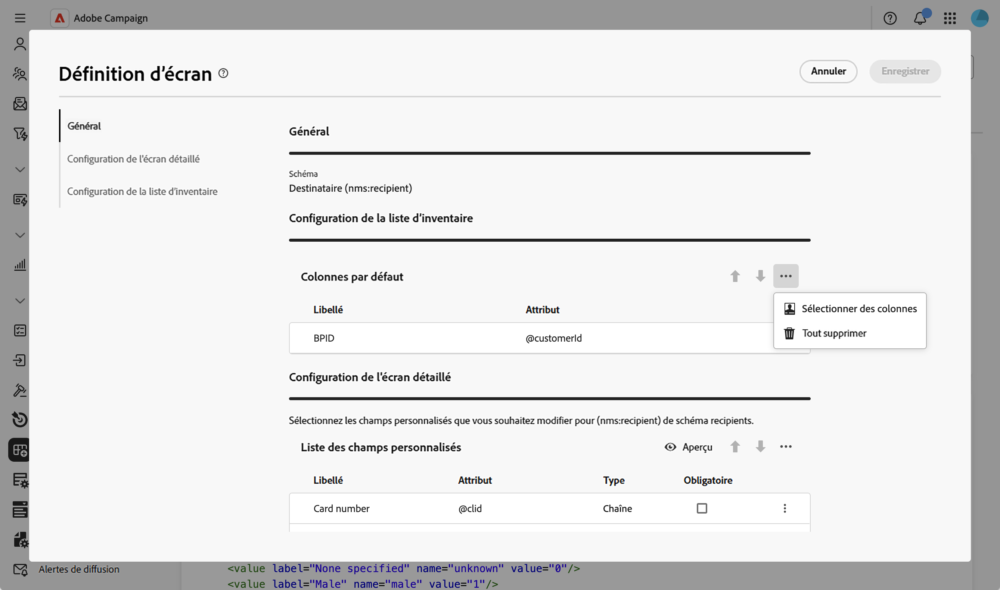
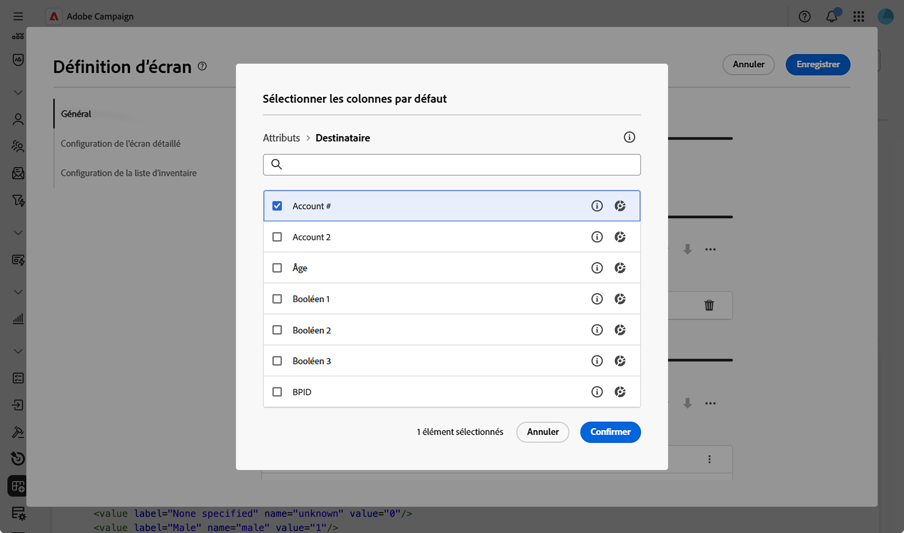
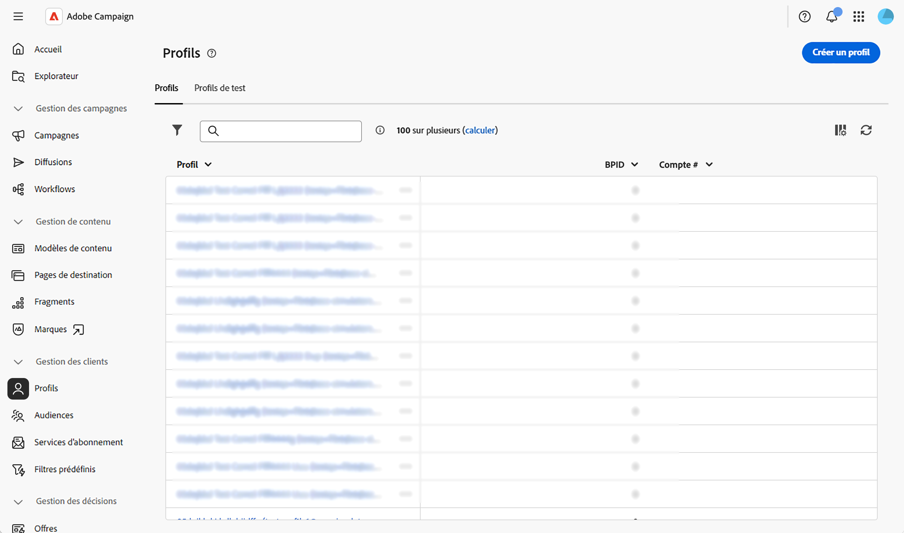

# Configurer les colonnes de la liste {#list-columns}

La section **[!UICONTROL Configuration de la liste d’inventaire]** vous permet de configurer les colonnes affichées par défaut dans les vues Liste. Chaque colonne affiche son libellé et l’attribut correspondant.

Pour plus d&#39;informations sur l&#39;écran de définition d&#39;écran et sur la façon d&#39;y accéder, consultez la section [Accéder à la définition d&#39;écran](schemas-browse-access.md#screen-def).

Pour ajouter de nouvelles colonnes à la liste par défaut, procédez comme suit :

1. Accédez au menu **[!UICONTROL Schémas]** et recherchez les schémas modifiables à l’aide des filtres.

1. Sélectionnez le nom du schéma dans la liste pour l’ouvrir et cliquez sur le bouton **[!UICONTROL Modification de l’écran]** dans la vue des détails du schéma pour accéder à la définition d’écran.

1. Cliquez sur l’icône représentant des points de suspension (trois points).
1. Choisissez **[!UICONTROL Sélectionner les colonnes]**.
   

1. Sélectionnez les attributs à afficher dans les vues de liste et confirmez.

   

1. Accédez au menu **Profils** pour accéder à la vue Liste des profils. Les nouveaux onglets s’affichent. Vous pouvez ajouter d’autres colonnes si nécessaire.

   
