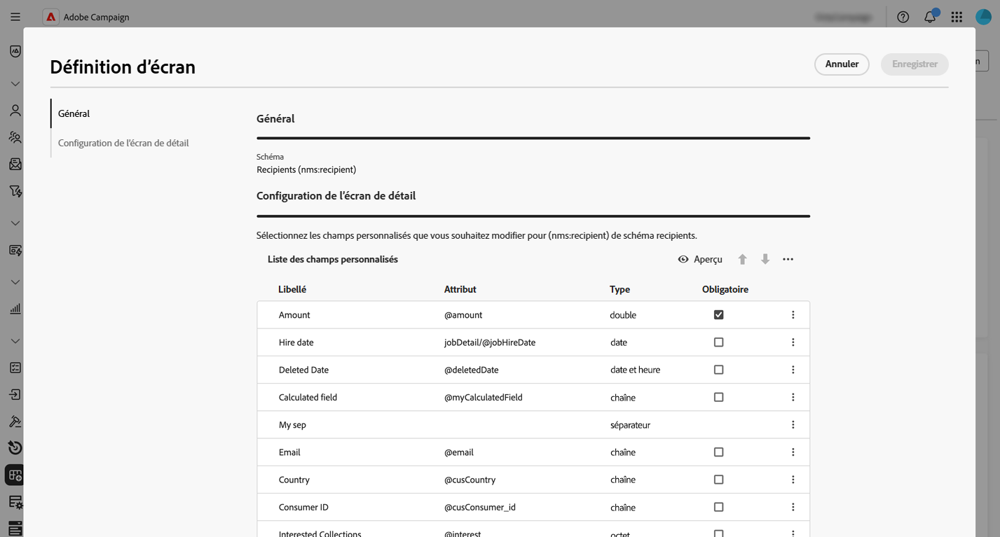

# Utilisation des schémas {#schemas}

>[!CONTEXTUALHELP]
>id="acw_homepage_welcome_rn3"
>title="Utilisation des schémas"
>abstract="Vous pouvez désormais accéder aux détails d’un schéma en sélectionnant son nom dans la liste. L’édition des champs personnalisés est également accessible à partir du bouton **Modifier les détails personnalisés**."
>additional-url="https://experienceleague.adobe.com/docs/campaign-web/v8/release-notes/release-notes.html?lang=fr" text="Voir les notes de mise à jour"

>[!CONTEXTUALHELP]
>id="acw_schema"
>title="Schémas"
>abstract="**[!DNL Adobe Campaign]** utilise des schémas XML pour définir la structure physique et logique des données dans l’application. Depuis cet écran, vous pouvez afficher tous les schémas existants et accéder aux détails d’un schéma en sélectionnant son nom dans la liste. Des filtres sont disponibles pour aider à affiner la liste, par exemple pour afficher uniquement les schémas modifiables."

## À propos des schémas {#about}

**[!DNL Adobe Campaign]** utilise des schémas XML pour définir la structure physique et logique des données dans l’application. Un schéma est un document XML lié à une table de base de données qui définit :

* Structure de la table SQL (nom de la table, champs, relations).
* La structure des données XML (éléments, attributs, hiérarchie, types, valeurs par défaut, libellés).

Les schémas jouent un rôle essentiel dans :

* Mappage des données d&#39;application avec les tables de la base de données.
* Définir les relations entre les objets de données.
* La spécification de la structure et des propriétés de chaque champ.

Chaque entité d’Adobe Campaign dispose d’un schéma dédié, ce qui permet d’assurer la cohérence des données et leur organisation.

Vous trouverez des informations détaillées sur les schémas dans la [documentation de la console Campaign](https://experienceleague.adobe.com/fr/docs/campaign/campaign-v8/developer/shemas-forms/schemas){target="_blank"}

## Accès aux schémas dans l’interface utilisateur web {#access}

Les schémas sont accessibles à partir du menu **[!UICONTROL Administration]** > **[!UICONTROL Schémas]**.

Depuis cet écran, vous pouvez afficher tous les schémas existants. Des filtres sont disponibles pour aider à affiner la liste, par exemple pour afficher uniquement les schémas modifiables.

Pour ouvrir un schéma, sélectionnez son nom. Une vue de schéma détaillée s’affiche.

### Présentation du schéma {#overview}

L’onglet **[!UICONTROL Aperçu]** offre une vue d’ensemble du schéma :

* La section **[!UICONTROL Propriétés]** affiche des informations clés, telles que le nom du schéma, l’espace de noms et le nom de la table associée.

* La section **[!UICONTROL Définition du schéma]** affiche des détails sur la définition du schéma, comme la clé primaire utilisée pour la réconciliation des données et ses liens avec d&#39;autres tables.

  Cliquez sur le bouton **[!UICONTROL Aperçu du schéma]** pour visualiser les différents champs et liens composant le schéma. Vous pouvez ainsi vérifier la structure complète d’un schéma. Si le schéma a été étendu avec des champs personnalisés, vous pouvez visualiser toutes ses extensions.

* La section **[!UICONTROL Contenu]** affiche le contenu XML du schéma, ce qui vous permet de basculer entre la source et la syntaxe générée.

### Données de schéma {#data}

L’onglet **[!UICONTROL Données]** fournit des informations sur les données du schéma.

## Modifier les champs personnalisés {#fields}

Les champs personnalisés sont des attributs supplémentaires ajoutés aux schémas d’usine par le biais de la console Adobe Campaign. Ils vous permettent de personnaliser les schémas en incluant de nouveaux attributs en fonction des besoins de votre entreprise.

Les champs personnalisés peuvent être affichés dans différents écrans, comme les détails du profil dans l’interface Web de Campaign. Vous pouvez contrôler quels champs sont visibles et comment ils apparaissent dans l’interface. Pour ce faire, cliquez sur le bouton **[!UICONTROL Modifier les détails personnalisés]** dans le menu **[!UICONTROL Schémas]**.

Pour plus d&#39;informations sur la modification des champs personnalisés dans un schéma, reportez-vous à la section [Configurer des champs personnalisés](../administration/custom-fields.md).
