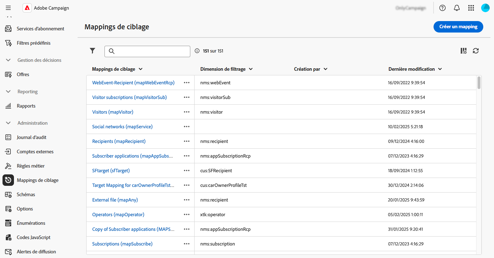
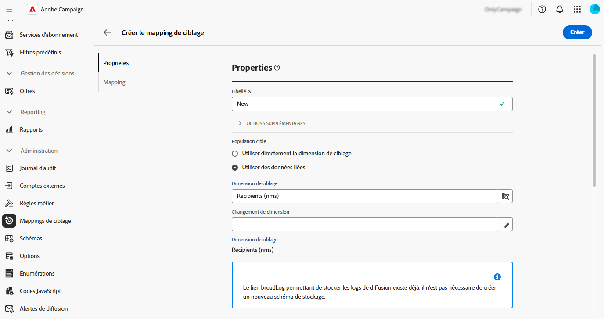
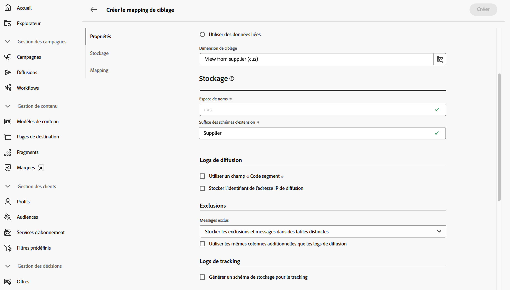
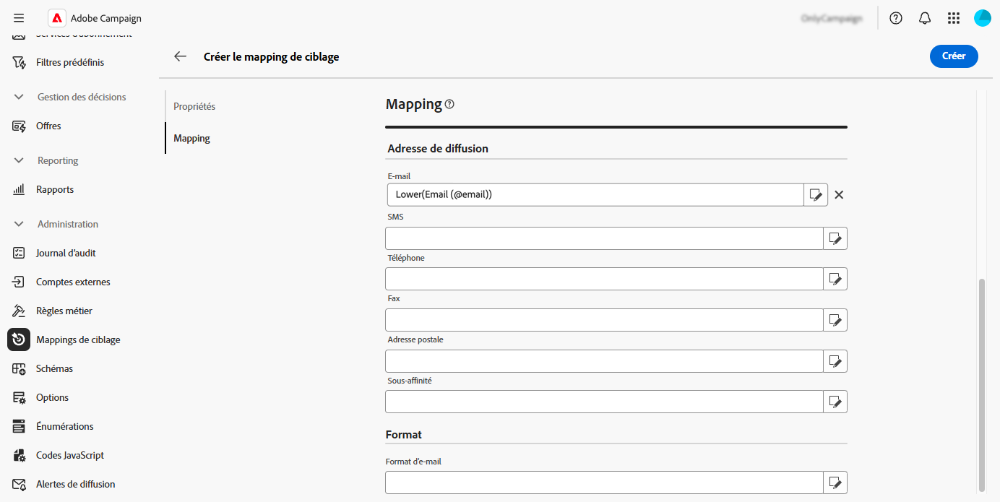
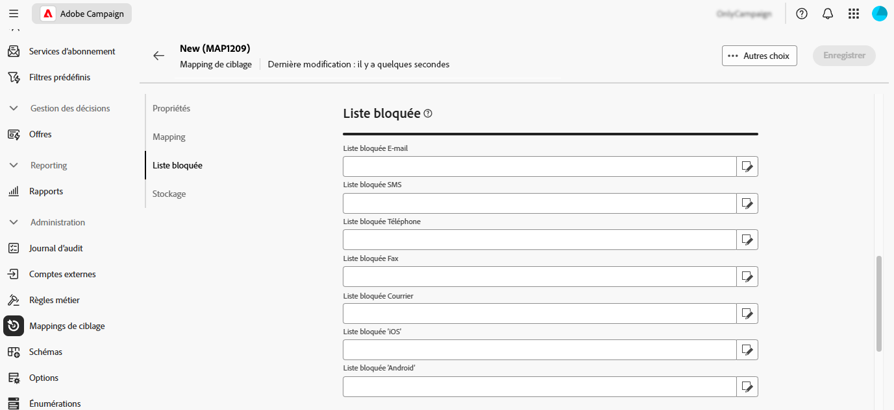
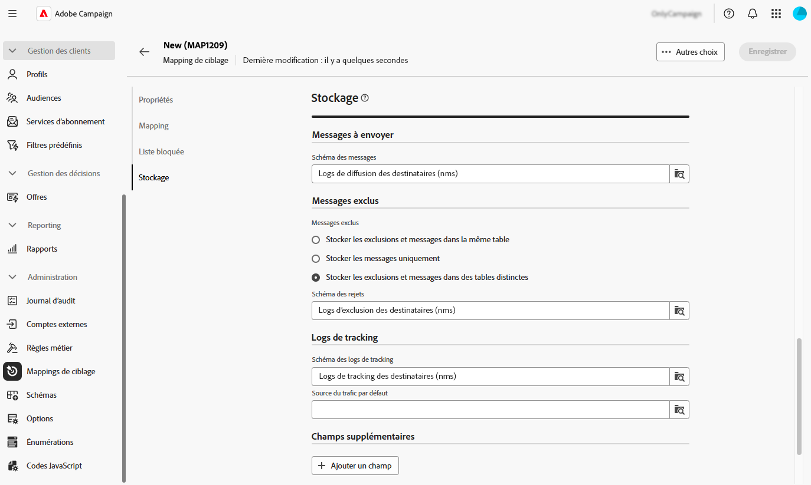
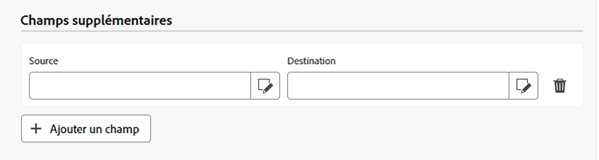

# Gérer les mappings de ciblage {#target-mappings}

>[!CONTEXTUALHELP]
>id="acw_homepage_welcome_rn4"
>title="Mappings de ciblage"
>abstract="Vous pouvez désormais créer des mappings de ciblage dans l’interface d’utilisation web de Campaign. Les mappings de ciblage définissent la manière dont différents canaux de diffusion (e-mails, SMS, notifications push) sont liés aux champs de données d’un schéma."
>additional-url="https://experienceleague.adobe.com/docs/campaign-web/v8/release-notes/release-notes.html?lang=fr" text="Voir les notes de mise à jour"

>[!CONTEXTUALHELP]
>id="acw_targetmapping_list"
>title="Mappings de ciblage "
>abstract="Mappings de ciblage"

## À propos des mappings de ciblage {#about}

Chaque canal de communication utilise un mapping de ciblage par défaut pour cibler ses destinataires. Par défaut, les modèles de diffusion par e-mail et SMS ciblent les **[!UICONTROL destinataires]**. Leur mapping de ciblage utilise donc les champs de la table **nms:recipient**. Pour les notifications push, le mapping de ciblage par défaut est **Applications abonnées (nms:appSubscriptionRcp)**, qui est lié au tableau des destinataires.

Les mappings de ciblage sont accessibles à partir du menu **[!UICONTROL Administration]** > **[!UICONTROL Mappings de ciblage]**. Depuis cet écran, vous pouvez accéder aux détails de chaque mapping de ciblage ou en créer de nouveaux en fonction de vos besoins.

Pour plus d’informations sur les mappings de ciblage intégrés fournis avec Adobe Campaign, reportez-vous à la [documentation de la console cliente Campaign v8](https://experienceleague.adobe.com/docs/campaign/campaign-v8/audience/add-profiles/target-mappings.html?lang=fr){target="_blank"}.

## Créer un mapping de ciblage {#create-mapping}

>[!CONTEXTUALHELP]
>id="acw_targetmapping_properties"
>title="Propriétés du mapping de ciblage"
>abstract="La section **[!UICONTROL Propriétés]** vous permet de définir des paramètres génériques pour le mapping de ciblage et la population ciblée."

>[!CONTEXTUALHELP]
>id="acw_targetmapping_mapping"
>title="Mapping du mapping de ciblage"
>abstract="La section **[!UICONTROL Mapping]** vous permet d’identifier les attributs du schéma du mapping de ciblage à utiliser pour les différents champs d’adresses de diffusion."

>[!CONTEXTUALHELP]
>id="acw_targetmapping_denylist"
>title="Liste bloquée du mapping de ciblage"
>abstract="Liste bloquée du mapping de ciblage"

>[!CONTEXTUALHELP]
>id="acw_targetmapping_storage"
>title="Stockage du mapping de ciblage"
>abstract="La section **[!UICONTROL Stockage]** vous permet d’identifier l’emplacement où les logs doivent être stockés."

Pour créer un mapping de ciblage, accédez au menu **[!UICONTROL Administration]** > **[!UICONTROL Mappings de ciblage]**. Cliquez sur le bouton **[!UICONTROL Créer un mapping]**, puis suivez les étapes présentées dans les sections ci-dessous.

1. Dans la section **[!UICONTROL Propriétés]**, saisissez un **[!UICONTROL Libellé]** pour le mapping de ciblage.

1. Développez la section **[!UICONTROL Options supplémentaires]** pour configurer les paramètres avancés, tels que le nom interne du mapping de ciblage, son dossier de stockage et sa description.

1. Sélectionnez la population cible. Vous pouvez, au choix, effectuer ce qui suit :

   * **[!UICONTROL Utiliser directement la dimension de ciblage]** : sélectionnez la dimension à cibler directement dans la liste des dimensions disponibles.
   * **[!UICONTROL Utiliser les données liées]** : démarrez d’une dimension de ciblage (par exemple, les abonnements), puis passez à la dimension de ciblage que vous souhaitez cibler (par exemple, les destinataires).

   

1. Si la dimension sélectionnée n’est pas déjà utilisée par un mapping de ciblage existant, les schémas pour stocker les logs doivent être créés. D’autres options sont disponibles dans la section **[!UICONTROL Stockage]**. Pour plus d’informations, développez la section ci-dessous.

   +++Options de stockage pour les nouvelles dimensions de ciblage

   1. **[!UICONTROL Espace de noms]** : identifiez l’espace de noms qui sera utilisé pour créer les logs.
   1. **[!UICONTROL Suffixe du schéma d’extension]** : indiquez un suffixe pour le nouveau schéma.

      Dans l’exemple ci-dessous, le nom du broadlog est « cusbroadlogSupplier ».

      

   1. **[!UICONTROL Logs de diffusion]** : activez les options de cette section pour enrichir les logs d’envoi avec un champ de code segment ou un champ contenant l’adresse IP de diffusion. Par exemple, enregistrez un code segment calculé pendant le workflow dans les logs d’envoi afin d’affiner la cible ultérieurement. Cela permet de cibler les profils avec ce code segment spécifique.

   1. **[!UICONTROL Exclusions]** : indiquez comment stocker les logs d’exclusions.

   1. **[!UICONTROL Logs de tracking]** : activez l’option **[!UICONTROL Générer un schéma pour le tracking]** afin de générer un schéma de stockage pour les logs de tracking.

   +++

1. Utilisez la section **[!UICONTROL Mapping]** pour identifier les attributs du schéma du mapping de ciblage à utiliser pour chaque champ d’adresse de diffusion. Pour chaque champ, sélectionnez l’attribut souhaité à mapper. Vous pouvez également créer une expression pour identifier le champ. Par exemple, appliquez une fonction inférieure à l’attribut address.

   

1. Lorsque votre mapping de ciblage est prêt, cliquez sur le bouton **[!UICONTROL Créer]**. Le système crée automatiquement le mapping de ciblage et tous les schémas associés pour les logs.

Une fois votre mapping de ciblage créé, deux sections supplémentaires s’affichent à l’écran :

* **[!UICONTROL Liste bloquée]** : cette section permet d’identifier les attributs du schéma du mapping de ciblage à utiliser pour les listes bloquées.

  

* **[!UICONTROL Stockage]** : cette section permet d’identifier les tables à utiliser pour stocker les logs.

  

   * **[!UICONTROL Schéma des messages]** : identifie le schéma à utiliser pour stocker les logs d’envoi.
   * **[!UICONTROL Messages exclus]** : explique comment gérer le stockage des logs de diffusion et d’exclusion.

      * **[!UICONTROL Stocker les exclusions et les messages dans le même tableau]**
      * **[!UICONTROL Stocker les messages uniquement]** : ne pas stocker les exclusions.
      * **[!UICONTROL Stocker les exclusions et les messages dans des tableaux distincts]** : sélectionnez le schéma à utiliser pour stocker les logs d’exclusion dans le champ **[!UICONTROL Schéma de rejet]**.

   * **[!UICONTROL Logs de tracking]** : choisissez où stocker les logs de tracking et la source du trafic par défaut.
   * **[!UICONTROL Champs supplémentaires]** : indique une liste de champs supplémentaires à stocker dans les logs de diffusion. Ces champs peuvent stocker en permanence des informations sur les personnes individuelles de la cible (par exemple, `recipient/@firstName`) ou stocker des données supplémentaires calculées pendant le workflow (par exemple, `[targetData/@offeCode]`).

     Pour ce faire, sélectionnez **[!UICONTROL Ajouter un champ]**. Identifiez les informations à enregistrer dans le champ **[!UICONTROL Source]** et l’attribut à utiliser dans les logs d’envoi pour enregistrer ces informations dans le champ **[!UICONTROL Destination]**.

     {width="50%" zoomable="yes"}