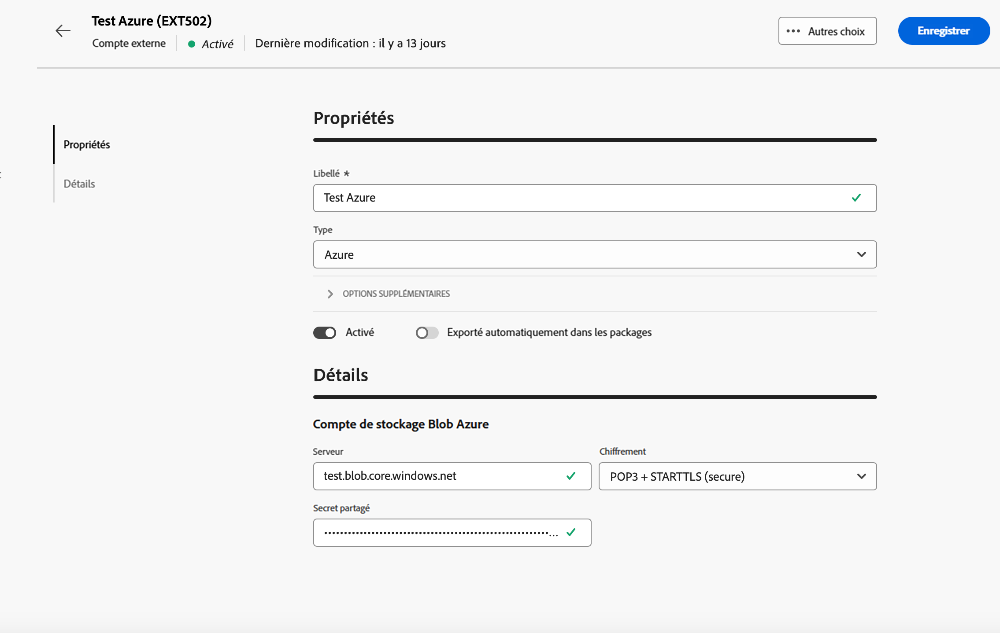

# Comptes externes de transfert de données {#transfer-external-account}

## Amazon Simple Storage Service (S3) {#amazon-simple-storage-service--s3--external-account}

Le connecteur Amazon Simple Storage Service (S3) peut être utilisé pour importer ou exporter des données vers Adobe Campaign. Il peut être configuré dans une activité de workflow. Pour plus d’informations, consultez [cette page](https://experienceleague.adobe.com/fr/docs/campaign-web/v8/wf/design-workflows/transfer-file){target=_blank}.

Lors de la configuration de ce nouveau compte externe, vous devez indiquer les informations suivantes :

* **[!UICONTROL Serveur du compte AWS S3]**

  URL du serveur qui doit être renseignée de la manière suivante :

  `  <S3bucket name>.s3.amazonaws.com/<s3object path>`

* **[!UICONTROL ID de la clé d&#39;accès AWS]**

  Pour savoir où trouver votre ID de la clé d’accès AWS, consultez cette [page](https://docs.aws.amazon.com/general/latest/gr/aws-sec-cred-types.html#access-keys-and-secret-access-keys).

* **[!UICONTROL Clé d&#39;accès secrète à AWS]**

  Pour savoir où trouver votre clé d&#39;accès secrète à AWS, consultez [cette page](https://aws.amazon.com/fr/blogs/security/wheres-my-secret-access-key/).

* **[!UICONTROL Région AWS]**

  Pour en savoir plus sur la région AWS, consultez cette [page](https://aws.amazon.com/fr/about-aws/global-infrastructure/regions_az/).

* La case à cocher **[!UICONTROL Utiliser le chiffrement coté serveur]** vous permet de stocker votre fichier en mode chiffré dans S3.

Pour savoir où trouver l’ID de la clé d’accès et la clé d’accès secrète, consultez la [documentation](https://docs.aws.amazon.com/general/latest/gr/aws-sec-cred-types.html#access-keys-and-secret-access-keys) d’Amazon Web Services.

## Stockage Azure Blob {#azure-blob-external-account}

Le compte externe **[!UICONTROL Stockage Blob Azure]** peut être utilisé pour importer ou exporter des données vers Adobe Campaign à l’aide d’une activité de workflow **[!UICONTROL Transfert de fichier]**. Pour plus d’informations, consultez [cette section](https://experienceleague.adobe.com/fr/docs/campaign-web/v8/wf/design-workflows/transfer-file){target=_blank}.

Pour configurer le **[!UICONTROL compte externe Azure]** afin de l’utiliser avec Adobe Campaign, vous devez fournir les détails suivants :

* **[!UICONTROL Serveur]**

  URL de votre serveur de stockage Azure Blob.

* **[!UICONTROL Chiffrement]**

  Type de chiffrement choisi entre **[!UICONTROL Aucun]** et **[!UICONTROL SSL]**.

* **[!UICONTROL Clé d’accès]**

  Pour savoir où trouver votre **** clé d’accès[, consultez cette page](https://docs.microsoft.com/fr-fr/azure/storage/common/storage-account-keys-manage?tabs=azure-portal).

## SFTP

Le compte externe SFTP permet de configurer et de tester l’accès à un serveur en dehors d’Adobe Campaign.

Pour configurer le compte externe **[!UICONTROL SFTP]**, renseignez les champs suivants :

* **[!UICONTROL Serveur]**

  Saisissez le nom ou l’adresse du serveur SFTP.

* **[!UICONTROL Port]**

  Spécifiez le numéro de port de connexion SFTP. Le port par défaut est 22.

* **[!UICONTROL Compte]**

  Saisissez le nom d’utilisateur ou d’utilisatrice utilisé pour se connecter au serveur SFTP.

* **[!UICONTROL Mot de passe]**

  Saisissez le mot de passe du compte SFTP.

* **[!UICONTROL Type d’authentification SFTP]**

  Choisissez la méthode d’authentification auprès du serveur SFTP. Les options incluent :

   * **[!UICONTROL Mot de passe]** : authentifiez-vous à l’aide du mot de passe du compte.

   * **[!UICONTROL Clé publique]** : authentifiez-vous à l’aide d’une paire de clés SSH (clés privée et publique).

Si l’authentification par **[!UICONTROL Clé publique]** est sélectionnée, les champs suivants doivent être renseignés :

* **[!UICONTROL Fichier de clé privée]**

  Spécifiez le fichier de clé SSH privée utilisé pour l’authentification.

* **[!UICONTROL Fichier de clé publique]**

  Spécifiez la clé SSH publique correspondante enregistrée sur le serveur SFTP.

* **[!UICONTROL Phrase secrète de la clé SSH]**

  Saisissez la phrase secrète pour déchiffrer la clé privée si elle est protégée.

## HTTP

Le compte externe HTTP permet de configurer et de tester l’accès à un serveur en dehors d’Adobe Campaign.

Pour configurer le compte externe **[!UICONTROL HTTP]**, renseignez les champs suivants :

* **[!UICONTROL Serveur]**

  Saisissez le nom ou l’adresse du serveur HTTP.

* **[!UICONTROL Port]**

  Spécifiez le numéro de port de connexion HTTP. Le port par défaut est 80.

* **[!UICONTROL Compte]**

  Saisissez le nom d’utilisateur ou d’utilisatrice pour l’authentification.

* **[!UICONTROL Mot de passe]**

  Saisissez le mot de passe associé au compte d’utilisateur ou d’utilisatrice.

* **[!UICONTROL Type d’authentification SFTP]**

  Sélectionnez le type d’authentification de la connexion. Les options incluent :

   * Mot de passe
   * Clé publique

Si vous utilisez l’authentification par **[!UICONTROL clé publique]**, dans le menu **[!UICONTROL Authentification PublicKey]**, saisissez les valeurs requises pour :

* **[!UICONTROL Mot de passe]** : phrase secrète protégeant la clé privée, le cas échéant.

* **[!UICONTROL Clé privée]** : clé privée utilisée pour authentifier le compte Snowflake.

## FTP

Le compte externe FTP permet de configurer et de tester l’accès à un serveur en dehors d’Adobe Campaign.

Pour configurer le compte externe **[!UICONTROL FTP]**, renseignez les champs suivants :

* **[!UICONTROL Serveur]**

  Saisissez le nom ou l’adresse du serveur FTP.

* **[!UICONTROL Port]**

  Spécifiez le numéro de port de connexion FTP. Le port par défaut est 21.

* **[!UICONTROL Compte]**

  Saisissez le nom d’utilisateur ou d’utilisatrice pour l’authentification.

* **[!UICONTROL Mot de passe]**

  Saisissez le mot de passe associé au compte d’utilisateur ou d’utilisatrice.

* **[!UICONTROL Chiffrement]**

  Sélectionnez le type de chiffrement de la connexion. Les options incluent :

   * Par défaut
   * POP3 + STARTTLS
   * POP3 non sécurisé
   * POP3 sécurisé
