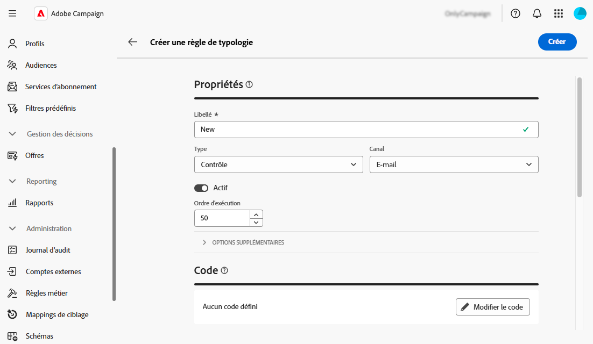

# Utilisation des règles métier (typologies) {#typologies}

>[!CONTEXTUALHELP]
>id="acw_homepage_welcome_rn1"
>title="Règles métier"
>abstract="Vous pouvez désormais créer des typologies et des règles de typologie dans l’interface utilisateur web d’Adobe Campaign. Les typologies vous permettent de contrôler, de filtrer et de hiérarchiser l’envoi des diffusions."
>additional-url="https://experienceleague.adobe.com/docs/campaign-web/v8/release-notes/release-notes.html?lang=fr" text="Voir les notes de mise à jour"

>[!CONTEXTUALHELP]
>id="acw_business_rules"
>title="Typologies et règles de typologie"
>abstract="Les typologies vous permettent de normaliser les pratiques commerciales, sur toutes les diffusions. Une typologie est un ensemble de règles de typologie qui permet de contrôler, filtrer et prioriser l’envoi des diffusions. Les profils qui correspondent à des critères dans une règle de typologie sont exclus des audiences de diffusion lors de la phase de préparation."

## À propos des typologies

Les typologies vous permettent de normaliser les pratiques commerciales, sur toutes les diffusions. Une **typologie** est un ensemble de **règles de typologie** qui vous permet de contrôler, de filtrer et de hiérarchiser l’envoi des diffusions. Les profils qui correspondent à des critères dans une règle de typologie sont exclus des audiences de diffusion lors de la phase de préparation.

Les typologies s’assurent que vos diffusions contiennent toujours certains éléments (tels qu’un lien de désinscription ou une ligne d’objet) ou des règles de filtrage pour exclure des groupes de votre cible visée (tels que les désabonnés, les concurrents ou les clients non fidèles).

Les typologies sont accessibles à partir du menu **[!UICONTROL Administration]** > **[!UICONTROL Règles métier]**. Depuis cet écran, vous pouvez accéder à toutes les typologies et règles de typologie existantes, ou en créer de nouvelles en fonction de vos besoins.

>[!NOTE]
>
>La liste **[!UICONTROL Règles de typologie]** affiche toutes les règles existantes créées à ce jour dans l’interface utilisateur web ou la console cliente. Toutefois, seules les règles **Contrôle** et **Filtrage** peuvent être créées dans l’interface utilisateur web. Pour créer d’autres types de règles de typologie telles que les règles de pression ou de capacité, utilisez la console cliente Campaign v8. [Découvrez comment créer des règles de typologie dans la console cliente](https://experienceleague.adobe.com/fr/docs/campaign/automation/campaign-optimization/campaign-typologies){target="_blank"}

Les principales étapes pour appliquer des typologies à vos messages sont les suivantes :

1. [Créer une typologie](#typology).
1. [Créer des règles de typologie](#typology-rules).
1. [Règles de typologie de référence dans la typologie](#add-rules).
1. [Appliquer la typologie à un message](#message).

## Création d’une typologie {#typology}

>[!CONTEXTUALHELP]
>id="acw_business_rules_typology_properties"
>title="Propriétés de la typologie"
>abstract="Définissez les propriétés de la typologie et développez la section **[!UICONTROL Options supplémentaires]** pour accéder aux paramètres avancés. Utilisez le champ **[!UICONTROL Affinité IP]** pour associer les affinités IP aux typologies. Vous pouvez ainsi mieux contrôler le trafic SMTP sortant en définissant les adresses IP spécifiques qui peuvent être utilisées pour chaque affinité."

>[!CONTEXTUALHELP]
>id="acw_business_rules_typology_ip_affinity"
>title="Affinité avec l’adresse IP"
>abstract="La gestion des affinités avec les adresses IP permet un meilleur contrôle du trafic SMTP sortant en associant différentes adresses IP à chaque type de trafic selon la typologie de son action de diffusion."

Pour créer une typologie, procédez comme suit :

1. Accédez au menu **[!UICONTROL Règles métier]** puis sélectionnez l’onglet **[!UICONTROL Typologie]**.

1. Cliquez sur le bouton **[!UICONTROL Créer une typologie]** et saisissez un **[!UICONTROL Libellé]** pour la typologie.

1. Développez la section **[!UICONTROL Options supplémentaires]** pour définir des paramètres avancés tels que le nom interne de la typologie, le dossier de stockage et la description.

   

   >[!NOTE]
   >
   >Le champ **[!UICONTROL Affinité IP]** vous permet d’associer des affinités IP à des typologies. Vous pouvez ainsi mieux contrôler le trafic SMTP sortant en définissant les adresses IP spécifiques qui peuvent être utilisées pour chaque affinité.  Vous pouvez, par exemple, utiliser une affinité par pays ou sous-domaine. Vous pouvez ensuite créer une typologie par pays et associer chaque affinité à la typologie correspondante.

1. Cliquez sur **[!UICONTROL Créer]** pour confirmer la création de la typologie.

La typologie ouvre les détails. Dans cet écran, vous pouvez référencer directement les règles de typologie existantes. Vous pouvez également créer des règles de typologie et les référencer ultérieurement dans la typologie :
* [Découvrez comment créer une règle de typologie](#add-rules)
* [Découvrez comment référencer des règles dans une typologie](#add-rules)

## Création d’une règle de typologie {#typology-rule}

>[!CONTEXTUALHELP]
>id="acw_business_rules_typology_rules_properties"
>title="Propriétés de la règle de typologie"
>abstract="Définissez les propriétés de la règle de typologie. Les règles **Contrôle** vérifient la qualité et la validité de l’envoi préalable des messages, tandis que les règles **Filtrage** excluent des segments de l’audience cible en fonction de critères spécifiques.  Vous pouvez également modifier l’ordre d’exécution de la règle pour gérer la séquence d’exécution des règles de typologie lorsque plusieurs règles du même type sont exécutées au cours de la même phase de traitement des messages."

Pour créer une règle de typologie, accédez au menu **[!UICONTROL Règles métier]** puis sélectionnez l’onglet **[!UICONTROL Règles de typologie]**.

Cliquez sur le bouton **[!UICONTROL Créer une règle de typologie]** puis suivez les étapes détaillées ci-dessous.

### Définition des propriétés de la règle de typologie {#properties}

Définissez les propriétés de la règle de typologie :

1. Saisissez un **[!UICONTROL Libellé]** pour la règle.

   

1. Sélectionnez le **[!UICONTROL type]** de la règle de typologie :

   * **Contrôle** : garantit la qualité et la validité de la pré-envoi du message (affichage des caractères, longueur du SMS, format d’adresse, raccourcissement des URL, par exemple). Ils sont créés à l’aide d’une interface de script pour définir une logique complexe pour les vérifications et modifications de contenu.

   * Les règles **Filtrage** excluent des segments de l’audience cible en fonction de critères spécifiques (par exemple, l’âge, la localisation, le pays, les numéros de téléphone). Ces règles sont liées à une dimension de ciblage.

   >[!NOTE]
   >
   >Pour l’instant, seules les règles de typologie **Contrôle** et **Filtrage** peuvent être créées à partir de l’interface utilisateur web. Pour créer d’autres types de règles, utilisez la console cliente . [Découvrez comment créer des règles de typologie dans la console cliente](https://experienceleague.adobe.com/fr/docs/campaign/automation/campaign-optimization/campaign-typologies){target="_blank"}

1. Sélectionnez un **[!UICONTROL Canal]** à associer à la règle.

1. Désactivez l’option **[!UICONTROL Actif]** si vous ne souhaitez pas que la règle soit active juste après sa création.

1. Définissez la règle **[!UICONTROL Ordre d’exécution]**.

   Par défaut, l’ordre des règles de typologie est défini sur 50. Vous pouvez adapter cette valeur pour gérer la séquence d’exécution des règles de typologie lorsque plusieurs règles d’un même type sont exécutées au cours de la même phase de traitement des messages. Par exemple, une règle de filtrage avec un ordre d’exécution de 20 est exécutée avant une règle de filtrage avec un ordre d’exécution de 30.

1. Développez la section **[!UICONTROL Options supplémentaires]** pour accéder aux paramètres avancés tels que le nom interne de la règle, le stockage du dossier et la description.

1. Pour les règles de contrôle, deux règles supplémentaires sont disponibles dans les options supplémentaires. Ils vous permettent de spécifier le moment où la règle doit s’appliquer et son niveau d’alerte :

   * **[!UICONTROL Phase]** : ce champ vous permet d’indiquer à quelle étape du cycle de vie de la diffusion la règle sera appliquée. Sélectionnez la valeur à appliquer dans la liste déroulante **[!UICONTROL Phase]**. Développez la section ci-dessous pour plus de détails sur les valeurs possibles.

   +++Phases des règles de contrôle :

   **[!UICONTROL Au début du ciblage]** : pour éviter que l&#39;étape de personnalisation ne soit exécutée en cas d&#39;erreur, vous pouvez appliquer la règle de contrôle ici.

   **[!UICONTROL Après ciblage]** : si vous avez besoin de connaître le volume de la cible pour appliquer la règle de pilotage, sélectionnez cette phase. Par exemple, la règle de contrôle Vérification de la taille des BAT s&#39;applique obligatoirement après chaque étape de ciblage : cette règle permet de ne pas préparer la personnalisation des messages si les destinataires du BAT sont trop nombreux.

   **[!UICONTROL Au début de la personnalisation]** : cette phase doit être sélectionnée si le contrôle porte sur la validation de la personnalisation du message. La personnalisation des messages est réalisée au cours de la phase d’analyse.

   **[!UICONTROL À la fin de l’analyse]** :lorsqu’une vérification nécessite que la personnalisation du message soit terminée, sélectionnez cette phase.

+++

   * **[!UICONTROL Niveau]** : cette option permet de définir le niveau d’alerte de la règle. Développez la section ci-dessous pour plus d’informations.

   +++Niveaux des règles de contrôle :

   **[!UICONTROL Erreur]** : arrêtez la préparation du message.

   **[!UICONTROL Avertissement]** : affichez un avertissement dans les journaux de préparation.

   **[!UICONTROL Info]** : permet d’afficher des informations dans les logs de préparation.

   <!--**[!UICONTROL Status]**:-->

   **[!UICONTROL Verbose]** : affichage d’informations dans les journaux du serveur.

+++

### Créer le contenu de la règle {#build}

>[!CONTEXTUALHELP]
>id="acw_business_rules_typology_rules_filtering"
>title="Filtrage"
>abstract="Les règles **Filtrage** excluent des segments de l’audience cible en fonction de critères spécifiques (par exemple, l’âge, la localisation, le pays, les numéros de téléphone). Sélectionnez la dimension de ciblage de la règle de typologie et cliquez sur le bouton **[!UICONTROL Ajouter des règles]** pour accéder au moteur de requête et créer la règle."

>[!CONTEXTUALHELP]
>id="acw_business_rules_typology_rules_code"
>title="Code"
>abstract="**Contrôle** les règles vérifient la qualité et la validité de la pré-envoi des messages (par exemple, affichage des caractères, longueur du SMS, format d’adresse, raccourcissement des URL). Ils sont créés à l’aide du code JavaScript."

Une fois les propriétés de la règle de typologie définies, vous pouvez créer le contenu de la règle.

* Pour **Règles de contrôle**, cliquez sur le bouton **Modifier le code** et saisissez la logique de la règle à l’aide de JavaScript. Dans l’exemple ci-dessous, nous créons une règle pour afficher un avertissement dans les journaux si la cible est vide.

  

* Pour **Règles de filtrage**, sélectionnez la dimension de ciblage et cliquez sur le bouton **[!UICONTROL Ajouter des règles]** pour définir les critères de filtrage à l&#39;aide du [modéliseur de requêtes](../query/query-modeler-overview.md).

  

Lorsque votre règle est prête, cliquez sur le bouton **[!UICONTROL Créer]** pour créer la règle de typologie. Vous pouvez désormais référencer la règle dans une typologie afin de l’appliquer aux messages.

## Règles de typologie de référence dans une typologie {#add-rules}

Pour référencer une ou plusieurs règles dans une typologie, procédez comme suit :

1. Accédez à l’onglet **[!UICONTROL Typologie]** et ouvrez la typologie dans laquelle vous souhaitez référencer la ou les règles.

1. Sélectionnez l’onglet **[!UICONTROL Règles de typologie]** et cliquez sur le bouton **[!UICONTROL Ajouter une ou plusieurs règles de typologie]** .

   

1. Sélectionnez une ou plusieurs règles de typologie à associer à la typologie et confirmez.

   

1. Cliquez sur **[!UICONTROL Enregistrer]**.

Vous pouvez maintenant appliquer la typologie aux messages. Une fois cette opération terminée, toutes les règles de typologie sélectionnées seront exécutées pour effectuer les vérifications définies.

## Application de typologies aux messages {#message}

Pour appliquer une typologie à un message ou à un modèle de message, vous devez sélectionner la typologie dans les paramètres du message. [Découvrez comment configurer les paramètres de diffusion](../advanced-settings/delivery-settings.md#typology)

Une fois cette opération terminée, les règles de typologie incluses dans la typologie sont exécutées pour vérifier la validité de la diffusion pendant la préparation du message. Les profils qui correspondent à des critères inclus dans une règle de typologie sont exclus des audiences de diffusion.
