# Utiliser les règles métier (typologies) {#typologies}

>[!CONTEXTUALHELP]
>id="acw_homepage_welcome_rn3"
>title="Règles métier"
>abstract="Vous pouvez désormais créer des typologies et des règles de typologie dans l’interface d’utilisation web d’Adobe Campaign. Les typologies permettent de contrôler, de filtrer et de hiérarchiser l’envoi des diffusions."
>additional-url="https://experienceleague.adobe.com/docs/campaign-web/v8/release-notes/release-notes.html?lang=fr" text="Voir les notes de mise à jour"

>[!CONTEXTUALHELP]
>id="acw_business_rules"
>title="Typologies et règles de typologie"
>abstract="Les typologies vous permettent de normaliser les pratiques commerciales de l’ensemble des diffusions. Une typologie est un ensemble de règles de typologie qui permet de contrôler, filtrer et prioriser l’envoi des diffusions. Les profils qui correspondent à des critères dans une règle de typologie sont exclus des audiences de diffusion lors de la phase de préparation."

>[!CONTEXTUALHELP]
>id="acw_business_rules_typology_rules_type"
>title="Filtrage"
>abstract=" Deux types de règles de typologie sont disponibles : les règles   **Contrôle** qui assurent la qualité et la validité des messages avant leur envoi (par exemple, l’affichage des caractères, la longueur des SMS, le format des adresses ou le raccourcissement des URL). Les règles   **Filtrage** excluent des segments de l’audience cible en fonction de critères spécifiques (par exemple, l’âge, l’adresse, le pays ou les numéros de téléphone)."

## À propos des typologies

Les typologies vous permettent de normaliser les pratiques commerciales de l’ensemble des diffusions. Une **typologie** est un ensemble de **règles de typologie** qui permet de contrôler, filtrer et ajuster la priorité de l’envoi des diffusions. Les profils qui correspondent à des critères dans une règle de typologie sont exclus des audiences de diffusion lors de la phase de préparation.

Les typologies vous permettent de vous assurer que vos diffusions contiennent toujours certains éléments, comme un lien de désabonnement ou un objet, ou des règles de filtrage pour exclure des groupes de votre cible visée, tels que la clientèle désabonnée, les concurrents et les clientes et clients ne faisant pas partie du programme de fidélité.

Les typologies sont accessibles via le menu **[!UICONTROL Administration]** > **[!UICONTROL Règles métier]**. À partir de cet écran, accédez à toutes les typologies et règles de typologie existantes, ou créez-en de nouvelles en fonction de vos besoins.

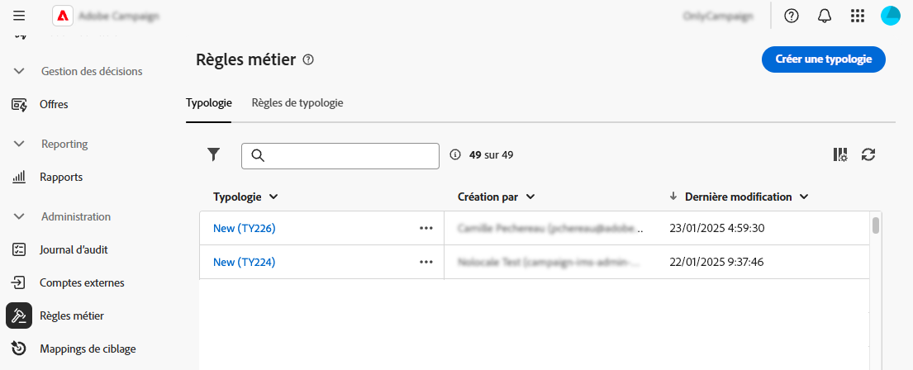

>[!NOTE]
>
>La liste **[!UICONTROL Règles de typologie]** affiche toutes les règles existantes créées à ce jour dans l’interface d’utilisation web ou la console cliente. Toutefois, seules les règles **Contrôle** et **Filtrage** peuvent être créées dans l’interface d’utilisation web. Pour créer d’autres types de règles de typologie, par exemple des règles de pression ou de capacité, utilisez la console cliente de Campaign v8. [Découvrir comment créer des règles de typologie dans la console cliente](https://experienceleague.adobe.com/fr/docs/campaign/automation/campaign-optimization/campaign-typologies){target="_blank"}

Voici les principales étapes à suivre pour appliquer des typologies à vos messages :

1. [Créez une typologie](#typology).
1. [Créez des règles de typologie](#typology-rule).
1. [Référencez les règles de typologie dans la typologie](#add-rules).
1. [Appliquez la typologie à un message](#message).

## Créer une typologie {#typology}

>[!CONTEXTUALHELP]
>id="acw_business_rules_typology_properties"
>title="Propriétés de la typologie"
>abstract="Définissez les propriétés de la typologie et développez la section **[!UICONTROL Options supplémentaires]** pour accéder aux paramètres avancés. Utilisez le champ **[!UICONTROL Affinité IP]** pour associer des affinités IP aux typologies. Cela vous permet de mieux contrôler le trafic SMTP sortant en définissant des adresses IP spécifiques qui peuvent être utilisées pour chaque affinité."

>[!CONTEXTUALHELP]
>id="acw_business_rules_typology_ip_affinity"
>title="Affinité avec l’adresse IP"
>abstract="La gestion des affinités avec les adresses IP permet un meilleur contrôle du trafic SMTP sortant en associant différentes adresses IP à chaque type de trafic selon la typologie de son action de diffusion."

Pour créer une typologie, procédez comme suit :

1. Accédez au menu **[!UICONTROL Règles métier]**, puis sélectionnez l’onglet **[!UICONTROL Typologie]**.

1. Cliquez sur le bouton **[!UICONTROL Créer une typologie]** et saisissez un **[!UICONTROL Libellé]** pour la typologie.

1. Développez la section **[!UICONTROL Options supplémentaires]** pour configurer les paramètres avancés, tels que le nom interne de la typologie, son dossier de stockage et sa description.

   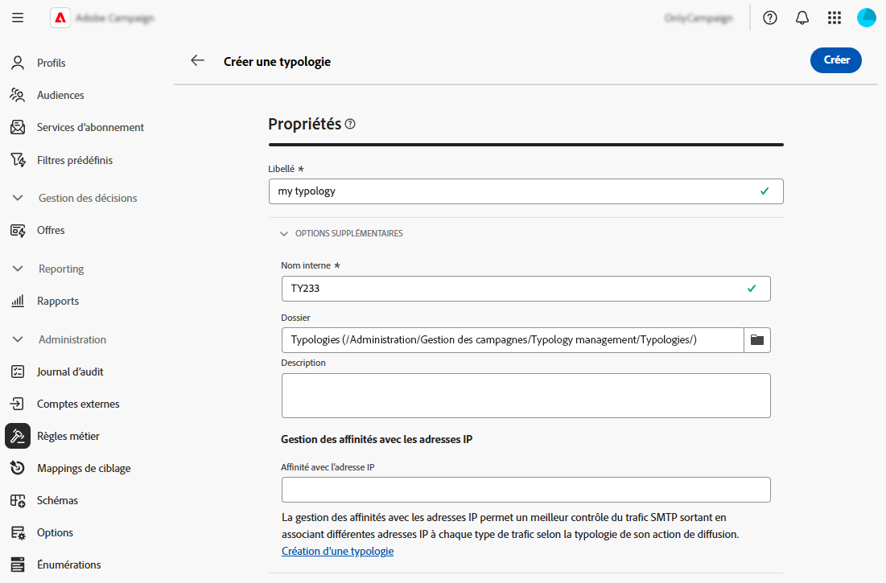

   >[!NOTE]
   >
   >Le champ **[!UICONTROL Affinité IP]** vous permet d’associer des affinités IP à des typologies. Cela vous permet de mieux contrôler le trafic SMTP sortant en définissant des adresses IP spécifiques qui peuvent être utilisées pour chaque affinité. Vous pouvez, par exemple, utiliser une affinité par pays ou sous-domaine. Vous pouvez ensuite créer une typologie par pays et associer chaque affinité à la typologie correspondante.

1. Cliquez sur **[!UICONTROL Créer]** pour confirmer la création de la typologie.

Les détails de la typologie s’ouvrent. Sur cet écran, référencez directement les règles de typologie existantes ou créez de nouvelles règles de typologie à référencer ultérieurement :
* [Découvrir comment créer une règle de typologie](#add-rules)
* [Découvrir comment référencer des règles dans une typologie](#add-rules)

## Créer une règle de typologie {#typology-rule}

>[!CONTEXTUALHELP]
>id="acw_business_rules_typology_rules_properties"
>title="Propriétés de la règle de typologie"
>abstract="Définissez les propriétés de la règle de typologie. Les règles **Contrôle** vérifient la qualité et la validité du message avant l’envoi, tandis que les règles **Filtrage** excluent des segments de l’audience cible en fonction de critères spécifiques.  Vous pouvez également modifier l’ordre d’exécution de la règle pour gérer la séquence d’exécution des règles de typologie lorsque plusieurs règles du même type sont exécutées au cours de la même phase de traitement des messages."

Deux types de règles de typologie sont disponibles :

* **Contrôle** : vérifie la qualité et la validité du message avant l’envoi (par exemple, l’affichage des caractères, la longueur du SMS, le format d’adresse, le raccourcissement des URL). Ces règles sont créés à l’aide d’une interface de script pour définir une logique complexe pour la vérification et la modification du contenu.

* **Filtrage** : exclut des segments de l’audience cible en fonction de critères spécifiques tels que l’âge, l’adresse, le pays ou les numéros de téléphone. Ces règles sont liées à une dimension de ciblage.

>[!NOTE]
>
>Pour l’instant, seules les règles de typologie **Contrôle** et **Filtrage** peuvent être créées à partir de l’interface d’utilisation web. Pour créer d’autres types de règles, utilisez la console cliente. [Découvrir comment créer des règles de typologie dans la console cliente](https://experienceleague.adobe.com/fr/docs/campaign/automation/campaign-optimization/campaign-typologies){target="_blank"}

Pour créer un règle de typologie, procédez comme suit :

1. Accédez au menu **[!UICONTROL Règles métier]**, puis sélectionnez l’onglet **[!UICONTROL Règles de typologie]**.

1. Cliquez sur le bouton **[!UICONTROL Créer une règle de typologie]**, puis suivez les étapes détaillées ci-dessous.

   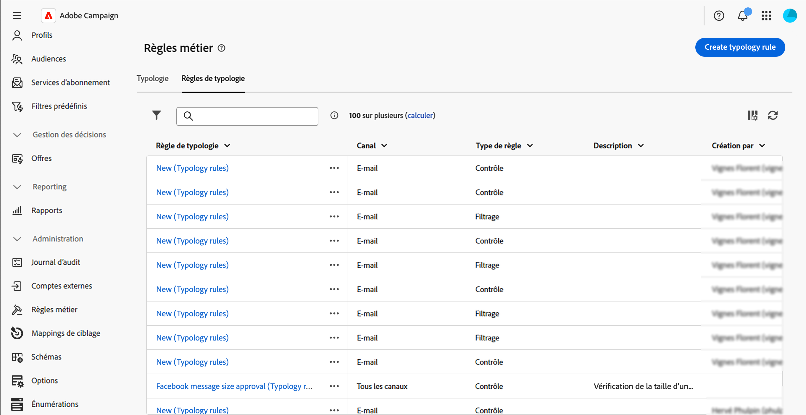

### Définir les propriétés principales de la règle {#properties}

>[!CONTEXTUALHELP]
>id="acw_business_rules_typology_rules_filtering"
>title="Filtrage"
>abstract="Les règles **Filtrage** excluent des segments de l’audience cible en fonction de critères spécifiques tels que l’âge, l’adresse, le pays ou les numéros de téléphone. Sélectionnez la dimension de ciblage de la règle de typologie et cliquez sur le bouton **[!UICONTROL Ajouter des règles]** pour accéder au concepteur de requête et créer la règle."

>[!CONTEXTUALHELP]
>id="acw_business_rules_typology_rules_code"
>title="Code"
>abstract="Les règles **Contrôle** vérifient la qualité et la validité des messages avant l’envoi (par exemple, l’affichage des caractères, la longueur du SMS, le format d’adresse, le raccourcissement des URL). Ces règles sont créées à l’aide de code JavaScript."

Voici les principales propriétés à définir lors de la création d’une règle de typologie :

>[!BEGINTABS]

>[!TAB Règles de contrôle]

1. Saisissez un **[!UICONTROL libellé]** pour la règle.

   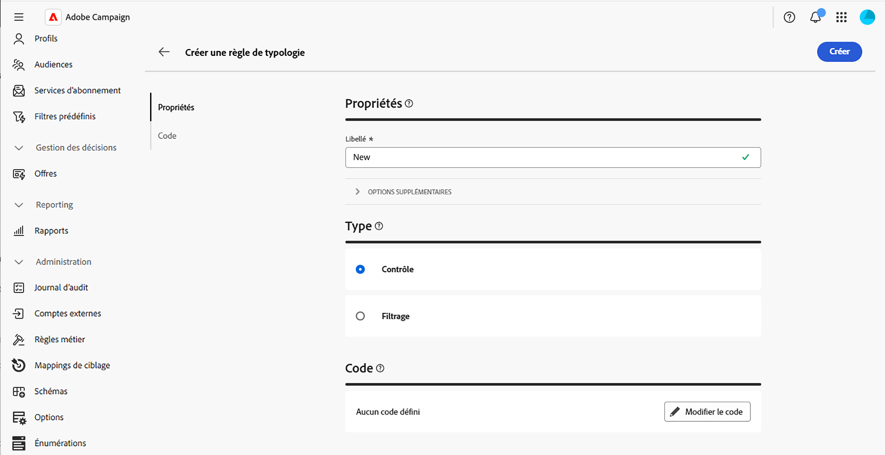

1. La section **[!UICONTROL Options supplémentaires]** vous permet d’accéder aux paramètres avancés, tels que le nom interne, le dossier de stockage et la description de la règle. Vous pouvez également indiquer le moment où la règle doit s’appliquer et son niveau d’alerte. Pour plus d’informations, développez les sections ci-dessous.

   +++Phases

   Indiquez à quelle étape du cycle de vie de la diffusion la règle sera appliquée. Sélectionnez la valeur dans la liste déroulante **[!UICONTROL Phase]**.

   * **[!UICONTROL Au début du ciblage]** : évitez l’exécution de l’étape de personnalisation en cas d’erreurs.

   * **[!UICONTROL Après le ciblage]** : si vous devez connaître le volume de la cible pour appliquer la règle de contrôle, sélectionnez cette phase. Par exemple, la règle de contrôle **[!UICONTROL Vérifier la taille du BAT]** s’applique après chaque étape de ciblage. Cette règle empêche la personnalisation des messages si les personnes destinataires du BAT sont trop nombreuses.

   * **[!UICONTROL Au début de la personnalisation]** : sélectionnez cette phase lorsque le contrôle porte sur la validation de la personnalisation des messages. La personnalisation des messages est réalisée au cours de la phase d’analyse.

   * **[!UICONTROL À la fin de l’analyse]** : effectuez des vérifications nécessitant une personnalisation complète du message.

   +++

   +++Niveau

   Indiquez le niveau d’alerte de la règle :

   * **[!UICONTROL Erreur]** : arrêtez la préparation du message.

   * **[!UICONTROL Avertissement]** : affichez un avertissement dans les logs de préparation.

   * **[!UICONTROL Info]** : affichez des informations dans les logs de préparation.

   * **[!UICONTROL Verbeux]** : affichez les informations dans les journaux du serveur.

   +++

1. Pour créer le contenu de la règle, cliquez sur le bouton **Modifier le code** et saisissez la logique de la règle en JavaScript. Dans l’exemple ci-dessous, une règle est créée pour afficher un avertissement dans les logs si la cible est vide.

   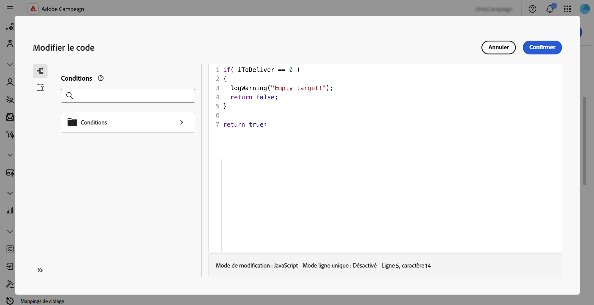

1. Cliquez sur **Créer**.

>[!TAB Règles de filtrage]

1. Saisissez un **[!UICONTROL libellé]** pour la règle.

   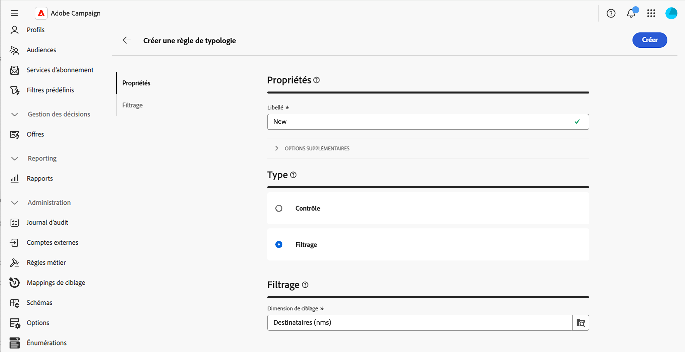

1. Développez la section **[!UICONTROL Options supplémentaires]** pour accéder aux paramètres avancés, tels que le nom interne de la règle, son dossier de stockage et sa description.

1. Pour créer le contenu de la règle, sélectionnez la dimension de ciblage et cliquez sur le bouton **[!UICONTROL Ajouter des règles]** pour définir les critères de filtrage à l’aide du [créateur de règles](../query/query-modeler-overview.md).

   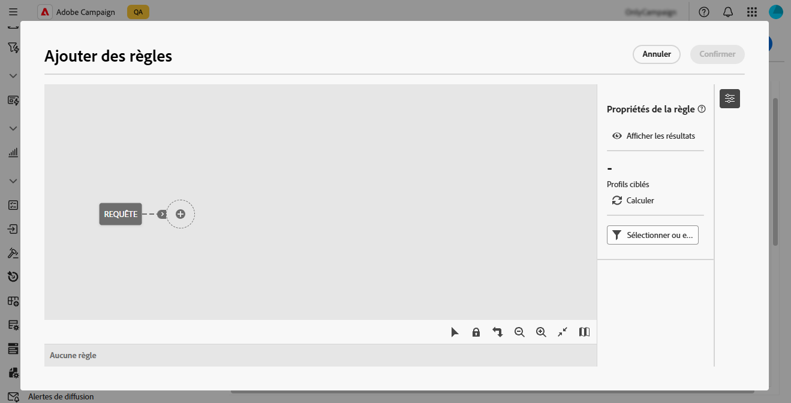

1. Cliquez sur **Créer**.

>[!ENDTABS]

### Définir les propriétés supplémentaires de la règle {#add-properties}

Définissons maintenant les paramètres supplémentaires. Sur cet écran, vous pouvez toujours modifier les propriétés principales que vous avez définies précédemment.

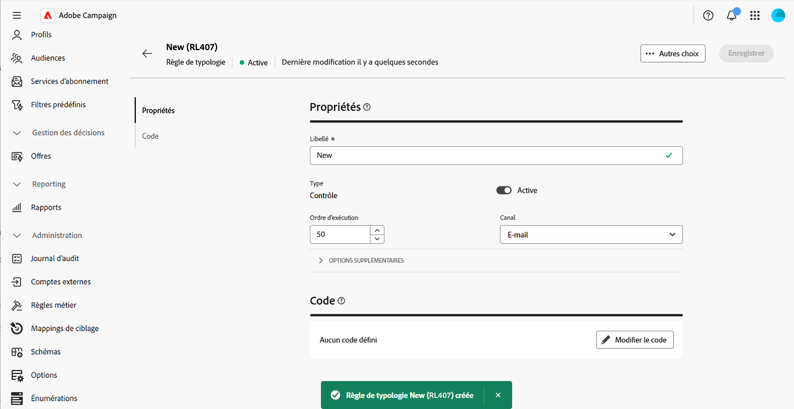

1. Désactivez l’option **[!UICONTROL Active]** si vous ne souhaitez pas que la règle soit active immédiatement après sa création.

1. Définissez l’**[!UICONTROL ordre d’exécution]** de la règle.

   Par défaut, l’ordre des règles de typologie est défini sur 50. Adaptez cette valeur pour gérer la séquence d’exécution des règles de typologie lorsque plusieurs règles d’un même type sont exécutées au cours de la même phase de traitement des messages. Par exemple, une règle de filtrage dont l’ordre d’exécution est défini sur 20 sera exécutée avant une règle de filtrage dont l’ordre d’exécution est défini sur 30.

1. Sélectionnez un **[!UICONTROL Canal]** à associer à la règle.

Votre règle peut désormais être référencée dans une typologie pour être appliquée aux messages.

## Référencer des règles de typologie dans une typologie {#add-rules}

Pour référencer une ou plusieurs règles dans une typologie, procédez comme suit :

1. Accédez à l’onglet **[!UICONTROL Typologie]** et ouvrez la typologie dans laquelle vous souhaitez référencer la ou les règles.

1. Sélectionnez l’onglet **[!UICONTROL Règles de typologie]** et cliquez sur le bouton **[!UICONTROL Ajouter des règles]**.

   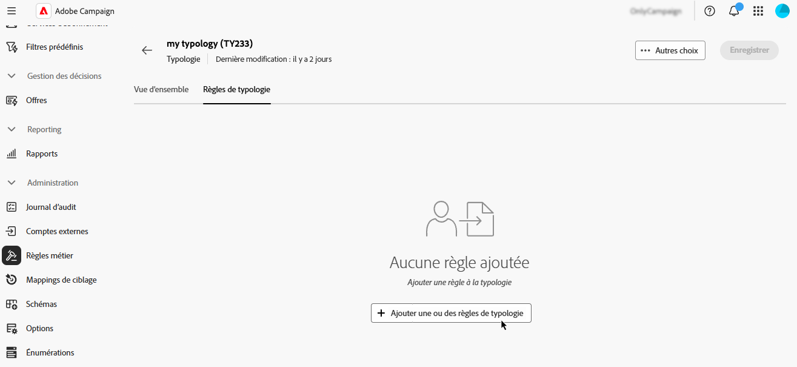

1. Sélectionnez une ou plusieurs règles de typologie à associer à la typologie et confirmez.

   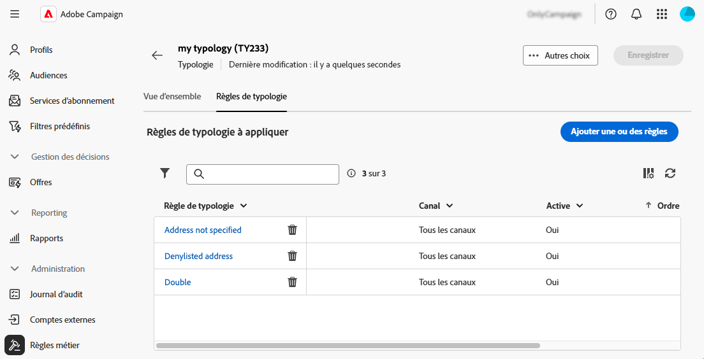

1. Cliquez sur **[!UICONTROL Enregistrer]**.

Vous pouvez désormais appliquer la typologie à des messages. Une fois cette opération terminée, toutes les règles de typologie sélectionnées seront exécutées pour effectuer les vérifications définies.

## Appliquer des typologies à des messages {#message}

Pour appliquer une typologie à un message ou à un modèle de message, sélectionnez la typologie dans les paramètres du message. [Découvrir comment configurer les paramètres de diffusion](../advanced-settings/delivery-settings.md#typology)

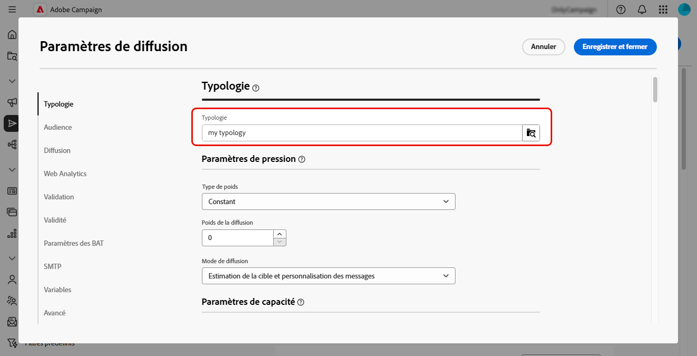

Une fois appliquées, les règles de typologie incluses dans la typologie sont exécutées pour vérifier la validité de la diffusion pendant la préparation du message. Les profils correspondant à des critères inclus dans une règle de typologie sont exclus des audiences de diffusion.