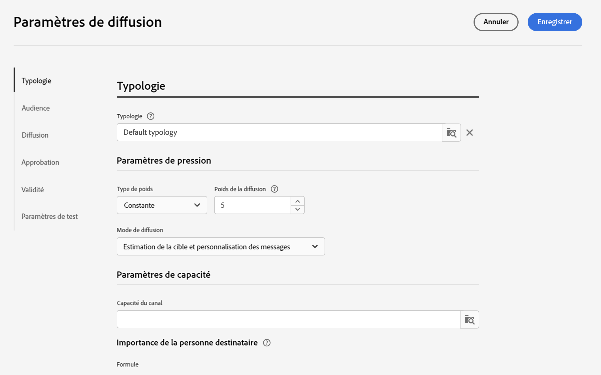
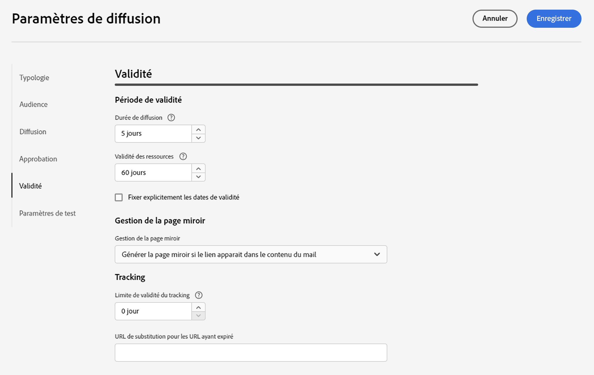

# Paramètres de diffusion d’e-mail {#email-del-settings}

Ces paramètres sont les suivants : **paramètres de diffusion technique** qui sont définis dans le modèle d’email.

## Paramètres de diffusion d’e-mail {#email-delivery-settings}

>[!CAUTION]
>
> Ces paramètres sont décrits uniquement à titre d’information. Certains dépendent de votre configuration et de vos autorisations. Elles ne doivent pas être modifiées dans cette version du produit.

## Typologie {#typology}

>[!CONTEXTUALHELP]
>id="acw_email_settings_typology"
>title="Typologie"
>abstract="Ce module permet de contrôler, de filtrer et de surveiller l’envoi des diffusions."

Les typologies sont des ensembles de **règles de typologie**, qui sont exécutés pendant la phase d’analyse du message. Elles vous permettent de vous assurer que vos e-mails contiennent toujours certains éléments (comme un lien de désinscription ou une ligne d’objet) ou des règles de filtrage pour exclure des groupes de votre cible visée (tels que les clients désabonnés, les concurrents et les clients ne faisant pas partie du programme de fidélité).

Lors de l&#39;association d&#39;une typologie à un message ou à un modèle de message, les règles de typologie incluses dans la typologie sont exécutées pour vérifier la validité du message lors de la préparation de ce dernier.

### Paramètres de pression {#pressure-parameters}

>[!CONTEXTUALHELP]
>id="acw_email_settings_delivery_weight"
>title="Poids de la diffusion"
>abstract="Les poids de chaque diffusion permettent d’identifier les diffusions prioritaires dans un contexte de gestion de la pression. Les messages dont le poids est le plus important sont prioritaires."

Dans cette section, les paramètres de pression permettent de définir une **seuil**. Il s’agit du nombre maximum de messages qui peuvent être envoyés à un profil sur une période donnée. Une fois ce seuil atteint, aucune diffusion ne sera envoyée jusqu&#39;à la fin de la période concernée. Ce mode de fonctionnement permet d&#39;exclure automatiquement un profil d&#39;une diffusion si l&#39;envoi du message provoquait le dépassement du seuil défini, et ainsi une sur-sollicitation.

La valeur de ce seuil peut être constante ou variable. Pour une même période, le seuil peut donc varier d&#39;un profil à l&#39;autre, et même pour un même profil.

Dans le champ **Type de poids**, trois options sont disponibles :

* **Constante**
* **Dépend du destinataire**
* **Défini dans chaque règle**

Utilisez la variable **Poids de la diffusion** pour définir la priorité de diffusion. Chaque diffusion a un poids qui représente son niveau de priorité. Par défaut, le poids d&#39;une diffusion est défini sur 5. Les règles de pression permettent de définir le poids des diffusions auxquelles elles seront appliquées. Les poids peuvent être définis ou calculés à partir d&#39;une formule en fonction des destinataires. Vous pouvez par exemple définir le poids d&#39;une diffusion en fonction des centres d&#39;intérêt des destinataires.

Utilisez la variable **Mode de diffusion** pour sélectionner le mode d&#39;évaluation de la cible. Trois modes sont disponibles :

* **Estimation de la cible et personnalisation des messages**
* **Estimation et validation de la cible prévisionnelle**
* **Evaluation de la cible**

La gestion de la fatigue s’accompagne de la méthode **Optimisation des campagnes** module complémentaire . En savoir plus sur les règles de pression et comment configurer la gestion de la fatigue dans [Documentation de Campaign v8](https://experienceleague.adobe.com/docs/campaign/automation/campaign-optimization/pressure-rules.html?lang=fr){target="_blank"}.

### Paramètres de capacité {#capacity-settings}

>[!CONTEXTUALHELP]
>id="acw_email_settings_recipient_importance"
>title="Importance du destinataire"
>abstract="L’importance du destinataire est une formule utilisée pour déterminer les destinataires qui sont conservés lorsque les règles de typologie de capacité sont dépassées."

Dans cette section, vous pouvez sélectionner une règle de capacité définie dans la console Adobe Campaign v8. Cette règle est associée au canal e-mail.

Le champ **Importance du destinataire** est une formule utilisée pour déterminer les destinataires qui sont conservés lorsque les règles de typologie de capacité sont dépassées.

En savoir plus sur les règles de cohérence et de capacité et comment les configurer dans [Documentation de Campaign v8](https://experienceleague.adobe.com/docs/campaign/automation/campaign-optimization/consistency-rules.html){target="_blank"}.

## Audience {#audience}

Dans cette section, vous pouvez sélectionner une **mapping de ciblage** parmi celles disponibles. Les mappages des cibles sont définis dans la console Adobe Campaign v8.

En savoir plus sur les mappings de ciblage dans [Documentation de Campaign v8](https://experienceleague.adobe.com/docs/campaign/campaign-v8/audience/add-profiles/target-mappings.html){target="_blank"}.

## Diffusion {#delivery}

Les paramètres de diffusion sont des paramètres techniques qui s&#39;appliquent à votre diffusion.

* **Routage**: le compte externe de routage d’email intégré est fourni par défaut. Il contient les paramètres techniques qui permettent à l’application d’envoyer des emails.

* **Tester la diffusion SMTP**: cette option est utilisée pour tester l’envoi via SMTP. La diffusion est traitée jusqu’à la connexion au serveur SMTP mais n’est pas envoyée : pour chaque destinataire de la diffusion, Campaign se connecte au serveur du fournisseur SMTP, exécute la commande SMTP RCPT TO et ferme la connexion avant la commande SMTP DATA.

* **Email Cci**: cette option est utilisée pour stocker les emails sur un système externe via Cci en ajoutant simplement une adresse email en Cci à votre cible de message. En savoir plus sur la fonctionnalité Email Cci dans [Documentation de Campaign v8](https://experienceleague.adobe.com/docs/campaign/campaign-v8/config/configuration/email-settings.html){target="_blank"}.

### Reprises {#retries}

>[!CONTEXTUALHELP]
>id="acw_email_settings_retries"
>title="Nombre maximal de reprises"
>abstract="Si un message est en échec en raison d’une erreur temporaire, les reprises seront effectuées pendant la durée de la diffusion."

<!--Temporarily undelivered messages due to a Soft or Ignored error are subject to an automatic retry. By default, five retries are scheduled for the first day of the delivery with a minimum interval of one hour spread out over the 24 hours of the day. -->

En savoir plus sur la gestion des reprises dans [Documentation de Campaign v8](https://experienceleague.adobe.com/docs/campaign/campaign-v8/config/configuration/email-settings.html){target="_blank"}.

## Validation {#approval}

>[!CONTEXTUALHELP]
>id="acw_email_settings_approval"
>title="Mode de validation"
>abstract="Chaque étape d’une diffusion peut faire l’objet d’une validation afin d’assurer un suivi et un contrôle complets des différents processus."

Si des avertissements sont générés lors de la préparation de la diffusion, vous pouvez configurer la diffusion afin de définir si elle doit encore être exécutée. Par défaut, l&#39;utilisateur doit confirmer l&#39;envoi des messages à la fin de la phase d&#39;analyse : this is **manuel** validation.

Vous pouvez sélectionner un autre mode de validation dans le champ correspondant. Les modes disponibles sont les suivants :

* **Manuel** : à la fin de la phase d’analyse, l’utilisateur doit confirmer la diffusion pour commencer l’envoi.

* **Semi-automatique**: L&#39;envoi commence automatiquement si la phase d&#39;analyse ne génère aucun message d&#39;avertissement.

* **Automatique**: Les envois démarrent automatiquement à la fin de la phase d’analyse, quel que soit le résultat.

## Validité {#validity}

>[!CONTEXTUALHELP]
>id="acw_email_settings_delivery_duration"
>title="Durée de diffusion"
>abstract="Le champ Durée de diffusion permet de saisir la limite pour des reprises globales de diffusion. Concrètement, Adobe Campaign diffuse les messages à partir de la date de lancement. Puis, pour les messages en erreur uniquement, des reprises régulières et paramétrables sont effectuées tant que la limite de validité n’est pas atteinte."

>[!CONTEXTUALHELP]
>id="acw_email_settings_resources_validity"
>title="Limite de validité des ressources"
>abstract="Le champ Limite de validité est utilisé pour les ressources téléchargées, principalement pour la page miroir et les images. Les ressources de cette page ont une durée de validité limitée."

Le champ **Durée de diffusion** permet de saisir la limite pour des reprises globales de diffusion. Concrètement, Adobe Campaign diffuse les messages à partir de la date de lancement. Puis, pour les messages en erreur uniquement, des reprises régulières et paramétrables sont effectuées tant que la limite de diffusion n&#39;est pas atteinte.

Vous pouvez également choisir de spécifier des dates.Pour cela, cochez l&#39;option **Fixer explicitement les dates de validité**. Dans ce cas, les dates limites de diffusion et de validité permettent de préciser également l&#39;heure. Cette heure correspond par défaut à l&#39;heure courante mais peut être modifiée directement dans le champ de saisie.

**Limite de validité des ressources** est utilisé pour les ressources téléchargées, principalement pour la page miroir et les images. Les ressources de cette page ont une durée de validité limitée (afin d’économiser de l’espace disque).

En savoir plus sur la période de validité des diffusions dans [Documentation de Campaign v8](https://experienceleague.adobe.com/docs/campaign/campaign-v8/campaigns/send/failures/delivery-failures.html#validity-period){target="_blank"}.

### Gestion de la page miroir {#mirror}

La page miroir est une page HTML accessible en ligne via un navigateur web et dont le contenu est identique à celui de l&#39;email. Par défaut, la page miroir est générée si le lien est inséré dans le contenu de l’email.

Outre le mode par défaut, les options disponibles sont les suivantes :

* **[!UICONTROL Forcer la génération de la page miroir]** : même si aucun lien vers la page miroir n&#39;est inséré dans la diffusion, la page miroir sera créée.
* **[!UICONTROL Ne pas générer de page miroir]** : aucune page miroir n&#39;est générée, même si le lien est présent dans la diffusion.
* **[!UICONTROL Générer une page miroir accessible depuis l&#39;identifiant du message]** : cette option permet d&#39;accéder au contenu de la page miroir, avec les informations de personnalisation, dans la fenêtre des logs de diffusion. Pour cela, une fois la diffusion terminée, cliquez sur l&#39;onglet **[!UICONTROL Diffusion]** et sélectionnez la ligne du destinataire dont vous souhaitez visualiser la page miroir. Cliquez ensuite sur le lien **[!UICONTROL Afficher la page miroir de ce message...]**.

### Tracking {#tracking}

>[!CONTEXTUALHELP]
>id="acw_email_settings_tracking_validity"
>title="Période de validité"
>abstract="Cette option définit la durée d’activation du tracking sur les URL."

Les paramètres de tracking sont définis dans la section correspondante. Les options possibles sont les suivantes :

**Limite de validité du suivi**: utilisez cette option pour modifier la durée d&#39;activation du tracking sur les URL.

**URL de substitution des URL périmées** : utilisez cette option pour renseigner une URL vers une page web de secours. Elle s&#39;affiche après expiration du tracking.

## Paramètres de test {#test-setttings}

Vous pouvez définir les paramètres d’exclusion dans cette section. Les options disponibles sont les suivantes :

* **Conserver double** permet d&#39;autoriser plusieurs diffusions vers des destinataires répondant à plusieurs critères de ciblage.

* **Conserver les adresses placées sur la liste bloquée** permet de garder à l&#39;écart de la cible les profils qui ne sont plus ciblés par la diffusion, par exemple après une désinscription (opt-out).

* **Conserver les adresses en quarantaine** permet de garder à l’écart de la cible les profils dont l’adresse ne répond pas.

Vous pouvez également personnaliser le nom des BAT.

Utilisez la variable **Conserver le code de diffusion pour le BAT** pour associer au BAT le même code de diffusion que celui défini pour la diffusion à laquelle il se rapporte.

Par défaut, le sujet du BAT est précédé du préfixe ‘BAT #’, où # est le numéro du BAT. Vous pouvez modifier ce préfixe dans la variable **Préfixe d’étiquette** champ .