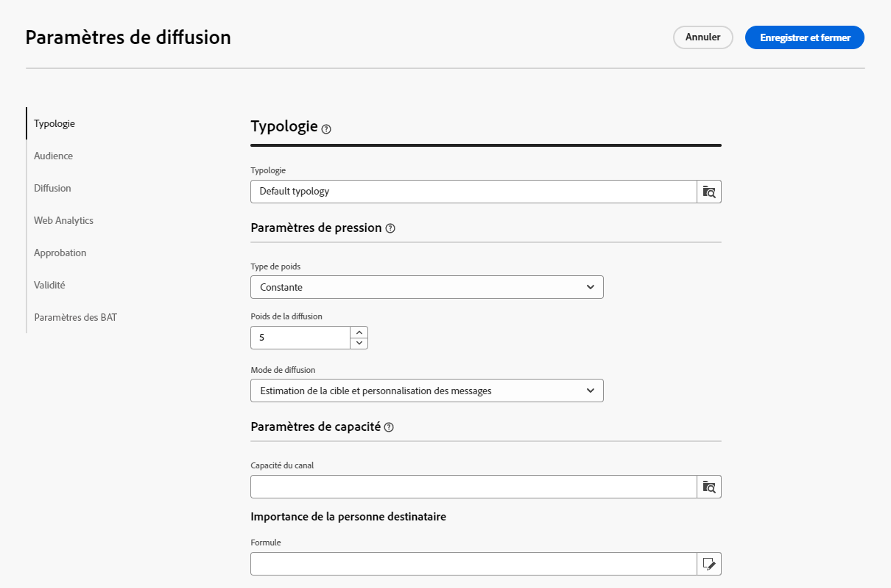
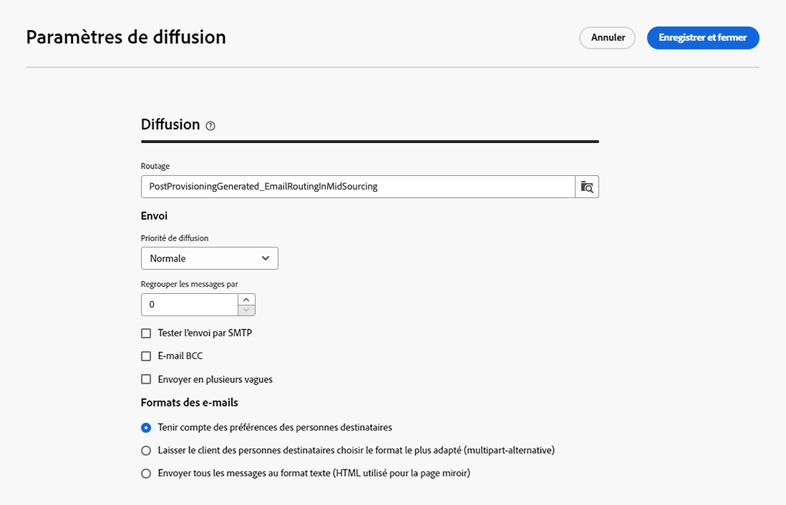
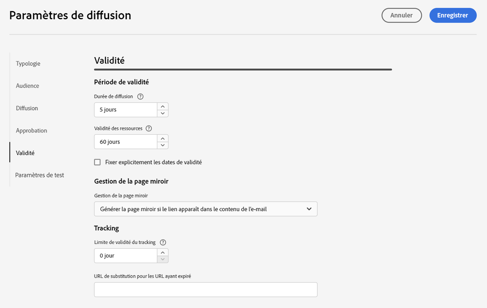
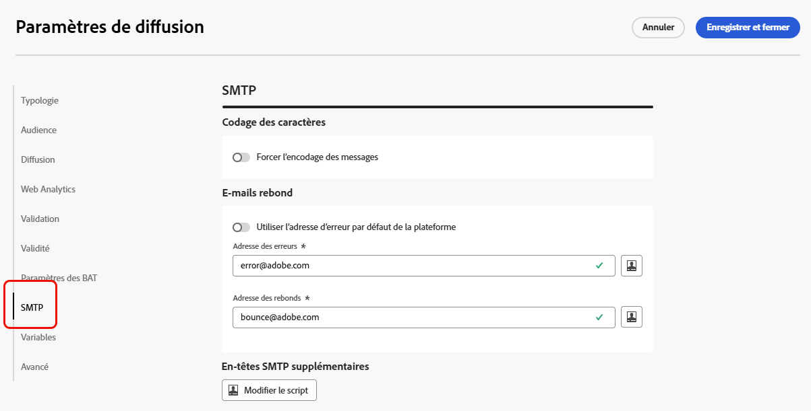
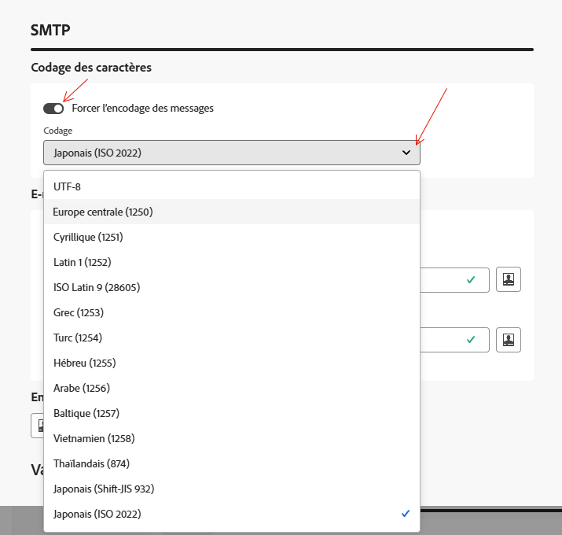
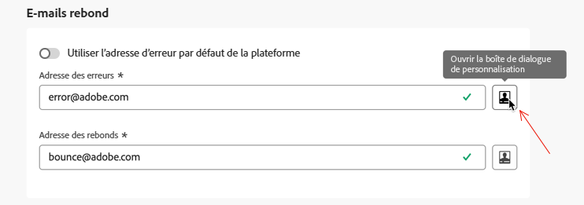
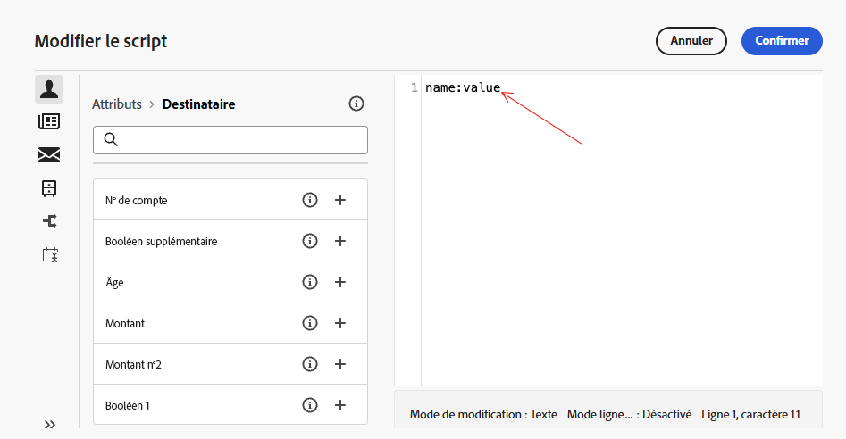
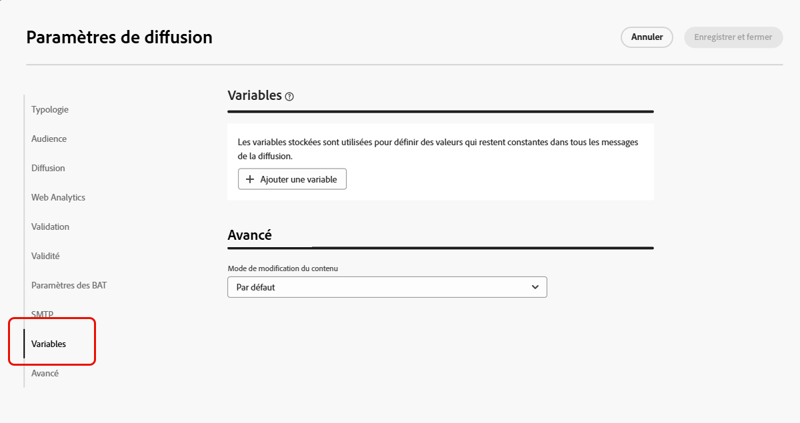
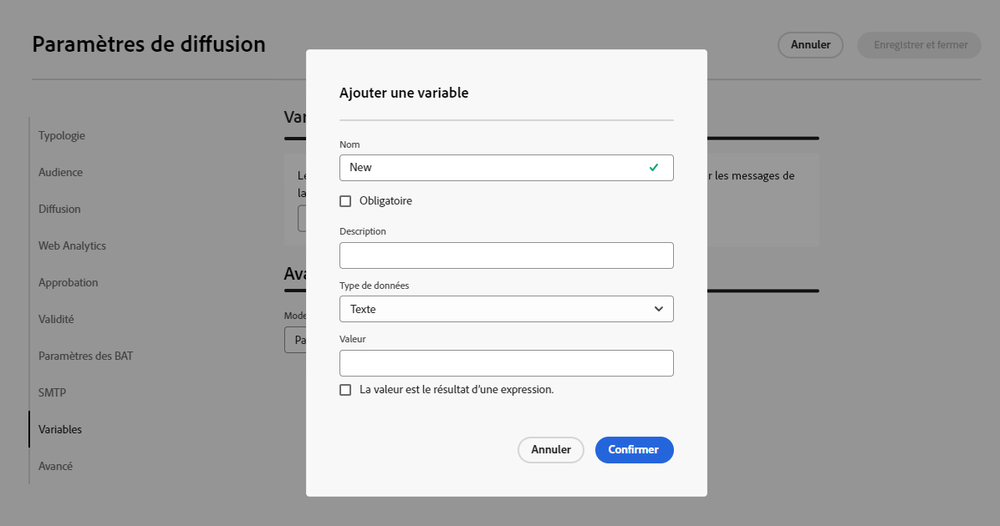

<?xml version="1.0" encoding="UTF-8"?>
<xliff xmlns="urn:oasis:names:tc:xliff:document:1.2" xmlns:okp="okapi-framework:xliff-extensions" xmlns:its="http://www.w3.org/2005/11/its" xmlns:itsxlf="http://www.w3.org/ns/its-xliff/" version="1.2" its:version="2.0">
<file original="help/v8/advanced-settings/delivery-settings.md.mdsc" source-language="en-US" target-language="en-XX" datatype="x-text/markdown">
<body>
<trans-unit id="tu34" xml:space="preserve">
<source xml:lang="en-US">https://experienceleague.adobe.com/docs/campaign/automation/campaign-optimization/pressure-rules.html</source>
<target xml:lang="en-XX">https://experienceleague.adobe.com/fr/docs/campaign/automation/campaign-optimization/pressure-rules.html?lang=fr</target>
</trans-unit>
<trans-unit id="tu44" xml:space="preserve">
<source xml:lang="en-US">https://experienceleague.adobe.com/docs/campaign/automation/campaign-optimization/consistency-rules.html</source>
<target xml:lang="en-XX">https://experienceleague.adobe.com/docs/campaign/automation/campaign-optimization/consistency-rules.html?lang=fr</target>
</trans-unit>
<trans-unit id="tu50" xml:space="preserve">
<source xml:lang="en-US">https://experienceleague.adobe.com/docs/campaign/campaign-v8/send/failures/quarantines.html</source>
<target xml:lang="en-XX">https://experienceleague.adobe.com/docs/campaign/campaign-v8/send/failures/quarantines.html?lang=fr</target>
</trans-unit>
<trans-unit id="tu64" xml:space="preserve">
<source xml:lang="en-US">https://experienceleague.adobe.com/docs/campaign/campaign-v8/send/emails/email-bcc.html</source>
<target xml:lang="en-XX">https://experienceleague.adobe.com/docs/campaign/campaign-v8/send/emails/email-bcc.html?lang=fr</target>
</trans-unit>
<trans-unit id="tu87" xml:space="preserve">
<source xml:lang="en-US">https://experienceleague.adobe.com/docs/campaign/campaign-v8/connect/ac-aa.html#external-account-ac</source>
<target xml:lang="en-XX">https://experienceleague.adobe.com/docs/campaign/campaign-v8/connect/ac-aa.html?lang=fr#external-account-ac</target>
</trans-unit>
<trans-unit id="tu115" xml:space="preserve">
<source xml:lang="en-US">https://experienceleague.adobe.com/docs/campaign/campaign-v8/campaigns/send/failures/delivery-failures.html#validity-period</source>
<target xml:lang="en-XX">https://experienceleague.adobe.com/docs/campaign/campaign-v8/campaigns/send/failures/delivery-failures.html?lang=fr#validity-period</target>
</trans-unit>
<trans-unit id="tu1" restype="x-YAML_METADATA_HEADER_VALUE" xml:space="preserve">
<source xml:lang="en-US">Configure delivery Settings</source>
<target xml:lang="en-XX">Configurer les paramètres de diffusion</target>
</trans-unit>
<trans-unit id="tu2" restype="x-YAML_METADATA_HEADER_VALUE" xml:space="preserve">
<source xml:lang="en-US">Learn how to configure delivery settings in Campaign Web</source>
<target xml:lang="en-XX">Découvrez comment configurer les paramètres de diffusion dans Campaign Web.</target>
</trans-unit>
<trans-unit id="tu3" xml:space="preserve">
<source xml:lang="en-US">Configure delivery settings</source>
<target xml:lang="en-XX">Configurer les paramètres de diffusion</target>
</trans-unit>
<trans-unit id="tu4" xml:space="preserve">
<source xml:lang="en-US">Delivery settings are <ph id="1" ctype="x-STRONG_EMPHASIS">**</ph>technical delivery parameters<ph id="2" ctype="x-STRONG_EMPHASIS">**</ph> that are defined in the delivery template. They can be overloaded for each delivery. These settings are available from the <ph id="3" ctype="x-STRONG_EMPHASIS">**</ph>Settings<ph id="4" ctype="x-STRONG_EMPHASIS">**</ph> button available when editing a delivery or a delivery template.</source>
<target xml:lang="en-XX">Les paramètres de diffusion sont des <ph id="1" ctype="x-STRONG_EMPHASIS">**</ph>paramètres de diffusions techniques<ph id="2" ctype="x-STRONG_EMPHASIS">**</ph> définis dans le modèle de diffusion. Ils peuvent être surchargés pour chaque diffusion. Ces paramètres sont disponibles depuis le bouton <ph id="3" ctype="x-STRONG_EMPHASIS">**</ph>Paramètres<ph id="4" ctype="x-STRONG_EMPHASIS">**</ph> disponible lors de la modification d’une diffusion ou d’un modèle de diffusion.</target>
</trans-unit>
<trans-unit id="tu5" xml:space="preserve">
<source xml:lang="en-US"><ph id="1" ctype="x-regxph" equiv-text="&lbrack;!CAUTION">[!CAUTION]</ph></source>
<target xml:lang="en-XX"><ph id="1" ctype="x-regxph" equiv-text="&lbrack;!CAUTION">[!CAUTION]</ph></target>
</trans-unit>
<trans-unit id="tu6" xml:space="preserve">
<source xml:lang="en-US">These settings are described for your information only. Some of them depend on your configuration and permissions. They must not be modified in this version of the product.</source>
<target xml:lang="en-XX">Ces paramètres sont décrits uniquement à titre d’information. Certains dépendent de votre configuration et de vos autorisations. Ils ne doivent pas être modifiées dans cette version du produit.</target>
</trans-unit>
<trans-unit id="tu7" xml:space="preserve">
<source xml:lang="en-US">Typology settings</source>
<target xml:lang="en-XX">Paramètres de typologie</target>
</trans-unit>
<trans-unit id="tu8" xml:space="preserve">
<source xml:lang="en-US">Typology</source>
<target xml:lang="en-XX">Typology</target>
</trans-unit>
<trans-unit id="tu9" xml:space="preserve">
<source xml:lang="en-US">Typologies allow you to standardize business practices, across all deliveries. A typology is a collection of typology rules which lets you control, filter, and prioritize the sending of deliveries. Profiles which match criteria within a typology rule are excluded from the delivery audiences at the preparation phase.</source>
<target xml:lang="en-XX">Les typologies vous permettent de normaliser les pratiques commerciales de l’ensemble des diffusions. Une typologie est un ensemble de règles de typologie qui permet de contrôler, filtrer et prioriser l’envoi des diffusions. Les profils qui correspondent à des critères dans une règle de typologie sont exclus des audiences de diffusion lors de la phase de préparation.</target>
</trans-unit>
<trans-unit id="tu10" xml:space="preserve">
<source xml:lang="en-US">Typology settings for the delivery</source>
<target xml:lang="en-XX">Paramètres de typologie de la diffusion</target>
</trans-unit>
<trans-unit id="tu11" xml:space="preserve">
<source xml:lang="en-US">Typology rules allow you to standardize business practices, across all deliveries. A typology is a collection of typology rules which lets you control, filter, and prioritize the sending of deliveries. Profiles which match criteria within a typology rule are excluded from the delivery audiences at the preparation phase.</source>
<target xml:lang="en-XX">Les règles de typologie vous permettent de normaliser les pratiques commerciales de l’ensemble des diffusions. Une typologie est un ensemble de règles de typologie qui permet de contrôler, filtrer et prioriser l’envoi des diffusions. Les profils qui correspondent à des critères dans une règle de typologie sont exclus des audiences de diffusion lors de la phase de préparation.</target>
</trans-unit>
<trans-unit id="tu12" xml:space="preserve">
<source xml:lang="en-US">Typologies are sets of <ph id="1" ctype="x-STRONG_EMPHASIS">**</ph>typology rules<ph id="2" ctype="x-STRONG_EMPHASIS">**</ph> that are executed during the preparation phase in order to easily apply multiple filtering rules to a delivery at once. They allow marketers to standardize business practices across all deliveries as they let them control, filter, and prioritize the sending of deliveries. <ph id="3" ctype="x-LINK">[</ph>Learn how to create typologies and typology rules<ph id="4" ctype="x-LINK">](../administration/typologies.md)</ph></source>
<target xml:lang="en-XX">Les typologies sont des ensembles de <ph id="1" ctype="x-STRONG_EMPHASIS">**</ph>règles de typologie<ph id="2" ctype="x-STRONG_EMPHASIS">**</ph> qui sont exécutées pendant la phase de préparation afin d’appliquer facilement plusieurs règles de filtrage en même temps à une diffusion. Elles permettent aux personnes spécialisées dans le marketing de normaliser les pratiques commerciales pour toutes les diffusions, car elles leur permettent de contrôler, filtrer et gérer la priorité de l’envoi des diffusions. <ph id="3" ctype="x-LINK">[</ph>Découvrir comment créer des typologies et des règles de typologie<ph id="4" ctype="x-LINK">](../administration/typologies.md)</ph></target>
</trans-unit>
<trans-unit id="tu13" xml:space="preserve">
<source xml:lang="en-US"><ph id="1" ctype="x-IMAGE">{zoomable="yes"}</ph></source>
<target xml:lang="en-XX"><ph id="1" ctype="x-IMAGE">{zoomable="yes"}</ph></target>
</trans-unit>
<trans-unit id="tu14" xml:space="preserve">
<source xml:lang="en-US">Pressure parameters</source>
<target xml:lang="en-XX">Paramètres de pression</target>
</trans-unit>
<trans-unit id="tu15" xml:space="preserve">
<source xml:lang="en-US">Pressure parameters for the delivery</source>
<target xml:lang="en-XX">Paramètres de pression de la diffusion</target>
</trans-unit>
<trans-unit id="tu16" xml:space="preserve">
<source xml:lang="en-US">Delivery weights let you identify top-priority deliveries within the framework of fatigue management. Messages with the highest weight have priority.</source>
<target xml:lang="en-XX">Le poids des diffusions permet d’identifier les diffusions prioritaires dans le cadre de la gestion de la fatigue. Les messages dont le poids est le plus élevé sont prioritaires.</target>
</trans-unit>
<trans-unit id="tu17" xml:space="preserve">
<source xml:lang="en-US">Delivery weight</source>
<target xml:lang="en-XX">Poids de la diffusion</target>
</trans-unit>
<trans-unit id="tu18" xml:space="preserve">
<source xml:lang="en-US">Delivery weights let you identify top-priority deliveries within the framework of pressure management. Messages with the highest weight have priority.</source>
<target xml:lang="en-XX">Le poids des diffusions permet d’identifier les diffusions prioritaires dans le cadre de la gestion de la pression. Les messages dont le poids est le plus élevé sont prioritaires.</target>
</trans-unit>
<trans-unit id="tu19" xml:space="preserve">
<source xml:lang="en-US">In this section, pressure parameters let you define a <ph id="1" ctype="x-STRONG_EMPHASIS">**</ph>threshold<ph id="2" ctype="x-STRONG_EMPHASIS">**</ph> to set up fatigue management rules, which is the maximum number of messages that can be sent to one profile over a given period.</source>
<target xml:lang="en-XX">Dans cette section, les paramètres de pression vous permettent de définir un <ph id="1" ctype="x-STRONG_EMPHASIS">**</ph>seuil<ph id="2" ctype="x-STRONG_EMPHASIS">**</ph> pour configurer des règles de gestion d’usure, qui est le nombre maximal de messages pouvant être envoyés à un profil sur une période donnée.</target>
</trans-unit>
<trans-unit id="tu20" xml:space="preserve">
<source xml:lang="en-US">Once this threshold has been reached, no more deliveries can take place until the end of the period considered. This process lets you automatically exclude a profile from a delivery if a message exceeds the set threshold, thus avoiding over-solicitation.</source>
<target xml:lang="en-XX">Une fois ce seuil atteint, aucune diffusion ne sera envoyée jusqu'à la fin de la période concernée. Ce mode de fonctionnement permet d'exclure automatiquement un profil d'une diffusion si l'envoi du message provoquait le dépassement du seuil défini, et ainsi une sur-sollicitation.</target>
</trans-unit>
<trans-unit id="tu21" xml:space="preserve">
<source xml:lang="en-US">Threshold values can be either constant or variable. This means that for a given period, thresholds can vary from one profile to another, or even for the same profile.</source>
<target xml:lang="en-XX">La valeur de ce seuil peut être constante ou variable. Pour une même période, le seuil peut donc varier d'un profil à l'autre, et même pour un même profil.</target>
</trans-unit>
<trans-unit id="tu22" xml:space="preserve">
<source xml:lang="en-US">In the <ph id="1" ctype="x-STRONG_EMPHASIS">**[!UICONTROL </ph>Weight type<ph id="3" ctype="x-LINK_REF">]**</ph> field, three options are available:</source>
<target xml:lang="en-XX">Dans le champ <ph id="1" ctype="x-STRONG_EMPHASIS">**[!UICONTROL </ph>Type de poids<ph id="3" ctype="x-LINK_REF">]**</ph>, trois options sont disponibles :</target>
</trans-unit>
<trans-unit id="tu23" xml:space="preserve">
<source xml:lang="en-US"><ph id="1" ctype="x-STRONG_EMPHASIS">**[!UICONTROL </ph>Constant<ph id="3" ctype="x-LINK_REF">]**</ph></source>
<target xml:lang="en-XX"><ph id="1" ctype="x-STRONG_EMPHASIS">**[!UICONTROL </ph>Constant<ph id="3" ctype="x-LINK_REF">]**</ph></target>
</trans-unit>
<trans-unit id="tu24" xml:space="preserve">
<source xml:lang="en-US"><ph id="1" ctype="x-STRONG_EMPHASIS">**[!UICONTROL </ph>Depends on the recipient<ph id="3" ctype="x-LINK_REF">]**</ph></source>
<target xml:lang="en-XX"><ph id="1" ctype="x-STRONG_EMPHASIS">**[!UICONTROL </ph>Dépend du destinataire<ph id="3" ctype="x-LINK_REF">]**</ph></target>
</trans-unit>
<trans-unit id="tu25" xml:space="preserve">
<source xml:lang="en-US"><ph id="1" ctype="x-STRONG_EMPHASIS">**[!UICONTROL </ph>Defined in each rule<ph id="3" ctype="x-LINK_REF">]**</ph></source>
<target xml:lang="en-XX"><ph id="1" ctype="x-STRONG_EMPHASIS">**[!UICONTROL </ph>Défini dans chaque règle<ph id="3" ctype="x-LINK_REF">]**</ph></target>
</trans-unit>
<trans-unit id="tu26" xml:space="preserve">
<source xml:lang="en-US">Use the <ph id="1" ctype="x-STRONG_EMPHASIS">**[!UICONTROL </ph>Delivery weight<ph id="3" ctype="x-LINK_REF">]**</ph> field to define the delivery priority. Each delivery has a weight which represents its level of priority. By default, the weight of a delivery is set to 5. Pressure rules let you define the weight of the deliveries which they are applied to. Weights can be either set or calculated via a formula to suit recipients. For example, you can define the weight of a delivery based on recipient interests.</source>
<target xml:lang="en-XX">Utilisez le champ <ph id="1" ctype="x-STRONG_EMPHASIS">**[!UICONTROL </ph>Poids de la diffusion<ph id="3" ctype="x-LINK_REF">]**</ph> pour définir la priorité de diffusion. Chaque diffusion a un poids qui représente son niveau de priorité. Par défaut, le poids d’une diffusion est défini sur 5. Les règles de pression permettent de définir le poids des diffusions auxquelles elles s’appliquent. Les poids peuvent être définis ou calculés au moyen d’une formule en fonction des destinataires. Par exemple, vous pouvez définir le poids d’une diffusion en fonction des centres d’intérêt d’un ou d’une destinataire.</target>
</trans-unit>
<trans-unit id="tu27" xml:space="preserve">
<source xml:lang="en-US">Use the <ph id="1" ctype="x-STRONG_EMPHASIS">**[!UICONTROL </ph>Delivery mode<ph id="3" ctype="x-LINK_REF">]**</ph> field to select the target evaluation mode.</source>
<target xml:lang="en-XX">Utilisez le champ <ph id="1" ctype="x-STRONG_EMPHASIS">**[!UICONTROL </ph>Mode de diffusion<ph id="3" ctype="x-LINK_REF">]**</ph> pour sélectionner le mode d’évaluation de la cible.</target>
</trans-unit>
<trans-unit id="tu28" xml:space="preserve">
<source xml:lang="en-US">Three modes are available:</source>
<target xml:lang="en-XX">Trois modes sont disponibles :</target>
</trans-unit>
<trans-unit id="tu29" xml:space="preserve">
<source xml:lang="en-US"><ph id="1" ctype="x-STRONG_EMPHASIS">**[!UICONTROL </ph>Target estimation and message personalization<ph id="3" ctype="x-LINK_REF">]**</ph></source>
<target xml:lang="en-XX"><ph id="1" ctype="x-STRONG_EMPHASIS">**[!UICONTROL </ph>Estimation de la cible et personnalisation des messages<ph id="3" ctype="x-LINK_REF">]**</ph></target>
</trans-unit>
<trans-unit id="tu30" xml:space="preserve">
<source xml:lang="en-US"><ph id="1" ctype="x-STRONG_EMPHASIS">**[!UICONTROL </ph>Estimation and approval of the provisional target<ph id="3" ctype="x-LINK_REF">]**</ph></source>
<target xml:lang="en-XX"><ph id="1" ctype="x-STRONG_EMPHASIS">**[!UICONTROL </ph>Estimation et validation de la cible prévisionnelle<ph id="3" ctype="x-LINK_REF">]**</ph></target>
</trans-unit>
<trans-unit id="tu31" xml:space="preserve">
<source xml:lang="en-US"><ph id="1" ctype="x-STRONG_EMPHASIS">**[!UICONTROL </ph>Target evaluation<ph id="3" ctype="x-LINK_REF">]**</ph></source>
<target xml:lang="en-XX"><ph id="1" ctype="x-STRONG_EMPHASIS">**[!UICONTROL </ph>Évaluation de la cible<ph id="3" ctype="x-LINK_REF">]**</ph></target>
</trans-unit>
<trans-unit id="tu32" xml:space="preserve">
<source xml:lang="en-US"><ph id="1" ctype="x-regxph" equiv-text="&lbrack;!NOTE">[!NOTE]</ph></source>
<target xml:lang="en-XX"><ph id="1" ctype="x-regxph" equiv-text="&lbrack;!NOTE">[!NOTE]</ph></target>
</trans-unit>
<trans-unit id="tu33" xml:space="preserve">
<source xml:lang="en-US">Fatigue management and pressure rules are configured in the Campaign client console. Learn more in <ph id="1" ctype="x-LINK">&lbrack;</ph>Campaign v8 (client console) documentation<ph id="2" ctype="x-LINK">[#$tu34]{target="_blank"}</ph>.</source>
<target xml:lang="en-XX">Le paramétrage des règles de gestion de la fatigue et de la pression s’effectue dans la console cliente Campaign. En savoir plus dans la <ph id="1" ctype="x-LINK">&lbrack;</ph>documentation de Campaign v8 (console cliente)<ph id="2" ctype="x-LINK">[#$tu34]{target="_blank"}</ph>.</target>
</trans-unit>
<trans-unit id="tu35" xml:space="preserve">
<source xml:lang="en-US">Capacity settings</source>
<target xml:lang="en-XX">Paramètres de capacité</target>
</trans-unit>
<trans-unit id="tu36" xml:space="preserve">
<source xml:lang="en-US">Capacity settings for the delivery</source>
<target xml:lang="en-XX">Paramètres de capacité de la diffusion</target>
</trans-unit>
<trans-unit id="tu37" xml:space="preserve">
<source xml:lang="en-US">Before delivering messages, use capacity rules to make sure your organization can process the delivery, the inbound messages which the delivery may generate, and the number of calls to be made to contact subscribers for example. Capacity rules are defined in the Adobe Campaign v8 console. In this screen, select a rule associated to the channel.</source>
<target xml:lang="en-XX">Avant de diffuser des messages, utilisez les règles de capacité pour vous assurer que votre organisation peut traiter notamment la diffusion, les messages entrants que la diffusion peut générer et le nombre d’appels à passer pour contacter les personnes abonnées, par exemple. La définition des règles de capacité s’effectue dans la console Adobe Campaign v8. Sur cet écran, sélectionnez une règle associée au canal.</target>
</trans-unit>
<trans-unit id="tu38" xml:space="preserve">
<source xml:lang="en-US">Importance of the recipient</source>
<target xml:lang="en-XX">Importance de la personne destinataire</target>
</trans-unit>
<trans-unit id="tu39" xml:space="preserve">
<source xml:lang="en-US">The importance of the recipient is a formula used to determine which profiles are kept when the capacity typology rules are exceeded.</source>
<target xml:lang="en-XX">L’importance de la personne destinataire est une formule utilisée pour déterminer les profils conservés lorsque les règles de typologie de capacité sont dépassées.</target>
</trans-unit>
<trans-unit id="tu40" xml:space="preserve">
<source xml:lang="en-US">In this section, you can select a capacity rule defined in the Adobe Campaign v8 console. This rule is associated to the channel.</source>
<target xml:lang="en-XX">Dans cette section, vous pouvez sélectionner une règle de capacité définie dans la console Adobe Campaign v8. Cette règle est associée au canal.</target>
</trans-unit>
<trans-unit id="tu41" xml:space="preserve">
<source xml:lang="en-US">The <ph id="1" ctype="x-STRONG_EMPHASIS">**[!UICONTROL </ph>Importance of the recipient<ph id="3" ctype="x-LINK_REF">]**</ph> field is a formula used to determine which profiles are kept when the capacity typology rules are exceeded.</source>
<target xml:lang="en-XX">Le champ <ph id="1" ctype="x-STRONG_EMPHASIS">**[!UICONTROL </ph>Importance de la personne destinataire<ph id="3" ctype="x-LINK_REF">]**</ph> est une formule utilisée pour déterminer les profils conservés lorsque les règles de typologie de capacité sont dépassées.</target>
</trans-unit>
<trans-unit id="tu42" xml:space="preserve">
<source xml:lang="en-US"><ph id="1" ctype="x-regxph" equiv-text="&lbrack;!NOTE">[!NOTE]</ph></source>
<target xml:lang="en-XX"><ph id="1" ctype="x-regxph" equiv-text="&lbrack;!NOTE">[!NOTE]</ph></target>
</trans-unit>
<trans-unit id="tu43" xml:space="preserve">
<source xml:lang="en-US">Typology rules are configured in the Campaign Client console. Learn more in <ph id="1" ctype="x-LINK">&lbrack;</ph>Campaign v8 (client console) documentation<ph id="2" ctype="x-LINK">[#$tu44]{target="_blank"}</ph>.</source>
<target xml:lang="en-XX">La configuration de règles de typologie s’effectue dans la console cliente Campaign. En savoir plus dans la <ph id="1" ctype="x-LINK">&lbrack;</ph>documentation de Campaign v8 (console cliente)<ph id="2" ctype="x-LINK">[#$tu44]{target="_blank"}</ph>.</target>
</trans-unit>
<trans-unit id="tu45" xml:space="preserve">
<source xml:lang="en-US">Audience settings</source>
<target xml:lang="en-XX">Paramètres de l’audience</target>
</trans-unit>
<trans-unit id="tu46" xml:space="preserve">
<source xml:lang="en-US">Audience settings for the delivery</source>
<target xml:lang="en-XX">Paramètres d’audience de la diffusion</target>
</trans-unit>
<trans-unit id="tu47" xml:space="preserve">
<source xml:lang="en-US">Select a <ph id="1" ctype="x-STRONG_EMPHASIS">**</ph>target mapping<ph id="2" ctype="x-STRONG_EMPHASIS">**</ph> among those available. Target mappings are defined in the Adobe Campaign v8 console. You can also set the exclusion parameters for the delivery.</source>
<target xml:lang="en-XX">Sélectionnez un <ph id="1" ctype="x-STRONG_EMPHASIS">**</ph>mapping de ciblage<ph id="2" ctype="x-STRONG_EMPHASIS">**</ph> parmi ceux disponibles. Les mappings de ciblage sont définis dans la console Adobe Campaign v8. Vous pouvez également définir les paramètres d’exclusion de la diffusion.</target>
</trans-unit>
<trans-unit id="tu48" xml:space="preserve">
<source xml:lang="en-US">In this section, you can select a <ph id="1" ctype="x-STRONG_EMPHASIS">**</ph>target mapping<ph id="2" ctype="x-STRONG_EMPHASIS">**</ph> among those available. Target mappings are defined in the Adobe Campaign v8 console. The target mapping is the type of data that an operation is handling. It lets you define the targeted population: recipients, contract beneficiaries, operators, subscribers, etc. <ph id="3" ctype="x-LINK">[</ph>Learn more about target mappings<ph id="4" ctype="x-LINK">](../audience/targeting-dimensions.md)</ph>.</source>
<target xml:lang="en-XX">Dans cette section, vous pouvez sélectionner un <ph id="1" ctype="x-STRONG_EMPHASIS">**</ph>mapping de ciblage<ph id="2" ctype="x-STRONG_EMPHASIS">**</ph> parmi ceux disponibles. Les mappings de ciblage sont définis dans la console Adobe Campaign v8. Le mapping de ciblage est le type de données qu’une opération traite. Il permet de définir la population ciblée : personnes destinataires, personnes bénéficiaires de contrats, opérateurs et opératrices, personnes abonnées, etc. <ph id="3" ctype="x-LINK">[</ph>En savoir plus sur les mappings de ciblage<ph id="4" ctype="x-LINK">](../audience/targeting-dimensions.md)</ph>.</target>
</trans-unit>
<trans-unit id="tu49" xml:space="preserve">
<source xml:lang="en-US">In the <ph id="1" ctype="x-STRONG_EMPHASIS">**[!UICONTROL </ph>Exclusion<ph id="3" ctype="x-LINK_REF">]**</ph> field, you can select to exclude profiles who no longer want to be contacted or who are quarantined. <ph id="5" ctype="x-LINK">&lbrack;</ph>Learn more<ph id="6" ctype="x-LINK">[#$tu50]{target="_blank"}</ph></source>
<target xml:lang="en-XX">Dans le champ <ph id="1" ctype="x-STRONG_EMPHASIS">**[!UICONTROL </ph>Exclusion<ph id="3" ctype="x-LINK_REF">]**</ph>, vous pouvez choisir d’exclure des profils qui ne souhaitent plus être contactés ou qui sont mis en quarantaine. <ph id="5" ctype="x-LINK">&lbrack;</ph>En savoir plus<ph id="6" ctype="x-LINK">[#$tu50]{target="_blank"}</ph></target>
</trans-unit>
<trans-unit id="tu51" xml:space="preserve">
<source xml:lang="en-US">Delivery</source>
<target xml:lang="en-XX">Diffusion</target>
</trans-unit>
<trans-unit id="tu52" xml:space="preserve">
<source xml:lang="en-US">Global settings for the delivery</source>
<target xml:lang="en-XX">Paramètres globaux de la diffusion</target>
</trans-unit>
<trans-unit id="tu53" xml:space="preserve">
<source xml:lang="en-US">Delivery parameters are technical settings which apply to your delivery. You can change the delivery and routine modes, activate Email BCC, send using waves, and also choose the format of the email messages sent. These options are restricted to expert users only.</source>
<target xml:lang="en-XX">Les paramètres de diffusion sont des paramètres techniques qui s’appliquent à votre diffusion. Vous pouvez modifier les modes de diffusion et de routine, activer E-mail Cci, envoyer par vagues et choisir le format des e-mails envoyés. Ces options sont limitées aux personnes expertes.</target>
</trans-unit>
<trans-unit id="tu54" xml:space="preserve">
<source xml:lang="en-US"><ph id="1" ctype="x-STRONG_EMPHASIS">**[!UICONTROL </ph>Delivery<ph id="3" ctype="x-LINK_REF">]**</ph> parameters are technical settings which apply to your delivery.</source>
<target xml:lang="en-XX">Les paramètres de <ph id="1" ctype="x-STRONG_EMPHASIS">**[!UICONTROL </ph>Diffusion<ph id="3" ctype="x-LINK_REF">]**</ph> sont des paramètres techniques qui s’appliquent à votre diffusion.</target>
</trans-unit>
<trans-unit id="tu55" xml:space="preserve">
<source xml:lang="en-US"><ph id="1" ctype="x-IMAGE">{zoomable="yes"}</ph></source>
<target xml:lang="en-XX"><ph id="1" ctype="x-IMAGE">{zoomable="yes"}</ph></target>
</trans-unit>
<trans-unit id="tu56" xml:space="preserve">
<source xml:lang="en-US">The integrated <ph id="1" ctype="x-STRONG_EMPHASIS">**[!UICONTROL </ph>Routing<ph id="3" ctype="x-LINK_REF">]**</ph> external account is provided by default. It contains the technical parameters that allow the application to send deliveries.</source>
<target xml:lang="en-XX">Le compte externe de <ph id="1" ctype="x-STRONG_EMPHASIS">**[!UICONTROL </ph>Routage<ph id="3" ctype="x-LINK_REF">]**</ph> intégré est fourni par défaut. Il contient les paramètres techniques qui permettent à l’application d’envoyer des diffusions.</target>
</trans-unit>
<trans-unit id="tu57" xml:space="preserve">
<source xml:lang="en-US">You can define the <ph id="1" ctype="x-STRONG_EMPHASIS">**[!UICONTROL </ph>Sending<ph id="3" ctype="x-LINK_REF">]**</ph> settings below.</source>
<target xml:lang="en-XX">Vous pouvez définir les paramètres d’<ph id="1" ctype="x-STRONG_EMPHASIS">**[!UICONTROL </ph>Envoi<ph id="3" ctype="x-LINK_REF">]**</ph> ci-dessous.</target>
</trans-unit>
<trans-unit id="tu58" xml:space="preserve">
<source xml:lang="en-US"><ph id="1" ctype="x-STRONG_EMPHASIS">**[!UICONTROL </ph>Delivery priority<ph id="3" ctype="x-LINK_REF">]**</ph>: Use this option to change the sending order for your deliveries by setting their priority level: normal, high or low.</source>
<target xml:lang="en-XX"><ph id="1" ctype="x-STRONG_EMPHASIS">**[!UICONTROL </ph>Priorité de diffusion<ph id="3" ctype="x-LINK_REF">]**</ph> : utilisez cette option pour modifier l’ordre d’envoi de vos diffusions en configurant leur niveau de priorité : normal, élevé ou faible.</target>
</trans-unit>
<trans-unit id="tu59" xml:space="preserve">
<source xml:lang="en-US"><ph id="1" ctype="x-STRONG_EMPHASIS">**[!UICONTROL </ph>Message batch quantity<ph id="3" ctype="x-LINK_REF">]**</ph>: Use this option to define the number of messages grouped within the same XML delivery package. If the parameter is set to 0, the messages are automatically grouped. The package size is defined by the calculation <ph id="5" ctype="x-CODE">`&lt;delivery size>/1024`</ph>, with a minimum of 8 and a maximum of 256 messages by package.</source>
<target xml:lang="en-XX"><ph id="1" ctype="x-STRONG_EMPHASIS">**[!UICONTROL </ph>Nombre de messages groupés<ph id="3" ctype="x-LINK_REF">]**</ph> : utilisez cette option pour définir le nombre de messages regroupés dans un même package d’envoi XML. Si le paramètre est défini sur 0, les messages sont automatiquement regroupés. La taille du paquet est définie par le calcul <ph id="5" ctype="x-CODE">`&lt;delivery size>/1024`</ph>, avec un minimum de 8 messages et un maximum de 256 messages par package.</target>
</trans-unit>
<trans-unit id="tu60" xml:space="preserve">
<source xml:lang="en-US"><ph id="1" ctype="x-regxph" equiv-text="&lbrack;!IMPORTANT">[!IMPORTANT]</ph></source>
<target xml:lang="en-XX"><ph id="1" ctype="x-regxph" equiv-text="&lbrack;!IMPORTANT">[!IMPORTANT]</ph></target>
</trans-unit>
<trans-unit id="tu61" xml:space="preserve">
<source xml:lang="en-US">When the delivery is created by duplicating an existing one, this parameter is reset.</source>
<target xml:lang="en-XX">Lorsque vous créez la diffusion en dupliquant une diffusion existante, vous réinitialisez également ce paramètre.</target>
</trans-unit>
<trans-unit id="tu62" xml:space="preserve">
<source xml:lang="en-US"><ph id="1" ctype="x-STRONG_EMPHASIS">**[!UICONTROL </ph>Test SMTP delivery<ph id="3" ctype="x-LINK_REF">]**</ph> (email channel): This option is used to test sending via SMTP. The email is processed up to connection to the SMTP server, but is not sent: for every recipient of the email, Campaign connects to the SMTP provider server, executes the SMTP RCPT TO command, and closes the connection before the SMTP DATA command.</source>
<target xml:lang="en-XX"><ph id="1" ctype="x-STRONG_EMPHASIS">**[!UICONTROL </ph>Test de la diffusion par SMTP<ph id="3" ctype="x-LINK_REF">]**</ph> (canal e-mail) : cette option vous permet de tester l’envoi via SMTP. L’e-mail est traité jusqu’à la connexion au serveur SMTP mais n’est pas envoyé : pour chaque personne destinataire de l’e-mail, Campaign se connecte au serveur du fournisseur SMTP, exécute la commande SMTP RCPT TO et met fin à la connexion avant la commande SMTP DATA.</target>
</trans-unit>
<trans-unit id="tu63" xml:space="preserve">
<source xml:lang="en-US"><ph id="1" ctype="x-STRONG_EMPHASIS">**[!UICONTROL </ph>Email BCC<ph id="3" ctype="x-LINK_REF">]**</ph> (email channel): This option is used to store emails on an external system through BCC by simply adding a BCC email address to your message target. Learn more in <ph id="5" ctype="x-LINK">&lbrack;</ph>Campaign v8 (client console) documentation<ph id="6" ctype="x-LINK">[#$tu64]{target="_blank"}</ph>.</source>
<target xml:lang="en-XX"><ph id="1" ctype="x-STRONG_EMPHASIS">**[!UICONTROL </ph>E-mail Cci<ph id="3" ctype="x-LINK_REF">]**</ph> (canal e-mail) : cette option permet de stocker les e-mails dans un système externe à l’aide de l’option Cci en ajoutant simplement une adresse e-mail Cci à la cible de vos messages. En savoir plus dans la <ph id="5" ctype="x-LINK">&lbrack;</ph>documentation de Campaign v8 (console cliente)<ph id="6" ctype="x-LINK">[#$tu64]{target="_blank"}</ph>.</target>
</trans-unit>
<trans-unit id="tu65" xml:space="preserve">
<source xml:lang="en-US">In the <ph id="1" ctype="x-STRONG_EMPHASIS">**[!UICONTROL </ph>Wave definition<ph id="3" ctype="x-LINK_REF">]**</ph> section, select the <ph id="5" ctype="x-STRONG_EMPHASIS">**[!UICONTROL </ph>Send using multiple waves<ph id="7" ctype="x-LINK_REF">]**</ph> option to progressively increase the volume sent using waves. This will avoid your messages being marked as spam or when you want to restrict the number of messages per day. Using waves you can divide deliveries into several batches instead of sending high volumes of messages at the same time. <ph id="9" ctype="x-LINK">[</ph>Learn more<ph id="10" ctype="x-LINK">](send-using-waves.md)</ph></source>
<target xml:lang="en-XX">Dans la section <ph id="1" ctype="x-STRONG_EMPHASIS">**[!UICONTROL </ph>Définition de vague<ph id="3" ctype="x-LINK_REF">]**</ph>, sélectionnez l’option <ph id="5" ctype="x-STRONG_EMPHASIS">**[!UICONTROL </ph>Envoyer en plusieurs vagues<ph id="7" ctype="x-LINK_REF">]**</ph> pour augmenter progressivement le volume envoyé par vagues. Cela évitera que les emails soient marqués comme spam ou pour limiter le nombre de messages par jour. Grâce aux vagues, vous pouvez répartir les envois en plusieurs lots au lieu d’envoyer de gros volumes de messages en même temps. <ph id="9" ctype="x-LINK">[</ph>En savoir plus<ph id="10" ctype="x-LINK">](send-using-waves.md)</ph></target>
</trans-unit>
<trans-unit id="tu66" xml:space="preserve">
<source xml:lang="en-US">For emails, you can also change the <ph id="1" ctype="x-STRONG_EMPHASIS">**[!UICONTROL </ph>Mail formats<ph id="3" ctype="x-LINK_REF">]**</ph> of the messages sent as detailed below.</source>
<target xml:lang="en-XX">Concernant les e-mails, vous pouvez également modifier les <ph id="1" ctype="x-STRONG_EMPHASIS">**[!UICONTROL </ph>Formats d’e-mail<ph id="3" ctype="x-LINK_REF">]**</ph> des messages envoyés comme décrit ci-dessous.</target>
</trans-unit>
<trans-unit id="tu67" xml:space="preserve">
<source xml:lang="en-US"><ph id="1" ctype="x-STRONG_EMPHASIS">**[!UICONTROL </ph>Use recipient preferences<ph id="3" ctype="x-LINK_REF">]**</ph> (default mode): The email format is defined according to the data stored in the recipient profile. If a recipient wishes to receive emails in a certain format, this is the format sent. If the field is not filled in, a multipart-alternative email is sent (see below).</source>
<target xml:lang="en-XX"><ph id="1" ctype="x-STRONG_EMPHASIS">**[!UICONTROL </ph>Utiliser les préférences des personnes destinataires<ph id="3" ctype="x-LINK_REF">]**</ph> (mode par défaut) : le format des e-mails est défini en fonction des données stockées dans le profil de la personne destinataire. Si une personne destinataire souhaite recevoir les messages dans un format particulier, c’est ce format qui lui est envoyé. Si ce champ n’est pas renseigné, l’e-mail est envoyé au format multipart-alternative (voir ci-dessous).</target>
</trans-unit>
<trans-unit id="tu68" xml:space="preserve">
<source xml:lang="en-US"><ph id="1" ctype="x-STRONG_EMPHASIS">**[!UICONTROL </ph>Let recipient mail client choose the most appropriate format<ph id="3" ctype="x-LINK_REF">]**</ph>: The email contains both formats: text and HTML. The format displayed on reception depends on the configuration of the recipient's mail software (multipart-alternative).</source>
<target xml:lang="en-XX"><ph id="1" ctype="x-STRONG_EMPHASIS">**[!UICONTROL </ph>Laisser le client de messagerie des personnes destinataires choisir le format le plus adapté<ph id="3" ctype="x-LINK_REF">]**</ph> : l’e-mail contient les deux formats : texte et HTML. Le format affiché lors de la réception dépend de la configuration du logiciel de messagerie de la personne destinataire (multipart-alternative).</target>
</trans-unit>
<trans-unit id="tu69" xml:space="preserve">
<source xml:lang="en-US"><ph id="1" ctype="x-regxph" equiv-text="&lbrack;!IMPORTANT">[!IMPORTANT]</ph></source>
<target xml:lang="en-XX"><ph id="1" ctype="x-regxph" equiv-text="&lbrack;!IMPORTANT">[!IMPORTANT]</ph></target>
</trans-unit>
<trans-unit id="tu70" xml:space="preserve">
<source xml:lang="en-US">This option includes both versions of the document. It therefore impacts the delivery rate, because the email size is greater.</source>
<target xml:lang="en-XX">Cette option inclut les deux versions du document. Par conséquent, celle-ci a un impact sur le débit de diffusion, car la taille de l’e-mail est plus importante.</target>
</trans-unit>
<trans-unit id="tu71" xml:space="preserve">
<source xml:lang="en-US"><ph id="1" ctype="x-STRONG_EMPHASIS">**[!UICONTROL </ph>Send all messages in text format<ph id="3" ctype="x-LINK_REF">]**</ph>: The email is sent in text format. HTML format will not be sent, but used for the mirror page only when the recipient clicks the email.</source>
<target xml:lang="en-XX"><ph id="1" ctype="x-STRONG_EMPHASIS">**[!UICONTROL </ph>Envoyer tous les messages au format texte<ph id="3" ctype="x-LINK_REF">]**</ph> : le message est envoyé au format texte. Le format HTML ne sera pas envoyé, mais uniquement utilisé pour la page miroir, lorsque la personne destinataire clique sur l’e-mail.</target>
</trans-unit>
<trans-unit id="tu72" xml:space="preserve">
<source xml:lang="en-US">Tracking</source>
<target xml:lang="en-XX">Tracking</target>
</trans-unit>
<trans-unit id="tu73" xml:space="preserve">
<source xml:lang="en-US">Edit tracking</source>
<target xml:lang="en-XX">Modifier le tracking</target>
</trans-unit>
<trans-unit id="tu74" xml:space="preserve">
<source xml:lang="en-US">By default, tracking is enabled for the delivery, meaning all links included in the message content are tracked. You can disable this option from here.</source>
<target xml:lang="en-XX">Par défaut, le tracking est activé pour la diffusion, ce qui signifie que tous les liens inclus dans le contenu du message sont suivis. Vous pouvez désactiver cette option à partir d’ici.</target>
</trans-unit>
<trans-unit id="tu75" xml:space="preserve">
<source xml:lang="en-US">https://experienceleague.adobe.com/en/docs/campaign-web/v8/content/email-design/design-content/message-tracking</source>
<target xml:lang="en-XX">https://experienceleague.adobe.com/fr/docs/campaign-web/v8/content/email-design/design-content/message-tracking</target>
</trans-unit>
<trans-unit id="tu76" xml:space="preserve">
<source xml:lang="en-US">Add links and track messages</source>
<target xml:lang="en-XX">Ajouter des liens et suivre les messages</target>
</trans-unit>
<trans-unit id="tu77" xml:space="preserve">
<source xml:lang="en-US">This tab is available when a tracking log schema is configured for the delivery, and the delivery mode is not external.</source>
<target xml:lang="en-XX">Cet onglet est disponible lorsqu’un schéma de log de tracking est configuré pour la diffusion et que le mode de diffusion n’est pas externe.</target>
</trans-unit>
<trans-unit id="tu78" xml:space="preserve">
<source xml:lang="en-US"><ph id="1" ctype="x-STRONG_EMPHASIS">**[!UICONTROL </ph>Activate tracking<ph id="3" ctype="x-LINK_REF">]**</ph>: Enable or disable tracking for the delivery. When disabled, no click or open tracking data is collected.</source>
<target xml:lang="en-XX"><ph id="1" ctype="x-STRONG_EMPHASIS">**[!UICONTROL </ph>Activer le tracking<ph id="3" ctype="x-LINK_REF">]**</ph> : activez ou désactivez le tracking de la diffusion. Lorsque cette option est désactivée, aucune donnée de tracking des clics ou des ouvertures n’est collectée.</target>
</trans-unit>
<trans-unit id="tu79" xml:space="preserve">
<source xml:lang="en-US"><ph id="1" ctype="x-STRONG_EMPHASIS">**[!UICONTROL </ph>Opens tracking<ph id="3" ctype="x-LINK_REF">]**</ph> (email channel): Enable or disable tracking of message opens using the tracking pixel. This option is only available when <ph id="5" ctype="x-STRONG_EMPHASIS">**[!UICONTROL </ph>Activate tracking<ph id="7" ctype="x-LINK_REF">]**</ph> is enabled. This helps you comply with data protection regulations, such as CNIL or GDPR.</source>
<target xml:lang="en-XX"><ph id="1" ctype="x-STRONG_EMPHASIS">**[!UICONTROL </ph>Tracking d’ouverture<ph id="3" ctype="x-LINK_REF">]**</ph> (canal e-mail) : activez ou désactivez le tracking des ouvertures de messages à l’aide du pixel de tracking. Cette option n’est disponible que lorsque l’option <ph id="5" ctype="x-STRONG_EMPHASIS">**[!UICONTROL </ph>Activer le tracking<ph id="7" ctype="x-LINK_REF">]**</ph> est activée. Cela vous aide à vous conformer aux réglementations de protection des données, telles que la CNIL ou le RGPD.</target>
</trans-unit>
<trans-unit id="tu80" xml:space="preserve">
<source xml:lang="en-US">Web Analytics</source>
<target xml:lang="en-XX">Web Analytics</target>
</trans-unit>
<trans-unit id="tu81" xml:space="preserve">
<source xml:lang="en-US">Web analytics settings for the delivery</source>
<target xml:lang="en-XX">Paramètres Web Analytics de la diffusion</target>
</trans-unit>
<trans-unit id="tu82" xml:space="preserve">
<source xml:lang="en-US">Select a web analytics account. This account is configured in the Campaign Client console. You can also define the tags shared with the analytics tool you are using.</source>
<target xml:lang="en-XX">Sélectionnez un compte Web Analytics. La configuration de ce compte s’effectue dans la console cliente Campaign. Vous pouvez également définir les balises partagées avec l’outil d’analyse que vous utilisez.</target>
</trans-unit>
<trans-unit id="tu83" xml:space="preserve">
<source xml:lang="en-US">In this section, you can select a web analytics account. This account is configured in the Campaign client console.</source>
<target xml:lang="en-XX">Dans cette section, vous pouvez sélectionner un compte Web Analytics. La configuration de ce compte s’effectue dans la console cliente Campaign.</target>
</trans-unit>
<trans-unit id="tu84" xml:space="preserve">
<source xml:lang="en-US">You can also define the tags shared with the analytics tool you are using.</source>
<target xml:lang="en-XX">Vous pouvez également définir les balises partagées avec l’outil d’analyse que vous utilisez.</target>
</trans-unit>
<trans-unit id="tu85" xml:space="preserve">
<source xml:lang="en-US"><ph id="1" ctype="x-regxph" equiv-text="&lbrack;!NOTE">[!NOTE]</ph></source>
<target xml:lang="en-XX"><ph id="1" ctype="x-regxph" equiv-text="&lbrack;!NOTE">[!NOTE]</ph></target>
</trans-unit>
<trans-unit id="tu86" xml:space="preserve">
<source xml:lang="en-US">Web Analytics capabilities are configured in the Campaign Client console. Learn more in <ph id="1" ctype="x-LINK">&lbrack;</ph>Campaign v8 (client console) documentation<ph id="2" ctype="x-LINK">[#$tu87]{target="_blank"}</ph>.</source>
<target xml:lang="en-XX">La configuration des fonctionnalités Web analytics s’effectue dans la console cliente Campaign. En savoir plus dans la <ph id="1" ctype="x-LINK">&lbrack;</ph>documentation de Campaign v8 (console cliente)<ph id="2" ctype="x-LINK">[#$tu87]{target="_blank"}</ph>.</target>
</trans-unit>
<trans-unit id="tu88" xml:space="preserve">
<source xml:lang="en-US">Retries</source>
<target xml:lang="en-XX">Reprises</target>
</trans-unit>
<trans-unit id="tu89" xml:space="preserve">
<source xml:lang="en-US">Maximum number of retries</source>
<target xml:lang="en-XX">Nombre maximal de reprises</target>
</trans-unit>
<trans-unit id="tu90" xml:space="preserve">
<source xml:lang="en-US">If a message fails due to a temporary error, retries are performed until the end of the delivery duration.</source>
<target xml:lang="en-XX">Si un message est en échec en raison d’une erreur temporaire, les reprises sont effectuées jusqu’à la fin de la durée de diffusion.</target>
</trans-unit>
<trans-unit id="tu91" xml:space="preserve">
<source xml:lang="en-US">Temporarily undelivered messages due to a Soft or Ignored error are subject to an automatic retry. By default, five retries are scheduled for the first day of the delivery with a minimum interval of one hour spread out over the 24 hours of the day.</source>
<target xml:lang="en-XX">Les messages temporairement non diffusés en raison d’une erreur Soft ou Ignoré font l’objet d’une nouvelle tentative automatique. Par défaut, cinq reprises sont planifiées le premier jour de l’envoi, avec un intervalle minimum d’une heure, réparties sur les 24 heures de la journée.</target>
</trans-unit>
<trans-unit id="tu92" xml:space="preserve">
<source xml:lang="en-US">Approval (email channel)</source>
<target xml:lang="en-XX">Approbation (canal e-mail)</target>
</trans-unit>
<trans-unit id="tu93" xml:space="preserve">
<source xml:lang="en-US">Approval mode for the delivery</source>
<target xml:lang="en-XX">Mode d’approbation de la diffusion</target>
</trans-unit>
<trans-unit id="tu94" xml:space="preserve">
<source xml:lang="en-US">Select the approval mode. If warnings are generated during the delivery preparation, you can configure the delivery to define whether or not it should still be executed.</source>
<target xml:lang="en-XX">Sélectionnez le mode d’approbation. Si des avertissements sont générés lors de la préparation de la diffusion, vous pouvez configurer celle-ci pour définir si elle doit quand même être exécutée ou non.</target>
</trans-unit>
<trans-unit id="tu95" xml:space="preserve">
<source xml:lang="en-US">Approval mode for the deliveries</source>
<target xml:lang="en-XX">Mode d’approbation des diffusions</target>
</trans-unit>
<trans-unit id="tu96" xml:space="preserve">
<source xml:lang="en-US">Select the approval mode for deliveries based on this template. If warnings are generated during the delivery preparation, you can configure the delivery to define whether or not it should still be executed.</source>
<target xml:lang="en-XX">Sélectionnez le mode d’approbation des diffusions à partir de ce modèle. Si des avertissements sont générés lors de la préparation de la diffusion, vous pouvez configurer celle-ci pour définir si elle doit quand même être exécutée ou non.</target>
</trans-unit>
<trans-unit id="tu97" xml:space="preserve">
<source xml:lang="en-US">If warnings are generated during an email delivery preparation, you can configure the delivery to define whether or not it should still be executed. By default, the user must confirm the sending of emails at the end of the analysis phase: this is <ph id="1" ctype="x-STRONG_EMPHASIS">**</ph>manual<ph id="2" ctype="x-STRONG_EMPHASIS">**</ph> validation.</source>
<target xml:lang="en-XX">Si des avertissements sont générés lors de la préparation d’une diffusion par e-mail, vous pouvez configurer celle-ci pour définir si elle doit quand même être exécutée ou non. Par défaut, l’utilisateur ou l’utilisatrice doit confirmer l’envoi des messages à la fin de la phase d’analyse : il s’agit d’une validation <ph id="1" ctype="x-STRONG_EMPHASIS">**</ph>manuelle<ph id="2" ctype="x-STRONG_EMPHASIS">**</ph>.</target>
</trans-unit>
<trans-unit id="tu98" xml:space="preserve">
<source xml:lang="en-US">You can select another approval mode in the appropriate field. Available modes are:</source>
<target xml:lang="en-XX">Vous pouvez sélectionner un autre mode de validation dans le champ correspondant. Les modes disponibles sont les suivants :</target>
</trans-unit>
<trans-unit id="tu99" xml:space="preserve">
<source xml:lang="en-US"><ph id="1" ctype="x-STRONG_EMPHASIS">**[!UICONTROL </ph>Manual<ph id="3" ctype="x-LINK_REF">]**</ph>: At the end of the analysis phase, the user must confirm delivery to start sending.</source>
<target xml:lang="en-XX"><ph id="1" ctype="x-STRONG_EMPHASIS">**[!UICONTROL </ph>Manuel<ph id="3" ctype="x-LINK_REF">]**</ph> : à la fin de la phase d’analyse, l’utilisateur ou l’utilisatrice doit confirmer la diffusion pour commencer l’envoi.</target>
</trans-unit>
<trans-unit id="tu100" xml:space="preserve">
<source xml:lang="en-US"><ph id="1" ctype="x-STRONG_EMPHASIS">**[!UICONTROL </ph>Semi-Automatic<ph id="3" ctype="x-LINK_REF">]**</ph>: Sending begins automatically if the analysis phase generates no warning messages.</source>
<target xml:lang="en-XX"><ph id="1" ctype="x-STRONG_EMPHASIS">**[!UICONTROL </ph>Semi-automatique<ph id="3" ctype="x-LINK_REF">]**</ph> : les envois démarrent automatiquement si la phase d’analyse ne génère aucun message d’avertissement.</target>
</trans-unit>
<trans-unit id="tu101" xml:space="preserve">
<source xml:lang="en-US"><ph id="1" ctype="x-STRONG_EMPHASIS">**[!UICONTROL </ph>Automatic<ph id="3" ctype="x-LINK_REF">]**</ph>: Sending begins automatically at the end of the analysis phase, irrespective of its result.</source>
<target xml:lang="en-XX"><ph id="1" ctype="x-STRONG_EMPHASIS">**[!UICONTROL </ph>Automatique<ph id="3" ctype="x-LINK_REF">]**</ph> : les envois démarrent automatiquement à la fin de la phase d’analyse, quel qu’en soit le résultat.</target>
</trans-unit>
<trans-unit id="tu102" xml:space="preserve">
<source xml:lang="en-US">Validity</source>
<target xml:lang="en-XX">Validité</target>
</trans-unit>
<trans-unit id="tu103" xml:space="preserve">
<source xml:lang="en-US">Settings validity</source>
<target xml:lang="en-XX">Validité des paramètres</target>
</trans-unit>
<trans-unit id="tu104" xml:space="preserve">
<source xml:lang="en-US">The <ph id="1" ctype="x-STRONG_EMPHASIS">**</ph>Delivery duration<ph id="2" ctype="x-STRONG_EMPHASIS">**</ph> field lets you enter the limit for global delivery retries. This means that Adobe Campaign sends the messages beginning on the start date, and then, for messages returning an error only, regular, configurable retries are performed until the validity limit is reached.<ph id="3" ctype="x-br">&lt;br></ph>The <ph id="4" ctype="x-STRONG_EMPHASIS">**</ph>Resources validity limit<ph id="5" ctype="x-STRONG_EMPHASIS">**</ph> field is used for uploaded resources, such as mirror page or images. Once the limit is reached, resources are no longer available.</source>
<target xml:lang="en-XX">Le champ <ph id="1" ctype="x-STRONG_EMPHASIS">**</ph>Durée de diffusion<ph id="2" ctype="x-STRONG_EMPHASIS">**</ph> permet de saisir la limite pour les reprises globales de diffusion. Concrètement, Adobe Campaign diffuse les messages à partir de la date de début. Puis, pour les messages en erreur uniquement, des reprises régulières et paramétrables sont effectuées tant que la limite de validité n’est pas atteinte.<ph id="3" ctype="x-br">&lt;br></ph>Le champ <ph id="4" ctype="x-STRONG_EMPHASIS">**</ph>Limite de validité des ressources<ph id="5" ctype="x-STRONG_EMPHASIS">**</ph> est utilisé pour les ressources chargées, comme la page miroir ou les images. Au-delà de cette limite, ces ressources ne sont plus disponibles.</target>
</trans-unit>
<trans-unit id="tu105" xml:space="preserve">
<source xml:lang="en-US">Resources validity limit</source>
<target xml:lang="en-XX">Limite de validité des ressources</target>
</trans-unit>
<trans-unit id="tu106" xml:space="preserve">
<source xml:lang="en-US">The <ph id="1" ctype="x-STRONG_EMPHASIS">**</ph>Resources validity limit<ph id="2" ctype="x-STRONG_EMPHASIS">**</ph> field is used for uploaded resources, such as the mirror page or images. These resources are valid for a limited time: once the limit is reached, resources are no longer available.</source>
<target xml:lang="en-XX">Le champ <ph id="1" ctype="x-STRONG_EMPHASIS">**</ph>Limite de validité des ressources<ph id="2" ctype="x-STRONG_EMPHASIS">**</ph> est utilisé pour les ressources chargées, comme la page miroir ou les images. Ces ressources sont valides pour une durée limitée. Une fois la limite atteinte, elles ne sont plus disponibles.</target>
</trans-unit>
<trans-unit id="tu107" xml:space="preserve">
<source xml:lang="en-US">Delivery duration</source>
<target xml:lang="en-XX">Durée de diffusion</target>
</trans-unit>
<trans-unit id="tu108" xml:space="preserve">
<source xml:lang="en-US">The <ph id="1" ctype="x-STRONG_EMPHASIS">**</ph>Delivery duration<ph id="2" ctype="x-STRONG_EMPHASIS">**</ph> field lets you enter the limit for global delivery retries. This means that Adobe Campaign sends the messages beginning on the start date, and then, for messages returning an error only, regular, configurable retries are performed until the validity limit is reached.</source>
<target xml:lang="en-XX">Le champ <ph id="1" ctype="x-STRONG_EMPHASIS">**</ph>Durée de diffusion<ph id="2" ctype="x-STRONG_EMPHASIS">**</ph> permet de saisir la limite pour les reprises globales de diffusion. Concrètement, Adobe Campaign diffuse les messages à partir de la date de début. Puis, pour les messages en erreur uniquement, des reprises régulières et paramétrables sont effectuées tant que la limite de validité n’est pas atteinte.</target>
</trans-unit>
<trans-unit id="tu109" xml:space="preserve">
<source xml:lang="en-US">Validity period</source>
<target xml:lang="en-XX">Période de validité</target>
</trans-unit>
<trans-unit id="tu110" xml:space="preserve">
<source xml:lang="en-US">The <ph id="1" ctype="x-STRONG_EMPHASIS">**[!UICONTROL </ph>Delivery duration<ph id="3" ctype="x-LINK_REF">]**</ph> field lets you enter the limit for global delivery retries. This means that Adobe Campaign sends the messages beginning on the start date, and then, for messages returning an error only, regular, configurable retries are performed until the validity limit is reached.</source>
<target xml:lang="en-XX">Le champ <ph id="1" ctype="x-STRONG_EMPHASIS">**[!UICONTROL </ph>Durée de diffusion<ph id="3" ctype="x-LINK_REF">]**</ph> permet de saisir la limite pour les reprises globales de diffusion. Concrètement, Adobe Campaign diffuse les messages à partir de la date de début. Puis, pour les messages en erreur uniquement, des reprises régulières et paramétrables sont effectuées tant que la limite de validité n’est pas atteinte.</target>
</trans-unit>
<trans-unit id="tu111" xml:space="preserve">
<source xml:lang="en-US">You can also choose to specify dates. To do this, select <ph id="1" ctype="x-STRONG_EMPHASIS">**[!UICONTROL </ph>Explicitly set validity dates<ph id="3" ctype="x-LINK_REF">]**</ph>. In this case, the delivery and validity limit dates also let you specify the time. The current time is used by default, but you can modify this directly in the input field.</source>
<target xml:lang="en-XX">Vous pouvez également choisir de spécifier des dates. Pour ce faire, sélectionnez <ph id="1" ctype="x-STRONG_EMPHASIS">**[!UICONTROL </ph>Fixer explicitement les dates de validité<ph id="3" ctype="x-LINK_REF">]**</ph>. Dans ce cas, les dates limites de diffusion et de validité permettent également de définir l’heure. L’heure actuelle est utilisée par défaut, mais vous pouvez la modifier directement dans le champ de saisie.</target>
</trans-unit>
<trans-unit id="tu112" xml:space="preserve">
<source xml:lang="en-US"><ph id="1" ctype="x-STRONG_EMPHASIS">**[!UICONTROL </ph>Resources validity limit<ph id="3" ctype="x-LINK_REF">]**</ph> is used for uploaded resources, mainly for the mirror page and images. The resources on this page are valid for a limited time (to save disk space). After this limit, these resources are no longer available.</source>
<target xml:lang="en-XX">La <ph id="1" ctype="x-STRONG_EMPHASIS">**[!UICONTROL </ph>Limite de validité des ressources<ph id="3" ctype="x-LINK_REF">]**</ph> est utilisée pour les ressources chargées, principalement pour la page miroir et les images. Les ressources de cette page ont une durée de validité limitée (afin d’économiser de l’espace disque). Au-delà de cette limite, ces ressources ne sont plus disponibles.</target>
</trans-unit>
<trans-unit id="tu113" xml:space="preserve">
<source xml:lang="en-US"><ph id="1" ctype="x-IMAGE">{zoomable="yes"}</ph></source>
<target xml:lang="en-XX"><ph id="1" ctype="x-IMAGE">{zoomable="yes"}</ph></target>
</trans-unit>
<trans-unit id="tu114" xml:space="preserve">
<source xml:lang="en-US">Learn more about delivery validity period in <ph id="1" ctype="x-LINK">&lbrack;</ph>Campaign v8 (client console) documentation<ph id="2" ctype="x-LINK">[#$tu115]{target="_blank"}</ph>.</source>
<target xml:lang="en-XX">En savoir plus sur la période de validité des diffusions dans la <ph id="1" ctype="x-LINK">&lbrack;</ph>documentation de Campaign v8 (console cliente)<ph id="2" ctype="x-LINK">[#$tu115]{target="_blank"}</ph>.</target>
</trans-unit>
<trans-unit id="tu116" xml:space="preserve">
<source xml:lang="en-US">Mirror page management (email channel)</source>
<target xml:lang="en-XX">Gestion des pages miroir (canal e-mail)</target>
</trans-unit>
<trans-unit id="tu117" xml:space="preserve">
<source xml:lang="en-US">The mirror page is an HTML page accessible online via a web browser. Its content is identical to the email. By default, the mirror page is generated if the link is inserted in the content of the email.</source>
<target xml:lang="en-XX">La page miroir est une page HTML accessible en ligne via un navigateur web et dont le contenu est identique à celui de l’e-mail. Par défaut, la page miroir est générée si le lien est inséré dans le contenu de l’e-mail.</target>
</trans-unit>
<trans-unit id="tu118" xml:space="preserve">
<source xml:lang="en-US">In addition to the default mode, the following options are also available:</source>
<target xml:lang="en-XX">Outre le mode par défaut, les options disponibles sont les suivantes :</target>
</trans-unit>
<trans-unit id="tu119" xml:space="preserve">
<source xml:lang="en-US"><ph id="1" ctype="x-STRONG_EMPHASIS">**[!UICONTROL </ph>Force the generation of the mirror page<ph id="3" ctype="x-LINK_REF">]**</ph>: Use this mode to generate the mirror page even if no link to the mirror page is inserted in the email.</source>
<target xml:lang="en-XX"><ph id="1" ctype="x-STRONG_EMPHASIS">**[!UICONTROL </ph>Forcer la génération de la page miroir<ph id="3" ctype="x-LINK_REF">]**</ph> : ce mode permet de générer la page miroir même si aucun lien vers la page miroir n’est inséré dans l’e-mail.</target>
</trans-unit>
<trans-unit id="tu120" xml:space="preserve">
<source xml:lang="en-US"><ph id="1" ctype="x-STRONG_EMPHASIS">**[!UICONTROL </ph>Do not generate the mirror page<ph id="3" ctype="x-LINK_REF">]**</ph>: Use this mode to avoid generating a mirror page, even if the link is present in the email.</source>
<target xml:lang="en-XX"><ph id="1" ctype="x-STRONG_EMPHASIS">**[!UICONTROL </ph>Ne pas générer de page miroir<ph id="3" ctype="x-LINK_REF">]**</ph> : ce mode permet de ne pas générer de page miroir, même si le lien est présent dans l’e-mail.</target>
</trans-unit>
<trans-unit id="tu121" xml:space="preserve">
<source xml:lang="en-US"><ph id="1" ctype="x-STRONG_EMPHASIS">**[!UICONTROL </ph>Generates a mirror page accessible using only the message identifier<ph id="3" ctype="x-LINK_REF">]**</ph>: When the mirror page link is not present in the email content, use this option to enable access the content of the mirror page, in the delivery log window, from the client console.</source>
<target xml:lang="en-XX"><ph id="1" ctype="x-STRONG_EMPHASIS">**[!UICONTROL </ph>Générer une page miroir accessible via l’identifiant du message uniquement<ph id="3" ctype="x-LINK_REF">]**</ph> : ce mode permet d’accéder au contenu de la page miroir, dans la fenêtre du log de diffusion de la console cliente, lorsque l’e-mail ne contient pas de lien vers la page miroir.</target>
</trans-unit>
<trans-unit id="tu122" xml:space="preserve">
<source xml:lang="en-US">Tracking</source>
<target xml:lang="en-XX">Tracking</target>
</trans-unit>
<trans-unit id="tu123" xml:space="preserve">
<source xml:lang="en-US">Validity period</source>
<target xml:lang="en-XX">Période de validité</target>
</trans-unit>
<trans-unit id="tu124" xml:space="preserve">
<source xml:lang="en-US">The validity period sets the duration for which the tracking is activated on the message URLs.</source>
<target xml:lang="en-XX">La période de validité définit la durée d’activation du tracking sur les URL des messages.</target>
</trans-unit>
<trans-unit id="tu125" xml:space="preserve">
<source xml:lang="en-US"><ph id="1" ctype="x-STRONG_EMPHASIS">**[!UICONTROL </ph>Tracking<ph id="3" ctype="x-LINK_REF">]**</ph> parameters are defined in the related section. Possible options are:</source>
<target xml:lang="en-XX">Les paramètres de <ph id="1" ctype="x-STRONG_EMPHASIS">**[!UICONTROL </ph>Tracking<ph id="3" ctype="x-LINK_REF">]**</ph> sont définis dans la section correspondante. Les options possibles sont les suivantes :</target>
</trans-unit>
<trans-unit id="tu126" xml:space="preserve">
<source xml:lang="en-US"><ph id="1" ctype="x-STRONG_EMPHASIS">**[!UICONTROL </ph>Tracking validity limit<ph id="3" ctype="x-LINK_REF">]**</ph>: Use this option to change the duration for which the tracking is activated on the URLs.</source>
<target xml:lang="en-XX"><ph id="1" ctype="x-STRONG_EMPHASIS">**[!UICONTROL </ph>Limite de validité du tracking<ph id="3" ctype="x-LINK_REF">]**</ph> : utilisez cette option pour définir la durée d’activation du tracking sur les URL.</target>
</trans-unit>
<trans-unit id="tu127" xml:space="preserve">
<source xml:lang="en-US"><ph id="1" ctype="x-STRONG_EMPHASIS">**[!UICONTROL </ph>Substitution URL for expired URLs<ph id="3" ctype="x-LINK_REF">]**</ph>: Use this option to enter a URL to a fallback web page: it is displayed once the tracking has expired.</source>
<target xml:lang="en-XX"><ph id="1" ctype="x-STRONG_EMPHASIS">**[!UICONTROL </ph>URL de substitution des URL arrivées à expiration<ph id="3" ctype="x-LINK_REF">]**</ph> : utilisez cette option pour renseigner une URL vers une page web de secours. Celle-ci s’affiche après l’expiration du tracking.</target>
</trans-unit>
<trans-unit id="tu128" xml:space="preserve">
<source xml:lang="en-US">Proof settings</source>
<target xml:lang="en-XX">Paramètres de BAT</target>
</trans-unit>
<trans-unit id="tu129" xml:space="preserve">
<source xml:lang="en-US">Define the proof settings for the delivery</source>
<target xml:lang="en-XX">Configurer les paramètres de BAT pour la diffusion</target>
</trans-unit>
<trans-unit id="tu130" xml:space="preserve">
<source xml:lang="en-US">Select the exclusion parameters and customize the label of the proofs.</source>
<target xml:lang="en-XX">Sélectionnez les paramètres d’exclusion et personnalisez le libellé des BAT.</target>
</trans-unit>
<trans-unit id="tu131" xml:space="preserve">
<source xml:lang="en-US">You can set the exclusion parameters in this section. Available options are:</source>
<target xml:lang="en-XX">Vous pouvez définir les paramètres d’exclusion dans cette section. Les options disponibles sont les suivantes :</target>
</trans-unit>
<trans-unit id="tu132" xml:space="preserve">
<source xml:lang="en-US"><ph id="1" ctype="x-STRONG_EMPHASIS">**[!UICONTROL </ph>Keep doubles<ph id="3" ctype="x-LINK_REF">]**</ph> lets you authorize multiple deliveries to profiles who satisfy several targeting criteria.</source>
<target xml:lang="en-XX">L’option <ph id="1" ctype="x-STRONG_EMPHASIS">**[!UICONTROL </ph>conserver les doublons<ph id="3" ctype="x-LINK_REF">]**</ph> vous permet d’autoriser plusieurs diffusions vers des profils répondant à plusieurs critères de ciblage.</target>
</trans-unit>
<trans-unit id="tu133" xml:space="preserve">
<source xml:lang="en-US"><ph id="1" ctype="x-STRONG_EMPHASIS">**[!UICONTROL </ph>Keep denylisted addresses<ph id="3" ctype="x-LINK_REF">]**</ph> lets you keep from the target any profiles no longer being targeted by the delivery, such as after an unsubscription (opt-out).</source>
<target xml:lang="en-XX">L’option <ph id="1" ctype="x-STRONG_EMPHASIS">**[!UICONTROL </ph>Conserver les adresses placées sur la liste bloquée<ph id="3" ctype="x-LINK_REF">]**</ph> permet de tenir à l’écart de la cible les profils qui ne sont plus ciblés par la diffusion, par exemple après une désinscription (opt-out).</target>
</trans-unit>
<trans-unit id="tu134" xml:space="preserve">
<source xml:lang="en-US"><ph id="1" ctype="x-STRONG_EMPHASIS">**[!UICONTROL </ph>Keep quarantined addresses<ph id="3" ctype="x-LINK_REF">]**</ph> lets you keep from the target any profiles with an address that does not respond.</source>
<target xml:lang="en-XX">L’option <ph id="1" ctype="x-STRONG_EMPHASIS">**[!UICONTROL </ph>Conserver les adresses placées en quarantaine<ph id="3" ctype="x-LINK_REF">]**</ph> permet de tenir à l’écart de la cible les profils dont l’adresse ne répond pas.</target>
</trans-unit>
<trans-unit id="tu135" xml:space="preserve">
<source xml:lang="en-US">You can also customize the lable of the proofs:</source>
<target xml:lang="en-XX">Vous pouvez également personnaliser le libellé des BAT :</target>
</trans-unit>
<trans-unit id="tu136" xml:space="preserve">
<source xml:lang="en-US">Use the <ph id="1" ctype="x-STRONG_EMPHASIS">**[!UICONTROL </ph>Keep the delivery code for the proof<ph id="3" ctype="x-LINK_REF">]**</ph> to associate to the proof the same delivery code as the one defined for the delivery to which it relates.</source>
<target xml:lang="en-XX">Utilisez l’option <ph id="1" ctype="x-STRONG_EMPHASIS">**[!UICONTROL </ph>Conserver le code diffusion pour le BAT<ph id="3" ctype="x-LINK_REF">]**</ph> pour associer au BAT le même code de diffusion que celui défini pour la diffusion à laquelle il se rapporte.</target>
</trans-unit>
<trans-unit id="tu137" xml:space="preserve">
<source xml:lang="en-US">By default, the subject of the proof is prefixed by 'PROOF #', where # is the number of the proof. You can change this prefix in the <ph id="1" ctype="x-STRONG_EMPHASIS">**[!UICONTROL </ph>Label prefix<ph id="3" ctype="x-LINK_REF">]**</ph> field.</source>
<target xml:lang="en-XX">Par défaut, l’objet du BAT est précédé du préfixe « BAT # », où # correspond au numéro du BAT. Vous pouvez modifier ce préfixe dans le champ <ph id="1" ctype="x-STRONG_EMPHASIS">**[!UICONTROL </ph>Préfixe de libellé<ph id="3" ctype="x-LINK_REF">]**</ph>.</target>
</trans-unit>
<trans-unit id="tu138" xml:space="preserve">
<source xml:lang="en-US">SMS settings (SMS channel)</source>
<target xml:lang="en-XX">Paramètres SMS (canal SMS)</target>
</trans-unit>
<trans-unit id="tu139" xml:space="preserve">
<source xml:lang="en-US">SMS delivery settings</source>
<target xml:lang="en-XX">Paramètres de diffusion SMS</target>
</trans-unit>
<trans-unit id="tu140" xml:space="preserve">
<source xml:lang="en-US">SMS delivery parameters are technical settings which apply to your SMS delivery. You can define the sender address, service parameters, transmission mode, and more. These options are restricted to expert users only.</source>
<target xml:lang="en-XX">Les paramètres de diffusion SMS sont des paramètres techniques qui s’appliquent à votre diffusion SMS. Vous pouvez définir l’adresse de l’expéditeur ou de l’expéditrice, les paramètres de service, le mode de transmission, etc. Ces options sont limitées aux personnes expertes.</target>
</trans-unit>
<trans-unit id="tu141" xml:space="preserve">
<source xml:lang="en-US">SMS delivery parameters are technical settings which apply to your SMS delivery. You can define the sender address, service parameters, transmission mode, and more. These options are restricted to expert users only.</source>
<target xml:lang="en-XX">Les paramètres de diffusion SMS sont des paramètres techniques qui s’appliquent à votre diffusion SMS. Vous pouvez définir l’adresse de l’expéditeur ou de l’expéditrice, les paramètres de service, le mode de transmission, etc. Ces options sont limitées aux personnes expertes.</target>
</trans-unit>
<trans-unit id="tu142" xml:space="preserve">
<source xml:lang="en-US"><ph id="1" ctype="x-STRONG_EMPHASIS">**[!UICONTROL </ph>Service type<ph id="3" ctype="x-LINK_REF">]**</ph>:</source>
<target xml:lang="en-XX"><ph id="1" ctype="x-STRONG_EMPHASIS">**[!UICONTROL </ph>Type de service<ph id="3" ctype="x-LINK_REF">]**</ph> :</target>
</trans-unit>
<trans-unit id="tu143" xml:space="preserve">
<source xml:lang="en-US">This parameter is passed to the provider as is.</source>
<target xml:lang="en-XX">Ce paramètre est transmis au fournisseur en l’état.</target>
</trans-unit>
<trans-unit id="tu144" xml:space="preserve">
<source xml:lang="en-US"><ph id="1" ctype="x-STRONG_EMPHASIS">**[!UICONTROL </ph>Service or program ID<ph id="3" ctype="x-LINK_REF">]**</ph></source>
<target xml:lang="en-XX"><ph id="1" ctype="x-STRONG_EMPHASIS">**[!UICONTROL </ph>Identifiant service ou programme<ph id="3" ctype="x-LINK_REF">]**</ph></target>
</trans-unit>
<trans-unit id="tu145" xml:space="preserve">
<source xml:lang="en-US"><ph id="1" ctype="x-regxph" equiv-text="&lbrack;!NOTE">[!NOTE]</ph></source>
<target xml:lang="en-XX"><ph id="1" ctype="x-regxph" equiv-text="&lbrack;!NOTE">[!NOTE]</ph></target>
</trans-unit>
<trans-unit id="tu146" xml:space="preserve">
<source xml:lang="en-US">Use of this field is discouraged. Optional SMPP parameters, available in the Client Console, provide a much more flexible implementation.</source>
<target xml:lang="en-XX">L’utilisation de ce champ est déconseillée. Les paramètres SMPP facultatifs, disponibles dans la console cliente, offrent une implémentation beaucoup plus flexible.</target>
</trans-unit>
<trans-unit id="tu147" xml:space="preserve">
<source xml:lang="en-US">This field cannot be used simultaneously with optional SMPP parameters.</source>
<target xml:lang="en-XX">Ce champ ne peut pas être utilisé en même temps que les paramètres SMPP facultatifs.</target>
</trans-unit>
<trans-unit id="tu148" xml:space="preserve">
<source xml:lang="en-US">In combination with the matching external account setting, allows sending one optional parameter with each MT. This field defines the value part of the TLV.</source>
<target xml:lang="en-XX">Associé au paramètre de compte externe correspondant, permet d’envoyer un paramètre facultatif avec chaque MT. Ce champ définit la partie valeur du fichier TLV.</target>
</trans-unit>
<trans-unit id="tu149" xml:space="preserve">
<source xml:lang="en-US"><ph id="1" ctype="x-STRONG_EMPHASIS">**[!UICONTROL </ph>Transmission mode<ph id="3" ctype="x-LINK_REF">]**</ph></source>
<target xml:lang="en-XX"><ph id="1" ctype="x-STRONG_EMPHASIS">**[!UICONTROL </ph>Mode de transmission<ph id="3" ctype="x-LINK_REF">]**</ph></target>
</trans-unit>
<trans-unit id="tu150" xml:space="preserve">
<source xml:lang="en-US">This field defines the type of SMS to send: whether it is a normal or flash message, and whether it should be stored on the mobile device or the SIM card. This setting is transmitted in the dest_addr_subunit optional field in the SUBMIT_SM PDU.</source>
<target xml:lang="en-XX">Ce champ définit le type de SMS à envoyer : s’il s’agit d’un message normal ou flash, et s’il doit être stocké sur l’appareil mobile ou la carte SIM. Ce paramètre est transmis dans le champ facultatif dest_addr_subunit du PDU SUBMIT_SM.</target>
</trans-unit>
<trans-unit id="tu151" xml:space="preserve">
<source xml:lang="en-US"><ph id="1" ctype="x-STRONG_EMPHASIS">**</ph>Flash<ph id="2" ctype="x-STRONG_EMPHASIS">**</ph> sets the value to 1. Sends a flash SMS that appears immediately on the screen and is not stored.</source>
<target xml:lang="en-XX"><ph id="1" ctype="x-STRONG_EMPHASIS">**</ph>Flash<ph id="2" ctype="x-STRONG_EMPHASIS">**</ph> définit la valeur sur 1. Envoie un SMS flash qui apparaît immédiatement à l’écran et n’est pas stocké.</target>
</trans-unit>
<trans-unit id="tu152" xml:space="preserve">
<source xml:lang="en-US"><ph id="1" ctype="x-STRONG_EMPHASIS">**</ph>Normal<ph id="2" ctype="x-STRONG_EMPHASIS">**</ph> sets the value to 0. Sends a standard SMS.</source>
<target xml:lang="en-XX"><ph id="1" ctype="x-STRONG_EMPHASIS">**</ph>Normal<ph id="2" ctype="x-STRONG_EMPHASIS">**</ph> définit la valeur sur 0. Envoie un SMS standard.</target>
</trans-unit>
<trans-unit id="tu153" xml:space="preserve">
<source xml:lang="en-US"><ph id="1" ctype="x-STRONG_EMPHASIS">**</ph>Saved on mobile<ph id="2" ctype="x-STRONG_EMPHASIS">**</ph> sets the value to 2. Instructs the device to store the SMS in internal memory.</source>
<target xml:lang="en-XX"><ph id="1" ctype="x-STRONG_EMPHASIS">**</ph>Enregistré sur mobile<ph id="2" ctype="x-STRONG_EMPHASIS">**</ph> définit la valeur sur 2. Cela indique à l’appareil de stocker le SMS dans la mémoire interne.</target>
</trans-unit>
<trans-unit id="tu154" xml:space="preserve">
<source xml:lang="en-US"><ph id="1" ctype="x-STRONG_EMPHASIS">**</ph>Saved on terminal<ph id="2" ctype="x-STRONG_EMPHASIS">**</ph> sets the value to 3. Instructs the device to store the SMS on the SIM card.</source>
<target xml:lang="en-XX"><ph id="1" ctype="x-STRONG_EMPHASIS">**</ph>Enregistré sur le terminal<ph id="2" ctype="x-STRONG_EMPHASIS">**</ph> définit la valeur sur 3. Cela indique à l’appareil de stocker le SMS sur la carte SIM.</target>
</trans-unit>
<trans-unit id="tu155" xml:space="preserve">
<source xml:lang="en-US"><ph id="1" ctype="x-STRONG_EMPHASIS">**[!UICONTROL </ph>Priority, Communication type<ph id="3" ctype="x-LINK_REF">]**</ph></source>
<target xml:lang="en-XX"><ph id="1" ctype="x-STRONG_EMPHASIS">**[!UICONTROL </ph>Priorité, type de communication<ph id="3" ctype="x-LINK_REF">]**</ph></target>
</trans-unit>
<trans-unit id="tu156" xml:space="preserve">
<source xml:lang="en-US">These fields are ignored by the extended SMPP connector.</source>
<target xml:lang="en-XX">Ces champs sont ignorés par le connecteur SMPP étendu.</target>
</trans-unit>
<trans-unit id="tu157" xml:space="preserve">
<source xml:lang="en-US"><ph id="1" ctype="x-STRONG_EMPHASIS">**[!UICONTROL </ph>Maximum number of SMS per message<ph id="3" ctype="x-LINK_REF">]**</ph></source>
<target xml:lang="en-XX"><ph id="1" ctype="x-STRONG_EMPHASIS">**[!UICONTROL </ph>Nombre maximal de SMS par message<ph id="3" ctype="x-LINK_REF">]**</ph></target>
</trans-unit>
<trans-unit id="tu158" xml:space="preserve">
<source xml:lang="en-US">This setting is only effective if the Message payload option is disabled (see the external account settings for more details). If the message requires more SMS than this value, an error is triggered.</source>
<target xml:lang="en-XX">Ce paramètre ne fonctionne que si l’option Payload du message est désactivée (voir dans les paramètres du compte externe pour plus d’informations). Si le message nécessite plus de SMS que cette valeur, une erreur est déclenchée.</target>
</trans-unit>
<trans-unit id="tu159" xml:space="preserve">
<source xml:lang="en-US">While the SMS protocol allows messages to be split into up to 255 parts, some mobile devices may struggle to reassemble messages with more than 10 parts (the limit depends on the device model). For reliability, it's best to limit messages to 5 parts or fewer.</source>
<target xml:lang="en-XX">Alors que le protocole SMS permet de diviser les messages en 255 parties (max.), certains appareils mobiles peuvent avoir des difficultés à réassembler les messages divisés en plus de 10 parties (la limite dépend du modèle de l’appareil). Pour plus de fiabilité, il est préférable de limiter les messages à 5 parties ou moins.</target>
</trans-unit>
<trans-unit id="tu160" xml:space="preserve">
<source xml:lang="en-US">Note that due to how personalized messages work in Adobe Campaign, message sizes can vary. A high number of long messages may result in increased sending costs, so using a sensible limit helps control expenses.</source>
<target xml:lang="en-XX">Notez qu’en raison du fonctionnement des messages personnalisés dans Adobe Campaign, les tailles des messages peuvent varier. Un nombre élevé de messages longs peut entraîner une augmentation des coûts d’envoi. Par conséquent, l’utilisation d’une limite raisonnable permet de contrôler les dépenses.</target>
</trans-unit>
<trans-unit id="tu161" xml:space="preserve">
<source xml:lang="en-US">Setting this value to 0 disables the limit.</source>
<target xml:lang="en-XX">Pour désactiver la limite, définissez cette valeur sur 0.</target>
</trans-unit>
<trans-unit id="tu162" xml:space="preserve">
<source xml:lang="en-US"><ph id="1" ctype="x-STRONG_EMPHASIS">**[!UICONTROL </ph>Optional SMPP parameters (TLV)<ph id="3" ctype="x-LINK_REF">]**</ph></source>
<target xml:lang="en-XX"><ph id="1" ctype="x-STRONG_EMPHASIS">**[!UICONTROL </ph>Paramètres SMPP facultatifs (TLV)<ph id="3" ctype="x-LINK_REF">]**</ph></target>
</trans-unit>
<trans-unit id="tu163" xml:space="preserve">
<source xml:lang="en-US">You can specify extra fields to send as optional SMPP parameters (TLV). These extra fields are sent with each MT and personalized fields allow to have different values for each MT.
The table lists optional parameters to send with each message. Columns contain the following information:</source>
<target xml:lang="en-XX">Vous pouvez spécifier des champs supplémentaires à envoyer en tant que paramètres SMPP facultatifs (TLV). Ces champs supplémentaires sont envoyés avec chaque MT et les champs personnalisés permettent d’avoir des valeurs différentes pour chaque MT.
Le tableau répertorie les paramètres facultatifs à envoyer avec chaque message. Les colonnes contiennent les informations suivantes :</target>
</trans-unit>
<trans-unit id="tu164" xml:space="preserve">
<source xml:lang="en-US"><ph id="1" ctype="x-STRONG_EMPHASIS">**</ph>Label<ph id="2" ctype="x-STRONG_EMPHASIS">**</ph>: this is an optional, free-form label. It is not transmitted to the provider. You can provide a textual description of the parameter.</source>
<target xml:lang="en-XX"><ph id="1" ctype="x-STRONG_EMPHASIS">**</ph>Libellé<ph id="2" ctype="x-STRONG_EMPHASIS">**</ph> : il s’agit d’un libellé de forme libre facultatif. Il n’est pas transmis au fournisseur. Vous pouvez fournir une description textuelle du paramètre.</target>
</trans-unit>
<trans-unit id="tu165" xml:space="preserve">
<source xml:lang="en-US"><ph id="1" ctype="x-STRONG_EMPHASIS">**</ph>Tag<ph id="2" ctype="x-STRONG_EMPHASIS">**</ph>: the tag value, either in decimal format (e.g. 12345) or hexadecimal with 0x prefix (e.g. 0x12ab). Tags can go between 0 and 65535. Ask the SMPP service provider for tags they support.</source>
<target xml:lang="en-XX"><ph id="1" ctype="x-STRONG_EMPHASIS">**</ph>Balise<ph id="2" ctype="x-STRONG_EMPHASIS">**</ph> : valeur de balise, au format décimal (par exemple, 12345) ou hexadécimal avec le préfixe 0x (par exemple, 0x12ab). Les balises peuvent aller entre 0 et 65535. Demandez au fournisseur de services SMPP les balises qu’il prend en charge.</target>
</trans-unit>
<trans-unit id="tu166" xml:space="preserve">
<source xml:lang="en-US"><ph id="1" ctype="x-STRONG_EMPHASIS">**</ph>Value<ph id="2" ctype="x-STRONG_EMPHASIS">**</ph>: value to send in the optional parameter. This is a personalized field.</source>
<target xml:lang="en-XX"><ph id="1" ctype="x-STRONG_EMPHASIS">**</ph>Valeur<ph id="2" ctype="x-STRONG_EMPHASIS">**</ph> : valeur à envoyer dans le paramètre facultatif. Il s’agit d’un champ personnalisé.</target>
</trans-unit>
<trans-unit id="tu167" xml:space="preserve">
<source xml:lang="en-US"><ph id="1" ctype="x-STRONG_EMPHASIS">**</ph>Format<ph id="2" ctype="x-STRONG_EMPHASIS">**</ph>: Encoding used for the parameter. You can select any supported text encoding or the most common binary formats. Ask the SMPP service provider for the required format.</source>
<target xml:lang="en-XX"><ph id="1" ctype="x-STRONG_EMPHASIS">**</ph>Format<ph id="2" ctype="x-STRONG_EMPHASIS">**</ph> : codage utilisé pour le paramètre. Vous pouvez sélectionner n’importe quel codage de texte pris en charge ou les formats binaires les plus courants. Demandez au fournisseur de services SMPP le format requis.</target>
</trans-unit>
<trans-unit id="tu168" xml:space="preserve">
<source xml:lang="en-US"><ph id="1" ctype="x-STRONG_EMPHASIS">**</ph>Maximum length<ph id="2" ctype="x-STRONG_EMPHASIS">**</ph>: Maximum number of bytes for this parameter. This is ignored for binary fields as binary fields have a fixed size.</source>
<target xml:lang="en-XX"><ph id="1" ctype="x-STRONG_EMPHASIS">**</ph>Longueur maximale<ph id="2" ctype="x-STRONG_EMPHASIS">**</ph> : nombre maximal d’octets pour ce paramètre. Ceci est ignoré pour les champs binaires, car les champs binaires ont une taille fixe.</target>
</trans-unit>
<trans-unit id="tu169" xml:space="preserve">
<source xml:lang="en-US"><ph id="1" ctype="x-STRONG_EMPHASIS">**</ph>Using binary formats for TLV<ph id="2" ctype="x-STRONG_EMPHASIS">**</ph></source>
<target xml:lang="en-XX"><ph id="1" ctype="x-STRONG_EMPHASIS">**</ph>Utiliser des formats binaires pour TLV<ph id="2" ctype="x-STRONG_EMPHASIS">**</ph></target>
</trans-unit>
<trans-unit id="tu170" xml:space="preserve">
<source xml:lang="en-US">Campaign supports sending TLV in binary format. Binary is limited to sending numbers.</source>
<target xml:lang="en-XX">Campaign prend en charge l’envoi de TLV au format binaire. Le fichier binaire se limite à l’envoi de nombres.</target>
</trans-unit>
<trans-unit id="tu171" xml:space="preserve">
<source xml:lang="en-US">Because personalized fields always output text, the personalized field must contain a decimal representation of the number (any string is okay as long as it only contains digits). Values can be both signed or unsigned, the personalization engine just converts it to the correct binary representation.</source>
<target xml:lang="en-XX">Comme les champs personnalisés génèrent toujours du texte, le champ personnalisé doit contenir une représentation décimale du nombre (toute chaîne est correcte tant qu’elle ne contient que des chiffres). Les valeurs peuvent être signées ou non, le moteur de personnalisation les convertit simplement en la bonne représentation binaire.</target>
</trans-unit>
<trans-unit id="tu172" xml:space="preserve">
<source xml:lang="en-US">When using binary formats, special values '' (empty string), 'null' and 'undefined' disable the field completely without throwing an error. In these 3 special cases, the tag is not passed at all. This allows passing a specific TLV only for some messages when using carefully crafted Javascript in the personalization field.</source>
<target xml:lang="en-XX">Lors de l’utilisation de formats binaires, les valeurs spéciales «  » (chaîne vide), « null » et « undefined » désactivent complètement le champ sans générer d’erreur. Dans ces 3 cas spéciaux, la balise n’est pas transmise du tout. Cela permet de transmettre un TLV spécifique uniquement pour certains messages lorsque vous utilisez du code JavaScript soigneusement conçu dans le champ de personnalisation.</target>
</trans-unit>
<trans-unit id="tu173" xml:space="preserve">
<source xml:lang="en-US"><ph id="1" ctype="x-regxph" equiv-text="&lbrack;!NOTE">[!NOTE]</ph></source>
<target xml:lang="en-XX"><ph id="1" ctype="x-regxph" equiv-text="&lbrack;!NOTE">[!NOTE]</ph></target>
</trans-unit>
<trans-unit id="tu174" xml:space="preserve">
<source xml:lang="en-US">Binary formats are always encoded into big-endian form.</source>
<target xml:lang="en-XX">Les formats binaires sont toujours codés dans un format big-endian.</target>
</trans-unit>
<trans-unit id="tu175" xml:space="preserve">
<source xml:lang="en-US">SMTP settings for email delivery</source>
<target xml:lang="en-XX">Paramètres SMTP pour la diffusion par e-mail</target>
</trans-unit>
<trans-unit id="tu176" xml:space="preserve">
<source xml:lang="en-US">SMTP parameters</source>
<target xml:lang="en-XX">Paramètres SMTP</target>
</trans-unit>
<trans-unit id="tu177" xml:space="preserve">
<source xml:lang="en-US">You can add additional SMTP parameters to your email delivery.</source>
<target xml:lang="en-XX">Vous pouvez ajouter des paramètres SMTP supplémentaires à votre diffusion par e-mail.</target>
</trans-unit>
<trans-unit id="tu178" xml:space="preserve">
<source xml:lang="en-US">You can add additional SMTP parameters to your email delivery. You can do it in the SMTP tab of the delivery settings.</source>
<target xml:lang="en-XX">Vous pouvez ajouter des paramètres SMTP supplémentaires à votre diffusion par e-mail. Vous pouvez le faire dans l’onglet SMTP des paramètres de la diffusion.</target>
</trans-unit>
<trans-unit id="tu179" xml:space="preserve">
<source xml:lang="en-US"><ph id="1" ctype="x-IMAGE">{zoomable="yes"}</ph></source>
<target xml:lang="en-XX"><ph id="1" ctype="x-IMAGE">{zoomable="yes"}</ph></target>
</trans-unit>
<trans-unit id="tu180" xml:space="preserve">
<source xml:lang="en-US">Character encoding</source>
<target xml:lang="en-XX">Encodage des caractères</target>
</trans-unit>
<trans-unit id="tu181" xml:space="preserve">
<source xml:lang="en-US">The <ph id="1" ctype="x-STRONG_EMPHASIS">**[!UICONTROL </ph>Character encoding<ph id="3" ctype="x-LINK_REF">]**</ph> section allows you to set a specific encoding. The default encoding is UTF-8, which works for most characters. However, some email providers might not display special characters correctly if they do not support the UTF-8 standard encoding.</source>
<target xml:lang="en-XX">La section <ph id="1" ctype="x-STRONG_EMPHASIS">**[!UICONTROL </ph>Encodage des caractères<ph id="3" ctype="x-LINK_REF">]**</ph> vous permet de définir un encodage spécifique. L’encodage par défaut est UTF-8, qui fonctionne pour la plupart des caractères. Cependant, certains fournisseurs de messagerie peuvent ne pas afficher correctement les caractères spéciaux s’ils ne prennent pas en charge l’encodage UTF-8 standard.</target>
</trans-unit>
<trans-unit id="tu182" xml:space="preserve">
<source xml:lang="en-US">For example, if you want to send an email with Japanese characters, it is better to use an encoding that specifically supports those characters, so your audience in Japan can see everything correctly.</source>
<target xml:lang="en-XX">Par exemple, si vous souhaitez envoyer un e-mail contenant des caractères japonais, il est préférable d’utiliser un encodage qui prend spécifiquement en charge ces caractères, de sorte que votre audience au Japon puisse voir tout le contenu correctement.</target>
</trans-unit>
<trans-unit id="tu183" xml:space="preserve">
<source xml:lang="en-US">To do this,  activate the <ph id="1" ctype="x-STRONG_EMPHASIS">**[!UICONTROL </ph>Force the encoding used for messages<ph id="3" ctype="x-LINK_REF">]**</ph> toggle, and select the right encoding from the list that supports your special characters.</source>
<target xml:lang="en-XX">Pour ce faire, activez le bouton (bascule) <ph id="1" ctype="x-STRONG_EMPHASIS">**[!UICONTROL </ph>Forcer l’encodage utilisé pour les messages<ph id="3" ctype="x-LINK_REF">]**</ph> et sélectionnez dans la liste l’encodage approprié qui prend en charge vos caractères spéciaux.</target>
</trans-unit>
<trans-unit id="tu184" xml:space="preserve">
<source xml:lang="en-US"><ph id="1" ctype="x-IMAGE">{zoomable="yes"}</ph></source>
<target xml:lang="en-XX"><ph id="1" ctype="x-IMAGE">{zoomable="yes"}</ph></target>
</trans-unit>
<trans-unit id="tu185" xml:space="preserve">
<source xml:lang="en-US">Bounce emails</source>
<target xml:lang="en-XX">E-mails de rebond</target>
</trans-unit>
<trans-unit id="tu186" xml:space="preserve">
<source xml:lang="en-US">The <ph id="1" ctype="x-STRONG_EMPHASIS">**[!UICONTROL </ph>SMTP<ph id="3" ctype="x-LINK_REF">]**</ph> tab of the delivery settings lets you also configure the management of bounce mails.</source>
<target xml:lang="en-XX">L’onglet <ph id="1" ctype="x-STRONG_EMPHASIS">**[!UICONTROL </ph>SMTP<ph id="3" ctype="x-LINK_REF">]**</ph> des propriétés de la diffusion vous permet également de configurer la gestion des e-mails de rebond.</target>
</trans-unit>
<trans-unit id="tu187" xml:space="preserve">
<source xml:lang="en-US"><ph id="1" ctype="x-STRONG_EMPHASIS">**[!UICONTROL </ph>Errors-to-address<ph id="3" ctype="x-LINK_REF">]**</ph>: If you activate the <ph id="5" ctype="x-STRONG_EMPHASIS">**[!UICONTROL </ph>Use the default error address defined for the platform<ph id="7" ctype="x-LINK_REF">]**</ph> toggle, bounced emails are received in the default error box of the platform. If you do not activate it, you can define a specific error address for your delivery.</source>
<target xml:lang="en-XX"><ph id="1" ctype="x-STRONG_EMPHASIS">**[!UICONTROL </ph>Adresse des erreurs<ph id="3" ctype="x-LINK_REF">]**</ph>  : si vous activez le bouton (bascule) <ph id="5" ctype="x-STRONG_EMPHASIS">**[!UICONTROL </ph>Utiliser l’adresse d’erreur par défaut de la plateforme<ph id="7" ctype="x-LINK_REF">]**</ph>, les e-mails de rebond sont réceptionnés dans la boîte d’erreur par défaut de la plateforme. Si vous ne l'activez pas, vous pouvez définir une adresse d’erreur spécifique pour votre diffusion.</target>
</trans-unit>
<trans-unit id="tu188" xml:space="preserve">
<source xml:lang="en-US"><ph id="1" ctype="x-STRONG_EMPHASIS">**[!UICONTROL </ph>Bounce address<ph id="3" ctype="x-LINK_REF">]**</ph>: You can also define another address to which the unprocessed bounced emails are forwarded. This address allows to investigate the reasons for bouncing when emails could not be automatically qualified by the application.</source>
<target xml:lang="en-XX"><ph id="1" ctype="x-STRONG_EMPHASIS">**[!UICONTROL </ph>Adresse des rebonds<ph id="3" ctype="x-LINK_REF">]**</ph> : vous pouvez également définir une autre adresse vers laquelle les e-mails de rebond non traités seront transférés. Cette adresse permet d’étudier les raisons des rebonds lorsque les e-mails n’ont pas pu être qualifiés automatiquement par l’application.</target>
</trans-unit>
<trans-unit id="tu189" xml:space="preserve">
<source xml:lang="en-US">These two fields can be personalized as described in <ph id="1" ctype="x-LINK">[</ph>this section<ph id="2" ctype="x-LINK">](../personalization/gs-personalization.md)</ph>.</source>
<target xml:lang="en-XX">Ces deux champs peuvent être personnalisés comme décrit dans <ph id="1" ctype="x-LINK">[</ph>cette section<ph id="2" ctype="x-LINK">](../personalization/gs-personalization.md)</ph>.</target>
</trans-unit>
<trans-unit id="tu190" xml:space="preserve">
<source xml:lang="en-US"><ph id="1" ctype="x-IMAGE">{zoomable="yes"}</ph></source>
<target xml:lang="en-XX"><ph id="1" ctype="x-IMAGE">{zoomable="yes"}</ph></target>
</trans-unit>
<trans-unit id="tu191" xml:space="preserve">
<source xml:lang="en-US">Additional SMTP headers</source>
<target xml:lang="en-XX">En-têtes SMTP supplémentaires</target>
</trans-unit>
<trans-unit id="tu192" xml:space="preserve">
<source xml:lang="en-US">You can add <ph id="1" ctype="x-STRONG_EMPHASIS">**[!UICONTROL </ph>SMTP headers<ph id="3" ctype="x-LINK_REF">]**</ph> to your email delivery, in the SMTP tab of the delivery settings.</source>
<target xml:lang="en-XX">Vous pouvez ajouter des <ph id="1" ctype="x-STRONG_EMPHASIS">**[!UICONTROL </ph>en-têtes SMTP<ph id="3" ctype="x-LINK_REF">]**</ph> à votre diffusion par e-mail, dans l’onglet SMTP des paramètres de la diffusion.</target>
</trans-unit>
<trans-unit id="tu193" xml:space="preserve">
<source xml:lang="en-US">The script entered in this window must reference one header per line in the following form: name<ph id="1" ctype="x-inline-directive">:value</ph>.</source>
<target xml:lang="en-XX">Le script saisi dans cette fenêtre doit référencer un en-tête par ligne sous la forme suivante : nom<ph id="1" ctype="x-inline-directive">:value</ph>.</target>
</trans-unit>
<trans-unit id="tu194" xml:space="preserve">
<source xml:lang="en-US">Values are encoded automatically if necessary.</source>
<target xml:lang="en-XX">Les valeurs sont automatiquement encodées, si nécessaire.</target>
</trans-unit>
<trans-unit id="tu195" xml:space="preserve">
<source xml:lang="en-US"><ph id="1" ctype="x-IMAGE">{zoomable="yes"}</ph></source>
<target xml:lang="en-XX"><ph id="1" ctype="x-IMAGE">{zoomable="yes"}</ph></target>
</trans-unit>
<trans-unit id="tu196" xml:space="preserve">
<source xml:lang="en-US"><ph id="1" ctype="x-regxph" equiv-text="&lbrack;!IMPORTANT">[!IMPORTANT]</ph></source>
<target xml:lang="en-XX"><ph id="1" ctype="x-regxph" equiv-text="&lbrack;!IMPORTANT">[!IMPORTANT]</ph></target>
</trans-unit>
<trans-unit id="tu197" xml:space="preserve">
<source xml:lang="en-US">Adding a script for inserting additional SMTP headers is reserved for advanced users. The syntax of this script must comply with the requirements of this content type: no unused space, no empty line, etc.</source>
<target xml:lang="en-XX">L’ajout d’un script pour l’insertion d’en-têtes SMTP supplémentaires est réservé aux utilisateurs expérimentés. La syntaxe de ce script doit être strictement conforme aux exigences de ce type de contenu : aucun espace superflu, aucune ligne vide, etc.</target>
</trans-unit>
<trans-unit id="tu198" xml:space="preserve">
<source xml:lang="en-US">Adding variables</source>
<target xml:lang="en-XX">Ajouter des variables</target>
</trans-unit>
<trans-unit id="tu199" xml:space="preserve">
<source xml:lang="en-US">Variables</source>
<target xml:lang="en-XX">Variables</target>
</trans-unit>
<trans-unit id="tu200" xml:space="preserve">
<source xml:lang="en-US">You can add variables to your delivery, which can be useful for tracking and personalization. These variables are accessible from both your delivery content and your workflows.</source>
<target xml:lang="en-XX">Vous pouvez ajouter des variables à votre diffusion, ce qui peut s’avérer utile pour le suivi et la personnalisation. Ces variables sont accessibles à partir du contenu de votre diffusion et de vos workflows.</target>
</trans-unit>
<trans-unit id="tu201" xml:space="preserve">
<source xml:lang="en-US">You can add variables to your delivery, which can be useful for tracking and personalization. These variables are accessible from both your delivery content and your workflows. Stored variables are used to set values that remain constant across all messages within the delivery. They can also be configured in delivery templates.</source>
<target xml:lang="en-XX">Vous pouvez ajouter des variables à votre diffusion, ce qui peut s’avérer utile pour le suivi et la personnalisation. Ces variables sont accessibles à partir du contenu de votre diffusion et de vos workflows. Les variables stockées sont utilisées pour définir des valeurs qui restent constantes dans tous les messages de la diffusion. Elles peuvent également être configurées dans des modèles de diffusion.</target>
</trans-unit>
<trans-unit id="tu202" xml:space="preserve">
<source xml:lang="en-US">To add a variable, browse to the <ph id="1" ctype="x-STRONG_EMPHASIS">**[!UICONTROL </ph>Variables<ph id="3" ctype="x-LINK_REF">]**</ph> tab as shown below.</source>
<target xml:lang="en-XX">Pour ajouter une variable, accédez à l’onglet <ph id="1" ctype="x-STRONG_EMPHASIS">**[!UICONTROL </ph>Variables<ph id="3" ctype="x-LINK_REF">]**</ph> comme illustré ci-dessous.</target>
</trans-unit>
<trans-unit id="tu203" xml:space="preserve">
<source xml:lang="en-US"><ph id="1" ctype="x-IMAGE">{zoomable="yes"}</ph></source>
<target xml:lang="en-XX"><ph id="1" ctype="x-IMAGE">{zoomable="yes"}</ph></target>
</trans-unit>
<trans-unit id="tu204" xml:space="preserve">
<source xml:lang="en-US">Click the <ph id="1" ctype="x-STRONG_EMPHASIS">**[!UICONTROL </ph>Add Variables<ph id="3" ctype="x-LINK_REF">]**</ph> button to enter the details of your variable. You can add directly its value or use an expression for it by activating the checkbox <ph id="5" ctype="x-STRONG_EMPHASIS">**[!UICONTROL </ph>Value is the result of an expression<ph id="7" ctype="x-LINK_REF">]**</ph>. Then click <ph id="9" ctype="x-STRONG_EMPHASIS">**[!UICONTROL </ph>Confirm<ph id="11" ctype="x-LINK_REF">]**</ph> to save your changes.</source>
<target xml:lang="en-XX">Cliquez sur le bouton <ph id="1" ctype="x-STRONG_EMPHASIS">**[!UICONTROL </ph>Ajouter des variables<ph id="3" ctype="x-LINK_REF">]**</ph> pour saisir les détails de votre variable. Vous pouvez ajouter directement sa valeur ou utiliser une expression pour celle-ci en activant la case à cocher <ph id="5" ctype="x-STRONG_EMPHASIS">**[!UICONTROL </ph>La valeur est le résultat d’une expression<ph id="7" ctype="x-LINK_REF">]**</ph>. Cliquez sur <ph id="9" ctype="x-STRONG_EMPHASIS">**[!UICONTROL </ph>Confirmer<ph id="11" ctype="x-LINK_REF">]**</ph> pour sauvegarder vos changements.</target>
</trans-unit>
<trans-unit id="tu205" xml:space="preserve">
<source xml:lang="en-US"><ph id="1" ctype="x-IMAGE">{zoomable="yes"}</ph></source>
<target xml:lang="en-XX"><ph id="1" ctype="x-IMAGE">{zoomable="yes"}</ph></target>
</trans-unit>
<trans-unit id="tu206" xml:space="preserve">
<source xml:lang="en-US">Learn more about <ph id="1" ctype="x-LINK">[</ph>using variables for personalization<ph id="2" ctype="x-LINK">](../personalization/personalize.md#variables-personalization)</ph> and <ph id="3" ctype="x-LINK">[</ph>using variables for dynamic content<ph id="4" ctype="x-LINK">](../personalization/conditions.md#variables-conditional)</ph>.</source>
<target xml:lang="en-XX">En savoir plus sur l’<ph id="1" ctype="x-LINK">[</ph>utilisation de variables pour la personnalisation<ph id="2" ctype="x-LINK">](../personalization/personalize.md#variables-personalization)</ph> et l’<ph id="3" ctype="x-LINK">[</ph>utilisation de variables pour le contenu dynamique<ph id="4" ctype="x-LINK">](../personalization/conditions.md#variables-conditional)</ph></target>
</trans-unit>
</body>
</file>
</xliff>