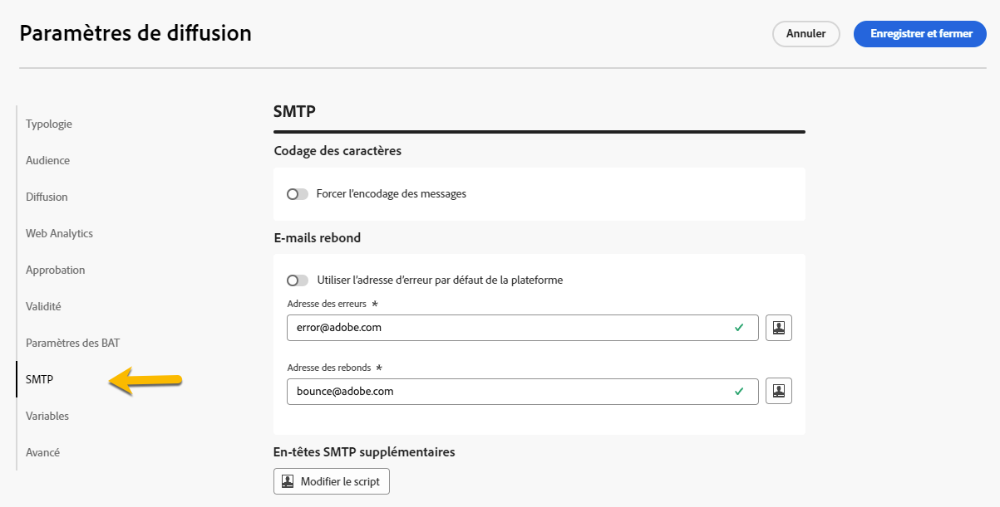
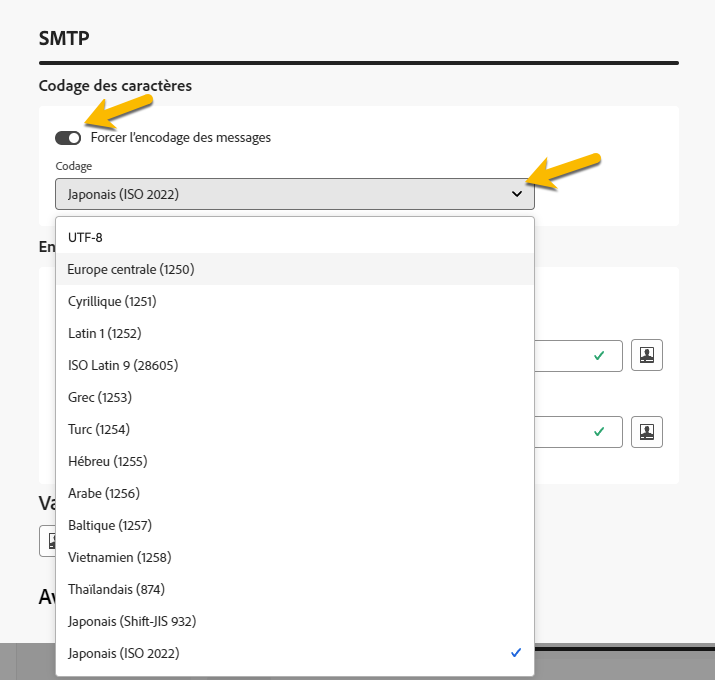
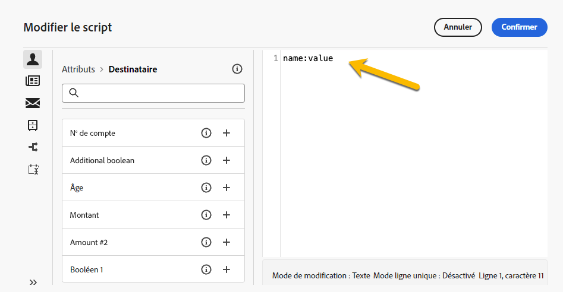
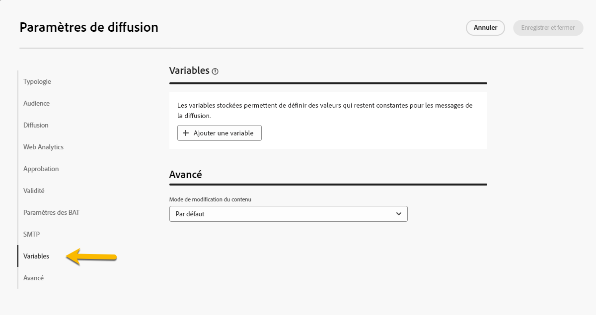

# Configurer les paramètres de diffusion {#del-settings}

Les paramètres de diffusion sont des **paramètres de diffusions techniques** définis dans le modèle de diffusion. Ils peuvent être surchargés pour chaque diffusion. Ces paramètres sont disponibles depuis le bouton **Paramètres** disponible lors de la modification d’une diffusion ou d’un modèle de diffusion.

>[!CAUTION]
>
>Ces paramètres sont décrits uniquement à titre d’information. Certains dépendent de votre configuration et de vos autorisations. Ils ne doivent pas être modifiées dans cette version du produit.

## Paramètres de typologie {#typology}

>[!CONTEXTUALHELP]
>id="acw_email_settings_typology"
>title="Typologie"
>abstract="Les règles de typologie permettent aux spécialistes marketing de normaliser les pratiques commerciales de l’ensemble des diffusions. Une typologie est un ensemble de règles de typologie qui permet de contrôler, filtrer et prioriser l’envoi des diffusions. Les profils qui correspondent à des critères dans une règle de typologie sont exclus des audiences de diffusion lors de la phase de préparation. La création de typologies et de règles de typologie s’effectue dans la console cliente Campaign."

>[!CONTEXTUALHELP]
>id="acw_delivery_template_settings_typology"
>title="Paramètres de typologie de la diffusion"
>abstract="Les règles de typologie permettent aux spécialistes marketing de normaliser les pratiques commerciales de l’ensemble des diffusions. Une typologie est un ensemble de règles de typologie qui permet de contrôler, filtrer et prioriser l’envoi des diffusions. Les profils qui correspondent à des critères dans une règle de typologie sont exclus des audiences de diffusion lors de la phase de préparation. La création de typologies et de règles de typologie s’effectue dans la console cliente Campaign."

Les typologies sont des ensembles de **règles de typologie** qui sont exécutées pendant la phase de préparation afin d’appliquer facilement plusieurs règles de filtrage en même temps à une diffusion. Elles permettent aux personnes spécialisées dans le marketing de normaliser les pratiques commerciales pour toutes les diffusions, en contrôlant, filtrant et gérant la priorité de l’envoi des diffusions.

Lors de l’association d’une typologie à un message ou à un modèle de message, les règles de typologie incluses dans la typologie sont exécutées pour vérifier la validité du message durant la préparation de celui-ci. Les profils qui correspondent à des critères inclus dans une règle de typologie sont exclus des audiences de diffusion.

Les typologies vous permettent de vous assurer que vos diffusions contiennent toujours certains éléments (comme un lien de désabonnement ou un objet) ou des règles de filtrage pour exclure des groupes de votre cible visée (tels que les clientes et clients désabonnés, les concurrents et les clientes et clients ne faisant pas partie du programme de fidélité).

{zoomable="yes"}

>[!NOTE]
>
>La création de typologies et de règles de typologie s’effectue dans la console cliente Campaign. En savoir plus sur les règles de pression et la configuration de la gestion de la fatigue dans la [documentation de Campaign v8 (console cliente)](https://experienceleague.adobe.com/docs/campaign/automation/campaign-optimization/campaign-typologies.html?lang=fr){target="_blank"}.

### Paramètres de pression {#pressure-parameters}

>[!CONTEXTUALHELP]
>id="acw_email_settings_pressure_parameters"
>title="Paramètres de pression de la diffusion"
>abstract="Le poids des diffusions permet d’identifier les diffusions prioritaires dans le cadre de la gestion de la fatigue. Les messages dont le poids est le plus élevé sont prioritaires."

>[!CONTEXTUALHELP]
>id="acw_delivery_template_settings_delivery_weight"
>title="Poids de la diffusion"
>abstract="Le poids des diffusions permet d’identifier les diffusions prioritaires dans le cadre de la gestion de la pression. Les messages dont le poids est le plus important sont prioritaires."

Dans cette section, les paramètres de pression vous permettent de définir un **seuil** pour configurer des règles de gestion d’usure, qui est le nombre maximal de messages pouvant être envoyés à un profil sur une période donnée.

Une fois ce seuil atteint, aucune diffusion ne sera envoyée jusqu&#39;à la fin de la période concernée. Ce mode de fonctionnement permet d&#39;exclure automatiquement un profil d&#39;une diffusion si l&#39;envoi du message provoquait le dépassement du seuil défini, et ainsi une sur-sollicitation.

La valeur de ce seuil peut être constante ou variable. Pour une même période, le seuil peut donc varier d&#39;un profil à l&#39;autre, et même pour un même profil.

Dans le champ **[!UICONTROL Type de poids]**, trois options sont disponibles :

* **[!UICONTROL Constant]**
* **[!UICONTROL Dépend du destinataire]**
* **[!UICONTROL Défini dans chaque règle]**

Utilisez le champ **[!UICONTROL Poids de la diffusion]** pour définir la priorité de diffusion. Chaque diffusion a un poids qui représente son niveau de priorité. Par défaut, le poids d’une diffusion est défini sur 5. Les règles de pression permettent de définir le poids des diffusions auxquelles elles s’appliquent. Le poids peut être fixe ou calculé au travers d’une formule afin de l’adapter en fonction des destinataires. Par exemple, vous pouvez définir le poids d’une diffusion en fonction des centres d’intérêt d’un(e) destinataire.

Utilisez le champ **[!UICONTROL Mode de diffusion]** pour sélectionner le mode d’évaluation de la cible.

Trois modes sont disponibles :

* **[!UICONTROL Estimation de la cible et personnalisation des messages]**
* **[!UICONTROL Estimation et validation de la cible prévisionnelle]**
* **[!UICONTROL Évaluation de la cible]**

>[!NOTE]
>
>Le paramétrage des règles de gestion de la fatigue et de la pression s’effectue dans la console cliente Campaign. En savoir plus dans la [documentation de Campaign v8 (console cliente)](https://experienceleague.adobe.com/docs/campaign/automation/campaign-optimization/pressure-rules.html?lang=fr){target="_blank"}.

### Paramètres de capacité {#capacity-settings}

>[!CONTEXTUALHELP]
>id="acw_email_settings_capacity_settings"
>title="Paramètres de capacité de la diffusion"
>abstract="Avant de diffuser des messages, utilisez les règles de capacité pour vous assurer que votre organisation peut traiter notamment la diffusion, les messages entrants que la diffusion peut générer et le nombre d’appels à passer pour contacter les personnes abonnées, par exemple. La définition des règles de capacité s’effectue dans la console Adobe Campaign v8. Sur cet écran, sélectionnez une règle associée au canal."

>[!CONTEXTUALHELP]
>id="acw_delivery_template_settings_recipient_importance"
>title="Importance de la personne destinataire"
>abstract="L’importance de la personne destinataire est une formule utilisée pour déterminer les profils conservés lorsque les règles de typologie de capacité sont dépassées."

Dans cette section, vous pouvez sélectionner une règle de capacité définie dans la console Adobe Campaign v8. Cette règle est associée au canal.

Le champ **[!UICONTROL Importance de la personne destinataire]** est une formule utilisée pour déterminer les profils conservés lorsque les règles de typologie de capacité sont dépassées.

>[!NOTE]
>
>La configuration de règles de typologie s’effectue dans la console cliente Campaign. En savoir plus dans la [documentation de Campaign v8 (console cliente)](https://experienceleague.adobe.com/docs/campaign/automation/campaign-optimization/consistency-rules.html?lang=fr){target="_blank"}.

## Paramètres de l’audience {#audience}

>[!CONTEXTUALHELP]
>id="acw_email_settings_audience"
>title="Paramètres d’audience de la diffusion"
>abstract="Sélectionnez un **mapping de ciblage** parmi ceux disponibles. Les mappings de ciblage sont définis dans la console Adobe Campaign v8. Vous pouvez également définir les paramètres d’exclusion de la diffusion."

Dans cette section, vous pouvez sélectionner un **mapping de ciblage** parmi ceux disponibles. Les mappings de ciblage sont définis dans la console Adobe Campaign v8. Le mapping de ciblage est le type de données qu’une opération traite. Il permet de définir la population ciblée : personnes destinataires, personnes bénéficiaires de contrats, opérateurs et opératrices, personnes abonnées, etc. [En savoir plus sur les mappings de ciblage](../audience/targeting-dimensions.md).

Dans le champ **[!UICONTROL Exclusion]**, vous pouvez choisir d’exclure des profils qui ne souhaitent plus être contactés ou qui sont mis en quarantaine. [En savoir plus](https://experienceleague.adobe.com/docs/campaign/campaign-v8/send/failures/quarantines.html?lang=fr){target="_blank"}

## Diffusion {#delivery}

>[!CONTEXTUALHELP]
>id="acw_email_settings_delivery"
>title="Paramètres de diffusion de la diffusion"
>abstract="Les paramètres de diffusion sont des paramètres techniques qui s’appliquent à votre diffusion. Vous pouvez modifier les modes de diffusion et de routine, activer E-mail Cci, envoyer par vagues et choisir le format des e-mails envoyés. Ces options sont limitées aux personnes expertes uniquement."

Les paramètres de **[!UICONTROL Diffusion]** sont des paramètres techniques qui s’appliquent à votre diffusion.

{zoomable="yes"}

Le compte externe de **[!UICONTROL Routage]** intégré est fourni par défaut. Il contient les paramètres techniques qui permettent à l’application d’envoyer des diffusions.

Vous pouvez définir les paramètres d’**[!UICONTROL Envoi]** ci-dessous.

* **[!UICONTROL Priorité de diffusion]** : utilisez cette option pour modifier l’ordre d’envoi de vos diffusions en configurant leur niveau de priorité : normal, élevé ou faible.

* **[!UICONTROL Nombre de messages groupés]** : utilisez cette option pour définir le nombre de messages regroupés dans un même package d’envoi XML. Si le paramètre est défini sur 0, les messages sont automatiquement regroupés. La taille du paquet est définie par le calcul `<delivery size>/1024`, avec un minimum de 8 messages et un maximum de 256 messages par package.

  >[!IMPORTANT]
  >
  >Lorsque vous créez la diffusion en dupliquant une diffusion existante, vous réinitialisez également ce paramètre.

* **[!UICONTROL Test de la diffusion par SMTP]** (canal e-mail) : cette option vous permet de tester l’envoi via SMTP. L’e-mail est traité jusqu’à la connexion au serveur SMTP mais n’est pas envoyé : pour chaque personne destinataire de l’e-mail, Campaign se connecte au serveur du fournisseur SMTP, exécute la commande SMTP RCPT TO et met fin à la connexion avant la commande SMTP DATA.

* **[!UICONTROL E-mail Cci]** (canal e-mail) : cette option permet de stocker les e-mails dans un système externe à l’aide de l’option Cci en ajoutant simplement une adresse e-mail Cci à la cible de vos messages. En savoir plus dans la [documentation de Campaign v8 (console cliente)](https://experienceleague.adobe.com/docs/campaign/campaign-v8/send/emails/email-bcc.html?lang=fr){target="_blank"}.

Dans la section **[!UICONTROL Définition de vague]**, sélectionnez l’option **[!UICONTROL Envoyer en plusieurs vagues]** pour augmenter progressivement le volume envoyé par vagues. Cela évitera que les emails soient marqués comme spam ou pour limiter le nombre de messages par jour. Grâce aux vagues, vous pouvez répartir les envois en plusieurs lots au lieu d’envoyer de gros volumes de messages en même temps. [En savoir plus](send-using-waves.md)

Concernant les e-mails, vous pouvez également modifier les **[!UICONTROL Formats d’e-mail]** des messages envoyés comme décrit ci-dessous.

* **[!UICONTROL Utiliser les préférences des personnes destinataires]** (mode par défaut) : le format des e-mails est défini en fonction des données stockées dans le profil de la personne destinataire. Si une personne destinataire souhaite recevoir les messages dans un format particulier, c’est ce format qui lui est envoyé. Si ce champ n’est pas renseigné, l’e-mail est envoyé au format multipart-alternative (voir ci-dessous).

* **[!UICONTROL Laisser le client de messagerie des personnes destinataires choisir le format le plus adapté]** : l’e-mail contient les deux formats : texte et HTML. Le format affiché lors de la réception dépend de la configuration du logiciel de messagerie de la personne destinataire (multipart-alternative).

  >[!IMPORTANT]
  >
  >Cette option inclut les deux versions du document. Par conséquent, celle-ci a un impact sur le débit de diffusion, car la taille de l’e-mail est plus importante.

* **[!UICONTROL Envoyer tous les messages au format texte]** : le message est envoyé au format texte. Le format HTML ne sera pas envoyé, mais uniquement utilisé pour la page miroir, lorsque la personne destinataire clique sur l’e-mail.

## Web Analytics {#web-analytics}

>[!CONTEXTUALHELP]
>id="acw_email_settings_webanalytics"
>title="Paramètres Web Analytics de la diffusion"
>abstract="Sélectionnez un compte Web Analytics. La configuration de ce compte s’effectue dans la console cliente Campaign. Vous pouvez également définir les balises partagées avec l’outil d’analyse que vous utilisez."

Dans cette section, vous pouvez sélectionner un compte Web Analytics. La configuration de ce compte s’effectue dans la console cliente Campaign.

Vous pouvez également définir les balises partagées avec l’outil d’analyse que vous utilisez.

>[!NOTE]
>
>La configuration des fonctionnalités Web analytics s’effectue dans la console cliente Campaign. En savoir plus dans la [documentation de Campaign v8 (console cliente)](https://experienceleague.adobe.com/docs/campaign/campaign-v8/connect/ac-aa.html?lang=fr#external-account-ac){target="_blank"}.

## Reprises {#retries}

>[!CONTEXTUALHELP]
>id="acw_delivery_template_settings_retries"
>title="Nombre maximal de reprises"
>abstract="Si un message est en échec en raison d’une erreur temporaire, les reprises sont effectuées jusqu’à la fin de la durée de diffusion."

<!--Currently not visible in UI > ??-->

Les messages temporairement non diffusés en raison d’une erreur Soft ou Ignoré font l’objet d’une nouvelle tentative automatique. Par défaut, cinq reprises sont planifiées le premier jour de l’envoi, avec un intervalle minimum d’une heure, réparties sur les 24 heures de la journée.

## Approbation (canal e-mail) {#approval}

>[!CONTEXTUALHELP]
>id="acw_email_settings_approval"
>title="Mode d’approbation de la diffusion"
>abstract="Sélectionnez le mode d’approbation. Si des avertissements sont générés lors de la préparation de la diffusion, vous pouvez configurer celle-ci pour définir si elle doit quand même être exécutée ou non."

>[!CONTEXTUALHELP]
>id="acw_delivery_template_settings_approval"
>title="Mode d’approbation des diffusions"
>abstract="Sélectionnez le mode d’approbation des diffusions à partir de ce modèle. Si des avertissements sont générés lors de la préparation de la diffusion, vous pouvez configurer celle-ci pour définir si elle doit quand même être exécutée ou non."

Si des avertissements sont générés lors de la préparation d’une diffusion par e-mail, vous pouvez configurer celle-ci pour définir si elle doit quand même être exécutée ou non. Par défaut, l’utilisateur ou l’utilisatrice doit confirmer l’envoi des messages à la fin de la phase d’analyse : il s’agit d’une validation **manuelle**.

Vous pouvez sélectionner un autre mode de validation dans le champ correspondant. Les modes disponibles sont les suivants :

* **[!UICONTROL Manuel]** : à la fin de la phase d’analyse, l’utilisateur ou l’utilisatrice doit confirmer la diffusion pour commencer l’envoi.
* **[!UICONTROL Semi-automatique]** : les envois démarrent automatiquement si la phase d’analyse ne génère aucun message d’avertissement.
* **[!UICONTROL Automatique]** : les envois démarrent automatiquement à la fin de la phase d’analyse, quel qu’en soit le résultat.

## Validité {#validity}

>[!CONTEXTUALHELP]
>id="acw_email_settings_validity"
>title="Validité des paramètres"
>abstract="Le champ **Durée de diffusion** permet de saisir la limite pour des reprises globales de diffusion. Concrètement, Adobe Campaign diffuse les messages à partir de la date de lancement. Puis, pour les messages en erreur uniquement, des reprises régulières et paramétrables sont effectuées tant que la limite de diffusion n’est pas atteinte. Le champ **Limite de validité des ressources** est utilisé pour les ressources chargées, comme la page miroir ou les images. Au-delà de cette limite, ces ressources ne sont plus disponibles."

>[!CONTEXTUALHELP]
>id="acw_delivery_template_settings_resources_validity"
>title="Limite de validité des ressources"
>abstract="Le champ **Limite de validité des ressources** est utilisé pour les ressources chargées, comme la page miroir ou les images. Ces ressources sont valides pour une durée limitée. Une fois la limite atteinte, elles ne sont plus disponibles."

>[!CONTEXTUALHELP]
>id="acw_delivery_template_settings_delivery_duration"
>title="Durée de diffusion"
>abstract="Le champ **Durée de diffusion** permet de saisir la limite pour des reprises globales de diffusion. Concrètement, Adobe Campaign diffuse les messages à partir de la date de lancement. Puis, pour les messages en erreur uniquement, des reprises régulières et paramétrables sont effectuées tant que la limite de diffusion n’est pas atteinte."

<!--
>[!CONTEXTUALHELP]
>id="acw_email_settings_resources_validity"
>title="Resources validity limit"
>abstract="The Validity limit field is used for uploaded resources, such as the mirror page or images. These resources are valid for a limited time: once the limit is reached, resources are no longer available."
-->

### Période de validité {#validity-period}

Le champ **[!UICONTROL Durée de diffusion]** permet de saisir la limite pour des reprises globales de diffusion. Concrètement, Adobe Campaign diffuse les messages à partir de la date de lancement. Puis, pour les messages en erreur uniquement, des reprises régulières et paramétrables sont effectuées tant que la limite de diffusion n’est pas atteinte.

Vous pouvez également choisir de spécifier des dates. Pour ce faire, sélectionnez **[!UICONTROL Fixer explicitement les dates de validité]**. Dans ce cas, les dates limites de diffusion et de validité permettent également de définir l’heure. L’heure actuelle est utilisée par défaut, mais vous pouvez la modifier directement dans le champ de saisie.

La **[!UICONTROL Limite de validité des ressources]** est utilisée pour les ressources chargées, principalement pour la page miroir et les images. Les ressources de cette page ont une durée de validité limitée (afin d’économiser de l’espace disque). Au-delà de cette limite, ces ressources ne sont plus disponibles.

{zoomable="yes"}

<!--Change screenshot to be consistent with prod > not sure which version is correct-->

En savoir plus sur la période de validité des diffusions dans la [documentation de Campaign v8 (console cliente)](https://experienceleague.adobe.com/docs/campaign/campaign-v8/campaigns/send/failures/delivery-failures.html?lang=fr#validity-period){target="_blank"}.

### Gestion des pages miroir (canal e-mail) {#mirror}

La page miroir est une page HTML accessible en ligne via un navigateur web et dont le contenu est identique à celui de l’e-mail. Par défaut, la page miroir est générée si le lien est inséré dans le contenu de l’e-mail.

Outre le mode par défaut, les options disponibles sont les suivantes :

* **[!UICONTROL Forcer la génération de la page miroir]** : ce mode permet de générer la page miroir même si aucun lien vers la page miroir n’est inséré dans l’e-mail.
* **[!UICONTROL Ne pas générer de page miroir]** : ce mode permet de ne pas générer de page miroir, même si le lien est présent dans l’e-mail.
* **[!UICONTROL Générer une page miroir accessible via l’identifiant du message uniquement]** : ce mode permet d’accéder au contenu de la page miroir, dans la fenêtre du log de diffusion de la console cliente, lorsque l’e-mail ne contient pas de lien vers la page miroir.

### Tracking {#tracking}

<!--
>[!CONTEXTUALHELP]
>id="acw_email_settings_tracking_validity"
>title="Validity period"
>abstract="This option defines the duration for which the tracking is activated on the URLs."
-->

>[!CONTEXTUALHELP]
>id="acw_delivery_template_settings_tracking_validity"
>title="Période de validité"
>abstract="La période de validité définit la durée d’activation du tracking sur les URL des messages."

Les paramètres de **[!UICONTROL Tracking]** sont définis dans la section correspondante. Les options possibles sont les suivantes :

* **[!UICONTROL Limite de validité du tracking]** : utilisez cette option pour définir la durée d’activation du tracking sur les URL.
* **[!UICONTROL URL de substitution des URL arrivées à expiration]** : utilisez cette option pour renseigner une URL vers une page web de secours. Celle-ci s’affiche après l’expiration du tracking.

## Paramètres de BAT {#test-setttings}

>[!CONTEXTUALHELP]
>id="acw_email_settings_testsettings"
>title="Configurer les paramètres de BAT pour la diffusion"
>abstract="Sélectionnez les paramètres d’exclusion et personnalisez le libellé des BAT."

<!--Test to be replaced with Proof everywhere - currently not consistent within UI > changed to Proof to reflect UI here but not consistent in documentation either-->

Vous pouvez définir les paramètres d’exclusion dans cette section. Les options disponibles sont les suivantes :

* L’option **[!UICONTROL conserver les doublons]** vous permet d’autoriser plusieurs diffusions vers des profils répondant à plusieurs critères de ciblage.
* L’option **[!UICONTROL Conserver les adresses placées sur la liste bloquée]** permet de tenir à l’écart de la cible les profils qui ne sont plus ciblés par la diffusion, par exemple après une désinscription (opt-out).
* L’option **[!UICONTROL Conserver les adresses placées en quarantaine]** permet de tenir à l’écart de la cible les profils dont l’adresse ne répond pas.

Vous pouvez également personnaliser le libellé des BAT :

* Utilisez l’option **[!UICONTROL Conserver le code diffusion pour le BAT]** pour associer au BAT le même code de diffusion que celui défini pour la diffusion à laquelle il se rapporte.
* Par défaut, l’objet du BAT est précédé du préfixe « BAT # », où # correspond au numéro du BAT. Vous pouvez modifier ce préfixe dans le champ **[!UICONTROL Préfixe de libellé]**.

## Paramètres SMTP pour la diffusion email {#smtp}

>[!CONTEXTUALHELP]
>id="acw_email_settings_smtp"
>title="Paramètres SMTP"
>abstract="Vous pouvez ajouter des paramètres SMTP supplémentaires à votre diffusion email."

Vous pouvez ajouter des paramètres SMTP supplémentaires à votre diffusion email. Vous pouvez le faire dans l&#39;onglet SMTP des paramètres de la diffusion.

{zoomable="yes"}

### Encodage des caractères {#character-encoding}

La section **[!UICONTROL Encodage des caractères]** vous permet de définir un encodage spécifique. Le codage par défaut est UTF-8, qui fonctionne pour la plupart des caractères. Cependant, certains fournisseurs de messagerie peuvent ne pas afficher correctement les caractères spéciaux s’ils ne prennent pas en charge le codage UTF-8 standard.

Par exemple, si vous souhaitez envoyer un email avec des caractères japonais, il est préférable d’utiliser un encodage qui prend spécifiquement en charge ces caractères, de sorte que votre audience au Japon puisse tout voir correctement.

Pour ce faire, activez le bouton d’activation/désactivation **[!UICONTROL Forcer l’encodage utilisé pour les messages]** et sélectionnez l’encodage approprié dans la liste qui prend en charge vos caractères spéciaux.

{zoomable="yes"}

### E-mails rebond {#bounce-emails}

L&#39;onglet **[!UICONTROL SMTP]** des paramètres de la diffusion permet également de configurer la gestion des mails rebonds.

* **[!UICONTROL Erreurs à adresse]** : si vous activez l’option **[!UICONTROL Utiliser l’adresse d’erreur par défaut définie pour le bouton d’activation/désactivation de la plateforme]**, les messages rejetés sont reçus dans la zone d’erreur par défaut de la plateforme. Si vous ne l&#39;activez pas, vous pouvez définir une adresse d&#39;erreur spécifique pour votre diffusion.

* **[!UICONTROL Adresse des rebonds]** : vous pouvez également définir une autre adresse vers laquelle les e-mails de rebond non traités seront transférés. Cette adresse permet d’étudier les raisons des rebonds lorsque les e-mails n’ont pas pu être qualifiés automatiquement par l’application.

Ces deux champs peuvent être personnalisés comme décrit dans [cette section](../personalization/gs-personalization.md).

{zoomable="yes"}

### En-têtes SMTP supplémentaires {#smtp-headers}

Vous pouvez ajouter des **[!UICONTROL en-têtes SMTP]** à votre diffusion email, dans l’onglet SMTP des paramètres de la diffusion.

Le script saisi dans cette fenêtre doit référencer un en-tête par ligne sous la forme nom:valeur.

Les valeurs sont automatiquement encodées, si nécessaire.

{zoomable="yes"}

>[!IMPORTANT]
>
>L’ajout d’un script pour l’insertion d’en-têtes SMTP supplémentaires est réservé aux utilisateurs expérimentés. La syntaxe de ce script doit être strictement conforme aux exigences de ce type de contenu : aucun espace superflu, aucune ligne vide, etc.

## Ajouter des variables {#variables-delivery}

>[!CONTEXTUALHELP]
>id="acw_delivery_settings_variable"
>title="Variables"
>abstract="Vous pouvez ajouter des variables à votre diffusion, ce qui peut s’avérer utile pour le suivi et la personnalisation. Ces variables sont accessibles à partir du contenu de votre diffusion et de vos workflows."

Pour ajouter une variable, accédez à l’onglet **[!UICONTROL Variables]** comme illustré ci-dessous.

{zoomable="yes"}

Cliquez sur le bouton **[!UICONTROL Ajouter des variables]** pour saisir les détails de votre variable, puis cliquez sur **[!UICONTROL Confirmer]** pour enregistrer vos modifications.

{zoomable="yes"}
