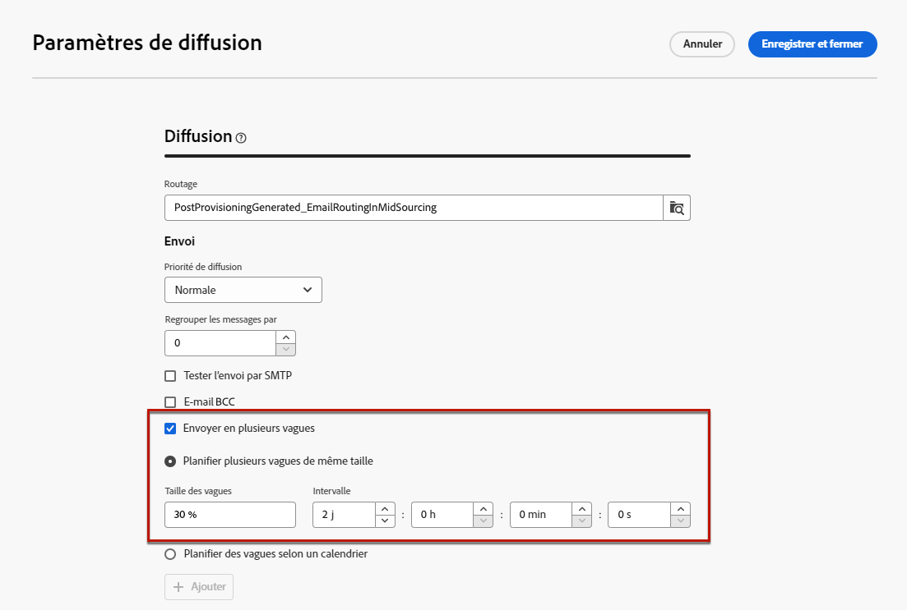
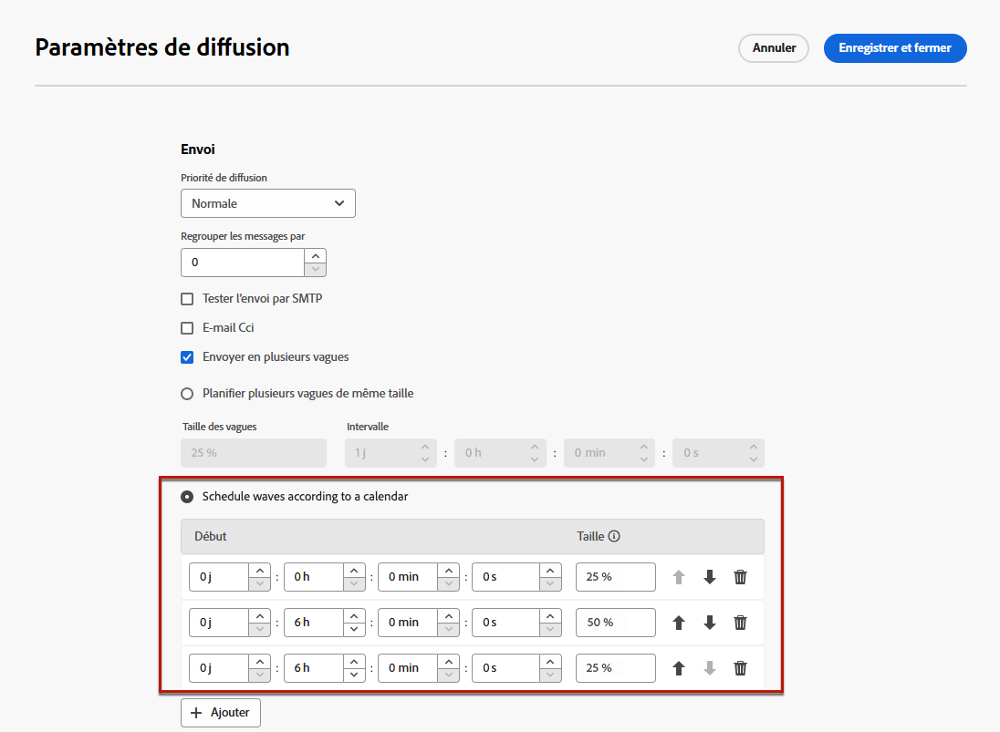
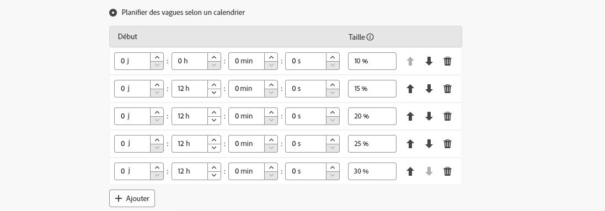

# Envoyer par vagues {#send-using-waves}

>[!CONTEXTUALHELP]
>id="acw_deliveries_waves_definition"
>title="Partager les diffusions en plusieurs lots"
>abstract="Au lieu d’envoyer simultanément de gros volumes de messages, définissez des vagues pour partager les envois en plusieurs lots. Vous pouvez configurer plusieurs vagues de même taille ou définir un calendrier pour les différentes vagues à envoyer."

>[!CONTEXTUALHELP]
>id="acw_deliveries_waves_size"
>title="Définir la taille de chaque vague"
>abstract="Vous devez indiquer une taille pour toutes les vagues que vous ajoutez. Saisissez une valeur numérique (nombre de messages pour chaque vague) ou un pourcentage (0 à 100 %)."

Pour équilibrer la charge, vous pouvez diviser les diffusions par e-mail en plusieurs lots. Configurez le nombre de lots et leur proportion par rapport à l’ensemble de la diffusion, ainsi que l’intervalle entre deux vagues.

>[!NOTE]
>
>Vous ne pouvez définir la taille et le délai qu’entre deux vagues consécutives. Le critère de sélection des personnes destinataires pour chaque vague ne peut pas être ajusté.

Pour envoyer des diffusions par vagues, procédez comme suit.

1. Ouvrez les [paramètres de diffusion](delivery-settings.md#retries).

1. Accédez à la section **[!UICONTROL Diffusion]**.

1. Sélectionnez l’option **[!UICONTROL Envoyer en plusieurs vagues]**.

1. Pour configurer des vagues, vous pouvez effectuer l’une des opérations suivantes :

   * [Planifier plusieurs vagues de même taille](#waves-same-size)
   * [Planifier des vagues selon un calendrier](#waves-calendar)

1. Préparez et envoyez votre diffusion selon la procédure habituelle. [En savoir plus](../msg/gs-deliveries.md)

   >[!CAUTION]
   >
   >Veillez à ce que les dernières vagues ne dépassent pas la date limite d’envoi qui est définie dans l’onglet [Validité](delivery-settings.md#validity). Sinon, certains messages peuvent ne pas être envoyés. Une règle de contrôle de typologie spécifique, la **[!UICONTROL vérification de la planification des vagues]**, garantit que la dernière vague est planifiée avant la limite de validité de la diffusion. Apprenez-en davantage sur les règles de contrôle dans la [documentation de Campaign v8 (console cliente)](https://experienceleague.adobe.com/docs/campaign/automation/campaign-optimization/control-rules.html?lang=fr).
   >
   >Lors de la configuration des dernières vagues, veillez également à prévoir assez de temps pour les reprises. [En savoir plus](delivery-settings.md#retries)

1. Pour surveiller vos envois, accédez aux [logs de diffusion](../monitor/delivery-logs.md). Vous pouvez visualiser les diffusions qui ont déjà été envoyées dans les vagues traitées (statut **[!UICONTROL Envoyé]**) et celles à envoyer dans les vagues restantes (statut **[!UICONTROL En attente]**).

## Planifier plusieurs vagues de même taille {#waves-same-size}

Si vous sélectionnez cette option, toutes les vagues ont la même taille (sauf la dernière) et le délai entre chaque vague est toujours le même.

{zoomable="yes"}

* Indiquez la taille de toutes les vagues dans lesquelles vous partagez la diffusion. Vous pouvez saisir un pourcentage ou une valeur numérique. Seule la dernière vague peut varier en taille, car elle doit inclure le nombre de messages restant.

  Par exemple, si vous saisissez **[!UICONTROL 30 %]** dans le champ **[!UICONTROL Taille des vagues]**, les trois premières vagues représentent 30 % de tous les messages inclus dans la diffusion, et la quatrième représente les 10 % restants.

* Dans la section **[!UICONTROL Intervalle]**, indiquez le délai entre le démarrage de deux vagues consécutives. Par exemple, si vous saisissez **[!UICONTROL 2 j]**, la première vague démarre immédiatement, la deuxième démarre dans deux jours, la troisième dans quatre jours, etc.

Un centre d’appel est impliqué dans le cas d’utilisation de plusieurs vagues de même taille. Lorsque vous gérez une campagne téléphonique de fidélisation, votre entreprise a une capacité de traitement des appels limitée pour contacter les abonnés.

Grâce aux vagues, vous pouvez limiter le nombre des messages à 20 par jour, ce qui correspond à la capacité de traitement quotidien d&#39;un centre d&#39;appels.

Pour ce faire, sélectionnez l’option **[!UICONTROL Planification de plusieurs vagues de même taille]**. Saisissez **[!UICONTROL 20]** comme taille de vague et **[!UICONTROL 1 j]** dans le champ **[!UICONTROL Intervalle]**.

{zoomable="yes"}

## Planifier des vagues selon un calendrier {#waves-calendar}

Si vous sélectionnez cette option, vous devez définir le jour/l’heure de début de chaque vague que vous envoyez, ainsi que la taille de chaque vague.

* Dans les champs **[!UICONTROL Début]**, indiquez le délai entre le démarrage de deux vagues consécutives.

* Dans la colonne **[!UICONTROL Taille]**, saisissez un nombre fixe ou un pourcentage.

Ajoutez autant de vagues que vous le souhaitez. Vous pouvez les réorganiser selon vos besoins.

>[!NOTE]
>
>Si vous utilisez des pourcentages, le total de toutes les vagues ne doit pas dépasser 100 %.

Dans l’exemple ci-dessous, la première vague représente 25 % du nombre total de messages inclus dans la diffusion et démarre immédiatement. Les deux vagues suivantes terminent la diffusion et sont définies pour commencer à six heures d’intervalle.

{zoomable="yes"}

Le processus d’accélération constitue un cas d’utilisation courant de plusieurs vagues selon un calendrier.

Lorsque vous envoyez des emails à l&#39;aide d&#39;une nouvelle plateforme, rien n&#39;est plus suspect pour un FAI (fournisseur d&#39;accès internet) que les adresses IP qui ne sont pas reconnues. Si des emails sont subitement envoyés en masse, le FAI les range souvent dans le courrier indésirable.

Pour éviter que les emails soient marqués comme spam, vous pouvez augmenter progressivement le volume envoyé à l&#39;aide de vagues. Cela permet d&#39;entamer la phase de démarrage en douceur et de réduire le nombre total d&#39;adresses invalides.

Pour ce faire, utilisez l’option **[!UICONTROL Planifier les vagues selon un calendrier]**. Par exemple, définissez la première vague sur 10 %, la deuxième sur 15 %, la troisième sur 20 %, etc.

{zoomable="yes"}
