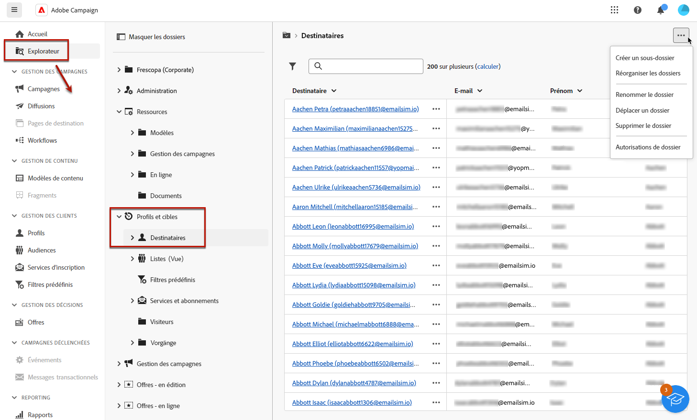
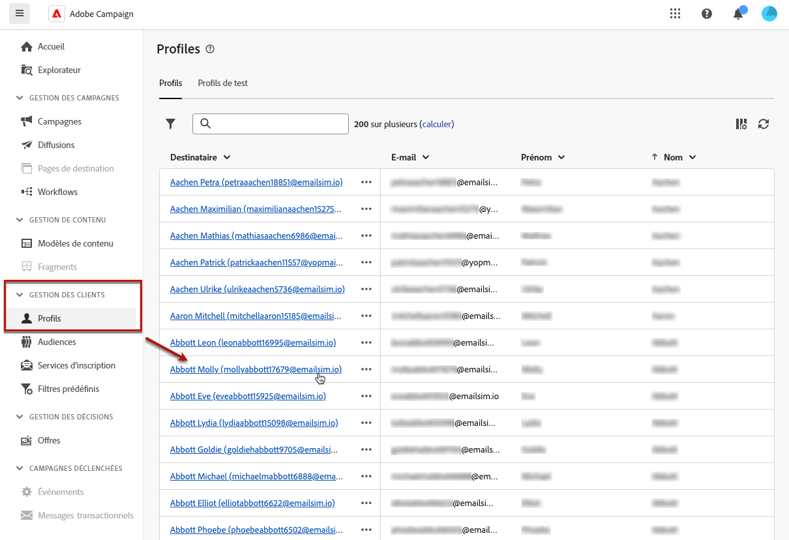
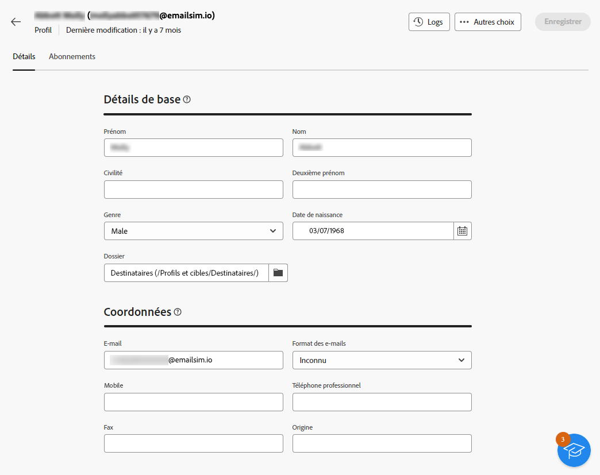
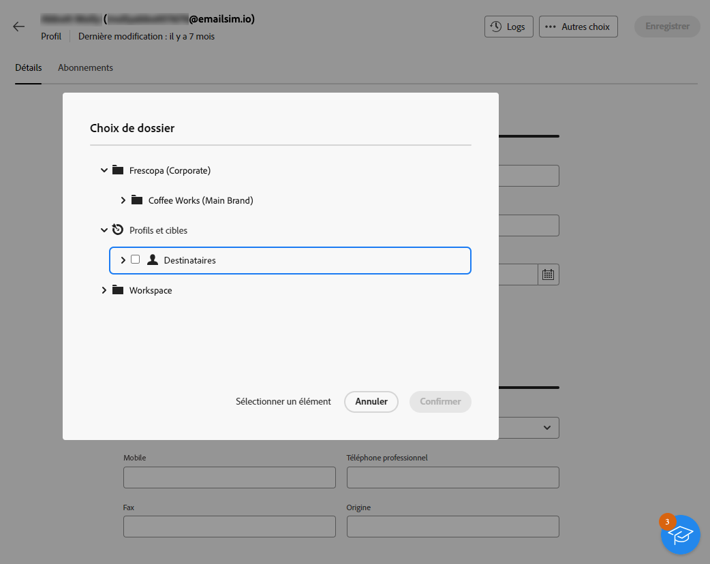
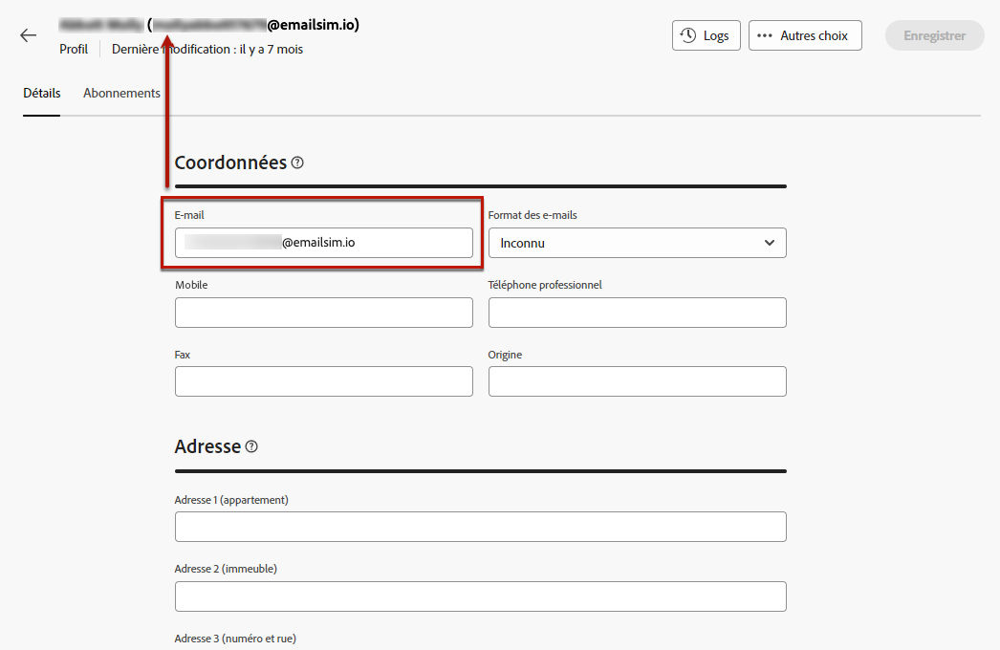
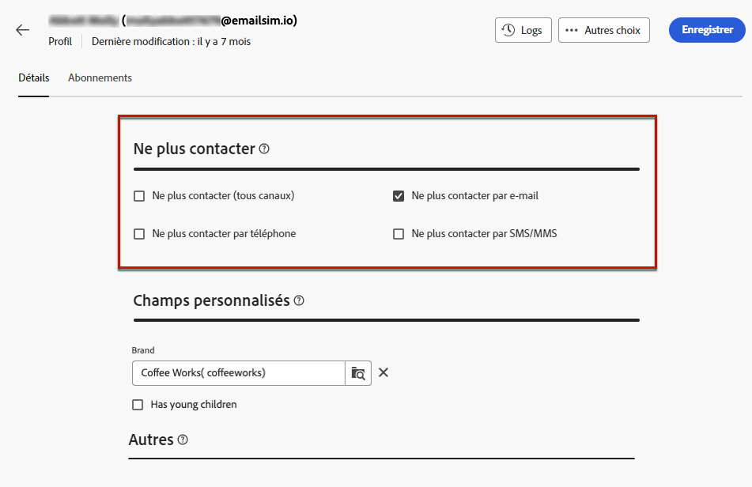
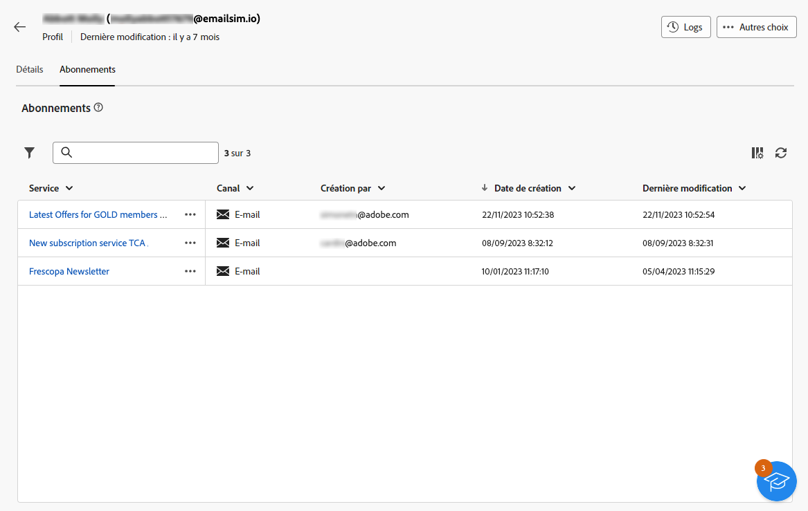
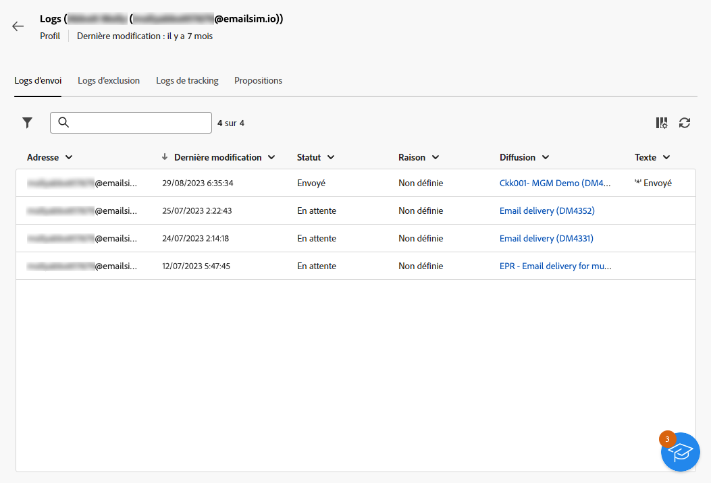

# Surveillance et modification des profils {#profiles}

>[!CONTEXTUALHELP]
>id="acw_homepage_rn4"
>title="Affichage 360 de vos profils"
>abstract="Créez de nouveaux profils et surveillez-les à l’aide de puissants rapports et outils. Accédez aux attributs, interactions et logs de vos profils. Utilisez les options de filtrage pour parcourir la liste des profils, éditer et mettre à jour leur profil."
>additional-url="https://experienceleague.adobe.com/docs/campaign-web/v8/whats-new.html" text="Voir les notes de mise à jour"

>[!CONTEXTUALHELP]
>id="acw_recipients_list"
>title="Profils"
>abstract="Un profil est une personne ciblée pour recevoir les messages envoyés par Adobe Campaign. Dans cette liste, vous pouvez afficher les détails des profils en fonction de vos autorisations. Utilisez les options de filtrage pour parcourir cette liste. Vous pouvez modifier et mettre à jour un petit ensemble d’attributs de vos profils."

## Prise en main des profils {#gs}

Un profil dans Adobe Campaign Web est un individu stocké dans la base de données, qui sert de composant clé à [créer des audiences](create-audience.md) pour les diffusions et [ajout de la personnalisation](../personalization/personalize.md) des données à votre contenu.

D’autres types de profils sont stockés dans la base de données, tels que **[!UICONTROL Profils de test]**, qui sont conçues pour tester vos diffusions avant leur envoi à l’audience finale. [En savoir plus](test-profiles.md)

Les profils peuvent uniquement être créés à partir de la console cliente Adobe Campaign : [apprendre](https://experienceleague.adobe.com/docs/campaign/campaign-v8/audience/add-profiles/create-profiles.html){target="_blank"}. Toutefois, elles sont accessibles et modifiables dans le Web Adobe Campaign à partir de la variable **[!UICONTROL Gestion des clients]** > **Profils** dans le rail de navigation de gauche.

>[!NOTE]
>
>En fonction de vos permissions, il se peut que vous n&#39;ayez pas accès à la liste complète des profils stockés dans la base de données. [En savoir plus sur les autorisations](../get-started/permissions.md).

* Vous pouvez filtrer la variable **[!UICONTROL Profils]** à l’aide du champ de recherche ou des filtres disponibles dans la variable **Afficher les filtres** bouton . Vous pouvez limiter les résultats à un [folder](../get-started/permissions.md#folders) à l’aide de la liste déroulante ou ajoutez des règles à l’aide du [query modeler](../query/query-modeler-overview.md).

  

* Pour supprimer un profil, sélectionnez l’option correspondante dans la **[!UICONTROL Autres actions]** .

* Pour modifier un profil, cliquez sur l’élément de votre choix dans la liste. [En savoir plus](#access)

Vous pouvez également accéder aux profils via la **[!UICONTROL Explorateur]** de la vue **[!UICONTROL Profils et cibles]** > **[!UICONTROL Destinataires]** noeud .

De là, vous pouvez parcourir, créer et gérer des dossiers ou des sous-dossiers, ainsi que vérifier les autorisations associées. [Découvrez comment créer des dossiers](../get-started/permissions.md#folders)

Dans la **[!UICONTROL Explorateur]** vous pouvez également filtrer, supprimer et [edit](#access) profils.

## Accès et modification des attributs des profils {#access}

>[!CONTEXTUALHELP]
>id="acw_recipients_creation_details"
>title="Détails de base"
>abstract="Cette section donne des informations sur les détails de base du profil. Pour modifier des informations, apportez vos modifications directement dans le champ correspondant, puis cliquez sur le bouton **Enregistrer** situé dans le coin supérieur droit de l’écran."

>[!CONTEXTUALHELP]
>id="acw_recipients_creation_contactinformation"
>title="Coordonnées"
>abstract="Cette section donne des informations sur les coordonnées du profil. Pour modifier des informations, apportez vos modifications directement dans le champ correspondant, puis cliquez sur le bouton **Enregistrer** situé dans le coin supérieur droit de l’écran."

>[!CONTEXTUALHELP]
>id="acw_recipients_creation_address"
>title="Adresse"
>abstract="Cette section donne des informations sur l’adresse postale du profil et la qualité des adresses. Pour modifier des informations, apportez vos modifications directement dans le champ correspondant, puis cliquez sur le bouton **Enregistrer** situé dans le coin supérieur droit de l’écran."

>[!CONTEXTUALHELP]
>id="acw_recipients_creation_account"
>title="Détails du compte"
>abstract="Cette section fournit des informations sur les détails du compte du profil. Pour modifier des informations, apportez vos modifications directement dans le champ correspondant, puis cliquez sur le bouton **Enregistrer** situé dans le coin supérieur droit de l’écran."

>[!CONTEXTUALHELP]
>id="acw_recipients_creation_nolongercontact"
>title="Personnes destinataires : ne plus contacter"
>abstract="Cette section donne des informations sur les préférences de contact du profil. Pour modifier des informations, apportez vos modifications directement dans le champ correspondant, puis cliquez sur le bouton **Enregistrer** situé dans le coin supérieur droit de l’écran."

>[!CONTEXTUALHELP]
>id="acw_recipients_creation_customfields"
>title="Champs personnalisés"
>abstract="Les champs personnalisés sont des attributs spécifiques, adaptés à vos besoins, qui ont été configurés pour votre instance. Pour modifier des informations, apportez vos modifications directement dans le champ correspondant, puis cliquez sur le bouton **Enregistrer** situé dans le coin supérieur droit de l’écran."

>[!CONTEXTUALHELP]
>id="acw_recipients_creation_othersfields"
>title="Autres"
>abstract="Cette section fournit des attributs intégrés supplémentaires. Pour modifier des informations, apportez vos modifications directement dans le champ correspondant, puis cliquez sur le bouton **Enregistrer** situé dans le coin supérieur droit de l’écran."

>[!CONTEXTUALHELP]
>id="acw_recipients_subscription_list"
>title="Liste des abonnements des personnes destinataires"
>abstract="Cet onglet répertorie tous les services auxquels le profil est abonné."

Pour accéder aux détails d&#39;un profil et les éditer, procédez comme suit.

1. Accédez à **[!UICONTROL Gestion des clients]** > **[!UICONTROL Profils]** et cliquez sur l’élément de votre choix dans la **[!UICONTROL Profils]** liste.

   

1. Les informations détaillées relatives au profil s&#39;affichent.

   La variable **[!UICONTROL Détails]** vous permet de parcourir les attributs intégrés et personnalisés du profil. Pour modifier un attribut, apportez des modifications dans le champ souhaité, puis cliquez sur le bouton **[!UICONTROL Enregistrer]** bouton .

   

   1. Par défaut, les profils sont stockés dans la variable **[!UICONTROL Destinataires]** dossier. Vous pouvez la modifier en accédant à l’emplacement souhaité. [Découvrez comment utiliser des dossiers](../get-started/permissions.md#folders)

      

   1. Dans le **[!UICONTROL Coordonnées]** , vous pouvez mettre à jour l’adresse électronique et d’autres données pertinentes. L&#39;adresse email s&#39;affiche entre crochets après le libellé du profil.

      

   1. Vérifiez les **[!UICONTROL Ne plus contacter]** et les mettre à jour si nécessaire. Lorsque l’une de ces options est sélectionnée, le profil est en liste bloquée. Par exemple, si le destinataire a cliqué sur un lien de désinscription dans une newsletter, ces informations sont ajoutées aux données de contact. Ce destinataire n&#39;est plus ciblé sur le ou les canaux sélectionnés. [En savoir plus](https://experienceleague.adobe.com/docs/campaign/campaign-v8/send/failures/quarantines.html){target="_blank"}

      

   1. S’il existe des **[!UICONTROL Champs personnalisés]**, vous pouvez mettre à jour leurs valeurs si nécessaire. Les champs personnalisés sont des attributs supplémentaires ajoutés à la variable **[!UICONTROL Profils]** via la console Adobe Campaign. [En savoir plus](https://experienceleague.adobe.com/docs/campaign/campaign-v8/developer/shemas-forms/extend-schema.html){target="_blank"}

      

1. Cliquez sur le bouton **[!UICONTROL Abonnements]** pour accéder aux informations sur les services auxquels le profil est abonné. [En savoir plus sur les services d’abonnement](manage-services.md)

   

1. Cliquez sur le bouton **[!UICONTROL Journaux]** situé dans le coin supérieur droit de l’écran pour afficher l’historique des interactions du profil par le biais des logs d’envoi, d’exclusion et de tracking. [En savoir plus sur les logs de diffusion](../monitor/delivery-logs.md)

   Vous pouvez également consulter les offres présentées au profil dans la section **[!UICONTROL Propositions]** . [En savoir plus sur les offres](../msg/offers.md)

   
