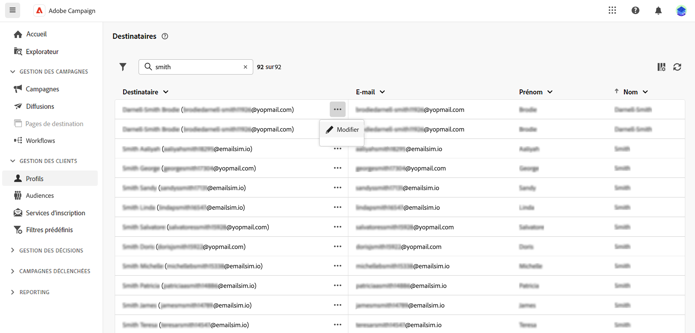
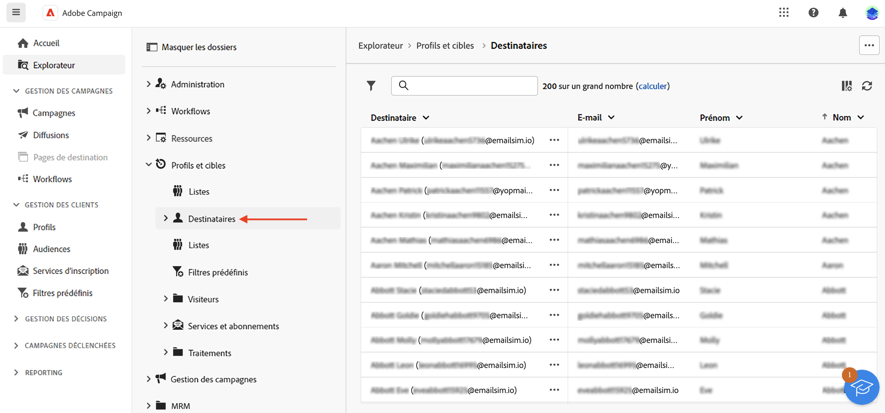

# Utilisation des destinataires et des audiences {#about-recipients}

## Que sont les destinataires ? {#recipients}

>[!CONTEXTUALHELP]
>id="acw_recipients_list"
>title="Destinataires"
>abstract="Un destinataire est un profil qui cible les messages envoyés par Adobe Campaign. Dans Adobe Campaign, les destinataires sont les profils par défaut ciblés pour l’envoi de diffusions (e-mails, SMS). Depuis cette liste, vous pouvez visualiser le profil du destinataire, en fonction de vos permissions. Utilisez les options de filtrage pour parcourir cette liste. Vous pouvez éditer et mettre à jour un petit ensemble d&#39;attributs de votre destinataire."

Un destinataire est un profil qui cible les messages envoyés par Adobe Campaign. Dans Adobe Campaign, les destinataires sont les profils par défaut ciblés pour l’envoi de diffusions (emails, SMS, etc.). Les données de destinataires stockées dans la base de données vous permettent de créer des audiences qui recevront une diffusion donnée, et d&#39;ajouter des données de personnalisation dans les contenus de vos diffusions. D&#39;autres types de profils sont stockés dans la base de données. Ils sont conçus pour différents usages : par exemple, des profils de contrôle sont créés pour tester vos diffusions avant leur envoi à l&#39;audience finale.

Les destinataires ne peuvent être ajoutés que depuis la console cliente Campaign. Toutefois, elles sont visibles dans le web de Campaign, à partir de la variable **Destinataires** entrée du rail de navigation de gauche. Vous pouvez également modifier les attributs du destinataire à partir de cet écran.

Pour éditer les données du destinataire, cliquez sur les trois points en regard de son nom et choisissez **Modifier...**.

Vous pouvez mettre à jour un ensemble limité d’attributs, à savoir : son prénom, son nom, son adresse électronique et son numéro de téléphone.

>[!NOTE]
>
>Ce formulaire de modification de profil limité est fourni uniquement pour le test du programme bêta. Il sera amélioré dans la prochaine version. Il permet à l’utilisateur d’ajouter rapidement une adresse électronique et un numéro de téléphone à n’importe quel profil afin de pouvoir tester les canaux email et SMS et recevoir les messages envoyés.

Vous pouvez filtrer les destinataires à l&#39;aide du champ de recherche, depuis le **Afficher les filtres** bouton .

Vous pouvez également accéder aux destinataires à partir de la fonction **Explorateur** afficher, parcourir et créer des dossiers et des sous-dossiers, et vérifier les autorisations associées.

>[!NOTE]
>
>En fonction de vos permissions, il se peut que vous n&#39;ayez pas accès à la liste complète des destinataires stockés dans la base de données. Pour en savoir plus sur les autorisations, consultez [cette section](../get-started/permissions.md).

En outre, vous pouvez gérer l&#39;inscription et la désinscription de vos destinataires à des services tels que des newsletters. [Découvrez comment utiliser les services d’abonnement](manage-services.md)

Vous pouvez créer des workflows pour dédupliquer, enrichir, combiner des profils et créer des audiences. En savoir plus dans [cette section](../workflows/gs-workflows.md).

## Que sont les audiences ? {#audiences}

L’audience est la cible principale de votre diffusion : les destinataires qui reçoivent les messages. Le type d’audience dépend du mapping de ciblage défini dans le modèle de diffusion. [Découvrez ce qu&#39;est un modèle de diffusion](../msg/delivery-template.md).

Pour définir la population d&#39;une audience, vous pouvez :

* [Créer de nouvelles audiences](create-audience.md) de la **[!UICONTROL Audiences]** menu,
* [Sélectionner une audience existante](add-audience.md) créé en tant que liste dans la console cliente,
* [Sélection d’une audience Adobe Experience Platform](aep-audience.md),
* [créer une nouvelle audience avec le créateur de règles en définissant et combinant des critères de filtrage,](segment-builder.md)
* [Utilisation d’une audience à partir d’un fichier externe](file-audience.md). Cette option est disponible uniquement pour les diffusions email autonomes et ne peut pas être utilisée dans les diffusions de campagne.

Lors du ciblage d’une audience, vous pouvez également définir **populations témoins** pour éviter d’envoyer des messages à une partie de votre audience et mesurer l’impact de vos campagnes. [Découvrez comment définir une population témoin](control-group.md)

>[!NOTE]
>
>Lors de l&#39;envoi de messages dans le cadre d&#39;un workflow de campagne, l&#39;audience est définie dans une **Créer une audience** activité de workflow. Dans ce contexte, vous ne pouvez pas charger une audience depuis un fichier pour une diffusion par e-mail, et l’audience n’est définie que dans cette activité dédiée. Découvrez comment définir l’audience de votre diffusion dans un workflow de campagne [dans cette section](../workflows/activities/build-audience.md)

## Dimensions de ciblage {#targeting-dimensions}

La dimension de ciblage, c’est-à-dire. mapping de ciblage, est le type de données qu’une opération gère. Il permet de définir la population ciblée : destinataires, bénéficiaires de contrats, opérateurs, abonnés, etc.

La dimension de ciblage d&#39;un workflow est définie par la première **[!UICONTROL Créer une audience]** et est utilisée dans toutes les autres activités jusqu’à la fin du workflow. Par exemple, si vous effectuez une requête sur les destinataires de la base de données, la transition sortante contiendra des données de type destinataire et sera transmise à l&#39;activité suivante.

Notez que vous pouvez changer la dimension de ciblage dans un workflow à l’aide d’une **[!UICONTROL Changement de dimension]** activité. [En savoir plus](../workflows/activities/change-dimension.md). Vous pouvez ainsi, par exemple, interroger la base de données sur une table spécifique telle que des achats ou des abonnements, puis modifier la dimension de ciblage en Destinataires afin d&#39;envoyer des diffusions aux destinataires correspondants.

Par défaut, les modèles de diffusion par e-mail et SMS ciblent les **[!UICONTROL destinataires]**. Leur dimension cible utilise donc les champs de la variable **nms:recipient** table. Pour les notifications push, la dimension cible par défaut est **Applications abonnées nms:appSubscriptionRcp**, qui est lié à la table des destinataires.

Vous pouvez également utiliser d’autres mappings de ciblage intégrés dans vos workflows et diffusions répertoriés ci-dessous :

| Nom | Utilisation à | Schéma |
|---|---|---|
| Destinataires | Diffuser aux destinataires (tableau de destinataires intégré) | nms:recipient |
| Visiteurs | Diffuser aux visiteurs dont les profils ont été collectés par le biais d’une recommandation (marketing viral), par exemple. | mns:visitor |
| Abonnements  | Diffuser aux destinataires abonnés à un service d&#39;information, par exemple une newsletter | nms:subscription |
| Abonnements des visiteurs | Diffuser à des visiteurs abonnés à un service d&#39;information | nms:visitorSub |
| Les opérateurs | Diffuser aux opérateurs Adobe Campaign | nms:operator |
| Fichier externe | Diffuser depuis un fichier contenant les toutes informations nécessaires à la diffusion | Aucun schéma associé, aucune cible renseignée |
| Applications abonnées | Diffuser aux destinataires abonnés à une application | nms:appSubscriptionRcp |

En outre, vous pouvez créer un nouveau mapping de ciblage selon vos besoins. Cette opération est effectuée à partir de la console cliente. En savoir plus dans la [documentation de Campaign v8 (console cliente)](https://experienceleague.adobe.com/docs/campaign/campaign-v8/audience/add-profiles/target-mappings.html#new-mapping){target="_blank"}.
