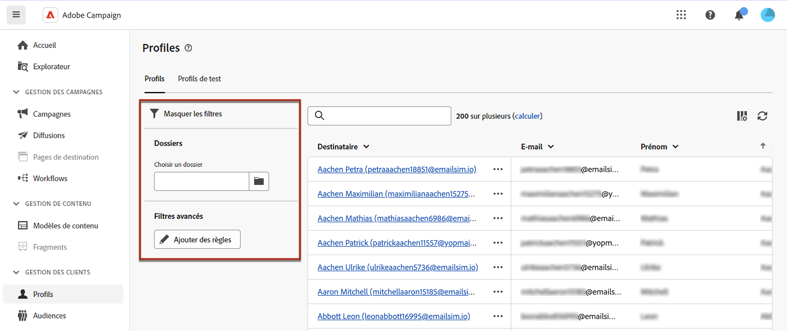

# Surveillance et gestion des profils {#profiles}

>[!CONTEXTUALHELP]
>id="acw_homepage_welcome_rn4"
>title="Vue à 360° de vos profils"
>abstract="Créez de nouveaux profils et surveillez-les à l’aide de puissants rapports et outils. Accédez aux attributs, interactions et logs de vos profils. Utilisez les options de filtrage pour parcourir la liste des profils, modifier et mettre à jour votre profil."
>additional-url="https://experienceleague.adobe.com/docs/campaign-web/v8/whats-new.html?lang=fr" text="Voir les notes de mise à jour"

<!--TO REMOVE BELOW-->
>[!CONTEXTUALHELP]
>id="acw_homepage_rn4"
>title="Vue à 360° de vos profils"
>abstract="Créez de nouveaux profils et surveillez-les à l’aide de puissants rapports et outils. Accédez aux attributs, interactions et logs de vos profils. Utilisez les options de filtrage pour parcourir la liste des profils, modifier et mettre à jour votre profil."
>additional-url="https://experienceleague.adobe.com/docs/campaign-web/v8/whats-new.html?lang=fr" text="Voir les notes de mise à jour"

<!--TO REMOVE ABOVE-->

>[!CONTEXTUALHELP]
>id="acw_recipients_list"
>title="Profils"
>abstract="Un profil est une personne ciblée pour recevoir les messages envoyés par Adobe Campaign. Depuis cette liste, vous pouvez visualiser les détails des profils, en fonction de vos autorisations. Utilisez les options de filtrage pour parcourir cette liste. Vous pouvez modifier et mettre à jour un petit ensemble d’attributs de vos profils."

## Commencer avec les profils {#gs}

Un profil dans Adobe Campaign Web est un individu stocké dans la base de données, qui sert de composant clé pour [créer des audiences](create-audience.md) pour les diffusions et [ajouter des données de personnalisation](../personalization/personalize.md) à votre contenu.

D’autres types de profils sont stockés dans la base de données, tels que les **[!UICONTROL Profils de test]**, qui sont conçus pour tester vos diffusions avant leur envoi à l’audience finale. [En savoir plus](test-profiles.md)

Les profils peuvent uniquement être créés à partir de la console cliente Adobe Campaign : [voici comment procéder](https://experienceleague.adobe.com/docs/campaign/campaign-v8/audience/add-profiles/create-profiles.html?lang=fr){target="_blank"}. Toutefois, ils sont accessibles et modifiables dans Adobe Campaign Web à partir de l’entrée **[!UICONTROL Gestion des clients]** > **Profils** dans le rail de navigation de gauche.

>[!NOTE]
>
>En fonction de vos autorisations, il se peut que vous n’ayez pas accès à la liste complète des profils stockés dans la base de données. [En savoir plus sur les autorisations](../get-started/permissions.md).

* Vous pouvez filtrer la liste **[!UICONTROL Profils]** à l’aide du champ de recherche ou des filtres disponibles en cliquant sur le bouton **Afficher les filtres**. Vous pouvez limiter les résultats à un [dossier](../get-started/permissions.md#folders) spécifique à l’aide de la liste déroulante ou ajouter des règles à l’aide du [concepteur de requête](../query/query-modeler-overview.md).

  

* Pour supprimer un profil, sélectionnez l’option correspondante dans le menu **[!UICONTROL Plus d’actions]**.

* Pour modifier un profil, cliquez sur l’élément souhaité dans la liste. [En savoir plus](#access)

Vous pouvez également accéder aux profils via la vue **[!UICONTROL Explorateur]**, dans le nœud **[!UICONTROL Profils et cibles]** > **[!UICONTROL Destinataires]**.

De là, vous pouvez parcourir, créer et gérer des dossiers ou des sous-dossiers, ainsi que vérifier les autorisations associées. [Découvrez comment créer des dossiers](../get-started/permissions.md#folders)

Dans la vue **[!UICONTROL Explorateur]**, vous pouvez également filtrer, supprimer et [modifier](#access) des profils.

## Accès et modification des attributs des profils {#access}

>[!CONTEXTUALHELP]
>id="acw_recipients_creation_details"
>title="Détails de base"
>abstract="Cette section fournit des informations sur les détails de base du profil. Pour modifier des informations, apportez vos modifications directement dans le champ correspondant, puis cliquez sur le bouton **Enregistrer** situé dans le coin supérieur droit de l’écran."

>[!CONTEXTUALHELP]
>id="acw_recipients_creation_contactinformation"
>title="Coordonnées"
>abstract="Cette section fournit des informations sur les coordonnées du profil. Pour modifier des informations, apportez vos modifications directement dans le champ correspondant, puis cliquez sur le bouton **Enregistrer** situé dans le coin supérieur droit de l’écran."

>[!CONTEXTUALHELP]
>id="acw_recipients_creation_address"
>title="Adresse"
>abstract="Cette section fournit des informations sur l’adresse postale du profil et la qualité de l’adresse. Pour modifier des informations, apportez vos modifications directement dans le champ correspondant, puis cliquez sur le bouton **Enregistrer** situé dans le coin supérieur droit de l’écran."

>[!CONTEXTUALHELP]
>id="acw_recipients_creation_account"
>title="Détails du compte"
>abstract="Cette section fournit des informations sur les détails du compte du profil. Pour modifier des informations, apportez vos modifications directement dans le champ correspondant, puis cliquez sur le bouton **Enregistrer** situé dans le coin supérieur droit de l’écran."

>[!CONTEXTUALHELP]
>id="acw_recipients_creation_nolongercontact"
>title="Destinataires : ne plus contacter"
>abstract="Cette section fournit des informations sur les préférences de contact du profil. Pour modifier des informations, apportez vos modifications directement dans le champ correspondant, puis cliquez sur le bouton **Enregistrer** situé dans le coin supérieur droit de l’écran."

>[!CONTEXTUALHELP]
>id="acw_recipients_creation_customfields"
>title="Champs personnalisés"
>abstract="Les champs personnalisés sont des attributs spécifiques, adaptés à vos besoins, qui ont été configurés pour votre instance. Pour modifier des informations, apportez vos modifications directement dans le champ correspondant, puis cliquez sur le bouton **Enregistrer** situé dans le coin supérieur droit de l’écran."

>[!CONTEXTUALHELP]
>id="acw_recipients_creation_othersfields"
>title="Autres"
>abstract="Cette section fournit des attributs intégrés supplémentaires. Pour modifier des informations, apportez vos modifications directement dans le champ correspondant, puis cliquez sur le bouton **Enregistrer** situé dans le coin supérieur droit de l’écran."

>[!CONTEXTUALHELP]
>id="acw_recipients_subscription_list"
>title="Liste des abonnements des destinataires"
>abstract="Cet onglet répertorie tous les services auxquels le profil est abonné."

Pour accéder aux détails d’un profil et les modifier, procédez comme suit.

1. Accédez à **[!UICONTROL Gestion des clients]** > **[!UICONTROL Profils]**, puis cliquez sur l’élément de votre choix dans la liste **[!UICONTROL Profils]**.

   

1. Les informations détaillées relatives au profil s’affichent.

   L’onglet **[!UICONTROL Détails]** vous permet de parcourir les attributs intégrés et personnalisés du profil. Pour modifier un attribut, apportez des modifications dans le champ souhaité, puis cliquez sur le bouton **[!UICONTROL Enregistrer]**.

   

   1. Par défaut, les profils sont stockés dans le dossier **[!UICONTROL Destinataires]**. Vous pouvez le modifier en accédant à l’emplacement souhaité. [Découvrez comment utiliser les dossiers](../get-started/permissions.md#folders)

      

   1. Dans la section **[!UICONTROL Coordonnées]**, vous pouvez mettre à jour l’adresse e-mail et d’autres données pertinentes. L’adresse e-mail s’affiche entre parenthèses après le libellé du profil.

      

   1. Vérifiez les options **[!UICONTROL Ne plus contacter]** et mettez-les à jour si nécessaire. Lorsque l’une de ces options est sélectionnée, le profil est sur la liste bloquée. Par exemple, si le ou la destinataire a cliqué sur un lien de désinscription dans une newsletter, ces informations sont ajoutées aux données de contact. Cette personne n’est plus ciblée sur le ou les canaux sélectionnés. [En savoir plus](https://experienceleague.adobe.com/docs/campaign/campaign-v8/send/failures/quarantines.html?lang=fr){target="_blank"}

      

   1. S’il existe des **[!UICONTROL Champs personnalisés]**, vous pouvez mettre à jour leurs valeurs si nécessaire. Les champs personnalisés sont des attributs supplémentaires ajoutés au schéma **[!UICONTROL Profils]** via la console Adobe Campaign. [En savoir plus](https://experienceleague.adobe.com/docs/campaign/campaign-v8/developer/shemas-forms/extend-schema.html?lang=fr){target="_blank"}

      

1. Cliquez sur l’onglet **[!UICONTROL Abonnements]** pour accéder aux informations relatives aux services auxquels le profil est abonné. [En savoir plus sur les services d’abonnement](manage-services.md)

   

1. Cliquez sur le bouton **[!UICONTROL Logs]** situé dans le coin supérieur droit de l’écran pour afficher l’historique des interactions du profil par le biais des logs d’envoi, d’exclusion et de tracking. [En savoir plus sur les logs de diffusion](../monitor/delivery-logs.md)

   Vous pouvez également consulter les offres présentées au profil dans la section **[!UICONTROL Propositions]**. [En savoir plus sur les offres](../msg/offers.md)

   
