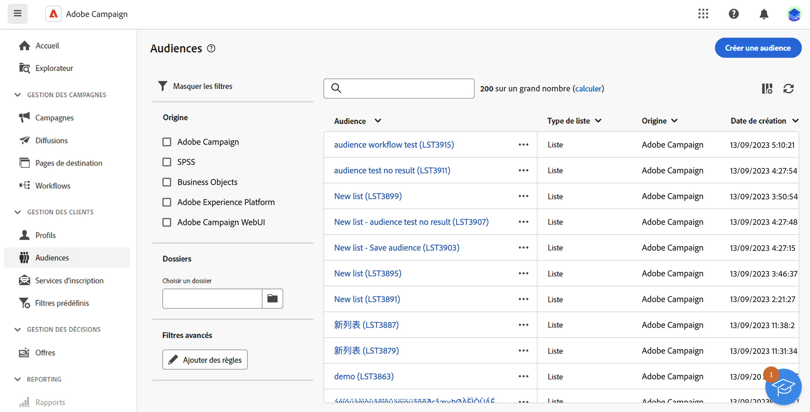
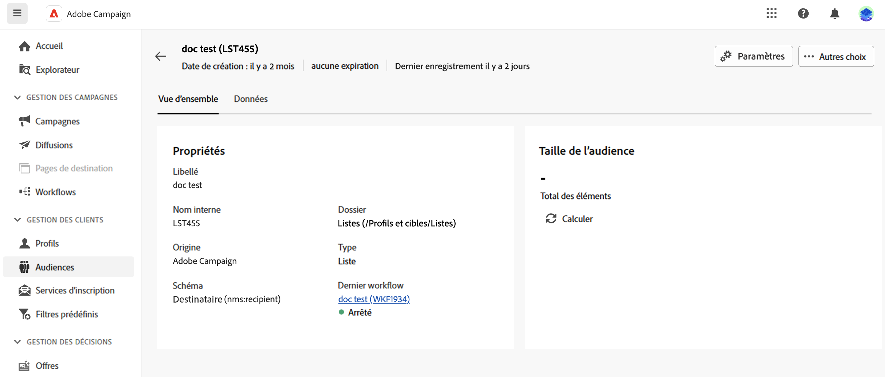

# Surveillance et gestion des audiences {#create-audiences}

La liste des audiences disponibles sur le Web de Campaign est accessible à partir du **[!UICONTROL Audiences]** .

Les audiences peuvent provenir de plusieurs sources. La variable **[!UICONTROL Origin]** indique l’emplacement de création d’une audience donnée :

* **[!UICONTROL ADOBE EXPERIENCE PLATFORM :]** Ces audiences ont été créées dans Adobe Experience Platform et mises à disposition dans le Web de Campaign à l’aide de l’intégration avec les sources d’Adobe et les destinations. Découvrez comment configurer cette intégration dans [Documentation de Campaign v8 (console cliente)](https://experienceleague.adobe.com/docs/campaign/campaign-v8/connect/ac-aep/ac-aep.html)

* **[!UICONTROL Adobe Campaign]**: ces audiences ont été créées à l&#39;aide d&#39;un workflow Web de campagne. [Découvrez comment créer des audiences](create-audiences.md)

*quelles sont les autres origines ? Sont-ils personnalisés ? Où les définissons-nous ?*

*Colonne Type : non disponible dans le filtre, normal ? quels sont les différents types, groupe ? liste ?*

Pour obtenir plus d’informations sur une audience, ouvrez-la dans la liste. Les propriétés de l’audience s’affichent, avec le nombre de profils inclus dans l’audience. Vous pouvez actualiser le nombre d’audiences à tout moment à l’aide de la variable **[!UICONTROL Calculer]** bouton .

L&#39;onglet Données permet de visualiser les profils qui font partie de l&#39;audience. Vous pouvez personnaliser cette vue en ajoutant d’autres colonnes. Vous pouvez également utiliser des filtres avancés pour affiner les données affichées.

Pour dupliquer ou supprimer une audience, cliquez sur le bouton **[!UICONTROL Plus d&#39;action]** est disponible dans la liste des audiences en regard du nom de l’audience ou dans un écran de détails de l’audience.

*lorsque vous dupliquez une audience, ne conservez pas le nom par exemple (1).*
