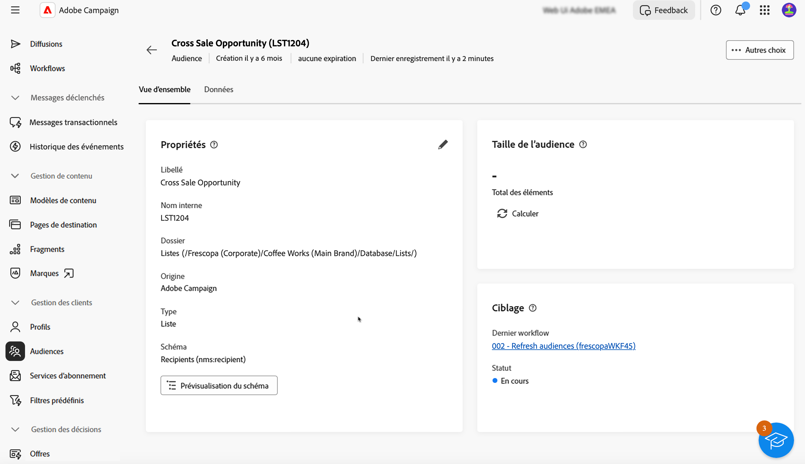

# Surveillance et gestion des audiences {#create-audiences}

La liste des audiences disponibles sur le Web de Campaign est accessible à partir du **[!UICONTROL Audiences]** .

Les audiences peuvent provenir de plusieurs sources. La variable **[!UICONTROL Origin]** indique l’emplacement de création d’une audience donnée :

* **[!UICONTROL Adobe Campaign]**: ces audiences sont créées dans la console Adobe Campaign V8. En savoir plus dans la [documentation de Campaign v8 (console cliente)](https://experienceleague.adobe.com/docs/campaign/campaign-v8/audience/create-audiences/create-audiences.html?lang=fr){target="_blank"}.

* **[!UICONTROL ADOBE EXPERIENCE PLATFORM :]** Ces audiences sont créées dans Adobe Experience Platform et intégrées au Web de Campaign à l’aide de l’intégration Sources d’Adobe et Destinations . Découvrez comment configurer cette intégration dans [Documentation de Campaign v8 (console cliente)](https://experienceleague.adobe.com/docs/campaign/campaign-v8/connect/ac-aep/ac-aep.html)

* **[!UICONTROL Interface utilisateur web d’Adobe Campaign]**: ces audiences sont créées à l&#39;aide des workflows d&#39;audience Web de Campaign. [Découvrez comment créer des audiences](create-audience.md)

Pour obtenir plus d’informations sur une audience, ouvrez-la dans la liste. Les propriétés de l’audience s’affichent, avec le nombre de profils inclus dans l’audience. Vous pouvez actualiser le nombre d’audiences à tout moment à l’aide de la variable **[!UICONTROL Calculer]** bouton .

La variable **[!UICONTROL Données]** vous permet de visualiser les profils qui font partie de l’audience. Vous pouvez personnaliser cette vue en ajoutant d’autres colonnes ou en utilisant des filtres avancés pour affiner les données affichées.

Pour dupliquer ou supprimer une audience, cliquez sur le bouton **[!UICONTROL Plus d&#39;action]** est disponible dans la liste des audiences en regard du nom de l’audience ou dans un écran de détails de l’audience.
