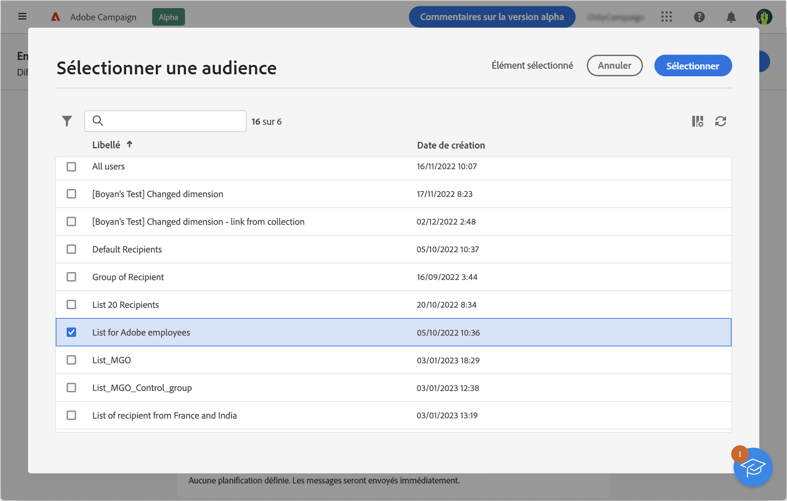
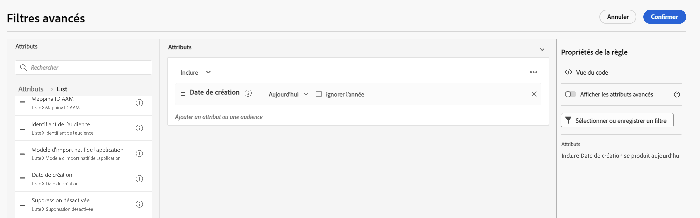

# Sélectionner une audience existante {#add-audience}

>[!CONTEXTUALHELP]
>id="acw_deliveries_email_audience_select"
>title="Sélectionner une audience existante"
>abstract="Parcourez la liste pour sélectionner une audience existante. Utilisez l&#39;icône Afficher les filtres pour filtrer la liste ou sélectionnez un dossier spécifique."

Cette section explique comment sélectionner une audience existante lors de la définition de la population cible de la diffusion d’un e-mail.

Vous pouvez également procéder comme suit :

* Créez une audience. [En savoir plus](segment-builder.md)
* Chargez une audience depuis un fichier externe (pour les e-mails uniquement). [En savoir plus](file-audience.md)
* Utilisez une audience Adobe Experience Platform. [En savoir plus](aep-audience.md).

Pour sélectionner une audience existante pour votre message, procédez comme suit :

1. Dans la section **Audience** de l’assistant de création de diffusion, cliquez sur le bouton **[!UICONTROL Sélectionner une audience]**.

   

1. Choisissez **[!UICONTROL Sélectionner une audience]** pour utiliser une audience existante. Afin de créer une nouvelle audience pour cet e-mail, choisissez **Créer la vôtre**. Reportez-vous à cette [section](segment-builder.md).

   Cet écran affiche toutes les audiences existantes pour le dossier actuel.

   

   Les audiences sont créées à partir du menu **Audience** de gauche. Elles peuvent également être créées dans la console cliente.

   Pour utiliser des audiences Adobe Experience Platform, vous devez configurer l’intégration aux destinations. Consultez la [documentation sur les destinations Adobe Experience Platform](https://experienceleague.adobe.com/docs/experience-platform/destinations/home.html?lang=fr){target="_blank"}.

1. Choisissez une audience, puis cliquez sur **Sélectionner**.
1. Utilisez l’icône **Afficher les filtres** pour afficher les options de filtrage. Cliquez sur **Ajouter des règles** pour accéder au créateur de règles : l’utilisation du créateur de règles vous permet de créer des filtres avancés pour la liste des audiences. Découvrez comment utiliser le créateur de règles dans cette [section](segment-builder.md).

   

1. Cliquez sur **Enregistrer**.

Vous pouvez également définir une population témoin afin de mesurer l’impact de vos campagnes. La population témoin ne reçoit pas le message. Vous pouvez ainsi comparer le comportement de la population qui a reçu le message avec celui des contacts qui ne l’ont pas reçu. En savoir plus dans [cette section](control-group.md).